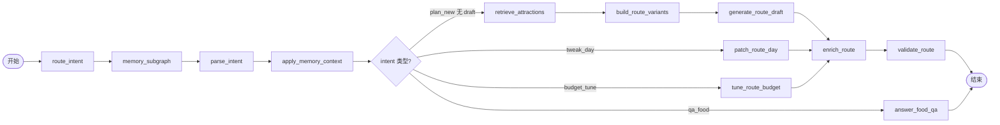

# AI 流程编排路线图

> **定位**：在现有 **Tool 化 + Agent 灰度** 基础上，引入 **可配置、可观测、可计费** 的规划流程编排能力。  
> **关联文档**：[AI规划与Agent演进.md](./AI规划与Agent演进.md) · [AI路径规划路线图.md](./AI路径规划路线图.md) · [ROADMAP.md](./ROADMAP.md) · [外部工具与插件推荐.md](./外部工具与插件推荐.md)

**文档版本**：1.3  
**最后更新**：2026-07-08（**W0+W1+W2 验收 · MW2 达成**）

---

## 0. 结论摘要（必读）

| 问题 | 结论 |
|------|------|
| 能否增加流程编排？ | **可行且合理**，但应 **渐进演进**，而非一次性上 Dify/Coze 级可视化低代码平台 |
| 与现有 16 个 Tool 的关系 | Tool 已是 **原子节点**；编排层只需 **声明 DAG + 条件边**，无需重写业务逻辑 |
| 与多 Agent 协作 | 当前 `graph.py` 为手写 if/elif；**迁移 LangGraph** 即获得图状态机 + 可插拔 Agent 节点 |
| 个性化路径（城市/预算/人数/天数） | 意图字段已结构化；编排层增加 **Workflow Template + 条件网关** 即可按参数走不同分支 |
| 流程不可见 / 难定位 | 已有 `toolTrace` + Langfuse **基础**；缺 **时间线 UI、RAG 命中明细、阶段对比验收** |
| 耗时与费用 | Tool 级 `ms` 已有；需补 **LLM token 汇总 + 外部 API 计数 + 模型单价换算** |
| RAG 接入编排 | **已接入**（`retrieve_attractions` / `retrieve_playbooks`）；编排后应 **显式成节点** 并 trace 命中列表 |

**推荐策略**：**「配置化 DAG + LangGraph 运行时 + Web 观测台」**，Visual 拖拽编辑器放到 Phase 4（按需）。

**与 M6 主链关系**：不阻塞 Step 35～40；Phase W1～W2 可与 Step 35 并行；Phase W3 建议在 M6 验收后启动。

---

## 1. 背景：六个核心诉求对照

### 1.1 诉求一 — 系统内已封装大量 Tools

**现状**

- Node 侧 **16 个 Agent Tool** 已注册（`packages/server/src/agent/tools/index.ts`）
- Python 经 `node_client.call_node_tool` 统一 HTTP 调用
- 意图路由独立 API：`POST /api/agent/route-intent`

**缺口**

- Tool 调用顺序 **硬编码** 在 `graph.py` 与 `agent-plan-client.service.ts` 本地镜像
- 新增/调整分支需改代码并发版，无法 A/B 或按城市灰度

**编排价值**

- 每个 Tool = 工作流 **Task 节点**（输入 schema / 输出 schema 已隐含于 payload）
- 编排引擎只负责 **拓扑、条件、重试、超时**，业务仍走 Node 权威实现

### 1.2 诉求二 — 多 Agent 协作

**现状**

| Agent | 文件 | 职责 |
|-------|------|------|
| 规划 Agent | `graph.py` `run_plan_agent` | 意图分支 + Tool 链 |
| 记忆 Agent | `memory_agent.py` | recall + apply context |
| 行中 Agent | `transit_agent.py` | replan_segment |

**缺口**

- 注释称「LangGraph Supervisor」，但 **未引入 langgraph 库**（手写 async 顺序）
- 无 LLM 协调器自主选 Tool；无循环 / max-rounds
- `write_trip_memory`、`detect_missed_pois` 已注册但未进规划图

**编排价值**

- LangGraph **Supervisor 节点** + **专家子图**（规划 / 记忆 / 行中）= 标准多 Agent 拓扑
- 子图可独立版本化、独立观测

### 1.3 诉求三 — 用户参数差异（城市、预算、人数、天数…）

**现状**

- C2 意图解析产出结构化 `intent`（city、days、budget、partySize、themes…）
- `routeAgentIntent` 按 **追问类型** 分支（10 类），非按 **用户画像** 分支

**缺口**

- 例如「低预算 3 天成都」与「高预算 7 天多城」走 **同一 Tool 链**
- 无法为 VIP / 新用户 / 特定城市配置 **不同 RAG topK、候选方案数、是否跳过 variants**

**编排价值**

```text
WorkflowTemplate「standard_domestic_3d」
  WHEN budget IN (low, medium) AND days <= 3
    → retrieve_attractions(topK=12) → build_route_variants(count=2)
WorkflowTemplate「premium_multi_city」
  WHEN days > 5 OR cities.length > 1
    → retrieve_attractions(topK=20) → retrieve_playbooks → build_route_variants(count=3)
```

模板由 **规则引擎 / JSON Logic** 选择，无需 LLM 猜路径。

### 1.4 诉求四 — 流程不可见，定位与验收困难

**现状（已有）**

| 能力 | 落点 |
|------|------|
| SSE 实时 Tool 进度 | `GET /api/plan-sessions/:id/stream` → `tool_call` |
| 会话持久化 trace | `plan_sessions.agent_state.toolTrace` |
| 分布式 trace | Langfuse（Python + Node，可选） |
| 路线质量事件 | `plan_route_quality` 分析埋点 |

**缺口**

| 缺口 | 影响 |
|------|------|
| 无 **端到端时间线 UI**（Web 管理端） | 运营/研发只能查 DB 或 Langfuse |
| RAG 命中 **未单独 trace**（藏在 retrieve 内） | 无法回答「为什么选了这些 POI」 |
| 无 **Golden Case 回归** 框架 | AI 规划准确性靠人工 spot check |
| LLM 原始 prompt/response **未关联到会话**（部分走 Node Tool） | 难以复现 bad case |

**编排价值**

- 每个节点产出 **标准化 Span**（input 摘要、output 摘要、metrics）
- Web **规划诊断页**：会话 ID → 时间线 → 展开 RAG 命中 / LLM 片段 / warnings

### 1.5 诉求五 — 各阶段耗时与 AI / 外部接口费用

**现状**

| 指标 | 状态 |
|------|------|
| Tool `durationMs` | ✅ `toolTrace` + Langfuse tool observation |
| LLM token | ✅ 部分（Node `llm-client` + Python CallbackHandler） |
| 高德 / 外部 HTTP | ⚠️ 仅在 Enricher 内，**无统一计数** |
| **费用换算** | ❌ 无模型单价表、无会话级 bill |
| 用户配额 | ❌ 无 |

**编排价值**

- 节点执行器统一写入 `WorkflowRunMetrics`：
  - `durationMs`、`llmInputTokens`、`llmOutputTokens`、`externalApiCalls`、`estimatedCostCny`
- 模型单价配置表（env 或 DB），便于财务对账

### 1.6 诉求六 — 内部库 RAG 是否可接入流程编排

**现状**

| RAG 源 | Tool / 服务 | 数据 |
|--------|-------------|------|
| 景点 | `retrieve_attractions` | MySQL `attractions` + 可选 TF-IDF/MMR |
| 玩法 | `retrieve_playbooks`（enrich 内间接） | `route_playbooks` |
| 酒店 | `retrieveHotelsForLodging` | attractions HOTEL |
| 用户记忆 | `recall_user_memory` | `pet_memories` |

**结论**：**完全可以且应该** 作为编排节点显式出现：

```text
retrieve_attractions ──→ generate_route_draft
retrieve_playbooks   ──→ enrich_route（或并行汇合）
recall_user_memory   ──→ apply_memory_context ──→ …
```

Step 22（真 embedding 向量检索）完成后，RAG 节点可增加 `retrievalMode: keyword | vector | hybrid` 参数。

---

## 2. 目标架构

### 2.1 分层模型

```text
┌─────────────────────────────────────────────────────────────┐
│  L4 观测与运营（Web 管理端 · 可选 Visual Editor Phase 4）      │
│      规划诊断时间线 · 费用报表 · 模板 CRUD · Golden Case       │
├─────────────────────────────────────────────────────────────┤
│  L3 编排运行时（packages/ai-service workflow engine）        │
│      LangGraph StateGraph · 模板选择 · 条件边 · 重试/超时      │
├─────────────────────────────────────────────────────────────┤
│  L2 Tool 层（packages/server agent/tools — 保持权威）         │
│      16+ Tools · HTTP API · 确定性 Enricher/Validate         │
├─────────────────────────────────────────────────────────────┤
│  L1 数据与模型（MySQL RAG · LLM Provider · 高德 · Langfuse）   │
└─────────────────────────────────────────────────────────────┘
```

### 2.2 核心概念

| 概念 | 说明 |
|------|------|
| **WorkflowTemplate** | 命名 DAG 定义（JSON/YAML），含节点、边、条件 |
| **WorkflowRun** | 单次规划/追问的执行实例，绑定 `planSessionId` |
| **WorkflowNode** | Tool 调用 / LLM 调用 / 条件网关 / 子图入口 |
| **WorkflowContext** | 跨节点共享状态（≈ 现有 `PlanAgentState`） |
| **NodeSpan** | 单节点观测记录（generalize `toolTrace` 条目） |

### 2.3 与现有代码映射

| 现有 | 编排后 |
|------|--------|
| `graph.py` if/elif | LangGraph `StateGraph` + conditional edges |
| `tool_trace[]` | `NodeSpan[]`（扩展字段） |
| `agent_state` JSON | `WorkflowRun.snapshot` |
| `AGENT_PLAN_ENABLED` | 扩展为 `WORKFLOW_ENGINE=legacy\|langgraph\|template` |

### 2.4 默认工作流模板（首句规划）



此图 **等价于当前 graph.py**，Phase W1 的目标是 **行为不变、实现可配置**。

---

## 3. 分阶段实施路线

**图例**：`[ ]` 未开始 · `[~]` 进行中 · `[x]` 已验收  
**里程碑**：**MW1** 可配置运行时 · **MW2** 观测与费用 · **MW3** 模板化个性化 · **MW4** Visual Editor（按需）

---

### Phase W0 · 基线加固（P0 · 与 M6 并行，1～2 周）

> **目标**：不重写编排，先补齐观测与 RAG trace，降低定位成本。

| Step | 状态 | 任务 | 交付 / 落点 | 验收标准 |
|------|------|------|-------------|----------|
| **W0-1** | [x] | **扩展 toolTrace → NodeSpan schema** | `@douxing/shared` 类型 + `plan-session.service` | [x] 含 `nodeId`/`inputDigest`/`outputDigest`/`llmUsage?` [x] 旧字段兼容 |
| **W0-2** | [x] | **RAG 命中明细 trace** | `retrieve-attractions.tool` 返回 `matchedIds[]` + score 摘要 | [x] agent_state 可查到 POI ID 列表 [x] Langfuse metadata 同步 |
| **W0-3** | [x] | **显式 retrieve_playbooks 节点** | graph + enrich 拆分 trace | [x] Langfuse 可见 playbook 命中 |
| **W0-4** | [x] | **LLM 调用与会话关联** | Node `llm-client` 传 `sessionId`/`runId` 至 Langfuse | [x] 单次会话可查全部 generation |
| **W0-5** | [x] | **规划诊断 API（只读）** | `GET /api/admin/plan-sessions/:id/workflow-trace` | [x] 返回 NodeSpan 时间线 [x] RBAC 鉴权 [x] i18n 错误码 |

**Phase W0 完成后**：研发可通过 API/Langfuse 定位 80% 问题，无需等 Visual Editor。

---

### Phase W1 · LangGraph 运行时（P0.5 · 2～3 周）

> **目标**：`graph.py` 迁移至 LangGraph；行为与 `agent-equivalence` ≥95% 等价。

| Step | 状态 | 任务 | 交付 / 落点 | 验收标准 |
|------|------|------|-------------|----------|
| **W1-1** | [x] | **引入 langgraph 依赖** | `ai-service/requirements.txt` + 版本锁定 | [x] CI 安装通过 |
| **W1-2** | [x] | **WorkflowContext 状态模型** | `ai-service/app/workflow/state.py` | [x] 覆盖现有 PlanAgentState 字段 |
| **W1-3** | [x] | **Tool 节点工厂** | `workflow/nodes/tool_node.py` 包装 `call_node_tool` | [x] 自动记录 NodeSpan |
| **W1-4** | [x] | **条件边：10 类 intent** | `workflow/graphs/plan_default.py` | [x] 与现 graph.py 分支一致 |
| **W1-5** | [x] | **Feature flag** | `WORKFLOW_ENGINE=legacy\|langgraph` | [x] legacy 为默认 [x] langgraph 可切换 |
| **W1-6** | [x] | **等价率回归** | `app/scripts/workflow_equivalence.py` | [x] 2026-07-08 本地 staging 模拟 3/3 通过（100%）· 报告 `reports/workflow-equivalence-2026-07-08.json` |
| **W1-7** | [x] | **子图：memory / transit** | `workflow/graphs/memory.py` · `transit.py` | [x] 行中 Agent 走同一引擎 |

**Phase W1 完成后**：**MW1 达成** — 编排逻辑图化，为模板配置打基础。

---

### Phase W2 · 观测台与费用（P1 · 2 周）

> **目标**：Web 管理端可见时间线；会话级 token/费用可汇总。

| Step | 状态 | 任务 | 交付 / 落点 | 验收标准 |
|------|------|------|-------------|----------|
| **W2-1** | [x] | **模型单价配置** | `packages/server/src/config/llm-pricing.ts` + env | [x] deepseek/douxing/lmstudio 单价可配 |
| **W2-2** | [x] | **费用计算服务** | `workflow-cost.service.ts` | [x] 输入 token 用量 → `estimatedCostCny` |
| **W2-3** | [x] | **外部 API 计数** | Enricher 高德调用 wrapper | [x] 每次 geocode/matrix 计入 NodeSpan |
| **W2-4** | [x] | **Web 规划诊断页** | `packages/web` 新路由 | [x] 时间线 Gantt 式展示 [x] 展开 RAG/LLM 摘要 [x] zh-CN/en-US |
| **W2-5** | [x] | **Langfuse 深链** | 诊断页 → Langfuse trace URL | [x] 配置 `LANGFUSE_HOST` + `LANGFUSE_PROJECT_ID` 时可用 |
| **W2-6** | [x] | **费用汇总 API** | `GET /api/admin/plan-sessions/:id/cost-summary` | [x] 分节点/分模型费用 [x] 仅管理员 |

**Phase W2 完成后**：**MW2 达成** — 诉求四、五基本满足。

---

### Phase W3 · 工作流模板与个性化（P1 · 2～3 周）

> **目标**：按城市/预算/天数等选择不同 DAG，无需改代码发版。

| Step | 状态 | 任务 | 交付 / 落点 | 验收标准 |
|------|------|------|-------------|----------|
| **W3-1** | [ ] | **模板存储** | DB 表 `workflow_templates` 或 Git 管理 YAML | [ ] 版本号 + 启用开关 |
| **W3-2** | [ ] | **模板选择器** | `workflow-template-selector.service.ts` | [ ] JSON Logic：intent + user tier → templateId |
| **W3-3** | [ ] | **预置模板包** | `standard_3d` · `premium_multi` · `budget_tune_only` | [ ] 3 套模板文档化 |
| **W3-4** | [ ] | **RAG 参数化** | 模板节点 config：`topK`/`mmrLambda`/`playbookRequired` | [ ] 低预算模板 topK=8 可验证 |
| **W3-5** | [ ] | **Web 模板 CRUD** | 管理端列表/编辑（JSON 表单，非拖拽） | [ ] 运营可改 topK/variants 数 [ ] 审计日志 |
| **W3-6** | [ ] | **A/B 灰度** | templateId 按 userId hash 分流 | [ ] 50/50 分流可观测 |

**Phase W3 完成后**：**MW3 达成** — 诉求三满足；RAG 完全编排化。

---

### Phase W4 · 准确性验证体系（P1.5 · 2 周）

> **目标**：可重复验证 AI 规划质量，支撑迭代。

| Step | 状态 | 任务 | 交付 / 落点 | 验收标准 |
|------|------|------|-------------|----------|
| **W4-1** | [ ] | **Golden Dataset** | `packages/server/src/scripts/plan-golden-cases.ts` | [ ] ≥30 条：城市/预算/天数/追问组合 |
| **W4-2** | [ ] | **自动断言** | POI 命中率、天数一致、budget warning、tool 链完整 | [ ] CI nightly 可跑 |
| **W4-3** | [ ] | **Diff 报告** | 模板/模型变更前后对比 JSON | [ ] 回归失败可定位到 nodeId |
| **W4-4** | [ ] | **人工标注回流** | 管理端「标记 bad case」→ 写入 dataset | [ ] 可选 |

**Phase W4 完成后**：诉求四「验证准确性」有工程化闭环。

---

### Phase W5 · Visual 编排编辑器（P2 · 按需 · 4～6 周）

> **目标**：类似参考截图的节点拖拽编排（**仅管理端内部工具**，非面向 C 端用户）。

| Step | 状态 | 任务 | 交付 / 落点 | 验收标准 |
|------|------|------|-------------|----------|
| **W5-1** | [ ] | **技术选型** | React Flow + JSON Schema 表单 | [ ] ADR 文档 |
| **W5-2** | [ ] | **节点面板** | 16 Tool + 条件 + 子图 节点 | [ ] 拖拽生成 JSON 模板 |
| **W5-3** | [ ] | **模板校验器** | 发布前静态检查（无环、必填边） | [ ] 非法图禁止保存 |
| **W5-4** | [ ] | **预览运行** | 管理端输入 prompt → 沙箱执行 | [ ] 不写生产 routes 表 |
| **W5-5** | [ ] | **版本与发布** | draft → published；回滚 | [ ] 与 W3 模板存储打通 |

**Phase W5 完成后**：**MW4 达成**（可选里程碑）。

---

## 4. 技术选型建议

| 领域 | 推荐 | 理由 | 不推荐（现阶段） |
|------|------|------|------------------|
| 运行时 | **LangGraph**（Python） | 与 ai-service 同栈；官方支持 Tool/子图/检查点 | Temporal（过重）、自研 DAG 引擎 |
| 模板格式 | **JSON + JSON Logic** | 与现有 intent 结构契合；可 Git 管理 | 纯 YAML 无 schema 校验 |
| 观测 | **Langfuse + 自建 NodeSpan** | 已接入；补 UI 即可 | 仅依赖原始日志 |
| 可视化 | **React Flow**（W5） | 前端栈一致 | 嵌入 Dify（双栈运维） |
| RAG | **现有 MySQL + Step 22 向量** | 不重复建设 | 编排内嵌新向量库 |

---

## 5. 数据模型（草案）

### 5.1 `workflow_runs`（可选持久化，W2 起）

```typescript
interface WorkflowRunRecord {
  id: string;
  planSessionId: number;
  templateId: string;
  templateVersion: string;
  engine: 'legacy' | 'langgraph';
  status: 'running' | 'completed' | 'failed' | 'degraded';
  startedAt: string;
  finishedAt?: string;
  totalDurationMs?: number;
  totalCostCny?: number;
  nodeSpans: NodeSpan[];
  langfuseTraceId?: string;
}
```

### 5.2 `NodeSpan`（扩展 toolTrace）

```typescript
interface NodeSpan {
  nodeId: string;
  tool?: string;
  ok: boolean;
  durationMs: number;
  inputDigest?: string;
  outputDigest?: string;
  ragMatchedIds?: number[];
  llmUsage?: { inputTokens: number; outputTokens: number; model: string };
  externalApiCalls?: number;
  estimatedCostCny?: number;
  errorCode?: string;
}
```

---

## 6. 兼容与降级（不可违背）

1. **`WORKFLOW_ENGINE=legacy` 或未配置** → 100% 现有 `graph.py` / 管道行为（与 `AGENT_PLAN_ENABLED=false` 原则一致）。
2. **LangGraph 超时 / 校验失败** → 降级 legacy graph → 再降级 `generateRoute` 管道。
3. **确定性数据**（交通、票价、POI 坐标）**仍只走 Tool/Enricher**，编排层不得让 LLM 跳过 validate。
4. **i18n**：管理端诊断页、API 错误码走 `ApiMessageKey`；用户端 SSE 文案沿用 `agent.status.*`。
5. **安全**：Workflow 模板 CRUD 仅 **系统管理员**；沙箱运行不可用生产 API Key 写库。

---

## 7. 与现有路线图衔接

| 文档 | 关系 |
|------|------|
| [AI路径规划路线图.md](./AI路径规划路线图.md) | Step 22 VECTOR_RAG 完成后，W3 RAG 节点可设 `retrievalMode=vector` |
| [AI规划与Agent演进.md](./AI规划与Agent演进.md) | W1 实现文档 §6「第 2 步 协调器 LangGraph」 |
| [数据中台.md](./数据中台.md) | W2 费用/耗时可汇入 DT 指标（`plan_workflow_cost` 事件） |
| [外部工具与插件推荐.md](./外部工具与插件推荐.md) | Langfuse 已推荐；W5 可补充 React Flow |

**建议排期**

```text
2026-07  M6 主链 Step 35～40（不阻塞）
         ∥ W0 基线加固（观测 + RAG trace）
2026-08  W1 LangGraph 迁移 → MW1
         W2 观测台 + 费用 → MW2
2026-09  W3 模板个性化 → MW3
         W4 Golden Case
2026-Q4  W5 Visual Editor（按运营需求决定）
```

---

## 8. 风险与规避

| 风险 | 规避 |
|------|------|
| 双轨编排（legacy + langgraph）漂移 | W1-6 等价率 CI 门禁；默认 legacy |
| Visual Editor 范围膨胀 | W5 明确 **内部工具**；C 端用户不接触 |
| 费用统计不准 | 单价表版本化；展示「估算」免责声明 |
| 模板错误导致全站规划失败 | 发布前校验 + Canary 5% + 一键回滚 |
| 与 Dify 等外部平台功能重复 | **不引入** 第二套 LLM 网关；兜行 Tool 留在 Node |

---

## 9. 验收总览

### MW1 · 可配置运行时 ✅（2026-07-08 验收）

- [x] LangGraph 模式与 legacy 等价率 ≥95%（`pnpm workflow:equivalence` · staging `WORKFLOW_ENGINE=langgraph`）
- [x] Feature flag 切换（`WORKFLOW_ENGINE` · `X-Workflow-Engine` 头 · `/v1/status` 可读）
- [x] memory/transit 子图纳入同一引擎

### MW2 · 观测与费用 ✅（2026-07-08 验收）

- [x] Web 诊断页展示完整 NodeSpan 时间线
- [x] 会话级 token + 估算费用 API
- [x] RAG 命中 ID 可追溯

### MW3 · 模板化

- [ ] ≥3 套预置模板可按 intent 自动选择
- [ ] 运营可在 Web 调整 RAG topK / variants 数（无需发版）

### MW4 · Visual Editor（可选）

- [ ] 拖拽生成合法模板 JSON
- [ ] 沙箱预览运行通过

---

## 10. 不建议优先做

| 项 | 原因 |
|----|------|
| 一步到位上 Dify/Coze 全功能平台 | 双栈、Tool 重复封装、与 Node 权威冲突 |
| C 端用户自定义工作流 | 复杂度过高；用模板 + 意图覆盖即可 |
| 编排内 LLM 自由选 Tool（无约束） | 破坏确定性；与 §0.3 原则冲突 |
| 替换现有 Enricher 为 LLM Agent | H9 已验收；Enricher 必须保持确定性 |

---

## 11. 相关文档

| 文档 | 用途 |
|------|------|
| [AI规划与Agent演进.md](./AI规划与Agent演进.md) | Agent / Tool 设计全稿 |
| [AI路径规划路线图.md](./AI路径规划路线图.md) | M6 主链 Step 35～40 |
| [ROADMAP.md § C7-W](./ROADMAP.md#阶段-c7-wai-流程编排2026-07-03-录入) | 全站阶段索引 |
| [下一步工作.md](./下一步工作.md) | 当前 Sprint · W0 并行排期 |
| [开发记录 § C7-W](./开发记录-重难点与亮点.md#c7-w--ai-流程编排方案定稿2026-07-06) | 方案定稿思考过程 |
| [API接口文档.md §20](./API接口文档.md) | Agent Tools API |
| [国际化.md](./国际化.md) | 管理端与 API 文案规范 |

---

## 12. 术语表

> 阅读本文档与 [AI规划与Agent演进.md](./AI规划与Agent演进.md) 时遇到的专有名词，按类别说明如下。解释均结合兜行当前代码与路线图语境。

### 12.1 编排与流程

| 名词 | 解释 |
|------|------|
| **流程编排** | 把一次 AI 规划拆成多个有序步骤（节点），规定执行顺序与条件分支，由引擎自动调度；替代在 `graph.py` 中硬编码 `if/elif`。 |
| **DAG** | Directed Acyclic Graph（有向无环图）。工作流用「节点 + 有向边」描述步骤依赖，**不允许成环**，避免无限循环。 |
| **WorkflowTemplate（工作流模板）** | 可复用的流程定义（JSON/YAML），描述规划时依次调用哪些 Tool、在什么条件下分叉。例如低预算 3 天与多城 7 天可走不同模板。 |
| **WorkflowRun（工作流运行实例）** | 某次真实规划或追问的执行记录，绑定 `planSessionId`，含状态、各节点耗时、费用、NodeSpan 列表等。 |
| **WorkflowNode（工作流节点）** | 流程中的一个步骤：调用 Tool、调用 LLM、条件判断，或进入子 Agent 子图。 |
| **WorkflowContext（工作流上下文）** | 节点间共享的状态对象，对应现有 `PlanAgentState`：意图、RAG 候选、草稿路线、`toolTrace` 等在其中传递。 |
| **条件网关 / 条件边** | 根据上游结果决定下一步分支。例如 `intent = tweak_day` → `patch_route_day`；`intent = qa_food` → 仅问答、不生成路线。 |
| **子图（Subgraph）** | 嵌套在大流程内的小流程。兜行中记忆 Agent、行中 Agent 可各自为子图，再挂到主规划图上。 |

### 12.2 Agent 与 Tool

| 名词 | 解释 |
|------|------|
| **Agent（智能体）** | 能根据目标多步执行任务并调用外部能力的 AI 系统。在兜行中指：解析意图 → 选路径 → 调 Tool → 汇总结果，而非单次聊天回复。 |
| **Tool（工具）** | Agent 调用的**确定性能力单元**，封装在 Node 侧（如 `retrieve_attractions`、`enrich_route`）。LLM 负责理解与决策边界，Tool 负责查库、算路、校验等可靠操作。 |
| **Agent Tool** | 经 `POST /api/agent/tools/:name` 暴露的 16 个工具；Python Agent 通过 HTTP 调用，**Node 为权威实现**（`packages/server/src/agent/tools/`）。 |
| **Supervisor（协调器）** | 多 Agent 架构中的调度中心：判断用户需求后派给规划、记忆、行中等专家。兜行现阶段以**规则路由**为主，避免 LLM 无约束自由派单。 |
| **多 Agent 协作** | 不同职责的 Agent 分工配合。当前有：规划 Agent（`graph.py`）、记忆 Agent（`memory_agent.py`）、行中 Agent（`transit_agent.py`）。 |
| **管道 / Pipeline** | 固定顺序的代码流水线（`generateRoute` 等）。`AGENT_PLAN_ENABLED=false` 时默认走管道，保证现网行为稳定。 |
| **降级** | 上层能力失败时退回更稳路径：Python Agent → Node 本地 Agent 镜像 → 管道 `generateRoute`。 |

### 12.3 规划业务

| 名词 | 解释 |
|------|------|
| **Intent（意图）** | 从用户输入解析出的结构化信息：城市、天数、预算、人数、主题、交通/住宿偏好等（C2 意图解析，`travel-intent`）。 |
| **routeAgentIntent / 意图路由** | 判断本轮属于新规划、改某天、调预算、美食问答等 **10 类追问类型**，从而选择不同 Tool 链（`agent-intent-router.service.ts`）。 |
| **plan_sessions** | 多轮规划会话表，存储对话历史、`agent_state`、候选路线等。 |
| **agent_state** | 会话 JSON 字段，记录上次路由意图、生成路径（`agent` / `pipeline`）、`toolTrace` 等，供追问与排查使用。 |
| **Enricher（增强器）** | 路线生成后的确定性补全：坐标、住宿、交通段、时刻表、polyline 等，主要靠规则与高德 API（`route-enricher.service.ts`），不让 LLM 编造交通与票价。 |
| **validate_route** | 路线质量校验 Tool：闭馆、超预算等产出 warnings，必要时 autoFix。 |
| **build_route_variants** | 首句规划生成 2～3 套候选方案（如经典/轻松/深度），供用户选择。 |
| **patch_route_day** | 局部修改某一天行程（如「第三天别去宽窄巷子」），不重算整段路线。 |

### 12.4 RAG 与检索

| 名词 | 解释 |
|------|------|
| **RAG** | Retrieval-Augmented Generation（检索增强生成）。先从内部库检索相关景点/玩法，再交给 LLM 排行程，降低胡编 POI 的概率。 |
| **retrieve_attractions** | 景点 RAG Tool：按城市、主题、关键词从 MySQL `attractions` 打分检索候选 POI。 |
| **retrieve_playbooks** | 玩法动线 RAG：从 `route_playbooks` 取经典游览顺序，供 Enricher 排段间交通；当前部分逻辑藏在 `enrich_route` 内，W0 目标为显式节点化。 |
| **TF-IDF** | 文本相关性打分方法；`VECTOR_RAG_ENABLED=true` 时作轻量语义增强，**非**外部 embedding API。 |
| **MMR** | Maximal Marginal Relevance（最大边际相关性）：检索重排时在相关性与多样性之间折中，避免结果过于雷同。 |
| **topK** | 检索返回前 K 条候选；WorkflowTemplate 可配置（如低预算 `topK=8`，高端 `topK=20`）。 |
| **VECTOR_RAG / Step 22** | [AI路径规划路线图](./AI路径规划路线图.md) 中的真向量检索项；当前多为关键词 + TF-IDF/MMR，embedding 检索尚未验收。 |

### 12.5 可观测与质量

| 名词 | 解释 |
|------|------|
| **toolTrace** | 单次规划各 Tool 执行记录：`{ tool, ok, ms }`，写入 `agent_state`，前端经 SSE 推送展示进度。 |
| **NodeSpan** | 对 `toolTrace` 的扩展结构：增加 `nodeId`、输入/输出摘要、RAG 命中 ID、token 用量、`estimatedCostCny` 等，用于深度排查（W0 交付）。 |
| **SSE** | Server-Sent Events：服务端向客户端单向推送事件（`tool_call`、`done` 等），规划页实时显示「正在检索景点…」。 |
| **Langfuse** | 第三方 LLM 可观测平台，记录 trace、span、token、耗时。项目已在 ai-service 与 Node 接入；未配置 Key 时为 no-op。 |
| **Trace / Span** | Trace 为一次完整请求的全链路；Span 为其中一步（如某 Tool 或某次 LLM 调用）。 |
| **Golden Case / Golden Dataset** | 标准测试用例集（固定 prompt + 自动断言），用于回归：改模型或模板后批量跑测，验证规划仍达标（W4 交付）。 |
| **等价率** | Agent 输出与管道输出的一致比例；要求 ≥95%（`agent-equivalence-cases`）。 |
| **plan_route_quality** | 路线质量分析埋点：POI 命中率、RAG 匹配数、生成来源等。 |

### 12.6 费用与配置

| 名词 | 解释 |
|------|------|
| **Token** | LLM 计费与上下文的基本单位，分输入 token 与输出 token。 |
| **estimatedCostCny** | 按模型单价表将 token 用量换算为**估算人民币费用**（展示时需标注为估算，非精确账单）。 |
| **externalApiCalls** | 节点执行中外部 HTTP 调用次数（如高德 geocode、Distance Matrix），用于成本与性能统计。 |
| **Feature flag（特性开关）** | 环境变量控制行为而无需改代码发版。例如 `AGENT_PLAN_ENABLED`、`WORKFLOW_ENGINE=legacy\|langgraph`。 |
| **JSON Logic** | 用 JSON 表达规则，根据 `intent.days`、`budget` 等字段自动选择 WorkflowTemplate，避免硬编码分支。 |
| **A/B 灰度** | 按用户 ID 哈希将流量分到两套模板或引擎，对比效果后再扩大范围。 |

### 12.7 技术栈与外部产品（对照）

| 名词 | 解释 |
|------|------|
| **LangGraph** | LangChain 生态的图状态机库，用节点与边定义 Agent 流程，支持子图、检查点、条件分支。路线图 W1 建议用它替代手写 `graph.py`。 |
| **LangChain** | Python LLM 应用框架；兜行 `ai-service` 用于路线 JSON 生成与 Callback 观测。 |
| **React Flow** | 前端节点连线画布库；W5 可视化编排编辑器拟采用，用于拖拽生成 DAG 模板 JSON。 |
| **Dify / Coze** | 外部一站式 AI 工作流平台（低代码 + 模型 + 知识库）。本文建议**不整体引入**，避免与 Node Tool 双栈重复。 |
| **Monorepo** | 单仓库多包结构：`server`、`ai-service`、`mobile`、`pc`、`web`、`shared` 等同仓协作。 |

### 12.8 文档内缩写与里程碑

| 名词 | 解释 |
|------|------|
| **C7** | AI Agent 演进阶段：Tool 化、追问局部修改、SSE 进度、Langfuse 等（见 [AI路径规划路线图](./AI路径规划路线图.md) Phase 1～2）。 |
| **H9** | 规划数据质量线：Playbook、开放时长、Enricher 交通、POI 对齐等。 |
| **M1～M6** | AI 路径规划里程碑编号；M6 为 Step 35～40（专属模型 + H10 等）主链验收。 |
| **MW1～MW4** | **本路线图**流程编排里程碑：可配置运行时 → 观测与费用 → 模板个性化 → 可选可视化编辑器。 |
| **W0～W5** | 本路线图实施阶段编号（§3）。 |
| **POC** | Proof of Concept（概念验证）：小范围试通后再铺开。 |

---

## 变更记录

| 日期 | 版本 | 说明 |
|------|------|------|
| 2026-07-03 | 1.0 | 初版：可行性分析 + Phase W0～W5 + 里程碑 MW1～MW4 |
| 2026-07-06 | 1.1 | 新增 §12 术语表；全站文档交叉引用同步 |
