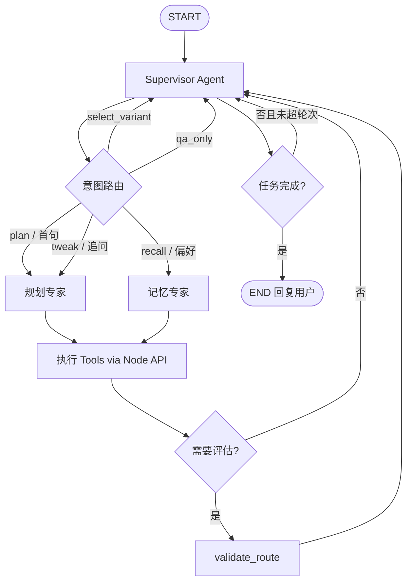

# 兜行 · AI 规划设计与 Agent 演进（设计思路全稿）

> **定位**：记录从 **固定流水线** 升级为 **真正 AI Agent / 多 Agent** 的完整设计思路、思考过程、概念释义、目标架构与分步执行流程。  
> **读者**：产品、架构、研发、AI 协作者。  
> **执行路线图（Step · 里程碑 · 验收）**：[AI路径规划路线图.md](./AI路径规划路线图.md) — **当前 Step 35**  
> **关联**：[详细设计文档.md §3](./详细设计文档.md) · [ROADMAP § C7](./ROADMAP.md#阶段-c7ai-agent-演进2026-06-11-录入) · [AI旅行宠物.md](./AI旅行宠物.md) · [开发记录 § C/H9](./开发记录-重难点与亮点.md) · [外部工具与插件推荐.md](./外部工具与插件推荐.md)

**文档版本**：2.6  
**最后更新**：2026-06-18  
**核心结论**：线上已是 **「编排式管道 + 多轮会话 + Agent 灰度」**；M1～M5 已验收，生产默认仍 `AGENT_PLAN_ENABLED=false`。

> **分工**：本文 = **为什么 / 怎么设计**；[AI路径规划路线图.md](./AI路径规划路线图.md) = **现在做什么 / 做到哪算完成**。

### 实现进度速览（2026-06-18）

> 逐步验收清单与 **Step 1～42** 见 **[AI路径规划路线图 §1](./AI路径规划路线图.md#1-主执行路径step-1--step-40)**；**下一项：Step 35 I2 PAI LoRA 微调**。

| 步 | 状态 | 已落地 | 待完成（对应 Step） |
|----|------|--------|---------------------|
| **C7-a** | ✅ 完成 | 9 Tool · `/v1/agent/plan` · feature flag · 等价率 · Langfuse | — |
| **C7-b** | ✅ M1 达成 | patch · SSE · i18n · agent_state · 10 用例 | — |
| **C7-c** | ✅ M5 达成 | memory Tool · memory_agent · 悬浮层 · 记忆墙 · 行中 analyze | — |
| **C7-d** | 🔄 部分 | validate_route · warnings 回复 · transit_agent | I3 LoRA → **Step 35～37** |

> **默认行为不变**：`AGENT_PLAN_ENABLED=false` 时，100% 走现有 `generateRoute` 管道。

---

## 目录

1. [背景与问题](#1-背景与问题)
2. [设计思考过程（决策记录）](#2-设计思考过程决策记录)
3. [核心概念释义](#3-核心概念释义)
4. [现状：流水线架构](#4-现状流水线架构)
5. [目标：Agent 与多 Agent 架构](#5-目标agent-与多-agent-架构)
6. [从流水线到 Agent 的改造路径](#6-从流水线到-agent-的改造路径)
7. [多 Agent 实现方式（三种模式）](#7-多-agent-实现方式三种模式)
8. [LangGraph 落地设计](#8-langgraph-落地设计)
9. [Tool 清单与代码映射](#9-tool-清单与代码映射)
10. [典型场景执行流程](#10-典型场景执行流程)
11. [分阶段实施（C7 线）](#11-分阶段实施c7-线)
12. [与 H3 / H8 / I 线关系](#12-与-h3--h8--i-线关系)
13. [技术选型与环境变量](#13-技术选型与环境变量)
14. [风险、边界与不建议做法](#14-风险边界与不建议做法)
15. [验收自检](#15-验收自检)
16. [相关文档](#16-相关文档)

---

## 1. 背景与问题

### 1.1 产品定位

兜行模块 A 的核心价值：**AI 驱动的个性化旅游决策** —— Slogan「你负责游玩，其他的交给我」。  
用户期望的不是「聊天机器人」，而是 **能产出可执行行程、能根据追问微调、能记住偏好** 的智能规划伙伴。

### 1.2 详细设计 vs 现实

《详细设计文档》§3.3 描述了 **6 类 Agent 协作**（规划 / 推荐 / 搜索 / 预订 / 评估 / 对话）。  
MVP 阶段（2026-05）团队选择 **先落地可验收的管道**，理由见 [§2](#2-设计思考过程决策记录)。

当前痛点（2026-06 复盘）：

| 痛点 | 用户侧表现 | 技术根因 |
|------|------------|----------|
| 追问成本高 | 改一句话，整段 3 天行程重生成 | `appendPlanSessionMessage` → 全量 `regenerateRouteFromPrompt` |
| 意图未驱动执行 | 「第三天轻松点」与「换城市」走同一路径 | 无 Tool 路由，无 `patch_day` |
| 能力入口分散 | 规划 / 打卡 / 相册 / 攻略各自独立 | 无统一协调器 |
| 难观测 | 不知道哪步慢、哪步失败 | 无 Tool trace / Langfuse |
| 无长期记忆 | 每次重复说偏好 | H3 表已建（`pet_memories`）；Agent 已接 `recall_user_memory`；**行中 regret 与 in_trip analyze 已落地（M5）** |

**升级 Agent 的目标**：在 **不破坏 C1～H9 已验收能力** 的前提下，让 AI **会判断、会选工具、会局部修改**。

---

## 2. 设计思考过程（决策记录）

按时间线记录关键取舍，供后续评审与新人 onboarding。

### 2.1 阶段一：为什么 MVP 不做多 Agent？（2026-05，C1/C5/H9 定稿）

| 问题 | 结论 | 依据 |
|------|------|------|
| 是否必须独立 Python 服务？ | **可选**（C5） | Node 已能直连 DeepSeek/LM Studio；Python 对齐架构、便于后续 Agent |
| 是否新建「路径规划 Agent」？ | **否**（H9） | 无 12306/航班/订房 API 时，Agent 仍会编造；**编排管道 + Enricher** 更可控 |
| Python 与 Node 谁做 RAG？ | **Node** | MySQL 检索与意图解析已在 Node 稳定；Python 只接结构化 payload |
| 多轮怎么做？ | **plan_sessions + history**（C1） | 不引入 LangChain 多 Agent，先保证追问可改方案 |

**沉淀原则 ①**：**确定性数据（交通、票价、POI 对齐）必须由代码 Tool 完成，不能交给 LLM 自由发挥。**

### 2.2 阶段二：为什么现在要考虑 Agent？（2026-06，C7 立项）

| 变化 | 说明 |
|------|------|
| C1～H9 管道已稳定 | 有东西可「Tool 化」，不是空中楼阁 |
| 用户追问场景增多 | PC P1 双栏规划、移动端多轮，整段重生成本凸显 |
| H3 旅行宠物方案定稿 | 需要统一 orchestrator + 记忆 Tool |
| ai-service 已存在 | LangChain 基础设施就绪，差 Agent 编排层 |
| 竞品普遍强调「AI 助手」 | 品牌域倾向 `douxingai`，需技术叙事对齐 |

**沉淀原则 ②**：**Agent ≠ 更多 LLM 调用；Agent = LLM 决策 + Tool 执行 + 可观测循环。**

### 2.3 阶段三：多 Agent 做几个？（2026-06，C7 收敛）

| 方案 | 评估 | 决策 |
|------|------|------|
| 设计文档 6 Agent 全上 | 运维难、延迟高、缺预订 API | **否决** |
| 单 Agent + 全量 Tool | 简单但 prompt 臃肿 | 可作 C7-a POC |
| **Supervisor + 3 专家 Agent** | 清晰、可渐进、贴合 H3/H8 | **采纳** |
| Group Chat 多 Agent 讨论 | 慢、贵、难 debug | 远期研究，不做首版 |

**沉淀原则 ③**：**Supervisor（协调 Agent）+ 规划 / 记忆 / 行中 三个专家**，评估合并为 `validate_route` Tool。

### 2.4 阶段四：运行时放哪？（2026-06）

| 选项 | 优劣 | 决策 |
|------|------|------|
| 全放 Node | 无 LangChain 生态 | 编排层放 Python |
| 全放 Python | DB/高德重复依赖 | Tool **执行**放 Node |
| **Python 编排 + Node 执行 Tool** | 职责清晰、复用现有 | **采纳** |

---

## 3. 核心概念释义

### 3.1 LLM、Chain、Agent 的区别

| 概念 | 含义 | 兜行例子 |
|------|------|----------|
| **LLM** | 大语言模型本身（DeepSeek 等） | 排 POI、写路线描述 |
| **Chain（链）** | 固定顺序的多步调用 | 现在 `generateRoute` 管道 |
| **Tool（工具）** | LLM 可调用的确定性函数 | `enrich_route`、高德 Matrix |
| **Agent** | LLM + Tools + **决策循环**（自己决定调什么） | C7 目标 |
| **多 Agent** | 多个分工角色 + 编排方式 | Supervisor + 专家 Agents |

### 3.2 LangChain 是什么

**LangChain** 是组装 LLM 应用的框架，**不是模型**。

| 能力 | 作用 | 兜行现状 |
|------|------|----------|
| LLM 封装 | 统一调 DeepSeek / OpenAI 兼容 API | `ai-service` `ChatOpenAI` |
| Prompt 模板 | system + 变量注入 | `prompts.py`、`llm-route-generator` |
| Chain | 串行多步 | `generateRoute`（在 Node 实现，非 LangChain Chain） |
| Tool | 函数绑定给 LLM | **C7-a 已建**（Node `agent/tools/*`） |
| Agent / ReAct | LLM 选 Tool 循环 | **C7-a POC**（`graph.py` 规则路由 + Tool 链） |
| **LangGraph** | 图状态机编排复杂 Agent | **C7-a 已接入**（`ai-service/app/agent/graph.py`） |
| Memory | 会话状态 | `plan_sessions`；长期见 H3 |

关系：

```text
LangChain（工具箱）
  ├── 现在用了：LLM 封装 + Prompt
  └── C7 要用：Tool + LangGraph +（可选）Langfuse 观测
```

### 3.3 AI Agent 是什么

**AI Agent = 能根据目标自主多步执行、并调用工具完成任务的 AI 系统。**

```text
普通聊天：  用户问 → LLM 答（只靠「说」）

AI Agent：  用户给目标 → LLM 判断 → 调 Tool → 看结果 → 再判断 → … → 回复
```

在兜行：**「帮我规划成都 3 天，轻松一点」** 是目标；Agent 应决定调用 `parse_intent` → `rag_poi` → `generate_route` → `enrich_route`，而不是一次 prompt 碰运气。

### 3.4 流水线 vs Agent

| 维度 | 固定流水线（现在） | AI Agent（目标） |
|------|-------------------|------------------|
| 步骤顺序 | 代码写死 | LLM/路由动态选择 |
| 追问 | 整段重生成 | 可只 `patch_day` |
| 失败处理 | 三级降级链 | Tool 失败可换路径或降级回管道 |
| 可观测性 | 日志分散 | Tool trace 统一 |
| 复杂度 | 低、稳定 | 较高，需 feature flag |
| 适用阶段 | MVP、缺外部 API | 成熟期、多场景追问 |

---

## 4. 现状：流水线架构

### 4.1 用户感知链路

```text
用户一句话（或语音 ASR）
       ↓
plan_sessions 多轮对话（C1）— 追问、改方案、选候选
       ↓
意图解析（C2）— 城市 / 天数 / 预算 / 主题 / 交通 / 住宿偏好
       ↓
RAG 景点检索（C3）+ 玩法 Playbook（H9-4）
       ↓
LLM 排 POI（DeepSeek / LM Studio / Python ai-service）
       ↓
Enricher 确定性增强（H9）— 住 / 行 / 班次 / polyline / warnings
       ↓
2～3 套候选路线（C4）→ 发布 / 打卡 / 相册 / 手帐
```

### 4.2 技术分层与代码位置

| 层 | 模块 | 代码位置 |
|----|------|----------|
| 会话 | `plan_sessions` + `agent_state` | `plan-session.service.ts`、`routes/plan-sessions.ts` |
| Agent 编排 | `run_plan_agent` | `ai-service/app/agent/graph.py` |
| Agent 客户端 | `runAgentPlan` | `agent-plan-client.service.ts` |
| 意图路由 | 追问分类 | `agent-intent-router.service.ts` |
| Tool 执行 | 9 个 Tool | `server/src/agent/tools/*`、`routes/agent-tools.ts` |
| 生成编排 | `generateRoute`（管道降级） | `route-generator.service.ts` |
| 意图 | C2 | `travel-intent.service.ts` |
| 检索 | C3 | `attraction-rag.service.ts` |
| 玩法 | H9-4 | `playbook-rag.service.ts` |
| 增强 | H9 | `route-enricher.service.ts` |
| LLM | Node / Python | `llm-route-generator.service.ts`、`packages/ai-service` |
| 专属模型数据 | C6 / I1 | `ml-training`、`training-data.service.ts` |

### 4.3 固定管道的关键代码路径

```text
POST /api/plan-sessions
  → createPlanSession
  → generateSessionCandidates (C4 多方案)
  → createRouteFromPrompt
  → generateRoute (固定顺序)

POST /api/plan-sessions/:id/messages
  → appendPlanSessionMessage
  → regenerateRouteFromPrompt (整段重跑 generateRoute)
```

### 4.4 降级链

```text
AI_SERVICE_ENABLED=true  →  packages/ai-service (LangChain 单次生成)
        ↓ 失败
Node LLM (DeepSeek / LM Studio / auto)
        ↓ 失败
模板匹配 + RAG 组装
```

### 4.5 与设计文档 §3.3 的差距

| 设计文档（远期） | 当前实现 |
|------------------|----------|
| Agent 协调器 + 6 类 Agent | 单管道 `generateRoute` |
| 对话 Agent 分发任务 | `plan_sessions` 直接调生成 |
| 搜索 / 预订 Agent | Enricher + Catalog mock |
| 评估 Agent | Zod + 规则约束 |
| 向量库 RAG | MySQL 轻量 RAG |

---

## 5. 目标：Agent 与多 Agent 架构

### 5.1 总体架构图

```text
┌─────────────────────────────────────────────────────────┐
│  UI：规划页 / 全站悬浮（H3） / 行中气泡（H8）              │
└───────────────────────────┬─────────────────────────────┘
                            ↓
┌─────────────────────────────────────────────────────────┐
│  Supervisor Agent（协调器 / Orchestrator）                │
│  · 读 PlanAgentState                                    │
│  · 路由到专家 Agent 或直接调 Tool                          │
│  · 汇总回复 · 写 toolTrace                               │
│  · 实现：packages/ai-service LangGraph                  │
└───────────────────────────┬─────────────────────────────┘
         ┌──────────────────┼──────────────────┐
         ▼                  ▼                  ▼
  ┌─────────────┐   ┌─────────────┐   ┌─────────────┐
  │ 规划专家     │   │ 记忆专家     │   │ 行中专家     │
  │ plan_agent  │   │ memory_agent│   │ transit_agent│
  └──────┬──────┘   └──────┬──────┘   └──────┬──────┘
         │                  │                  │
         └──────────────────┼──────────────────┘
                            ↓ HTTP 调 Node Tool API
              packages/server/src/agent/tools/*
                            ↓
              现有 services（travel-intent、rag、enricher…）
```

### 5.2 专家 Agent 职责（收敛版 3+1）

| 角色 | 职责 | 绑定 Tools | 阶段 |
|------|------|------------|------|
| **Supervisor** | 意图分类、派单、汇总 | 路由逻辑 | C7-a |
| **规划专家** | 排 POI、增强、局部修改 | generate / enrich / patch / variants | C7-a/b |
| **记忆专家** | 长期偏好、行程摘要 | recall_memory / write_memory | C7-c + H3 |
| **行中专家** | 打卡偏离、临时改计划 | replan_segment · detect_missed_pois | H8/H7 ✅ |
| **评估**（非独立 Agent） | 质量检查 | validate_route | C7-d |

**暂不独立**：预订 Agent（缺 API）、搜索 Agent（RAG 覆盖）、推荐 Agent（合并入规划）。

### 5.3 Agent 状态（PlanAgentState）

```typescript
// 持久化模型（C7-b Step 3，写入 plan_sessions.agent_state JSON）
interface PlanSessionAgentState {
  lastRoutedIntent: string;
  generationPath: 'agent' | 'pipeline';
  toolTrace: Array<{ tool: string; ok: boolean; ms: number }>;
  assistantHint?: string;
}
```

---

## 6. 从流水线到 Agent 的改造路径

### 6.1 四步改造法（不重写）

```text
第 1 步  Tool 化     现有 service → 标准 Tool 接口（Node 为权威）
第 2 步  协调器     ai-service LangGraph Supervisor + 决策循环
第 3 步  接入会话   plan_sessions 在 AGENT_PLAN_ENABLED 时走 Agent
第 4 步  状态+记忆  PlanAgentState + H3 pet_memories
```

### 6.2 改造前后对比（追问场景）

**现在：**

```text
用户：「第三天别去宽窄巷子」
  → appendPlanSessionMessage
  → regenerateRouteFromPrompt (全量 generateRoute)
  → 3 天全部重生成
```

**Agent 后：**

```text
用户：「第三天别去宽窄巷子」
  → Supervisor：intent = tweak_day, day=3
  → plan_agent：patch_route_day → enrich_route(day=3) → validate_route
  → 仅第 3 天变化，第 1～2 天保留
```

### 6.3 兼容与降级策略

```text
AGENT_PLAN_ENABLED=false  →  100% 现有管道（默认）
AGENT_PLAN_ENABLED=true   →  优先 Agent
        ↓ Agent 异常 / 超时 / 校验失败
  降级 generateRoute 管道（与现在一致）
```

---

## 7. 多 Agent 实现方式（三种模式）

### 7.1 Supervisor 模式（兜行首选）

```text
用户 → Supervisor → [路由] → 专家 Agent → Tools → 回到 Supervisor → 用户
```

- **优点**：结构清晰；专家可独立迭代 prompt 与 Tool 集；贴合 `plan_sessions`。
- **缺点**：多一跳路由延迟（可缓存意图分类）。
- **兜行决策**：**C7 全部采用此模式。**

### 7.2 Handoff 接力模式

```text
对话 Agent → 规划 Agent → 增强 Agent → 评估 → 用户
```

- 固定接力，像加强版流水线。
- 适合步骤稳定的批处理；**兜行仅作 C7-a POC 备选**，不作为主架构。

### 7.3 Group Chat 群聊模式

```text
规划 Agent ↔ 评估 Agent ↔ 推荐 Agent（多轮讨论）→ 协调者总结
```

- 适合互相纠错；**慢、贵、难观测**。
- **兜行明确不做首版**；远期 A/B 可试验。

### 7.4 三种模式对照

| 模式 | 复杂度 | 延迟 | 可观测 | 兜行 |
|------|--------|------|--------|------|
| Supervisor | 中 | 中 | 好 | **主选** |
| Handoff | 低 | 低～中 | 中 | POC 备选 |
| Group Chat | 高 | 高 | 差 | 不做首版 |

---

## 8. LangGraph 落地设计

### 8.1 为什么用 LangGraph

| 需求 | LangChain Chain | LangGraph |
|------|-----------------|-----------|
| 条件分支（改天 vs 全量） | 难 | 原生边路由 |
| 循环（多轮 Tool） | 需手写 | 图循环 + max rounds |
| 多 Agent 节点 | 弱 | 多 Node + Supervisor |
| 状态持久化 | 弱 | State 一等公民 |
| 与现有 ai-service 集成 | 已有 LangChain | 同生态 |

### 8.2 图结构（C7-b 目标）



### 8.3 目录与代码落点（2026-06-16 已落地）

```text
packages/ai-service/
  app/
    agent/
      graph.py           # ✅ run_plan_agent：Node 意图路由 + enrich/validate 全量链（C7-b Step 1～2）
      __init__.py
    tools/
      node_client.py     # ✅ HTTP 调 Node Tool API（x-agent-tool-secret）
    main.py              # ✅ POST /v1/agent/plan

packages/server/
  src/
    agent/
      tools/             # ✅ Tool 权威实现（9 个）
        index.ts
        parse-intent.tool.ts
        retrieve-attractions.tool.ts
        retrieve-playbooks.tool.ts
        generate-route-draft.tool.ts
        enrich-route.tool.ts
        patch-route-day.tool.ts
        validate-route.tool.ts
        memory.tools.ts          # recall_user_memory · write_trip_memory
        schemas.ts
    config/
      agent.ts           # ✅ AGENT_PLAN_ENABLED · AGENT_TOOL_SECRET
      vector-rag.ts      # VECTOR_RAG_ENABLED（可选向量 RAG）
    routes/
      agent-tools.ts     # ✅ GET/POST /api/agent/tools/:name（内网鉴权）
    services/
      agent-plan-client.service.ts   # ✅ Node 调 ai-service / 本地降级
      agent-intent-router.service.ts # ✅ 追问意图路由（10 条用例）
      patch-route-day.service.ts
      validate-route.service.ts
      pet-memory.service.ts          # H3 记忆读写
      plan-user-context.service.ts   # 用户偏好注入规划
    scripts/
      agent-intent-cases.ts          # ✅ 意图路由断言脚本
  drizzle/
    0027_plan_agent_state.sql        # ✅ plan_sessions.agent_state
    0028_travel_pets.sql             # ✅ travel_pets · pet_memories
```

**远期拆分**（尚未独立文件）：`supervisor.py` · `plan_agent.py` · `memory_agent.py` — 当前逻辑集中在 `graph.py` + Node `agent-intent-router`。

### 8.4 API 契约

| 方法 | 路径 | 状态 | 说明 |
|------|------|------|------|
| POST | `/v1/agent/plan` | ✅ | ai-service：Agent 主入口；返回 `draft` · `toolTrace` · `routedIntent` |
| GET | `/api/agent/tools` | ✅ | Node：列出可用 Tool 名（内网鉴权） |
| POST | `/api/agent/tools/:toolName` | ✅ | Node：Tool 执行；Header `x-agent-tool-secret` |
| POST | `/api/plan-sessions/:id/messages` | ✅ | 追问时 `AGENT_PLAN_ENABLED=true` 走 Agent；失败降级管道 |
| GET | `/api/plan-sessions/:id/stream` | ✅ | C7-b Step 7：SSE 流式 tool 状态 |

**内网鉴权**：`AGENT_TOOL_SECRET` 与请求头 `x-agent-tool-secret` 一致；开发环境未配置 secret 时 Node 放行（`NODE_ENV=development`）。

---

## 9. Tool 清单与代码映射

| Tool 名（HTTP `:name`） | 输入 | 输出 | 封装文件 | 状态 |
|---------|------|------|----------|------|
| `parse_intent` | prompt, history, days, budget, userId | `intent` | `parse-intent.tool.ts` | ✅ C7-a |
| `retrieve_attractions` | city, themes, prompt, days, excludeNames… | `candidates` | `retrieve-attractions.tool.ts` | ✅ C7-a |
| `retrieve_playbooks` | city, themes | `playbooks` | `retrieve-playbooks.tool.ts` | ✅ C7-a |
| `generate_route_draft` | prompt, intent, ragCandidates… | `draft` | `generate-route-draft.tool.ts` | ✅ C7-a |
| `enrich_route` | draft, intent, locale | 增强后 draft | `enrich-route.tool.ts` | ✅ C7-a |
| `patch_route_day` | draft, dayIndex, intent, relaxed… | 局部 draft | `patch-route-day.tool.ts` | ✅ C7-b |
| `validate_route` | draft, ragCandidates, autoFix | draft + warnings | `validate-route.tool.ts` | ✅ C7-d |
| `recall_user_memory` | userId, query, limit | `memories` | `memory.tools.ts` | ✅ C7-c |
| `write_trip_memory` | userId, memoryType, content | ok | `memory.tools.ts` | ✅ C7-c |
| `build_route_variants` | intent, userId | 2～3 变体 key/label/hint | `build-route-variants.tool.ts` | ✅ Step 13 |
| `replan_segment` | routeId, context | 局部路线 + diff | `replan-segment.tool.ts` | ✅ H8 Step 31 |
| `detect_missed_pois` | routeId, dayIndex | missed[] + 替补 | `detect-missed-pois.tool.ts` | ✅ H7 Step 33 |
| `apply_memory_context` | userId, sessionId | 记忆注入规划 | `memory.tools.ts` | ✅ C7-c Step 26 |

---

## 10. 典型场景执行流程

### 10.1 首句规划（全量生成）

```text
1. 用户：「成都 3 天，美食+休闲，预算 5000」
2. Supervisor → intent=plan_new
3. plan_agent 顺序 Tool：
   parse_travel_intent → retrieve_attractions → retrieve_playbooks
   → generate_route_draft → enrich_route → build_route_variants
4. validate_route（C7-d 起）
5. Supervisor 生成 assistantMessage + 写入 2～3 candidates
```

与现管道 **结果应等价**（C7-a 验收：JSON 等价率 ≥95%）。

### 10.2 追问改某一天

```text
1. 用户：「第三天轻松点，别去宽窄巷子」
2. Supervisor → intent=tweak_day, day=3
3. plan_agent：
   parse_travel_intent（合并约束）
   → patch_route_day（移除宽窄巷子、降强度）
   → enrich_route（仅 day=3 或增量）
   → validate_route
4. 回复：说明第三天调整；day1～2 snapshot 保留
```

### 10.3 纯问答（不生成路线）

```text
1. 用户：「成都有哪些必吃？」
2. Supervisor → intent=qa_food
3. retrieve_attractions(theme=美食) → Supervisor 组织文案回答
4. 不调用 generate_route_draft
```

### 10.4 选候选方案

```text
1. 用户：「就方案 B 吧」
2. Supervisor → intent=select_variant
3. 调 plan_sessions 已有 selectCandidate 逻辑（可不经过 LLM）
```

### 10.5 带记忆的第二轮规划（C7-c）

```text
1. memory_agent：recall_user_memory → 「上次成都遗憾没吃到火锅」
2. Supervisor 注入 memory 到 plan_agent context
3. 正常 plan 流程，LLM 在约束中体现补火锅
```

---

## 11. 分阶段实施（C7 线）

> ROADMAP 工单表见 [§ 阶段 C7](./ROADMAP.md#阶段-c7ai-agent-演进2026-06-11-录入)；本节为 **执行级拆解**。

### C7-a · Tool 化与协调器 POC（2～3 周）— ✅ 主体完成（2026-06-16）

**目标**：证明 Agent 路径可产出与管道等价的路线。

| 顺序 | 任务 | 产出 | 状态 |
|------|------|------|------|
| a1 | Node `agent/tools/*` 封装 9 个 Tool | 对齐原 service | ✅ |
| a2 | `POST /api/agent/tools/:name` 内网 API | 鉴权 + Zod 入参 | ✅ |
| a3 | ai-service `tools/node_client.py` | Python 调 Node | ✅ |
| a4 | `graph.py`：意图路由 + Tool 链 | 首句全量 / 追问 patch | ✅ |
| a5 | `POST /v1/agent/plan` | OpenAPI + schema | ✅ |
| a6 | `agent-plan-client.service.ts` + feature flag | `AGENT_PLAN_ENABLED` | ✅ |
| a7 | 对比测试脚本 | 管道 vs Agent 等价率报告 | ✅ Step 10 · 20/20 |
| a8 | Langfuse 接入（可选但推荐） | trace 可查 | ✅ Step 11 · `langfuse:smoke` |

**验收**：`POST /v1/agent/plan` 与 `generateRoute` 等价率 ≥95%（**Step 10 已自动化 · 100%**）；flag 关闭时零影响（✅ 已验证逻辑）。

### C7-b · 多轮 Agent 规划（2～3 周）— ✅ M1 达成（2026-06-17）

| 顺序 | 任务 | 产出 | 状态 |
|------|------|------|------|
| b1 | 实现 `patch_route_day` Tool | 局部改 POI | ✅ |
| b2 | Supervisor 意图分类 prompt + 10 条用例集 | 路由准确率 | ✅（`agent-intent-cases.ts`） |
| b3 | `appendPlanSessionMessage` 接 Agent 路径 | plan_sessions | ✅ |
| b4 | `plan_sessions.agent_state` 迁移列 | 状态持久化 | ✅ |
| b5 | SSE：`thinking` / `tool_call` / `assistant` | 移动端/PC 规划页 | ✅ |
| b6 | i18n：`agent.status.*` shared keys | zh-CN / en-US | ✅ |

**验收**：10 条典型追问用例通过（路由层 ✅）；追问不再全量重生（patch 路径 ✅）；SSE/i18n 双端进度 UI ✅（2026-06-17 M1 验收）。

### C7-c · 记忆与全站 Agent（与 H3 并行）— ✅ M5 达成（2026-06-18）

| 顺序 | 任务 | 依赖 | 状态 |
|------|------|------|------|
| c1 | H3-a `pet_memories` 表 | H3 | ✅ |
| c2 | `recall_user_memory` / `write_trip_memory` Tool | c1 | ✅ |
| c3 | memory_agent 节点入图 | C7-b | ✅ |
| c4 | H3 悬浮层调同一 `/v1/agent/plan` | H3-b | ✅ |
| c5 | 行中 `in_trip` analyze + H7 regret | H3-c | ✅ Step 34 |

### C7-d · 评估与专属模型 — 🔄 部分

| 顺序 | 任务 | 依赖 | 状态 |
|------|------|------|------|
| d1 | `validate_route` Tool 抽离 | C7-a | ✅ |
| d2 | 生成后自动 warnings 回复 | C7-b | ✅ |
| d3 | I3 `douxing-lora` 作为 plan_agent 子模型 | I3 | ⏳ Step 35～37 |

---

## 12. 与 H3 / H8 / I 线关系

```text
时间轴 ──────────────────────────────────────────────────────►

C7-a/b          Tool + Supervisor + 多轮追问
H3-a/b    ────  宠物形象 + memory 表
C7-c      ────  memory_agent + 全站悬浮
H8        ────  transit_agent + replan_segment
I2/I3     ────  专属模型接入 plan_agent
```

| 线 | 与 Agent 关系 |
|----|---------------|
| **H3** | 提供长期记忆数据源；宠物是 Agent 的「人格化 UI」 |
| **H8** | 行中专家 Agent；`replan_segment` Tool |
| **H7** | 错过景点 → 写入 memory → 下次规划补偿 |
| **I** | LoRA 模型降低 plan_agent token 与提升 JSON 合法率 |
| **C1～H9** | 全部沉淀为 Tool，不被替代 |

---

## 13. 技术选型与环境变量

| 组件 | 选型 | 理由 |
|------|------|------|
| 协调器 | `ai-service` + LangGraph | 已有 LangChain；图适合多 Agent |
| Tool 执行 | Node server | DB、高德、Enricher 权威在 Node |
| 观测 | Langfuse | Agent trace 必需 |
| 向量 RAG | 暂缓；规模上来再加 pgvector | MySQL RAG 当前够用 |
| 前端 | `agentStatus` + SSE | 规划页展示 Tool 进度 |

```env
# C7 环境变量（写入 .env，默认关闭 Agent）
AGENT_PLAN_ENABLED=false
AGENT_TOOL_SECRET=随机长字符串          # ai-service → Node Tool 鉴权
AGENT_PLAN_TIMEOUT_MS=180000
AI_SERVICE_ENABLED=true
AI_SERVICE_URL=http://127.0.0.1:8100

# 可选：向量 RAG 增强（C3 扩展）
VECTOR_RAG_ENABLED=false
VECTOR_RAG_BOOST_WEIGHT=0.35
MMR_LAMBDA=0.7

# 可选：观测（Step 11 已接入，未配 KEY 时 no-op）
LANGFUSE_PUBLIC_KEY=
LANGFUSE_SECRET_KEY=
```

---

## 14. 风险、边界与不建议做法

| 风险 | 缓解 |
|------|------|
| Agent 幻觉编造交通 | 交通一律 Enricher Tool |
| 延迟增加 | 追问走 patch；全量才走 complete chain |
| 调试困难 | Langfuse + toolTrace 写入 session |
| 成本上升 | max rounds 限制；I3 专属模型降本 |

| 不建议 | 原因 |
|--------|------|
| 推倒 `generateRoute` | 破坏已验收链路 |
| 6 个独立 Agent 进程 | 运维成本高 |
| LLM 直接算票价/耗时 | 无 API 必编造 |
| Agent 与 plan_sessions 两套状态 | 必须统一 PlanAgentState |
| 首版 Group Chat 多 Agent | 慢、贵、难验收 |

---

## 15. 验收自检

- [x] `AGENT_PLAN_ENABLED=false` 时行为与现网完全一致
- [x] `AGENT_PLAN_ENABLED=true` 时首句规划与管道可对比（≥95%，**Step 10 已验收** · 2026-06-17 · 20/20）
- [x] 追问「第三天轻松点」可走 `patch_route_day`（Tool + 路由用例已通过）
- [x] Tool / Agent 失败自动降级 `generateRoute`
- [x] zh-CN / en-US Agent 文案与 API 错误走 i18n（`agent.status.*` + SSE 流式推送）
- [x] Langfuse 可查单次规划 Tool 链路与 token（Step 11 · 配 KEY 后生效；`langfuse:smoke` 验证）
- [x] `pnpm --filter @douxing/server exec tsc --noEmit` 通过

---

## 16. 相关文档

| 文档 | 说明 |
|------|------|
| [ROADMAP.md § C7](./ROADMAP.md#阶段-c7ai-agent-演进2026-06-11-录入) | 路线图 + 执行流程 |
| [下一步工作.md](./下一步工作.md) | 当前 Sprint 与 C7 触发时机 |
| [AI旅行宠物.md](./AI旅行宠物.md) | 记忆 Agent、悬浮层 |
| [阿里云-兜行专属模型训练与部署.md](./阿里云-兜行专属模型训练与部署.md) | I2/I3 |
| [外部工具与插件推荐.md](./外部工具与插件推荐.md) | Langfuse |
| [开发记录 § C5/H9](./开发记录-重难点与亮点.md) | 历史决策依据 |

---

## 变更记录

| 日期 | 版本 | 说明 |
|------|------|------|
| 2026-06-11 | 1.0 | 初版：现状 + C7 路线 + Tool 映射 |
| 2026-06-11 | 2.0 | 全稿：设计思考、LangChain/Agent 释义、多 Agent 模式、LangGraph、场景流程、C7 执行拆解 |
| 2026-06-18 | 2.6 | **M5 达成**：H7/H8/H3-d · `replan_segment` · `transit_agent` · `detect_missed_pois` · 指针 → Step 35 |
| 2026-06-17 | 2.3 | **M1 达成**：C7-b Step 1～9 验收 · SSE API ✅ · 指针 → Step 10 |
| 2026-06-16 | 2.1 | **C7-a 主体落地**：9 Tool · `/v1/agent/plan` · `graph.py` · C7-b 追问 patch · H3 记忆表与 Tool · 实现进度速览 |
