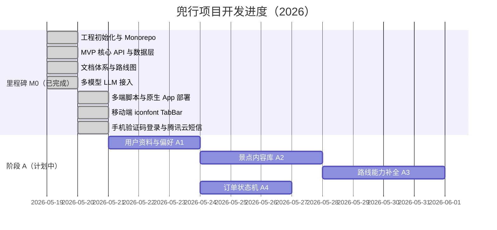

# 兜行（Douxing）功能路线图

> 依据《兜行平台最终详细设计文档》V2.0（2024年12月）与当前代码库对照编制。  
> 用于跟踪 **已完成 / 进行中 / 未开始** 功能，并按 **时间节点** 记录开发进度。

**文档版本**：3.0  
**更新日期**：2026-05-22  
**关联仓库**：`project/` Monorepo（`packages/web` · `packages/mobile` · `packages/server` · `packages/shared`）

---

## 目录

1. [进度总览](#1-进度总览)
2. [项目开发进度（时间轴）](#2-项目开发进度时间轴)
   - [2.4 开发记录（重难点与方案）](#24-开发记录重难点与方案)
3. [当前实现概况](#3-当前实现概况)
4. [模块对照总表](#4-模块对照总表)
5. [分步实施路线图](#5-分步实施路线图)
6. [与文档 Sprint 对应](#6-与文档-sprint-对应)
7. [推荐实施顺序](#7-推荐实施顺序)
8. [验收与协作说明](#8-验收与协作说明)

---

## 1. 进度总览

| 维度 | 状态 | 说明 |
|------|------|------|
| **整体阶段** | 阶段 C 已完成 | C1～C5 已验收 |
| **当前焦点** | 阶段 D/E/G | 按产品目标选线 |
| **下一步建议** | 阶段 D/E/G | 社交 / 商业 / 平台工程 |
| **完成度（里程碑）** | M0：**7/7** · A：**4/4** · B：**6/6** · C：**5/5** · 其余未开始 | 见 [时间轴](#2-项目开发进度时间轴) |

**状态图例**：`[ ]` 未开始 · `[~]` 进行中 · `[x]` 已完成

---

## 2. 项目开发进度（时间轴）

按实际开发与提交记录整理；每完成一项请更新 **完成日** 与 **状态**。



### 2.1 里程碑记录表

| 节点 ID | 完成日 | 状态 | 名称 | 交付摘要 | 关联提交/说明 |
|---------|--------|------|------|----------|----------------|
| **M0-1** | 2026-05-19 | [x] | 工程初始化 | pnpm Monorepo、Web / UniApp / Express、MySQL + Drizzle、Docker Compose | `feat(init)` |
| **M0-2** | 2026-05-19 | [x] | MVP 核心功能 | 认证、路线生成/列表/发布、打卡、成就、模拟支付订单 | `feat(mvp)` |
| **M0-3** | 2026-05-19 | [x] | 文档体系 | `docs/ROADMAP.md`、`docs/详细设计文档.md`、README 命令速查 | `docs(README)` |
| **M0-4** | 2026-05-19 | [x] | 多模型 LLM | DeepSeek / LM Studio / `auto` 降级；`llm-status`、`llm-providers`；规划页选模型 | `feat(llm)` |
| **M0-5** | 2026-05-20 | [x] | 多端与原生部署 | `dev:only`、`deploy:app`、`build:app-all`；`scripts/app-native.md` | `feat(build)` |
| **M0-6** | 2026-05-20 | [x] | 移动端 TabBar | iconfont 字体图标、`DouxingTabBar` 组件、H5/小程序/App 底部导航 | `feat(tab-bar)` |
| **M0-7** | 2026-05-20 | [x] | 手机验证码登录注册 | 验证码发送/登录 API；Web + 移动端双 Tab 登录页；腾讯云短信；mock 开发模式 | 未单独提交 |
| **A** | 2026-05-21 | [x] | 阶段 A 完成 | A1～A4 全部验收 | — |
| **B** | 2026-05-22 | [x] | 阶段 B 完成 | B1～B6 打卡与游戏化 | — |
| **C** | 2026-05-22 | [x] | 阶段 C 完成 | C1～C5 AI 规划深化 | — |
| **D** | — | [ ] | 阶段 D 完成 | D1～D5 社交 | 依赖 B 部分能力 |
| **E** | — | [ ] | 阶段 E 完成 | E1～E7 商业闭环 | 依赖 A4 |
| **F** | — | [ ] | 阶段 F 完成 | F1～F3 AR/VR | 可后置 |
| **G** | — | [ ] | 阶段 G 完成 | G1～G8 平台工程 | 建议穿插 |

### 2.2 版本迭代日志（简表）

| 版本 | 日期 | 类型 | 变更摘要 |
|------|------|------|----------|
| v0.1.0 | 2026-05-19 | 初始化 | Monorepo、基础配置、Git 提交规范 |
| v0.2.0 | 2026-05-19 | MVP | 用户/路线/打卡/成就/订单 API；Web 管理端；移动端四 Tab |
| v0.2.1 | 2026-05-19 | AI | DeepSeek + LM Studio；`.env.example`；移动端模型选择 |
| v0.2.2 | 2026-05-19 | 文档 | 路线图 v1.0；详细设计 Markdown；README 完善 |
| v0.3.0 | 2026-05-20 | 工程 | 单平台 dev/build、原生 App 一键部署脚本 |
| v0.3.1 | 2026-05-20 | 移动端 | iconfont TabBar；修复 H5 底部栏与高亮同步 |
| v0.3.2 | 2026-05-20 | 认证 | 手机验证码登录/注册；腾讯云短信；密码/验证码双模式登录页 |
| v0.4.0 | 2026-05-20 | 内容库 | `attractions` 表、28 条种子、景点 API、路线关联 `attractionId` |
| v0.4.1 | 2026-05-21 | 路线互动 | 点赞/收藏、热门列表、草稿编辑、浏览量统计 |
| v0.4.5 | 2026-05-22 | 排行榜 | 周榜/月榜、打卡数/积分排行、移动端排行榜页 |
| v0.4.4 | 2026-05-22 | 成就 | achievement_definitions 表、8 种成就、配置化触发、图鉴页 |
| v0.4.3 | 2026-05-22 | 徽章 | badges/user_badges 表、11 种徽章、打卡触发解锁、移动端图鉴 |
| v0.5.0 | 2026-05-22 | AI 多轮规划 | plan_sessions 会话表、规划页对话 UI、LLM history 追问改方案 |
| v0.5.1 | 2026-05-22 | 路线解锁 | `ROUTE_UNLOCK_PAYMENT_REQUIRED` 环境开关，默认免支付直看行程 |
| v0.5.2 | 2026-05-22 | 草稿 UX | 生成后详情页隐藏「编辑草稿」，仅从「我的路线」草稿入口编辑 |
| v0.5.3 | 2026-05-22 | AI 意图解析 | 城市/天数/预算/主题结构化抽取；约束注入 LLM；生成后校正 |
| v0.5.4 | 2026-05-22 | RAG 景点检索 | 城市+标签检索内容库；注入 LLM；生成后对齐 attractionId |
| v0.5.5 | 2026-05-22 | 多方案生成 | 首条生成 3 套候选；横向卡片选择；追问收敛为单方案 |
| v0.5.6 | 2026-05-22 | AI 微服务 | packages/ai-service FastAPI+LangChain；Node 优先调用、失败降级 |

### 2.3 下一步时间节点（计划）

| 计划完成日 | 步骤 | 目标 |
|------------|------|------|
| 2026-05-22 | C1 | 多轮对话规划（已完成） |
| 2026-05-22 | C2 | 意图结构化解析（城市/天数/预算/主题）（已完成） |
| 2026-05-22 | C3 | RAG 轻量景点检索（已完成） |
| 2026-05-22 | C4 | 一次返回 2～3 套候选路线（已完成） |
| 2026-05-22 | C5 | Python AI 微服务 FastAPI+LangChain（已完成） |

> 计划日随实际进度调整；完成某步后请将上表「状态」改为 `[x]` 并填写实际完成日。

### 2.4 开发记录索引（重难点与亮点）

> **详细内容**（思考过程、取舍、每任务 2～3 亮点 + 2～3 重难点）见独立文档：  
> **[开发记录-重难点与亮点.md](./开发记录-重难点与亮点.md)**

| 完成日 | 任务 | 文档章节 |
|--------|------|----------|
| 2026-05-20 | M0-7 手机验证码登录 + 腾讯云短信 | [§ M0-7](./开发记录-重难点与亮点.md#m0-7-手机验证码登录--腾讯云短信) |
| 2026-05-20 | A1 用户资料与偏好 | [§ A1](./开发记录-重难点与亮点.md#a1-用户资料与偏好) |
| 2026-05-20 | A2 景点/内容基础库 | [§ A2](./开发记录-重难点与亮点.md#a2-景点内容基础库) |
| 2026-05-20 | A2+ AI 景点同步（pending + 合并） | [§ A2+](./开发记录-重难点与亮点.md#a2-ai-景点同步pending--合并) |
| 2026-05-20 | A2++ POI 分类过滤入库 | [§ A2++](./开发记录-重难点与亮点.md#a2-poi-分类过滤入库) |
| 2026-05-20 | 高德地理编码补坐标 | [§ 高德](./开发记录-重难点与亮点.md#高德地理编码补坐标) |
| 2026-05-20 | Redis 地理编码缓存 | [§ Redis](./开发记录-重难点与亮点.md#redis-地理编码缓存) |
| 2026-05-20 | 数据库命令体系（Drizzle） | [§ Drizzle](./开发记录-重难点与亮点.md#数据库生成与使用命令drizzle) |
| 2026-05-20 | A3-1 AI 路线重新生成（prompt + 景点同步） | [§ A3-1](./开发记录-重难点与亮点.md#a3-1-ai-路线重新生成prompt--景点同步) |
| 2026-05-20 | A3-2 移动端 AI 规划全局 Loading 与中断 | [§ A3-2](./开发记录-重难点与亮点.md#a3-2-移动端-ai-规划全局-loading-与中断) |
| 2026-05-21 | A3 路线能力补全（点赞/收藏/热门/草稿/浏览量） | [§ A3](./开发记录-重难点与亮点.md#a3-路线能力补全) |
| 2026-05-21 | A4 订单状态机与超时取消 | [§ A4](./开发记录-重难点与亮点.md#a4-订单状态机) |
| 2026-05-21 | B1 打卡字段增强 | [§ B1](./开发记录-重难点与亮点.md#b1-打卡字段增强) |
| 2026-05-21 | B2 地理围栏打卡 | [§ B2](./开发记录-重难点与亮点.md#b2-地理围栏打卡) |
| 2026-05-21 | B3 打卡地图 UI | [§ B3](./开发记录-重难点与亮点.md#b3-打卡地图-ui) |
| 2026-05-22 | B4 徽章系统 | [§ B4](./开发记录-重难点与亮点.md#b4-徽章系统) |
| 2026-05-22 | B5 成就体系完善 | [§ B5](./开发记录-重难点与亮点.md#b5-成就体系完善) |
| 2026-05-22 | B6 排行榜 | [§ B6](./开发记录-重难点与亮点.md#b6-排行榜) |
| 2026-05-22 | C1 多轮对话规划 | [§ C1](./开发记录-重难点与亮点.md#c1-多轮对话规划) |
| 2026-05-22 | C4 多方案生成 | [§ C4](./开发记录-重难点与亮点.md#c4-多方案生成) |
| 2026-05-22 | C3 RAG 景点检索 | [§ C3](./开发记录-重难点与亮点.md#c3-rag-景点检索) |
| 2026-05-22 | C2 意图结构化解析 | [§ C2](./开发记录-重难点与亮点.md#c2-意图结构化解析) |
| 2026-05-22 | C5 Python AI 微服务 | [§ C5](./开发记录-重难点与亮点.md#c5-python-ai-微服务) |
| 2026-05-22 | C1+ 路线解锁支付开关 | [§ C1+](./开发记录-重难点与亮点.md#c1-路线解锁支付开关) |
| 2026-05-22 | A3++ 草稿编辑入口分离 | [§ A3++](./开发记录-重难点与亮点.md#a3-草稿编辑入口分离) |

新任务完成后：在独立文档按附录模板追加一章，并在此表增加一行索引。

---

## 3. 当前实现概况

### 3.1 已完成（M0 · 对应设计文档 Sprint 1–2 骨架）

| 能力 | 完成日 | 说明 |
|------|--------|------|
| 工程脚手架 | 2026-05-19 | pnpm Monorepo、Web / UniApp / Express、MySQL + Drizzle |
| 用户认证 | 2026-05-20 | 注册、登录、JWT、`/auth/me`、RBAC；**手机验证码登录/注册**（`/auth/sms/send`、`/auth/sms/login`）；密码/验证码双模式登录页（Web + 移动端） |
| AI 路线生成 | 2026-05-22 | **DeepSeek** / **LM Studio** / `auto` 模板降级；**多轮对话**；**意图解析**；**RAG 内容库检索** |
| 路线管理 | 2026-05-22 | 生成、列表、详情、发布；解锁可选（`ROUTE_UNLOCK_PAYMENT_REQUIRED`，默认免支付） |
| 打卡 | 2026-05-21 | 含城市/积分/照片/GPS 围栏；列表 + 地图足迹、时间筛选 |
| 徽章 | 2026-05-22 | 11 种徽章（城市/成就/特殊）；打卡条件触发；移动端图鉴展示 |
| 成就 | 2026-05-22 | 8 种配置化成就；打卡触发；独立图鉴页 |
| 排行榜 | 2026-05-22 | 周榜/月榜；打卡数/积分；移动端排行榜页 |
| 订单 | 2026-05-19 | 路线解锁订单、`pending` → 模拟支付 |
| 移动端 | 2026-05-20 | Tab：首页 / 规划 / 路线 / 我的；iconfont 底栏；登录注册（验证码 + 密码） |
| 管理端 | 2026-05-19 | 路线、订单、打卡列表（admin） |
| 多端脚本 | 2026-05-20 | `dev:only`、`deploy:app`、H5 / 微信小程序 / Android / iOS |
| 景点库 | 2026-05-20 | `attractions` 表 + 28 条种子；路线生成自动关联 `attractionId` |
| 数据表 | 2026-05-22 | `users`、`travel_routes`、`plan_sessions`、`plan_session_messages`、`check_ins`、`achievements`、`badges`、`orders` 等 |

### 3.2 主要 API（已实现）

```
GET  /api/health
POST /api/auth/register
POST /api/auth/login
POST /api/auth/sms/send
POST /api/auth/sms/login
GET  /api/auth/me
GET  /api/users/me
PUT  /api/users/me
POST /api/users/me/avatar

GET  /api/routes/llm-status
GET  /api/routes/llm-providers
POST /api/routes/generate
POST /api/routes/plan-sessions
GET  /api/routes/plan-sessions
GET  /api/routes/plan-sessions/:id
POST /api/routes/plan-sessions/:id/messages
POST /api/routes/:id/regenerate
GET  /api/routes
GET  /api/routes/hot
GET  /api/routes/:id
PUT  /api/routes/:id
POST /api/routes/:id/like
POST /api/routes/:id/favorite
POST /api/routes/:id/publish

POST /api/checkins
GET  /api/checkins

GET  /api/achievements
GET  /api/achievements/catalog
GET  /api/achievements/mine

GET  /api/badges
GET  /api/badges/mine

GET  /api/leaderboard

GET  /api/attractions
GET  /api/attractions/cities
GET  /api/attractions/:id

POST /api/orders
GET  /api/orders/payment-config
POST /api/orders/:id/pay
POST /api/orders/:id/cancel
GET  /api/orders
```

### 3.3 默认账号

| 用户名 | 密码 | 用途 |
|--------|------|------|
| admin | admin123 | Web 管理端 |
| demo | demo123 | 移动端体验 |

---

## 4. 模块对照总表

| 设计文档章节 | 模块 | 已实现 | 未实现 / 仅简化 |
|-------------|------|--------|----------------|
| §2 | 系统架构 | 单体 Express、多端脚本 | 微服务、K8s、API 网关、消息队列 |
| §3 | AI 智能规划 | 单轮/多轮 LLM + 模板；plan_sessions 追问改方案 | 多 Agent、RAG、向量库、语音/图输入 |
| §4.3 | 打卡地图 | GPS 围栏、地图足迹、照片字段 | 热力图、照片审核 |
| §4.6 | 成就系统 | 8 种配置化成就 + 徽章 + 排行榜 | 事件驱动（Kafka） |
| §4.4 | 搭子匹配 | — | 发布需求、匹配算法、邀请组队 |
| §4.5 | 盲盒旅行 | — | 加权随机、揭晓、保底 |
| §4.7 | 社交图谱 | — | Neo4j / 关注关系 |
| §5.3 | 订单管理 | 路线解锁、MVP 状态机与超时取消 | 多类型、退款/售后 |
| §5.4 | 支付 | 模拟支付；路线解锁可 `.env` 关闭（默认免支付） | 微信对账、生产强校验 |
| §5.5 | 服务者认证 | — | 申请、审核、信用分 |
| §5.6 | CPS 分佣 | — | 推广员、结算 |
| §5.7 | 数字商品 | — | 手绘地图、藏品等 |
| §6 | AR/VR | — | AR 导航、讲解、全景、虚拟合影 |
| §7 | 数据存储 | MySQL | Redis、ES、Milvus、Neo4j、OSS |
| §8 | 安全合规 | JWT、RBAC；短信验证码登录 | 脱敏、审计、OAuth、等保；验证码 Redis 持久化（G1） |
| §9 | 部署运维 | Docker MySQL、bootstrap 脚本 | K8s、Prometheus、ELK |
| §11 | 测试 | — | 单元 / 集成 / E2E、压测 |
| §12 | 接口规范 | 部分 REST | WebSocket、完整 v1 清单 |
| §13 | 前沿技术 | — | Web3、联邦学习等 |
| 移动端 UX | iconfont TabBar、四 Tab | 自定义主题、消息红点 |

---

## 5. 分步实施路线图

每一步力求 **独立可交付、可验收**。完成某步后请：

1. 将下表「状态」改为 `[x]`，填写「完成日」  
2. 在 [§2.1 里程碑记录表](#21-里程碑记录表) 或 [§2.3 计划表](#23-下一步时间节点计划) 更新实际日期  
3. 在 [§2.2 版本迭代日志](#22-版本迭代日志简表) 追加一行  

---

### 阶段 A：补齐 MVP 缺口（优先，计划 2026-05-21 ～ 2026-06-07）

| 步 | 状态 | 计划完成 | 名称 | 设计文档 | 交付内容 | 验收标准 |
|----|------|----------|------|----------|----------|----------|
| A1 | [x] | 2026-05-20 | 用户资料与偏好 | §7.2.1、§12.2.1 | `PUT /users/me`、头像、兴趣标签；移动端编辑页 | 修改资料持久化 |
| A2 | [x] | 2026-05-20 | 景点/内容基础库 | §3.5、内容服务 | `attractions` 表 + 种子数据（城市、坐标、标签） | 路线可关联真实景点 ID |
| A3 | [x] | 2026-05-21 | 路线能力补全 | §12.2.2 | 点赞/收藏、热门列表、草稿编辑、浏览量 | 列表筛选与统计可用 |
| A4 | [x] | 2026-05-21 | 订单状态机 | §5.3 | `pending→paid→completed/cancelled`、超时取消 | 状态流转正确、不可重复支付 |

---

### 阶段 B：打卡与游戏化（§4，计划 2026-06 起，约 2～3 周）

| 步 | 状态 | 计划完成 | 名称 | 设计文档 | 交付内容 | 验收标准 |
|----|------|----------|------|----------|----------|----------|
| B1 | [x] | 2026-05-21 | 打卡字段增强 | §4.3.4 | `city_code`、`photos`、`points_earned` 等 | 打卡含城市、积分、可选图 |
| B2 | [x] | 2026-05-21 | 地理围栏打卡 | §4.3.3 | GPS 上报、距离 ≤500m、简单防作弊 | 远离景点无法打卡 |
| B3 | [x] | 2026-05-21 | 打卡地图 UI | §4.3 | UniApp 地图展示打卡点、按时间筛选 | 地图可见足迹 |
| B4 | [x] | 2026-05-22 | 徽章系统 | §4.3.4 | `badges`、`user_badges`、条件触发 | 达成条件解锁徽章 |
| B5 | [x] | 2026-05-22 | 成就体系完善 | §4.6 | 成就配置表、8 种类型 | 多类型成就可触发 |
| B6 | [x] | 2026-05-22 | 排行榜 | §4.2 | 周榜/月榜（打卡数、积分） | 移动端排行榜页 |

---

### 阶段 C：AI 规划深化（§3，约 2～4 周）

| 步 | 状态 | 计划完成 | 名称 | 设计文档 | 交付内容 | 验收标准 |
|----|------|----------|------|----------|----------|----------|
| C1 | [x] | 2026-05-22 | 多轮对话规划 | §3.3、§3.4 | 会话表、带 history 的生成接口 | 可追问并调整方案 |
| C2 | [x] | 2026-05-22 | 意图结构化解析 | §3.4.3 | 抽取城市/天数/预算/主题 | 生成结果符合约束 |
| C3 | [x] | 2026-05-22 | RAG 景点检索（轻量） | §3.5 | MySQL 全文/标签检索或本地向量 | 景点来自内容库 |
| C4 | [x] | 2026-05-22 | 多方案生成 | §3.7 | 一次返回 2～3 条候选路线 | 用户可选择方案 |
| C5 | [x] | 2026-05-22 | Python AI 微服务（可选） | §1.4 | `packages/ai-service` + FastAPI/LangChain | Node 可调用，失败降级 |

---

### 阶段 D：社交（§4.4、§4.7，约 2～3 周）

| 步 | 状态 | 计划完成 | 名称 | 设计文档 | 交付内容 | 验收标准 |
|----|------|----------|------|----------|----------|----------|
| D1 | [ ] | — | 关注/好友 | §4.7 | `follows` 表（MySQL 先行） | 关注与粉丝列表 |
| D2 | [ ] | — | 搭子需求发布 | §4.4 | `match_requests` 表 | 发布与我的需求列表 |
| D3 | [ ] | — | 搭子匹配推荐 | §4.4.2 | 标签+时间+地点加权打分 | Top N 推荐与分数 |
| D4 | [ ] | — | 邀请与组队 | §4.4.5 | 邀请/接受、小队表 | 邀请流程闭环 |
| D5 | [ ] | — | 社交分享 | Sprint 3–4 | 分享海报 / H5 / 小程序卡片 | 他人可打开只读页 |

---

### 阶段 E：商业闭环（§5，约 3～4 周）

| 步 | 状态 | 计划完成 | 名称 | 设计文档 | 交付内容 | 验收标准 |
|----|------|----------|------|----------|----------|----------|
| E1 | [ ] | — | 多类型订单 | §5.3.1 | service/package/blindbox/vip | 各类型可创建订单 |
| E2 | [ ] | — | 真实支付 | §5.4 | 微信支付（小程序或 H5）+ 回调 | 沙箱真实支付一笔 |
| E3 | [ ] | — | 盲盒旅行 | §4.5 | SKU、加权随机、揭晓时间 | 付费后按时揭晓 |
| E4 | [ ] | — | 服务者认证 | §5.5 | 申请、审核、服务者角色 | 管理端审核通过/拒绝 |
| E5 | [ ] | — | 服务预约订单 | §5 | 时段预约、与服务者绑定 | 下单到完成流程 |
| E6 | [ ] | — | CPS 分佣 | §5.6 | 推广员、佣金、待结算记录 | 订单完成后生成佣金 |
| E7 | [ ] | — | 数字商品 | §5.7 | 虚拟商品下单与下载 | 购买后可下载/预览 |

---

### 阶段 F：AR/VR 与前沿（§6、§13，可后置）

| 步 | 状态 | 计划完成 | 名称 | 设计文档 | 交付内容 | 验收标准 |
|----|------|----------|------|----------|----------|----------|
| F1 | [ ] | — | VR 全景预览 | §6.6 | 景点挂全景 URL + 播放器 | 详情页可全景浏览 |
| F2 | [ ] | — | AR 讲解（简化） | §6.4 | 景点语音+图文讲解 | 景点页可播放 |
| F3 | [ ] | — | 数字藏品（可选） | §13.1 | 链下藏品或联盟链对接 | 购买与展示 |

---

### 阶段 G：平台与工程质量（建议穿插）

| 步 | 状态 | 计划完成 | 名称 | 设计文档 | 交付内容 | 验收标准 |
|----|------|----------|------|----------|----------|----------|
| G1 | [ ] | — | Redis 缓存 | §7.3 | 热门路线、会话、限流 | docker-compose 含 Redis |
| G2 | [ ] | — | 对象存储 | §7 | MinIO/OSS 上传头像与打卡图 | 图片 URL 可访问 |
| G3 | [ ] | — | 通知服务 | §2.2.3 | 站内消息 + 微信订阅消息 | 关键事件有通知 |
| G4 | [ ] | — | 管理端数据分析 | 数据分析服务 | Dashboard 图表 | 用户/订单/打卡趋势 |
| G5 | [ ] | — | 限流与网关 | §2.2.2 | Nginx 反代 + rate limit | 超限 429 |
| G6 | [ ] | — | 安全合规 | §8 | 脱敏、审计日志、HTTPS 说明 | 敏感字段已脱敏 |
| G7 | [ ] | — | 自动化测试 | §11 | API 集成测试 + 核心 E2E | CI `pnpm test` 通过 |
| G8 | [~] | — | 生产部署 | §9 | Nginx + PM2 + 生产 compose、`docs/deploy-production.md` | 服务器 HTTPS 可访问 `/api/health` |

---

## 6. 与文档 Sprint 对应

| 设计文档 Sprint | 时间（文档） | 路线图阶段 | 实际进度 |
|----------------|-------------|------------|----------|
| Sprint 1–2 | MVP | **M0（已完成）** | 2026-05-19 ～ 2026-05-20（含 M0-7 验证码登录） |
| Sprint 1–2 补全 | MVP 缺口 | **阶段 A** | 计划 2026-05-21 起 |
| Sprint 5–6 | AI 增强 | **C + F** | C1～C5 已完成（2026-05-22）；M0 已含基础 LLM |
| Sprint 3–4 | 社交功能 | **B + D** | B 已完成（2026-05-22）；D 未开始 |
| Sprint 7–8 | 商业闭环 | **E** | 未开始 |
| 基础设施 | 贯穿 | **G** | 未开始 |

---

## 7. 推荐实施顺序

### 7.1 按产品目标选线

| 目标 | 建议步骤顺序 |
|------|-------------|
| 产品尽快好用 | A1 → A2 → B2 → B4 |
| AI 对齐设计文档 | C2 → C3 → C4 → C5 |
| 商业化变现 | A4 → E1 → E2 → E3 |
| 社交差异化 | D1 → D2 → D3 → D5 |
| 工程可上线 | G1 → G2 → G6 → G7 → G8 |

### 7.2 最小可行迭代（对齐时间节点）

| 迭代 | 计划周期 | 步骤 | 目标 |
|------|----------|------|------|
| 迭代 0 | 2026-05-19 ～ 05-20 | M0-1 ～ M0-7 | **已完成** — MVP 可演示、多端可跑、验证码登录 |
| 迭代 1 | 2026-05-21 ～ 05-24 | A1 | 用户可完善资料 |
| 迭代 2 | 2026-05-25 ～ 06-02 | A2 + A4 | 景点库 + 订单更可靠 |
| 迭代 3 | 2026-06-03 ～ 06-14 | B4 + B5 + A3 | 徽章成就 + 路线互动 |
| 迭代 4 | 2026-05-22 ～ 06-12 | C1～C5 | 对话式规划 + 约束 + RAG + 多方案 + Python AI 服务（已完成） |
| 迭代 5 | 2026-07 起 | D2 + D3 | 搭子匹配 MVP |
| 迭代 6 | 2026-07 起 | E2 + E3 | 真支付 + 盲盒 |

---

## 8. 验收与协作说明

### 8.1 单步完成检查清单

- [ ] 数据库迁移已添加（`packages/server/drizzle/`）
- [ ] 类型已同步到 `@douxing/shared`
- [ ] API 已在 `README.md` 或本文档补充
- [ ] 移动端 / 管理端页面可演示
- [ ] `pnpm --filter @douxing/server exec tsc --noEmit` 通过
- [ ] 本地 `pnpm dev` 可端到端走通
- [ ] **本文档** §2.1 / §5 对应步骤状态与完成日已更新

### 8.2 分支与提交建议

- 分支命名：`feat/roadmap-a1-user-profile`（与步骤编号对应）
- 提交格式：`feat(user): 添加用户资料编辑接口`（Conventional Commits）

### 8.3 如何指定开发任务

```text
做路线图第 A1 步：用户资料与偏好
```

以该步「交付内容」「验收标准」为完成定义。

---

## 附录 A：技术栈（设计 vs 当前）

| 层级 | 设计文档 | 当前实现（截至 2026-05-20） |
|------|----------|---------------------------|
| Web | Vue 3 + Element Plus | Vue 3 + Vite（无 Element Plus） |
| 移动 | UniApp | UniApp Vue3；H5 / 微信小程序 / App；iconfont TabBar |
| 后端 | Node + 独立 Python AI | Node Express + 可选 `packages/ai-service`；腾讯云短信 |
| AI | Qwen + LangChain | **DeepSeek** + **LM Studio** + Python LangChain 微服务 + 模板降级 |
| 数据库 | MySQL + Redis + Milvus + Neo4j | MySQL only |
| 部署 | Docker + K8s | Docker MySQL + bootstrap / deploy 脚本 |

---

## 附录 B：相关文档

| 文档 | 路径 |
|------|------|
| 项目说明 | [README.md](../README.md) |
| 详细设计（Markdown） | [docs/详细设计文档.md](./详细设计文档.md) |
| 开发记录（重难点与亮点） | [docs/开发记录-重难点与亮点.md](./开发记录-重难点与亮点.md) |
| 微信小程序 | [scripts/mp-weixin.md](../scripts/mp-weixin.md) |
| 原生 App 部署 | [scripts/app-native.md](../scripts/app-native.md) |

---

## 附录 C：维护说明

1. **每完成一步**：更新 §5 状态为 `[x]`，填写「完成日」；同步 §2.1 或 §2.2。  
2. **每完成一项任务**：在 [开发记录-重难点与亮点.md](./开发记录-重难点与亮点.md) 追加一章（含思考过程；每章 2～3 亮点 + 2～3 重难点），并在 §2.4 索引表增加一行。  
3. **每发布版本**：在 §2.2 追加版本行（如 v0.3.2）。  
4. **计划变更**：只改 §2.3 与 §5「计划完成」列，保留历史于 Git 提交记录。  
5. **README**：MVP / API 有重大变更时同步 [README.md](../README.md)。

---

*文档版本 3.1 · 最后更新：2026-05-22*
