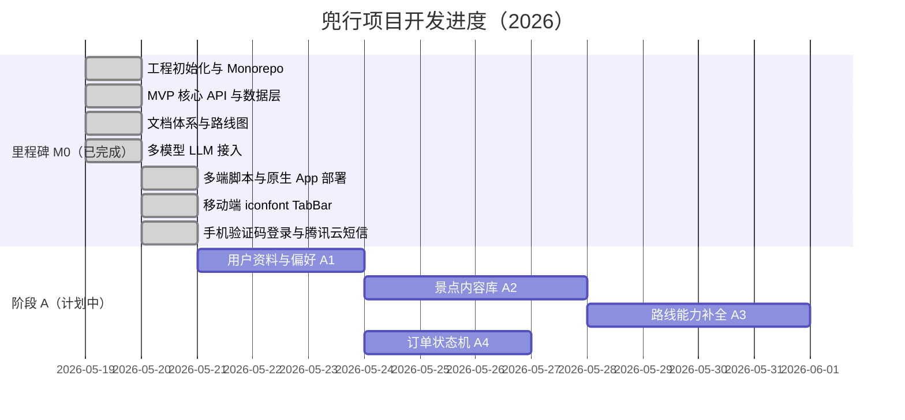
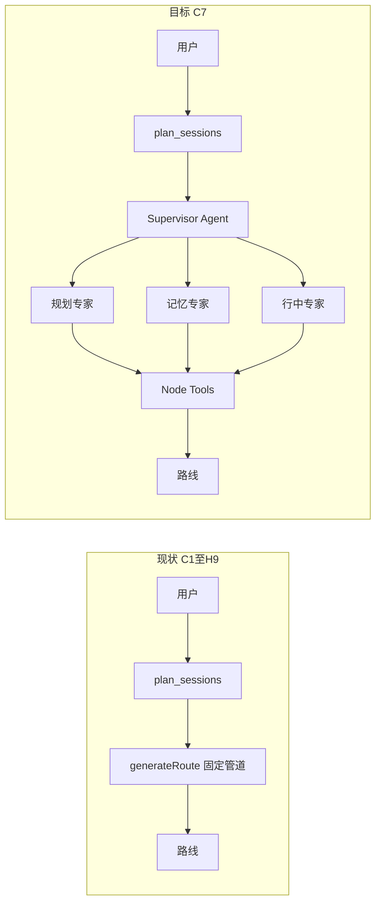

# 兜行（Douxing）功能路线图

> 依据《兜行平台最终详细设计文档》V2.0（2024年12月）与当前代码库对照编制。  
> 用于跟踪 **已完成 / 进行中 / 未开始** 功能，并按 **时间节点** 记录开发进度。

**文档版本**：3.41  
**更新日期**：2026-06-23  
**关联仓库**：`project/` Monorepo（`packages/web` · `packages/pc` · `packages/mobile` · `packages/server` · `packages/shared`）  
**新增专题**：[系统管理.md](./系统管理.md) · [发单接单平台.md](./发单接单平台.md) · [数字孪生与三维建模.md](./数字孪生与三维建模.md) · [AI旅行宠物.md](./AI旅行宠物.md) · [旅行日记博客.md](./旅行日记博客.md) · [用户粘性与旅友圈战略.md](./用户粘性与旅友圈战略.md) · [Web管理端表格规范.md](./Web管理端表格规范.md)

---

## 目录

1. [进度总览](#1-进度总览)
2. [项目开发进度（时间轴）](#2-项目开发进度时间轴)
   - [2.4 开发记录（重难点与方案）](#24-开发记录重难点与方案)
3. [当前实现概况](#3-当前实现概况)
4. [模块对照总表](#4-模块对照总表)
5. [分步实施路线图](#5-分步实施路线图)（含 [阶段 C7：AI Agent](#阶段-c7ai-agent-演进2026-06-11-录入) · [阶段 P：PC 用户端](#阶段-pc-用户端c-端桌面网页2026-06-08-录入) · [阶段 P6：PC 体验基建](#阶段-p6pc-体验基建tailwind-组件与全局反馈2026-06-10-录入) · [阶段 S：系统管理](#阶段-s系统管理2026-06-09-录入) · [阶段 W：Web 管理端体验](#阶段-wweb-管理端体验补充) · [阶段 M：发单接单](#阶段-m发单接单平台2026-06-09-录入) · [阶段 F：数字孪生/3D](#阶段-farvr-数字孪生与三维建模可后置) · [阶段 K-A：旅行日记博客](#阶段-ka旅行日记博客2026-06-10-定稿) · [阶段 K-B：品牌博客](#阶段-kb品牌博客后期待办2026-06-10-录入)）
6. [与文档 Sprint 对应](#6-与文档-sprint-对应)
7. [推荐实施顺序](#7-推荐实施顺序)（含 [§7.5 C7 Agent 执行顺序](#75-c7-agent-演进推荐执行顺序)）
8. [验收与协作说明](#8-验收与协作说明)
9. [产品待办池（新增关键点）](#9-产品待办池新增关键点)
   - [9.4 宣传类目](#94-宣传类目2026-05-29-录入)
   - [9.6 后期待办 · K-A 旅行日记博客](#96-后期待办--ka-旅行日记博客2026-06-10-定稿) · [9.7 后期待办 · K-B 品牌博客](#97-后期待办--kb-品牌博客2026-06-10-录入) · [9.8 用户粘性与旅友圈战略](#98-用户粘性与旅友圈战略2026-06-12-定稿)

---

## 1. 进度总览

| 维度 | 状态 | 说明 |
|------|------|------|
| **整体阶段** | 阶段 C 已完成 · G8 生产部署已落地 · **G9 国际化已验收** | C1～C5 已验收；API 可公有化至 `api.yxtao.site` |
| **当前焦点** | **Step 35 I2 PAI LoRA 微调**（上传脚本已交付）· **S1 RBAC** · 开发环境联调 | **M1～M5 已达成**；`ml:upload-dataset` · `i2:pai-lora-cases` 已落地；P5 Webhook · J1～J5+ · G4/DT1 已落地；见 [下一步工作.md](./下一步工作.md) |
| **下一步建议** | 见 **[下一步工作.md](./下一步工作.md)** · **[AI路径规划路线图 §0](./AI路径规划路线图.md#0-当前指针必读)** | 全站：S1 RBAC；**AI 规划：Step 35～40 → M6 主链验收** |
| **完成度（里程碑）** | M0：**7/7** · A：**4/4** · B：**6/6** · C：**5/5** · G8：**已交付** · G9：**已验收** · 其余未开始 | 见 [时间轴](#2-项目开发进度时间轴) |

**状态图例**：`[ ]` 未开始 · `[~]` 进行中 · `[x]` 已完成

### 1.1 双模块产品架构（2026-06-09 定稿）

兜行由 **两个独立业务模块** 并列组成，共用账号与基础设施，**不强制串联**：

| 模块 | 名称 | 用户 | 核心能力 | 数据域 |
|------|------|------|----------|--------|
| **A** | AI 旅行规划 | 个人自助游（默认） | 规划、路线、打卡、成就、手帐 | `plan_sessions`、`travel_routes`、`check_ins` … |
| **B** | 发单接单 marketplace | 按需：个人/团体发单 + 持证服务方接单 | 发单、报价、履约、结算 | `service_demand`、`biz_org`、`service_order` … |

- 模块 A 主链继续 J1、H9-3、PC P5 等，**不受** 模块 B 阻塞。  
- 模块 B 详见 [发单接单平台.md](./发单接单平台.md)；平台 RBAC 见 [系统管理.md](./系统管理.md)。  
- **搭子匹配（D 线）** 为社交结伴，与模块 B 商业发单 **分表、分入口**。

---

## 2. 项目开发进度（时间轴）

按实际开发与提交记录整理；每完成一项请更新 **完成日** 与 **状态**。



### 2.1 里程碑记录表

| 节点 ID | 完成日 | 状态 | 名称 | 交付摘要 | 关联提交/说明 |
|---------|--------|------|------|----------|----------------|
| **M0-1** | 2026-05-19 | [x] | 工程初始化 | pnpm Monorepo、Web / UniApp / Express、MySQL + Drizzle、Docker Compose | `feat(init)` |
| **M0-2** | 2026-05-19 | [x] | MVP 核心功能 | 认证、路线生成/列表/发布、打卡、成就、模拟支付订单 | `feat(mvp)` |
| **M0-3** | 2026-05-19 | [x] | 文档体系 | `docs/ROADMAP.md`、`docs/详细设计文档.md`、README 命令速查 | `docs(README)` |
| **M0-4** | 2026-05-19 | [x] | 多模型 LLM | DeepSeek / LM Studio / `auto` 降级；`llm-status`、`llm-providers`；规划页选模型 | `feat(llm)` |
| **M0-5** | 2026-05-20 | [x] | 多端与原生部署 | `dev:only`、`deploy:app`、`build:app-all`；`scripts/app-native.md` | `feat(build)` |
| **M0-6** | 2026-05-20 | [x] | 移动端 TabBar | iconfont 字体图标、`DouxingTabBar` 组件、H5/小程序/App 底部导航 | `feat(tab-bar)` |
| **M0-7** | 2026-05-20 | [x] | 手机验证码登录注册 | 验证码发送/登录 API；Web + 移动端双 Tab 登录页；腾讯云短信；mock 开发模式 | 未单独提交 |
| **A** | 2026-05-21 | [x] | 阶段 A 完成 | A1～A4 全部验收 | — |
| **B** | 2026-05-22 | [x] | 阶段 B 完成 | B1～B6 打卡与游戏化 | — |
| **C** | 2026-05-22 | [x] | 阶段 C 完成 | C1～C5 AI 规划深化 | — |
| **G8** | 2026-05-23 | [x] | 生产部署公有化 | Debian 12 + PM2 + Docker + Nginx/Certbot 一键；tsx 低内存模式；发版文档 | 见 [§ G8](./开发记录-重难点与亮点.md#g8-生产部署与-api-公有化) |
| **D** | — | [ ] | 阶段 D 完成 | D1～D6 社交（含 **旅友圈 D6**） | 依赖 B 部分能力 |
| **E** | — | [ ] | 阶段 E 完成 | E1～E7 商业闭环 | 依赖 A4 |
| **F** | — | [ ] | 阶段 F 完成 | F0～F6 孪生/3D/AR/VR | 可后置；见 [数字孪生与三维建模.md](./数字孪生与三维建模.md) |
| **G9** | 2026-05-27 | [x] | 国际化（i18n） | zh-CN / en-US 全主流程 UI + API 多语言；`mobileT`；Web 管理端；后端 `ApiError` 高频业务错误 | en-US 主流程手测已通过（2026-05-27） |
| **G** | — | [ ] | 阶段 G 完成 | G1～G9 平台工程 | 建议穿插 |

### 2.2 版本迭代日志（简表）

| 版本 | 日期 | 类型 | 变更摘要 |
|------|------|------|----------|
| v0.1.0 | 2026-05-19 | 初始化 | Monorepo、基础配置、Git 提交规范 |
| v0.2.0 | 2026-05-19 | MVP | 用户/路线/打卡/成就/订单 API；Web 管理端；移动端四 Tab |
| v0.2.1 | 2026-05-19 | AI | DeepSeek + LM Studio；`.env.example`；移动端模型选择 |
| v0.2.2 | 2026-05-19 | 文档 | 路线图 v1.0；详细设计 Markdown；README 完善 |
| v0.3.0 | 2026-05-20 | 工程 | 单平台 dev/build、原生 App 一键部署脚本 |
| v0.3.1 | 2026-05-20 | 移动端 | iconfont TabBar；修复 H5 底部栏与高亮同步 |
| v0.3.2 | 2026-05-20 | 认证 | 手机验证码登录/注册；腾讯云短信；密码/验证码双模式登录页 |
| v0.4.0 | 2026-05-20 | 内容库 | `attractions` 表、28 条种子、景点 API、路线关联 `attractionId` |
| v0.4.1 | 2026-05-21 | 路线互动 | 点赞/收藏、热门列表、草稿编辑、浏览量统计 |
| v0.4.5 | 2026-05-22 | 排行榜 | 周榜/月榜、打卡数/积分排行、移动端排行榜页 |
| v0.4.4 | 2026-05-22 | 成就 | achievement_definitions 表、8 种成就、配置化触发、图鉴页 |
| v0.4.3 | 2026-05-22 | 徽章 | badges/user_badges 表、11 种徽章、打卡触发解锁、移动端图鉴 |
| v0.5.0 | 2026-05-22 | AI 多轮规划 | plan_sessions 会话表、规划页对话 UI、LLM history 追问改方案 |
| v0.5.1 | 2026-05-22 | 路线解锁 | `ROUTE_UNLOCK_PAYMENT_REQUIRED` 环境开关，默认免支付直看行程 |
| v0.5.2 | 2026-05-22 | 草稿 UX | 生成后详情页隐藏内嵌「编辑草稿」；2026-05-26 **v0.6.3** 改为 hero 编辑按钮 + 弹窗，移除 `edit=1` 自动展开 |
| v0.5.3 | 2026-05-22 | AI 意图解析 | 城市/天数/预算/主题结构化抽取；约束注入 LLM；生成后校正 |
| v0.5.4 | 2026-05-22 | RAG 景点检索 | 城市+标签检索内容库；注入 LLM；生成后对齐 attractionId |
| v0.5.5 | 2026-05-22 | 多方案生成 | 首条生成 3 套候选；横向卡片选择；追问收敛为单方案 |
| v0.5.6 | 2026-05-22 | AI 微服务 | packages/ai-service FastAPI+LangChain；Node 优先调用、失败降级 |
| v0.6.0 | 2026-05-23 | 生产部署 | Debian 12 指南；deploy-server + PM2；Nginx/Certbot 自动配置；tsx 低内存；三套 env 与发版流程文档 |
| v0.6.1 | 2026-05-26 | 国际化 | `@douxing/shared` i18n 包；Web/移动端 vue-i18n；`Accept-Language` + `messageKey`；规划助手/变体/兴趣标签多语言 |
| v0.6.2 | 2026-05-26 | 体验 | 规划页 `VoiceTextComposer` 语音输入（录音 + 服务端腾讯云 ASR，替代微信同声传译插件） |
| v0.6.3 | 2026-05-26 | 路线详情 | 解锁后路线地图预览动画（`RouteMapPlayer` + `@douxing/shared` 路径模型）；草稿编辑改为 hero 编辑按钮 + 弹窗（按发布状态显隐，不自动弹出） |
| v0.6.4 | 2026-05-27 | 国际化扫尾 | 移动子页/规划/登录/语音/定位/打卡地图/Web 管理端 View；`mobileT`；`getOrderStatusI18nKey`；后端 `ApiError` + 30+ `ApiMessageKey`；en-US 主流程手测通过 |
| v0.6.5 | 2026-05-27 | H9 Phase 1 | Enricher MVP：schema、C2 交通/住宿意图、高德 Matrix 排程、跨城 mock、Prompt 收窄、详情行程展示 |
| v0.6.6 | 2026-05-27 | H9-1 UI + 修复 | 详情页 `RouteDayFlowChart` 统一展示交通→游玩→住宿；`cloneRouteDaysForSync` 保留 enrich 字段；规划对话区不展示路径 |
| v0.6.7 | 2026-05-28 | H9 Phase 2 | 高德 direction polyline + Redis 缓存；`GET /routes/:id/map-path`；酒店 RAG；详情地图接服务端路径 |
| v0.6.8 | 2026-05-29 | H9 Phase 3 | 班次库 Catalog（12+ 城市对）；可选 Juhe 实时；`scheduleNo`/`scheduleSource`；携程订票链接；闭馆冲突 `warnings` |
| v0.6.9 | 2026-05-29 | H9 Phase 4 | 玩法 RAG：`route-playbooks` + `playbook-rag.service`；段间 mode 比选；LLM 动线注入；去除虚假 `subway` 猜测 |
| v0.7.1 | 2026-05-29 | H1-b 宣传 | `DouxingEmptyState` 组件；路线/成就/徽章/打卡/排行榜/订单/首页空态统一 |
| v0.7.0 | 2026-05-29 | H1-a 宣传 | 品牌 CSS token；首页渐变 Hero + 价值主张 + 主 CTA；广场热门路线横向预览；去除「体验 MVP」文案 |
| v0.7.2 | 2026-05-29 | H1-c 宣传（部分） | 全站 `--dx-*` 皮肤；`useTheme` 蓝/青主题切换；Tab 页 Header+内容区+TabBar 布局；首页 Cover Flow 热门路线轮播；子页 Hero+筛选面板；订单页包装 |
| v0.7.3 | 2026-05-29 | H1-c 主题扫尾（部分） | `App.vue` `initAppTheme` 启动初始化；订单/个人资料页 i18n 与主题文案；`profile.theme*` 中英文 |
| v0.7.4 | 2026-06-01 | H1-c 宣传（完成） | `theme-colors.ts`；地图 polyline/语音/流程图/遮罩/成就徽章解锁态 token 化；原生 switch 随主题 |
| v0.8.0 | 2026-06-01 | I1 专属模型数据管线 | `pnpm ml:generate-dataset` / `ml:validate-dataset`；`training-data.service`；`packages/ml-training` 目录与 LoRA 配置；见 [阿里云专属模型](./阿里云-兜行专属模型训练与部署.md) |
| v0.8.1 | 2026-06-01 | H2-a 产品定稿 | 路线分享改为 **手帐多模板**；H2-a MVP 2 模板 · H2-a+ 轻量选项 · H2-c 拖拽编辑远期；见 [§5 H2-a 模板](#h2-a-路线手帐海报模板体系) |
| v0.8.2 | 2026-06-01 | H10 产品录入 | **路线可信度**：UGC 短视频绑定路线/POI、跳转播放、景点说明与热评；分 Phase H10-a～e |
| v0.8.3 | 2026-06-01 | H2-a + D5-a 宣传 | `packages/mobile/src/poster/` 手帐双模板 · 路线详情分享图 · `onShareAppMessage` · H5 只读分享页 · `GET /share/routes/:id`；见 [§ H2-a+D5-a](./开发记录-重难点与亮点.md#h2-a--d5-a-路线手帐海报与分享链路) |
| v0.8.4 | 2026-06-01 | A2+++ 景点封面 Phase 0 | `attractions` 封面字段 · 管理端上传 · 路线 POI/手帐/分享页展示 · Image Enricher 骨架；见 [§ A2+++ P0](./开发记录-重难点与亮点.md#a2-景点封面-phase-0) |
| v0.8.5 | 2026-06-01 | A2+++ P1 + H2-a 内容增强 | 高德 POI 自动拉图 · sync/读路线 await · 磁盘覆盖策略 · 手帐全节点/动态画布 · 行程缩略图大图预览；见 [§ A2+++ P1](./开发记录-重难点与亮点.md#a2-景点封面-phase-1) · [§ H2-a 增强](./开发记录-重难点与亮点.md#h2-a-手帐内容与行程展示增强) |
| v0.8.6 | 2026-06-01 | H2-a 体验扫尾 | 手帐完整描述/多天展示 · 每日多图照片条 · 标签与标题同行 · Canvas 实测高度 · 地图打卡点常驻名称；见 [§ H2-a 增强](./开发记录-重难点与亮点.md#h2-a-手帐内容与行程展示增强) |
| v0.8.7 | 2026-06-01 | D5 补全 + 手帐全量行程 | 海报三层 QR（H5 / 小程序码 / URL Link）· 取消每天 8 项/5 天上限 · 卡片测高修复 · 画布上限 4096px；见 [§ D5 补全](./开发记录-重难点与亮点.md#d5-补全--海报二维码与行程全量展示) |
| v0.8.8 | 2026-06-03 | H2-a+ · H2-b · A2+++ P2 | 手帐轻量自定义 · 打卡/成就炫耀海报 · OSS 封面 + Wikimedia 兜底 + 运维脚本 |
| v0.8.9 | 2026-06-02 | 海报体验扫尾 | 四套主题底纹 · 足迹缩略图+斥力防重叠 · 徽章双列布局修复 |
| v0.9.0 | 2026-06-02 | H2-b 实机验收 | DataV 中国地图平铺 · 曲线箭头足迹 · 海报加高；炫耀海报验收通过 |
| v0.9.1 | 2026-06-08 | **P0 PC 用户端脚手架** | `packages/pc`（`@douxing/pc`）· Vue3 + Vite + Tailwind · 首页 Hero/登录/热门路线 · `pnpm dev` / `dev:only pc` · `:5176` | 见 [§ 阶段 P](#阶段-pc-用户端c-端桌面网页2026-06-08-录入) |
| v0.9.2 | 2026-06-08 | **P1 PC 智能规划** | 双栏对话 + 方案预览 · `plan_sessions` 创建/追问/切候选 · LLM 选择（dev）· 取消规划 | 见 [§ 阶段 P · P1](#阶段-pc-用户端c-端桌面网页2026-06-08-录入) |
| v0.9.3 | 2026-06-08 | **P2 PC 路线列表与详情** | 我的/广场/收藏 · `RouteDetailView`（流程图 + 地图动画 + 草稿编辑 + 发布/公开 + 互动）· 路线组件复用 | 见 [§ 阶段 P · P2](#阶段-pc-用户端c-端桌面网页2026-06-08-录入) |
| v0.9.4 | 2026-06-08 | **P3 PC 个人中心** | 资料编辑 · 成就/徽章/打卡/排行榜 · 订单 · 会员权益子页 | 见 [§ 阶段 P · P3](#阶段-pc-用户端c-端桌面网页2026-06-08-录入) |
| v0.9.5 | 2026-06-08 | **P4 PC 分享与手帐** | `/share/routes/:id` 只读页 · `RoutePosterSheet` Canvas 预览 · 浏览器下载 PNG | 见 [§ 阶段 P · P4](#阶段-pc-用户端c-端桌面网页2026-06-08-录入) |
| v0.9.6 | 2026-06-08 | **双端 Logo 与主题色** | 管理后台青蓝+橙（`packages/web`）· PC 紫青渐变（`packages/pc`）· [品牌视觉规范 §14～15](./品牌视觉规范.md) | Web 标题「兜行管理后台」· favicon 与侧栏 Logo 一致 |
| v0.9.7 | 2026-06-09 | **Web/PC dev 浏览器自启动** | `scripts/dev-web.mjs` · `scripts/dev-pc.mjs` · `pnpm dev:admin` · `DOUXING_NO_OPEN` / `DOUXING_*_OPEN_URL` | `pnpm dev` 就绪后自动打开 :5173 与 :5176；见 [启动与部署流程 §3.4](./启动与部署流程.md#34-浏览器自启动可选) |
| v0.9.8 | 2026-06-09 | **G4/DT1 管理端数据分析** | `/api/analytics/*` · `analytics_events` · Web「数据中台 → 数据分析」· ECharts 趋势看板 · [数据中台.md](./数据中台.md) | 管理员可看概览、30 日趋势、城市 Top10；见 [§ G4/DT1](./开发记录-重难点与亮点.md#g4dt1-管理端数据分析与数据中台) |
| v0.9.9 | 2026-06-09 | **产品架构 · S/M 线录入** | 双模块（A 规划 + B 发单接单）定稿；[系统管理.md](./系统管理.md) · [发单接单平台.md](./发单接单平台.md) · ROADMAP 阶段 S/M | 文档对齐；代码 M0/S1 待启动 |
| v0.9.10 | 2026-06-10 | **B3+ Web/PC 打卡地图** | Leaflet + 高德双层瓦片 · 全国 `fitBounds` · PC `/checkins/map` · 全国视图 `resetToChinaView` | 见 [§ B3+](./开发记录-重难点与亮点.md#b3-webpc-leaflet-打卡地图) |
| v0.9.11 | 2026-06-10 | **F 线 · 数字孪生文档** | [数字孪生与三维建模.md](./数字孪生与三维建模.md) · ROADMAP F0～F6 · 详细设计 §6.7 / §17.5 | 思路录入；代码未启动 |
| v0.9.12 | 2026-06-10 | **DT5 + 文档 v1.1** | 旅行运营大屏 · pc-only 3D · 三维建模三线 · 技术体系 · web `/screen/travel` | 方案定稿；代码未启动 |
| v0.9.13 | 2026-06-10 | **S0 系统管理骨架** | `sys_menu` 等表 · `/api/system/*` CRUD · Web 系统/监控/日志页 · 菜单图标选择器 | 鉴权仍 `requireAdmin`；S1 `perms` 待做 |
| v0.9.14 | 2026-06-10 | **J1～J4 旅程相册** | `journey_albums` / `travel_photos` · 配额 · mobile/pc 相册 UI · 打卡归并 · 手帐选图 | 见 [§ 阶段 J](#阶段-j旅程相册与照片存储2026-06-03-录入) · [旅行照片存储系统.md](./旅行照片存储系统.md) |
| v0.9.15 | 2026-06-10 | **H3 · AI 旅行宠物方案** | [AI旅行宠物.md](./AI旅行宠物.md) · H3-a～e · 记忆/分析/全站悬浮 · 原 H3 角色扮演升级 | 产品方案定稿 |
| v0.9.15b | 2026-06-16 | **H3-a 后端骨架** | `travel_pets` / `pet_memories` 迁移 · `pet-memory.service.ts` · Agent memory Tool | 表与服务已落地；领养 API 与 UI 未启动 |
| v0.9.16 | 2026-06-10 | **K 线 · 个人博客（后期待办）** | ROADMAP §9.6 · K0 方案 · K1 MVP | 录入待办；代码未启动 |
| v0.9.17 | 2026-06-10 | **K-A · 旅行日记博客（方案定稿）** | [旅行日记博客.md](./旅行日记博客.md) · K-A0～K-A5 · 与 K-B 拆分 | K-A0 文档定稿；代码未启动 |
| v0.9.18 | 2026-06-10 | **P6-0/1 PC 体验基建** | Tailwind 组件选型定稿 · `appMessage` 全局轻提示 · 相册/路线相册替换 `window.alert` | 见 [§ 阶段 P6](#阶段-p6pc-体验基建tailwind-组件与全局反馈2026-06-10-录入) |
| v0.9.20 | 2026-06-10 | **P6-2/3 + P5 CI/CD 初版** | Headless UI 确认框 · 全局 appMessage 扫尾 · `deploy:release` · PC Nginx 模板 |
| v0.9.21 | 2026-06-11 | **P5 Webhook 自动发版** | Gitee Push Hook → `gitee-webhook-server` · 增量 `detect-deploy-targets` · PC/Web 静态发版 · [发版流程与CI-CD解析.md](./发版流程与CI-CD解析.md) · [服务端命令手册.md](./服务端命令手册.md) |
| v0.9.22 | 2026-06-11 | **C7 · AI Agent 演进设计** | [AI规划与Agent演进.md](./AI规划与Agent演进.md) 设计全稿 · ROADMAP §C7 执行流程 · §7.5 推荐顺序 | 文档定稿 |
| v0.9.24 | 2026-06-16 | **AI路径规划路线图 v2.0** | Step 1～42 · M0～M6 里程碑 · §0 当前指针 · 全部验收定义 | 规划主链执行顺序定稿 |
| v0.9.25 | 2026-06-17 | **C7 M2 · Step 10～11 验收** | 等价率脚本 20/20 · Langfuse 双路径 · `langfuse:smoke` · 指针 → Step 12 | M2 进行中 |
| v0.9.26 | 2026-06-17 | **C7 M2 · Step 12～15** | warnings 进对话 · `build_route_variants` · 首句 Agent · `agent:m2-accept` | **M2 达成** |
| v0.9.27 | 2026-06-18 | **H9+ M3 · Step 16～21** | Playbook 扩充/Web CRUD · startDate · openHours · POI soft 对齐 · `h9:m3-accept` | **M3 达成** |
| v0.9.28 | 2026-06-18 | **H3-a 领养 API** | `POST/PATCH /api/pets/*` · `pet:adopt-cases` · 双语 ApiMessageKey | Step 25 ✅ |
| v0.9.29 | 2026-06-18 | **H3-b/c + C7-c · M4** | `TravelPetFloatingLayer` · `PlanPetFocusCard` · 记忆墙/analyze · `h3:m4-accept` | **M4 达成** |
| v0.9.31 | 2026-06-18 | **M5 达成** | H7/H8/H3-d 行中智能 · `h5:m5-accept` · 指针 → Step 35 I2 LoRA | — |
| v0.9.32 | 2026-06-22 | **I2 Step 35 上传脚本** | `pnpm ml:upload-dataset` · `i2:pai-lora-cases` · `manifests/pai-job-v0.1.json` · OSS 校验 | PAI 微调任务待执行 |
| v0.9.30 | 2026-06-18 | **文档同步** | 路线图/下一步/API 文档对齐 M4；指针 → Step 31 H8 | — |
| v0.9.23 | 2026-06-15 | **W2 Web 管理端表格规范** | 全列表 `AdminSearchBar` 筛选 · `AdminTableExportButton` XLSX 导出（表头/文件名 i18n + 时间戳）· 空值 `-` 占位 · [Web管理端表格规范.md](./Web管理端表格规范.md) · `.cursor/rules/web-admin-table-filter.mdc` | 业务/系统/监控/日志/会员/分析内嵌表均可导出；见 [§ W2](./开发记录-重难点与亮点.md#web-管理端表格筛选导出与空值占位2026-06-15) |

### 2.3 下一步时间节点（计划）

| 计划完成日 | 步骤 | 目标 |
|------------|------|------|
| 2026-05-22 | C1 | 多轮对话规划（已完成） |
| 2026-05-22 | C2 | 意图结构化解析（城市/天数/预算/主题）（已完成） |
| 2026-05-22 | C3 | RAG 轻量景点检索（已完成） |
| 2026-05-22 | C4 | 一次返回 2～3 套候选路线（已完成） |
| 2026-05-22 | C5 | Python AI 微服务 FastAPI+LangChain（已完成） |
| 2026-05-23 | G8 | 生产部署公有化（Debian 12 / Nginx / Certbot / 发版流程）（已完成） |
| 2026-05-26 | G9 | 国际化框架（vue-i18n + API messageKey）（已完成） |
| 2026-05-27 | G9 扫尾 + 验收 | 全站硬编码文案迁移、Web 管理端、后端高频 `ApiError`；en-US 主流程手测通过 |
| — | G9+ | 第三语言、LLM 输出语言跟随、配置类内部错误 i18n | 见 [国际化.md](./国际化.md) |
| 2026-05-29 | **H9-3** | Phase 3 — 真班次与开放时长 | 班次库 Catalog 方案（12+城市对）；可选 Juhe 实时 API；`scheduleNo`+`scheduleSource`；携程订票链接；闭馆冲突 `warnings` |
| 2026-05-29 | **H9-4** | Phase 4 — **玩法 RAG** 与段间交通智能选型 | 3 条 playbook seed；`playbook-rag.service`；Enricher 段间 mode + i18n 推荐理由；LLM/Python 动线注入；`enricher:demo --playbook` 验收 |
| 待定 | **H9+** | 远期增强（Phase 4 之后） | playbook 扩充 · Web CRUD · POI soft 对齐 · C2 `startDate` · 开放时长 · 景区交通 schema；见 [§5 H9+](#h9-远期增强phase-4-之后) |
| — | **H8** | 位置实时重规划 | 复用 Enricher `buildDailySchedule`；GPS + 剩余 POI 一键刷新 |
| — | A3-3+ | 足迹页多路线合并动画 | `mergeRoutePaths` + H9-2 polyline |
| — | E2 | 微信支付正式联调 | 依赖 [后期待办.md](./后期待办.md) 商户号与公司主体 |
| — | D2 + D3 | 搭子需求 + 匹配 MVP | 与 H5 社交 IM 前置 |
| 2026-05-29 | **H1-a** | 宣传 Phase 1 — 首屏与品牌 token | **已完成** — CSS 变量；首页 Hero + 主 CTA + 广场热门预览；i18n 去 MVP 文案 |
| 2026-05-29 | **H1-b** | 宣传 Phase 2 — 空状态与引导 | **已完成** — `DouxingEmptyState`；路线/成就/打卡/首页等复用 |
| 2026-06-01 | **H1-c** | 宣传 Phase 4 — 全站视觉统一 | **已完成** — `theme-colors.ts`；地图/语音/流程图/遮罩/原生 switch token 化；成就/徽章解锁边框随主题 |
| 2026-06-01 | **H2-a + D5-a** | 宣传 Phase 3 — 路线手帐海报与分享链路 | **已完成** — 模板选择 + Canvas（`timeline-columns`/`diary-page`）· 保存相册 · 小程序转发 · H5 二维码/只读页 |
| 2026-06-01 | **A2+++ Phase 0** | 景点封面（运营上传） | **已完成** — schema + 管理端封面上传 + 详情/手帐/分享页消费；不接入爬虫 |
| 2026-06-01 | **A2+++ Phase 1** | 高德 POI 图自动补全（局部） | **已完成** — 高德拉图 + 本地盘 + CLI；**待续** OSS / Wikimedia |
| 2026-06-01 | **I1** | 专属模型 — 训练数据生成与校验 | **已完成** — DeepSeek 批量造 SFT JSONL；Zod + POI 命中率校验；train/val 划分 |
| 2026-06-03 | **H2-a+ · H2-b · A2+++ P2** | 手帐轻量自定义 · 炫耀海报 · OSS 运维 | **已完成** — 见 v0.8.8 |
| 2026-06-02 | **H2-b 验收扫尾** | 海报主题底纹 · 足迹缩略图 · 徽章布局 | **已完成** — `draw-poster-background.ts` · `checkin-map.ts` · `achievement-showcase.ts` |
| 2026-06-08 | **P0** | PC 用户端脚手架 | **已完成** — `packages/pc` · 首页/登录/热门路线 · `pnpm dev` 含 `:5176` |
| 2026-06-08 | **P1** | PC 智能规划 | **已完成** — 双栏对话 + 方案预览 · 多轮追问 · 候选切换 |
| 2026-06-08 | **P2** | PC 路线列表与详情 | **已完成** — 列表筛选/分页 · 详情 Hero + 按天 Tab + 流程图/地图 · 草稿编辑 · 发布/公开 |
| 2026-06-08 | **P3** | PC 个人中心与子页 | **已完成** — 资料/会员/成就/徽章/打卡/排行榜/订单 |
| 2026-06-10 | **P3+** | PC 打卡地图 | **已完成** — Leaflet 足迹页 `/checkins/map`；见 [B3+](./开发记录-重难点与亮点.md#b3-webpc-leaflet-打卡地图) |
| 2026-06-08 | **P4** | PC 分享与手帐 | **已完成** — 只读分享页 · Canvas 手帐海报 · PNG 下载 |
| 2026-06-08 | **双端品牌** | Logo + 主题色 | **已完成** — 管理后台 Logo1 青蓝+橙 · PC Logo2 紫青 · 见 [品牌视觉规范 §14～15](./品牌视觉规范.md) |
| — | **P5** | PC 生产部署 | **已完成** — Nginx 静态 · 子域 · **Gitee Webhook 增量发版**（`deploy:release`） |
| 2026-06-10 | **P6-2/3** | PC 体验扫尾 | Headless UI 确认框 · 全局 `appMessage` 统一 |
| 待定 | **I2 + I3** | 专属模型 — PAI 微调与百炼接入 | OSS 上传 → PAI LoRA → DashScope Endpoint → API `llmProvider` 切换；见 [阿里云专属模型](./阿里云-兜行专属模型训练与部署.md) |
| — | **H8 / H7** | 行中智能 | 位置实时重规划 · 错过景点；宣传 Sprint 后推进 |
| 待定 | **K-A** | **旅行日记博客** | 块级可见性 · 多模板公开页 · token 分享；见 [旅行日记博客.md](./旅行日记博客.md) |
| 远期 | **K-B** | **品牌博客** | Markdown/CMS · 独立子域；见 [§9.7](#97-后期待办--kb-品牌博客2026-06-10-录入) |

> 计划日随实际进度调整；完成某步后请将上表「状态」改为 `[x]` 并填写实际完成日。

### 2.4 开发记录索引（重难点与亮点）

> **详细内容**（思考过程、取舍、每任务 2～3 亮点 + 2～3 重难点）见独立文档：  
> **[开发记录-重难点与亮点.md](./开发记录-重难点与亮点.md)**

| 完成日 | 任务 | 文档章节 |
|--------|------|----------|
| 2026-05-20 | M0-7 手机验证码登录 + 腾讯云短信 | [§ M0-7](./开发记录-重难点与亮点.md#m0-7-手机验证码登录--腾讯云短信) |
| 2026-05-20 | A1 用户资料与偏好 | [§ A1](./开发记录-重难点与亮点.md#a1-用户资料与偏好) |
| 2026-05-20 | A2 景点/内容基础库 | [§ A2](./开发记录-重难点与亮点.md#a2-景点内容基础库) |
| 2026-05-20 | A2+ AI 景点同步（pending + 合并） | [§ A2+](./开发记录-重难点与亮点.md#a2-ai-景点同步pending--合并) |
| 2026-05-20 | A2++ POI 分类过滤入库 | [§ A2++](./开发记录-重难点与亮点.md#a2-poi-分类过滤入库) |
| 2026-05-20 | 高德地理编码补坐标 | [§ 高德](./开发记录-重难点与亮点.md#高德地理编码补坐标) |
| 2026-05-20 | Redis 地理编码缓存 | [§ Redis](./开发记录-重难点与亮点.md#redis-地理编码缓存) |
| 2026-05-20 | 数据库命令体系（Drizzle） | [§ Drizzle](./开发记录-重难点与亮点.md#数据库生成与使用命令drizzle) |
| 2026-05-20 | A3-1 AI 路线重新生成（prompt + 景点同步） | [§ A3-1](./开发记录-重难点与亮点.md#a3-1-ai-路线重新生成prompt--景点同步) |
| 2026-05-20 | A3-2 移动端 AI 规划全局 Loading 与中断 | [§ A3-2](./开发记录-重难点与亮点.md#a3-2-移动端-ai-规划全局-loading-与中断) |
| 2026-05-21 | A3 路线能力补全（点赞/收藏/热门/草稿/浏览量） | [§ A3](./开发记录-重难点与亮点.md#a3-路线能力补全) |
| 2026-05-21 | A4 订单状态机与超时取消 | [§ A4](./开发记录-重难点与亮点.md#a4-订单状态机) |
| 2026-05-21 | B1 打卡字段增强 | [§ B1](./开发记录-重难点与亮点.md#b1-打卡字段增强) |
| 2026-05-21 | B2 地理围栏打卡 | [§ B2](./开发记录-重难点与亮点.md#b2-地理围栏打卡) |
| 2026-05-21 | B3 打卡地图 UI | [§ B3](./开发记录-重难点与亮点.md#b3-打卡地图-ui) |
| 2026-06-10 | B3+ Web/PC Leaflet 打卡地图 | [§ B3+](./开发记录-重难点与亮点.md#b3-webpc-leaflet-打卡地图) |
| 2026-05-22 | B4 徽章系统 | [§ B4](./开发记录-重难点与亮点.md#b4-徽章系统) |
| 2026-05-22 | B5 成就体系完善 | [§ B5](./开发记录-重难点与亮点.md#b5-成就体系完善) |
| 2026-05-22 | B6 排行榜 | [§ B6](./开发记录-重难点与亮点.md#b6-排行榜) |
| 2026-05-22 | C1 多轮对话规划 | [§ C1](./开发记录-重难点与亮点.md#c1-多轮对话规划) |
| 2026-05-22 | C4 多方案生成 | [§ C4](./开发记录-重难点与亮点.md#c4-多方案生成) |
| 2026-05-22 | C3 RAG 景点检索 | [§ C3](./开发记录-重难点与亮点.md#c3-rag-景点检索) |
| 2026-05-22 | C2 意图结构化解析 | [§ C2](./开发记录-重难点与亮点.md#c2-意图结构化解析) |
| 2026-05-22 | C5 Python AI 微服务 | [§ C5](./开发记录-重难点与亮点.md#c5-python-ai-微服务) |
| 2026-05-22 | C1+ 路线解锁支付开关 | [§ C1+](./开发记录-重难点与亮点.md#c1-路线解锁支付开关) |
| 2026-05-22 | A3++ 草稿编辑入口分离 | [§ A3++](./开发记录-重难点与亮点.md#a3-草稿编辑入口分离)（2026-05-26 演进为 [A3+++](./开发记录-重难点与亮点.md#a3-草稿编辑弹窗与发布状态)） |
| 2026-05-23 | G8 生产部署与 API 公有化 | [§ G8](./开发记录-重难点与亮点.md#g8-生产部署与-api-公有化) |
| 2026-05-26 | G9 国际化（i18n）框架 | [§ G9](./开发记录-重难点与亮点.md#g9-国际化i18n) |
| 2026-05-27 | G9 国际化验收 | [§ G9](./开发记录-重难点与亮点.md#g9-国际化i18n)（en-US 主流程手测通过） |
| 2026-05-27 | H9-1 Enricher MVP（Phase 1） | [§ H9-1](./开发记录-重难点与亮点.md#h9-1-enricher-mvpphase-1) |
| 2026-05-28 | H9-2 路网 polyline + 酒店 RAG（Phase 2） | [§ H9-2](./开发记录-重难点与亮点.md#h9-2-路网-polyline-与酒店-ragphase-2) |
| 2026-05-27 | H9-1 UI 行程流程图 + enrich 入库修复 | [§ H9-1 UI](./开发记录-重难点与亮点.md#h9-1-ui-行程流程图与展示策略) |
| 2026-05-27 | H9 方案定稿（LLM 排 POI + Enricher） | [§ H9](./开发记录-重难点与亮点.md#h9-住宿与交通编排llm-排-poi--后端-enricher) |
| 2026-05-29 | H9-4 玩法 RAG（Phase 4） | [§ H9-4](./开发记录-重难点与亮点.md#h9-4-玩法-rag-与段间交通phase-4) |
| 2026-05-29 | H1-c 全站视觉统一（部分） | [§ H1-c](./开发记录-重难点与亮点.md#h1-c-全站视觉统一) |
| 2026-06-01 | H2-a + D5-a 手帐海报与分享 | [§ H2-a+D5-a](./开发记录-重难点与亮点.md#h2-a--d5-a-路线手帐海报与分享链路) |
| 2026-06-01 | A2+++ 景点封面 Phase 0 | [§ A2+++ P0](./开发记录-重难点与亮点.md#a2-景点封面-phase-0) |
| 2026-06-01 | A2+++ 景点封面 Phase 1 | [§ A2+++ P1](./开发记录-重难点与亮点.md#a2-景点封面-phase-1) |
| 2026-06-01 | H2-a 手帐内容增强 | [§ H2-a 增强](./开发记录-重难点与亮点.md#h2-a-手帐内容与行程展示增强) |
| 2026-06-01 | I1 ML 训练数据生成与校验 | [§ I1](./开发记录-重难点与亮点.md#i1-ml-训练数据生成与校验) |
| 2026-06-08 | P0～P4 PC 用户端功能迁移 | [§ P0～P4](./开发记录-重难点与亮点.md#p0p4-pc-用户端功能迁移) |
| 2026-06-08 | 双端 Logo 与主题色 | [§ 双端品牌](./开发记录-重难点与亮点.md#双端-logo-与主题色) |
| 2026-06-09 | G4/DT1 管理端数据分析与数据中台 | [§ G4/DT1](./开发记录-重难点与亮点.md#g4dt1-管理端数据分析与数据中台) |
| 2026-06-09 | 双模块架构 · 系统管理与发单接单（产品定稿） | [§ 双模块](./开发记录-重难点与亮点.md#双模块架构系统管理与发单接单2026-06-09) |
| 2026-06-10 | F 线 · 数字孪生与三维建模（方案定稿） | [§ F 线](./开发记录-重难点与亮点.md#f-线数字孪生与三维建模思路录入2026-06-10) |
| 2026-06-10 | J1～J5 + J5+ 旅程相册 | [§ J1～J4](./开发记录-重难点与亮点.md#j1j4-旅程相册数据模型配额ui与打卡手帐打通) · [§ J5](./开发记录-重难点与亮点.md#j5-exif-智能归类与相册-h5-分享) · [§ J5+](./开发记录-重难点与亮点.md#j5-我的相册上传拍摄参数与同参数拼图) · [§ J5++](./开发记录-重难点与亮点.md#j5-pc-相册列表详情与删除相册) |
| 2026-06-10 | P6-0/1 PC 体验基建 | [§ 阶段 P6](#阶段-p6pc-体验基建tailwind-组件与全局反馈2026-06-10-录入) · `appMessage` 全局轻提示 |
| 2026-06-10 | P6-2/3 PC 体验扫尾 | Headless UI 确认框 · 全局 `appMessage` 统一 |
| 2026-06-11 | P5 Webhook 自动发版 | [§ P5](./开发记录-重难点与亮点.md#p5-webhook-自动发版与增量-deploy) · [发版流程与CI-CD解析.md](./发版流程与CI-CD解析.md) |
| 2026-06-11 | C7 · AI Agent 演进（方案定稿） | [§ C7](./开发记录-重难点与亮点.md#c7-ai-agent-演进设计录入2026-06-11) · [AI规划与Agent演进.md](./AI规划与Agent演进.md) |
| 2026-06-10 | S0 系统管理骨架 | [§ S0](./开发记录-重难点与亮点.md#s0-系统管理骨架web-crud与监控页) · [系统管理.md](./系统管理.md) |
| 2026-06-15 | W2 Web 管理端表格规范 | [§ W2 表格](./开发记录-重难点与亮点.md#web-管理端表格筛选导出与空值占位2026-06-15) · [Web管理端表格规范.md](./Web管理端表格规范.md) |
| 2026-05-26 | A3-3 路线详情地图预览动画 | [§ A3-3](./开发记录-重难点与亮点.md#a3-3-路线详情地图预览动画) |
| 2026-05-26 | A3+++ 草稿编辑弹窗 | [§ A3+++](./开发记录-重难点与亮点.md#a3-草稿编辑弹窗与发布状态) |

新任务完成后：在独立文档按附录模板追加一章，并在此表增加一行索引。

---

## 3. 当前实现概况

### 3.1 已完成（M0 · 对应设计文档 Sprint 1–2 骨架）

| 能力 | 完成日 | 说明 |
|------|--------|------|
| 工程脚手架 | 2026-05-19 | pnpm Monorepo、Web / UniApp / Express、MySQL + Drizzle |
| 用户认证 | 2026-05-20 | 注册、登录、JWT、`/auth/me`、RBAC；**手机验证码登录/注册**（`/auth/sms/send`、`/auth/sms/login`）；密码/验证码双模式登录页（Web + 移动端） |
| AI 路线生成 | 2026-05-22 | **DeepSeek** / **LM Studio** / `auto` 模板降级；**多轮对话**；**意图解析**；**RAG 内容库检索** |
| 路线管理 | 2026-06-01 | 生成、列表、详情、发布；解锁可选；**详情页地图预览**（服务端 polyline，打卡点**常驻名称气泡**）+ **行程流程图**；规划对话区仅消息与候选卡片；草稿 **hero 编辑弹窗**；**手帐分享海报**（双模板、动态画布、多天多图）+ **H5 只读分享页** |
| 景点封面 | 2026-06-01 | Phase 0 运营上传；**Phase 1** 高德 POI 自动拉图（本地盘、覆盖式存储）；路线/手帐/行程路径展示；CLI `pnpm enrich:attraction-images` |
| 打卡 | 2026-05-21 | 含城市/积分/照片/GPS 围栏；列表 + 地图足迹、时间筛选 |
| 徽章 | 2026-05-22 | 11 种徽章（城市/成就/特殊）；打卡条件触发；移动端图鉴展示 |
| 成就 | 2026-05-22 | 8 种配置化成就；打卡触发；独立图鉴页 |
| 排行榜 | 2026-05-22 | 周榜/月榜；打卡数/积分；移动端排行榜页 |
| 订单 | 2026-05-19 | 路线解锁订单、`pending` → 模拟支付 |
| 移动端 | 2026-05-20 | Tab：首页 / 规划 / 路线 / 我的；iconfont 底栏；登录注册（验证码 + 密码） |
| **PC 用户端** | 2026-06-10 | **`packages/pc`**：**P0～P4 + P3+ 打卡地图 + J3～J4 旅程相册** — 规划 · 路线详情相册 Tab · 我的相册 · 手帐选图 · `pnpm dev:pc` / `:5176` |
| **旅程相册 J** | 2026-06-10 | **J1～J5 + J5+**：表 + API + 配额 · mobile/pc UI · 打卡归并 · 手帐 · EXIF/智能归类 · 相册分享 · **拍摄参数 · 同参数拼图 · 我的相册选路线上传** |
| 管理端 | 2026-06-15 | 路线、订单、打卡 + **打卡地图**；**S0** 系统/监控/日志 CRUD；**G4/DT1** 数据分析；**W2** 全列表筛选 + XLSX 导出 + 空值 `-`；兜行管理后台品牌 |
| 多端脚本 | 2026-05-20 | `dev:only`、`deploy:app`、H5 / 微信小程序 / Android / iOS；**2026-06-08** 增 `dev:pc` / `build:pc` |
| 生产部署 | 2026-05-23 | `deploy:server`、PM2、Docker MySQL+Redis、Nginx 反代、Certbot；`docs/启动与部署流程.md` |
| 国际化 | 2026-05-27 | zh-CN / en-US 全主流程已验收；shared + mobile/web vue-i18n；`mobileT`；Web 管理端；`localeMiddleware` + `ApiMessageKey` / `ApiError` |
| 语音输入 | 2026-05-26 | 规划页 `VoiceTextComposer`；H5 Web Speech / 小程序·App 录音上传 + `POST /api/speech/transcribe`（腾讯云 ASR） |
| 景点库 | 2026-05-20 | `attractions` 表 + 28 条种子；路线生成自动关联 `attractionId` |
| 数据表 | 2026-05-22 | `users`、`travel_routes`、`plan_sessions`、`plan_session_messages`、`check_ins`、`achievements`、`badges`、`orders` 等 |

### 3.2 主要 API（已实现）

```
GET  /api/health
POST /api/auth/register
POST /api/auth/login
POST /api/auth/sms/send
POST /api/auth/sms/login
GET  /api/auth/me
GET  /api/users/me
PUT  /api/users/me
GET  /api/users/me/storage
POST /api/users/me/avatar

GET  /api/routes/llm-status
GET  /api/routes/llm-providers
POST /api/routes/generate
POST /api/routes/plan-sessions
GET  /api/routes/plan-sessions
GET  /api/routes/plan-sessions/:id
POST /api/routes/plan-sessions/:id/messages
POST /api/routes/:id/regenerate
GET  /api/routes
GET  /api/routes/hot
GET  /api/routes/:id
GET  /api/routes/:id/map-path
PUT  /api/routes/:id
POST /api/routes/:id/like
POST /api/routes/:id/favorite
POST /api/routes/:id/publish

POST /api/checkins
GET  /api/checkins

GET  /api/achievements
GET  /api/achievements/catalog
GET  /api/achievements/mine

GET  /api/badges
GET  /api/badges/mine

GET  /api/leaderboard

GET  /api/attractions
GET  /api/attractions/cities
GET  /api/attractions/:id
GET  /api/attractions/admin/catalog
POST /api/attractions/admin/:id/cover

GET  /api/share/routes/:id

POST /api/orders
GET  /api/orders/payment-config
POST /api/orders/:id/pay
POST /api/orders/:id/cancel
GET  /api/orders
POST /api/speech/transcribe

GET  /api/journey-albums
GET  /api/journey-albums/photos
GET  /api/journey-albums/by-route/:routeId
POST /api/journey-albums
GET  /api/journey-albums/:id
POST /api/journey-albums/:id/photos
POST /api/journey-albums/:id/share
POST /api/journey-albums/:id/photos/apply-exif-suggestions
PATCH /api/journey-albums/:id/photos/:photoId
DELETE /api/journey-albums/:id/photos/:photoId
DELETE /api/journey-albums/:id

GET  /api/share/journey-albums/:token

GET  /api/analytics/overview
GET  /api/analytics/trends
GET  /api/analytics/top-cities
POST /api/analytics/events
```

### 3.3 默认账号（seed 演示用户）

执行 `pnpm db:seed` 或 `pnpm bootstrap` 后写入数据库（定义见 `packages/server/src/db/seed.ts`）。**生产环境须改密或禁用 demo 账号。**

| 用户名 | 密码 | 用途 |
|--------|------|------|
| **demo** | **demo123** | 移动端 / 小程序体验（路线、打卡、AI 规划联调） |
| admin | admin123 | Web 管理端 |

**小程序登录：** 用户名 `demo`，密码 `demo123`（密码登录 Tab，非验证码登录）。

若提示账号不存在：`pnpm db:seed` 后重试。

---

## 4. 模块对照总表

| 设计文档章节 | 模块 | 已实现 | 未实现 / 仅简化 |
|-------------|------|--------|----------------|
| §2 | 系统架构 | 单体 Express、多端脚本 | 微服务、K8s、API 网关、消息队列 |
| §3 | AI 智能规划 | 单轮/多轮 LLM + 模板；plan_sessions 追问改方案；**语音输入（ASR）**；**H9 全 Phase** LLM 排 POI + Enricher 住/行 + 路网 polyline + Catalog 班次 + **玩法 RAG**；**C3 景点 RAG** | **[C7 AI Agent 演进](./AI规划与Agent演进.md)**；H8 实时重规划；**[H3 AI 旅行宠物](./AI旅行宠物.md)**；H7 错过景点；[H9+ 远期增强](#h9-远期增强phase-4-之后)；向量库、图片输入 |
| §4.3 | 打卡地图 | GPS 围栏、地图足迹、照片字段；**路线详情 POI 路径动画**（高德 direction polyline，失败降级直线）；Web/PC Leaflet 打卡地图 | 热力图；**3D 旅行地图 / 足迹孪生**（阶段 **F0/F4**）；足迹页多路线 `mergeRoutePaths` 动画；**错过景点**（H7） |
| §4.6 | 成就系统 | 8 种配置化成就 + 徽章 + 排行榜 | 事件驱动（Kafka）；**旅行游戏化**任务链/关卡（H4） |
| §4.4 | 搭子匹配 | — | 发布需求、匹配算法、邀请组队；**社交 IM 聊天**（H5）；**旅友圈 D6** 见 [用户粘性与旅友圈战略.md](./用户粘性与旅友圈战略.md) |
| §4.5 | 盲盒旅行 | — | 加权随机、揭晓、保底 |
| §4.7 | 社交图谱 | — | MySQL `follows`（D1）；**旅友圈活动流**（D6）；Neo4j 远期 |
| §5.3 | 订单管理 | 路线解锁、MVP 状态机与超时取消 | 多类型、退款/售后 |
| §5.4 | 支付 | 模拟支付；路线解锁可 `.env` 关闭（默认免支付） | 微信对账、生产强校验 |
| §5.5 | 服务者认证 | — | 申请、审核、信用分 |
| §5.6 | CPS 分佣 | — | 推广员、结算 |
| §5.7 | 数字商品 | — | 手绘地图、藏品等 |
| §6 · §17.5 | AR/VR · 数字孪生 | 2D 地图与路线动画（§4.3） | **F0～F6**：3D 路线预览、全景、glTF、足迹孪生、AR 导航；见 [数字孪生与三维建模.md](./数字孪生与三维建模.md) |
| §7 | 数据存储 | MySQL | Redis、ES、Milvus、Neo4j、OSS |
| §8 | 安全合规 | JWT、RBAC；短信验证码登录 | 脱敏、审计、OAuth、等保；**实名身份认证**（H6）；验证码 Redis 持久化（G1） |
| §9 | 部署运维 | Docker MySQL+Redis、PM2、Nginx HTTPS、deploy-server、Debian 12 指南 | K8s、Prometheus、ELK |
| §11 | 测试 | — | 单元 / 集成 / E2E、压测 |
| §12 | 接口规范 | REST + **`Accept-Language` / `messageKey`**（G9 已落地，高频业务错误已 `ApiError`） | WebSocket、完整 v1 清单、配置类内部错误 i18n |
| 国际化 | 界面与 API 多语言 | **G9 已验收**：全页 vue-i18n、shared 文案、locale 中间件、Web 管理端；en-US 主流程手测通过 | 第三语言、LLM 输出语言跟随 |
| §13 | 前沿技术 | — | Web3、联邦学习等 |
| 移动端 UX | iconfont TabBar、四 Tab | **H1-a/b/c 已完成**；全站 `--dx-*` token + 双主题；**H2-a 手帐海报** 已落地；见 [§5 宣传类目](#宣传类目h1--h2--d5-最小版分-phase-实施) | — |
| **PC 用户端 UX** | C 端桌面浏览器 | **P0～P4 已完成**（2026-06-08）：规划 · 路线详情 · 个人中心 · 分享手帐；**P5** 生产部署待做 | 见 [§ 阶段 P](#阶段-pc-用户端c-端桌面网页2026-06-08-录入) · [品牌视觉规范 §15](./品牌视觉规范.md) |
| Web 管理端 UX | Ant Design Vue 4 左右布局 | **W1 已完成**（2026-06-03）：侧栏+Logo+多标签页；**2026-06-08** 品牌 Logo/主题色；**G4/DT1 已完成**（2026-06-09）：数据中台菜单 + 数据分析 ECharts 看板；**W2 已完成**（2026-06-15）：统一筛选栏 · XLSX 报表导出 · 空值 `-` | [Web管理端表格规范.md](./Web管理端表格规范.md) · [品牌视觉规范 §14](./品牌视觉规范.md) · [数据中台](./数据中台.md) |
| 分享与传播 | 广场公开路线 | **H2-a + D5-a 已完成**；**H2-a+ / H2-b / H2-c** 待续；远期 **H10** UGC 视频+热评增强可信度 | D5 完整 H5 只读页 + 搭子链分享；**分享拉新奖励**见 [用户粘性与旅友圈战略 §3.1](./用户粘性与旅友圈战略.md#31-推广分享奖励--优先做) |
| **§8 + Web** | **系统管理（S 线）** | **S0 已完成**（2026-06-10）：表 + `/api/system/*` + Web 系统/监控/日志页；鉴权仍 `requireAdmin` | **S1** `role_menu` + `requirePerm` + 动态菜单；见 [系统管理.md](./系统管理.md) |
| **§5.5 + 新增** | **发单接单（M 线 · 模块 B）** | — | M0～M7；与模块 A **独立**；旅行社/摄影/领队等；见 [发单接单平台.md](./发单接单平台.md) |

---

## 5. 分步实施路线图

每一步力求 **独立可交付、可验收**。完成某步后请：

1. 将下表「状态」改为 `[x]`，填写「完成日」  
2. 在 [§2.1 里程碑记录表](#21-里程碑记录表) 或 [§2.3 计划表](#23-下一步时间节点计划) 更新实际日期  
3. 在 [§2.2 版本迭代日志](#22-版本迭代日志简表) 追加一行  

---

### 阶段 A：补齐 MVP 缺口（优先，计划 2026-05-21 ～ 2026-06-07）

| 步 | 状态 | 计划完成 | 名称 | 设计文档 | 交付内容 | 验收标准 |
|----|------|----------|------|----------|----------|----------|
| A1 | [x] | 2026-05-20 | 用户资料与偏好 | §7.2.1、§12.2.1 | `PUT /users/me`、头像、兴趣标签；移动端编辑页 | 修改资料持久化 |
| A2 | [x] | 2026-05-20 | 景点/内容基础库 | §3.5、内容服务 | `attractions` 表 + 种子数据（城市、坐标、标签） | 路线可关联真实景点 ID |
| A3 | [x] | 2026-05-21 | 路线能力补全 | §12.2.2 | 点赞/收藏、热门列表、草稿编辑、浏览量 | 列表筛选与统计可用 |
| A4 | [x] | 2026-05-21 | 订单状态机 | §5.3 | `pending→paid→completed/cancelled`、超时取消 | 状态流转正确、不可重复支付 |
| A2+++ | [x] | 2026-06-01 | 景点封面 Phase 0 | §3.5 | `cover_image_url` 等字段 · 管理端上传 · 路线/手帐/分享页消费 | 运营上传封面后，详情流程图/手帐/分享页可见缩略图 |
| A2+++ P1 | [x] | 2026-06-01 | 景点封面自动补全 | §3.5 | 高德 POI 图 · sync/读路线 await · 本地盘覆盖策略 · CLI | 自动拉图 + 注入 |
| A2+++ P2 | [x] | 2026-06-03 | 封面 OSS 与运维 | §3.5 | OSS/CDN · Wikimedia 兜底 · 管理端刷新 · migrate/cleanup 脚本 | 多机封面 URL 稳定 |

---

### 阶段 B：打卡与游戏化（§4，计划 2026-06 起，约 2～3 周）

| 步 | 状态 | 计划完成 | 名称 | 设计文档 | 交付内容 | 验收标准 |
|----|------|----------|------|----------|----------|----------|
| B1 | [x] | 2026-05-21 | 打卡字段增强 | §4.3.4 | `city_code`、`photos`、`points_earned` 等 | 打卡含城市、积分、可选图 |
| B2 | [x] | 2026-05-21 | 地理围栏打卡 | §4.3.3 | GPS 上报、距离 ≤500m、简单防作弊 | 远离景点无法打卡 |
| B3 | [x] | 2026-05-21 | 打卡地图 UI | §4.3 | UniApp 地图展示打卡点、按时间筛选 | 地图可见足迹 |
| B4 | [x] | 2026-05-22 | 徽章系统 | §4.3.4 | `badges`、`user_badges`、条件触发 | 达成条件解锁徽章 |
| B5 | [x] | 2026-05-22 | 成就体系完善 | §4.6 | 成就配置表、8 种类型 | 多类型成就可触发 |
| B6 | [x] | 2026-05-22 | 排行榜 | §4.2 | 周榜/月榜（打卡数、积分） | 移动端排行榜页 |

---

### 阶段 C：AI 规划深化（§3，约 2～4 周）

| 步 | 状态 | 计划完成 | 名称 | 设计文档 | 交付内容 | 验收标准 |
|----|------|----------|------|----------|----------|----------|
| C1 | [x] | 2026-05-22 | 多轮对话规划 | §3.3、§3.4 | 会话表、带 history 的生成接口 | 可追问并调整方案 |
| C2 | [x] | 2026-05-22 | 意图结构化解析 | §3.4.3 | 抽取城市/天数/预算/主题 | 生成结果符合约束 |
| C3 | [x] | 2026-05-22 | RAG 景点检索（轻量） | §3.5 | MySQL 全文/标签检索或本地向量 | 景点来自内容库 |
| C4 | [x] | 2026-05-22 | 多方案生成 | §3.7 | 一次返回 2～3 条候选路线 | 用户可选择方案 |
| C5 | [x] | 2026-05-22 | Python AI 微服务（可选） | §1.4 | `packages/ai-service` + FastAPI/LangChain | Node 可调用，失败降级 |
| C6 | [x] | 2026-06-01 | ML 训练数据管线 | §3、专属模型 | `ml:generate-dataset` / `ml:validate-dataset`；`training-data.service`；`packages/ml-training` | 种子 prompt → DeepSeek 造 SFT JSONL → Zod + POI 命中率校验 → train/val 划分 |

### 阶段 C7：AI Agent 演进（§3.3，2026-06-11 录入）

> **设计全稿**：[AI规划与Agent演进.md](./AI规划与Agent演进.md)  
> **专项路线图（执行顺序 · 验收）**：[AI路径规划路线图.md](./AI路径规划路线图.md) — **M1～M5 ✅ · 当前 Step 35～40 → M6**  
> **原则**：复用 C1～H9 管道为 **Tool**；**Supervisor + 3 专家 Agent**；`AGENT_PLAN_ENABLED=false` 默认关；**不推倒** `generateRoute`；Tool 执行以 **Node 为权威**，Python `ai-service` 负责 LangGraph 编排。

#### C7 架构总览

```text
现在（流水线）                    目标（Agent）
─────────────────                ─────────────────
用户 → plan_sessions            用户 → plan_sessions
  → generateRoute（固定顺序）       → Supervisor Agent（LangGraph）
  → 追问 = 整段重生成                 → 路由 → 规划/记忆/行中 专家
                                      → Tools（Node HTTP）
                                      → 追问可 patch_day 局部修改
```



| 步 | 状态 | 计划完成 | 名称 | 依赖 | 交付内容 | 验收标准 |
|----|------|----------|------|------|----------|----------|
| **C7-a** | [x] | 2026-06-17 | Tool 化 + 协调器 POC | C5、H9 | Node `agent/tools/*`（9 个）；`POST /api/agent/tools/:name`；`graph.py`；`POST /v1/agent/plan`；`AGENT_PLAN_ENABLED`；等价率脚本 · Langfuse | flag 关时零影响；**Step 10～11 已验收** |
| **C7-b** | [x] | 2026-06-17 | 多轮 Agent 规划 | C7-a、C1 | `patch_route_day`；意图路由（10 用例）；`plan_sessions` Agent 路径；`agent_state` 列；SSE/i18n | M1 达成 |
| **C7-c** | [x] | 2026-06-18 | 记忆 + 全站 Agent | C7-b、H3-a | `recall_user_memory` / `write_trip_memory`；`pet_memories`；memory_agent · 悬浮层 · 记忆墙 | **M4 达成** |
| **C7-d** | [~] | 部分 | 评估 Tool + 专属模型 + 行中 | C7-a、I3 | `validate_route` · `transit_agent` · H7/H8 API | I3 LoRA 待做（Step 35～37） |

**建议时机**：执行顺序以 **[AI路径规划路线图 §1](./AI路径规划路线图.md#1-主执行路径step-1--step-40)** 为准。**当前**：Step 35（I2 PAI LoRA）→ Step 40（M6 主链验收）。

#### C7-a 执行流程（Tool 化 + 协调器 POC）

| 序 | 任务 | 预估 | 落点 | 说明 |
|----|------|------|------|------|
| a1 | 封装 9 个 Tool | 2d | `server/src/agent/tools/` | parse_intent · retrieve_* · generate_route_draft · enrich_route · validate · patch · memory |
| a2 | Node Tool HTTP API | 1d | `routes/agent-tools.ts` | 内网鉴权 `x-agent-tool-secret`；Zod 入参/出参 | ✅ |
| a3 | Python 调 Node Tool | 1d | `ai-service/app/tools/node_client.py` | 统一超时与错误 | ✅ |
| a4 | `graph.py` 意图路由 + Tool 链 | 2～3d | `ai-service/app/agent/graph.py` | 首句全量生成 · 追问 patch | ✅ |
| a5 | `POST /v1/agent/plan` | 0.5d | `ai-service/app/main.py` | 返回 draft + toolTrace | ✅ |
| a6 | Node `agent-plan-client` + flag | 1d | `agent-plan-client.service.ts` | `AGENT_PLAN_ENABLED=false` 默认 | ✅ |
| a7 | 管道 vs Agent 对比脚本 | 1d | `agent-equivalence-cases.ts` | 等价率 ≥95% 报告 | ✅ Step 10 · 20/20 |
| a8 | Langfuse（推荐） | 1d | `observability/langfuse_*` | tool 名 · 耗时 · token | ✅ Step 11 · `langfuse:smoke` |

```text
C7-a 数据流：
  客户端 → Node plan_sessions（flag 开时）
         → ai-service POST /v1/agent/plan
         → LangGraph Supervisor → plan_agent
         → HTTP POST /api/agent/tools/generate_route_draft 等
         → Node 现有 services
         → 返回 routeSnapshot + toolTrace
```

#### C7-b 执行流程（多轮 Agent）

| 序 | 任务 | 预估 | 说明 |
|----|------|------|------|
| b1 | `patch_route_day` Tool | 2d | 局部改 POI；避免整段重生 | ✅ |
| b2 | Supervisor 意图分类 | 1～2d | plan_new · tweak_day · qa · select_variant 等 | ✅（`agent-intent-cases.ts`） |
| b3 | 10 条追问用例集 | 1d | 文档化 + 自动化断言 | ✅ |
| b4 | `appendPlanSessionMessage` 接 Agent | 1d | feature flag 切换 | ✅ |
| b5 | `plan_sessions.agent_state` 迁移 | 0.5d | JSON 存 PlanAgentState | ✅ |
| b6 | SSE 流式状态 | 1～2d | thinking · tool_call · assistant | ✅ |
| b7 | i18n `agent.status.*` | 0.5d | shared zh-CN / en-US | ✅ |

**C7-b 追问路由示意**：

```text
「第三天轻松点」     → tweak_day  → patch_route_day → enrich_route(day=3)
「预算降到 3000」   → budget_tune → parse_intent → generate 或 patch
「成都有什么好吃的」→ qa_food    → retrieve_attractions → 文字答（不生成全路线）
「就方案 B」         → select_variant → 现有 selectCandidate（可无 LLM）
```

#### C7-c / C7-d 执行流程（摘要）

| 步 | 关键任务 | 依赖线 |
|----|----------|--------|
| C7-c | H3 `pet_memories` → memory_agent 节点 → 悬浮层调 `/v1/agent/plan` | H3-a～b |
| C7-d | `validate_route` 抽离 → 生成后 warnings；I3 LoRA 替换 plan_agent 默认模型 | I3 |

**C7 降级链**（与现网一致）：

```text
Agent 路径（flag 开）
  ↓ 超时 / 校验失败 / Tool 异常
generateRoute 管道（现 C1～H9）
  ↓
Python ai-service → Node LLM → 模板/RAG
```

---

### 阶段 I：专属模型（§3 增强，2026-06-01 录入）

> 与阶段 C/H9 并行；完整操作见 **[阿里云-兜行专属模型训练与部署.md](./阿里云-兜行专属模型训练与部署.md)**。  
> **目标**：在 RAG + Enricher 架构不变前提下，用 LoRA 微调提升 POI JSON 合法率与 RAG 命中率，降低延迟与推理成本。

| 步 | 状态 | 计划完成 | 名称 | 依赖 | 交付内容 | 验收标准 |
|----|------|----------|------|------|----------|----------|
| **I1** | [x] | 2026-06-01 | **训练数据生成与校验** | C2、C3、H9-4、DeepSeek | `generate-training-dataset.ts`；`validate-training-dataset.ts`；`buildTrainingSample` 复用线上 prompt 链；`packages/ml-training/datasets/` | `pnpm ml:generate-dataset` 产出 `raw.jsonl`；`pnpm ml:validate-dataset -- --split` 产出 train/val；无效样本被过滤 |
| **I2** | [~] | 2026-06-22 | **PAI LoRA 微调** | I1、阿里云 OSS | `ml:upload-dataset` 上传 train/val + manifest；PAI Model Gallery 按 `distill-qwen-7b-lora.yaml` 训练 | 上传脚本与 `i2:pai-lora-cases` 已交付；**PAI 微调任务待完成** |
| **I3** | [ ] | 待定 | **百炼推理接入与 A/B** | I2、G8 | DashScope Endpoint；server `llmProvider` 新增专属模型选项；失败降级 DeepSeek | 生产可切换 provider；JSON 合法率与 POI 命中率优于基线（见阿里云 doc §8） |

**推荐实施顺序（专属模型）**：`I1`（已完成）→ 扩充 `prompts-seed.jsonl` 并批量造数 → `I2` → `I3`；与 **H2-a** 宣传 Sprint 可并行（不同人力线）。

---

### 阶段 D：社交（§4.4、§4.7，约 4～6 周）

> **旅友圈（D6）** 方案定稿见 [用户粘性与旅友圈战略.md](./用户粘性与旅友圈战略.md)。**推荐顺序**：`D1 → D6-a/b → D2/D3`（可与 D6-c 并行）→ `D4` → `H5`；D5-a 已完成。

| 步 | 状态 | 计划完成 | 名称 | 设计文档 | 交付内容 | 验收标准 |
|----|------|----------|------|----------|----------|----------|
| D1 | [ ] | — | 关注/旅友 | §4.7、[旅友圈战略 §5.3](./用户粘性与旅友圈战略.md#53-关系模型关注--旅友双轨) | `follows` 表；单向关注 + 双向旅友确认 | 关注/粉丝/旅友列表 |
| D6-a | [ ] | — | 旅友圈 · 活动流 MVP | [旅友圈战略 §5.10](./用户粘性与旅友圈战略.md#510-d6-分步交付写入-roadmap) | `social_posts`；打卡/发布/成就自动入圈；四档可见性（`team` 可 stub） | 关注链时间线；默认仅旅友可见 |
| D6-b | [ ] | — | 旅友圈 · 互动与发现 | 同上 | 点赞、评论；可选「发现」Tab | 互动 + i18n；公开动态可浏览 |
| D6-c | [ ] | — | 旅友圈 · K-A 联动 | 同上、[旅行日记博客.md](./旅行日记博客.md) | 日记发布同步动态；路线/日记卡片跳转 | 发布后自动生成可删动态 |
| D6-d | [ ] | — | 旅友圈 · 自由发帖 | 同上 | 用户多图+文字+POI 主动发帖 | 与活动流共存；审核接入 |
| D6-e | [ ] | — | 旅友圈 · 关注推荐 | 同上 | 同城/同兴趣标签推荐关注 | 新用户 Feed 非空 |
| D2 | [ ] | — | 搭子需求发布 | §4.4 | `match_requests` 表 | 发布与我的需求列表 |
| D3 | [ ] | — | 搭子匹配推荐 | §4.4.2 | 标签+时间+地点加权打分 | Top N 推荐与分数 |
| D4 | [ ] | — | 邀请与组队 | §4.4.5 | 邀请/接受、小队表；`team` 可见性 | 邀请流程闭环 |
| D5 | [~] | — | 社交分享 | Sprint 3–4 | **D5-a**（H5 只读 + 小程序卡片 + 海报，见 [宣传类目](#宣传类目h1--h2--d5-最小版分-phase-实施)）；完整版含搭子链分享 | 他人可打开只读页；可保存/转发海报图 |

---

### 阶段 E：商业闭环（§5，约 3～4 周）

| 步 | 状态 | 计划完成 | 名称 | 设计文档 | 交付内容 | 验收标准 |
|----|------|----------|------|----------|----------|----------|
| E1 | [ ] | — | 多类型订单 | §5.3.1 | service/package/blindbox/vip | 各类型可创建订单 |
| E2 | [ ] | — | 真实支付 | §5.4 | 微信支付（小程序或 H5）+ 回调 | 沙箱真实支付一笔 |
| E3 | [ ] | — | 盲盒旅行 | §4.5 | SKU、加权随机、揭晓时间 | 付费后按时揭晓 |
| E4 | [ ] | — | 服务者认证 | §5.5 | 申请、审核、服务者角色 | 管理端审核通过/拒绝 |
| E5 | [ ] | — | 服务预约订单 | §5 | 时段预约、与服务者绑定 | 下单到完成流程 |
| E6 | [ ] | — | CPS 分佣 | §5.6 | 推广员、佣金、待结算记录 | 订单完成后生成佣金 |
| E7 | [ ] | — | 数字商品 | §5.7 | 虚拟商品下单与下载 | 购买后可下载/预览 |

> **与 M 线关系**：E4/E5/E6 中 **服务者认证、服务预约、商户结算** 由 [阶段 M](#阶段-m发单接单平台2026-06-09-录入) 以 `service_order` / `biz_org` 落地；E 线保留盲盒、VIP、CPS 推广员等与模块 A 或推广生态相关能力。模块 A 的 **路线解锁** 仍走现有 `orders` 表。

---

### 阶段 S：系统管理（2026-06-09 录入）

> **定位**：Web 管理端 **平台运营** 的用户、角色、菜单、权限与内部运维。  
> **详述**：[系统管理.md](./系统管理.md)  
> **注意**：`sys_dept` 仅 **平台内部** HR；旅行社等商户组织用 M 线 `biz_org`。

| 步 | 状态 | 计划完成 | 名称 | 依赖 | 交付内容 | 验收标准 |
|----|------|----------|------|------|----------|----------|
| **S0** | [x] | 2026-06-10 | 管理骨架 | W1、G9 | 表迁移 + `/api/system/*` CRUD + Web 系统/监控/日志页 + 菜单图标选择器 + `requireAdmin` | 管理员可维护用户/角色/菜单/部门等 |
| **S1** | [ ] | — | RBAC 闭环 | S0 | `role_menu`；`requirePerm`；登录返回 `permissions` | 运营/审核角色菜单与接口不一致 |
| **S2** | [ ] | — | 动态菜单 | S1 | 侧栏按 `/api/system/menus/tree` + 权限渲染 | 改种子菜单后前端同步 |
| **S3** | [ ] | — | 运营账号规范 | S1 | 运营用户创建流程；C 端列表筛选 | 不依赖单一 admin 硬编码 |
| **S4** | [ ] | — | 审计增强 | S1 | 敏感操作 oper_log；登录失败记录 | 角色/菜单变更可追溯 |

**推荐顺序**：`S0`（收尾）→ `S1` → `S2`；**S1 宜在 M1 商户入驻前完成**。与 J1 主链可并行。

---

### 阶段 W：Web 管理端体验（补充）

> **定位**：`packages/web` 运营管理端的布局与列表交互规范（非 RBAC 业务逻辑）。  
> **详述**：[Web管理端表格规范.md](./Web管理端表格规范.md) · [品牌视觉规范 §14](./品牌视觉规范.md)

| 步 | 状态 | 完成日 | 名称 | 依赖 | 交付内容 | 验收标准 |
|----|------|--------|------|------|----------|----------|
| **W1** | [x] | 2026-06-03 | 左右布局 | G9 | Ant Design Vue 4 侧栏 + Logo + 多标签页 + 按需加载 | 全业务页迁入 `PageContainer` |
| **W2** | [x] | 2026-06-15 | 表格规范 | W1、S0、G9 | `DouxingAdminTable` + `AdminSearchBar` + `AdminTableExportButton`；XLSX 导出；空值 `-`；Cursor Rule | 23+ 列表可导出；表头/文件名随 locale；服务端分页按筛选拉全量 |

---

### 阶段 M：发单接单平台（2026-06-09 录入）

> **定位**：模块 B — 旅行及相关服务 **发单 / 报价 / 履约 / 结算** marketplace。  
> **与模块 A**：完全独立；个人默认只用 AI 规划，按需进入「定制服务」入口。  
> **详述**：[发单接单平台.md](./发单接单平台.md)

| 步 | 状态 | 计划完成 | 名称 | 依赖 | 交付内容 | 验收标准 |
|----|------|----------|------|------|----------|----------|
| **M0** | [ ] | — | 领域建模 | — | 类目、`biz_org`、`service_provider`、`service_demand`/`quote`/`order` 表 | 迁移 + 种子；API 前缀 `/api/marketplace/*` |
| **M1** | [ ] | — | 供给入驻 | M0、S1、H6 | 资质上传、平台审核、服务者主页 | 旅行社/摄影师入驻并通过审核 |
| **M2** | [ ] | — | 发单 MVP | M1 | 个人发单 + 报价 + 选定（模拟支付） | 走通一单 |
| **M3** | [ ] | — | 团体发单 | M2 | `demand_group`（班级/公司/社区） | 团体场景可发单 |
| **M4** | [ ] | — | 撮合增强 | M2 | 类目/区域匹配推送、信用排序 | 发单后多家报价 |
| **M5** | [ ] | — | 标品上架 | M1 | 套餐商品页（标准团/旅拍套餐） | 直购与发单并存 |
| **M6** | [ ] | — | 支付与分佣 | M2、E2 | 真实支付 + 商户结算 | 沙箱完成一笔服务订单 |
| **M7** | [ ] | — | 商户端 | M2 | 接单大厅、排期、履约 | 服务方自助闭环 |

**MVP 产品择一**：① 团体 + 旅行社（团建/研学） ② 旅拍 + 摄影团队（婚拍/旅拍）。  
**不做首版**：多级分销、竞价拍卖、完整多租户 SaaS 独立库。

---

### 阶段 F：AR/VR、数字孪生与三维建模（§6、§17.5、§13，可后置）

> **专题方案**：[数字孪生与三维建模.md](./数字孪生与三维建模.md)（L1 路线孪生 → L2 景点孪生 → L3 城市孪生）。  
> **与 DT 线区分**：DT1～DT4 为 **数据中台**，非 Digital Twin。  
> **不阻塞** J1 / H9-3 / PC P5；建议 J1 或 P5 稳定后启动 **F0** POC。  
> **端策略（定稿）**：用户 3D/孪生仅 **`packages/pc`**；**mobile 不做 3D**；资产入库在 **web**；全站分布大屏见 **DT5**（非 F 线）。

| 步 | 状态 | 计划完成 | 名称 | 设计文档 | 交付内容 | 验收标准 |
|----|------|----------|------|----------|----------|----------|
| **F0** | [ ] | — | 3D 底座 + 路线 3D 预览 POC | §17.5 · §4.3 | `attractions` 场景字段迁移；`GET /attractions/:id/scene`；`GET /routes/:id/twin`；PC 路线详情 3D Tab（Three.js + `RoutePath` polyline）；无资产时降级 2D | 管理员可绑全景/模型 URL；PC 可 3D 播放路线；zh-CN/en-US |
| **F1** | [ ] | — | VR 全景预览 | §6.6 | `panorama_url` + 全景播放器（PC/H5） | 景点详情可 360° 浏览 |
| **F2** | [ ] | — | 景点 3D 模型 | §6.4 · §17.5 | glTF/GLB OSS + Three.js 播放器；Web 管理端审核绑定 | 地标景点可加载 3D 模型 |
| **F3** | [ ] | — | AR 讲解（简化） | §6.4 | 景点语音+图文讲解（不强制 AR 相机） | 景点页可播放讲解 |
| **F4** | [ ] | — | 旅行足迹孪生地图 | §4.3 · §17.5 | 规划 `map-path` vs `check_ins` 轨迹 3D 叠加；可选截图分享 | PC 可对比规划与实走 |
| **F5** | [ ] | — | 数字藏品（可选） | §13.1 | 链下藏品或联盟链对接 | 购买与展示 |
| **F6** | [ ] | — | AR 实景导航（远期） | §6.3 | ARKit/ARCore 路径叠加 | 原生 App 实景导航 POC |

**推荐顺序**：`F0` → `F1` → `F2` → `F3` → `F4`；`F5` / `F6` 按需。

---

### 阶段 G：平台与工程质量（建议穿插）

| 步 | 状态 | 计划完成 | 名称 | 设计文档 | 交付内容 | 验收标准 |
|----|------|----------|------|----------|----------|----------|
| G1 | [~] | — | Redis 缓存 | §7.3 | 热门路线、会话、限流 | docker-compose 含 Redis；生产 compose 已启用 |
| G2 | [~] | — | 对象存储 | §7 | 景点封面 OSS（A2+++ P2）；**J 线**旅行照片本地盘已可用，生产 `photos/` OSS 待联调 | 见 [旅行照片存储系统](./旅行照片存储系统.md) |
| G3 | [ ] | — | 通知服务 | §2.2.3 | 站内消息 + 微信订阅消息 | 关键事件有通知 |
| G4 | [x] | 2026-06-09 | 管理端数据分析 | §7.5 · [数据中台](./数据中台.md) | **DT1** Dashboard + `/api/analytics/*` + ECharts 看板 | 用户/订单/打卡趋势；见阶段 **DT** |
| G5 | [~] | — | 限流与网关 | §2.2.2 | Nginx 反代 + rate limit | 超限 429 |
| G6 | [~] | — | 安全合规 | §8 | 脱敏、审计日志、HTTPS 说明 | 敏感字段已脱敏 |
| G7 | [ ] | — | 自动化测试 | §11 | API 集成测试 + 核心 E2E | CI `pnpm test` 通过 |
| G8 | [x] | 2026-05-23 | 生产部署 | §9 | Debian 12 + deploy-server + Nginx/Certbot 自动 + tsx 低内存 + 发版文档 | `curl https://api.yxtao.site/api/health` |
| G9 | [x] | 2026-05-27 | 国际化（i18n） | §12、产品出海 | shared/mobile/web i18n；`mobileT`；Web 管理端 View；`ApiError` + 旧中文兼容映射 | zh-CN / en-US 切换后全主流程 UI 无硬编码；API `message` 随 `Accept-Language` 变化（已手测） |

---

### 阶段 DT：数据中台（2026-06-09 录入）

> 完整方案见 **[数据中台.md](./数据中台.md)**。与 **G4** 管理端数据分析合并验收。

| 步 | 状态 | 计划完成 | 名称 | 依赖 | 交付内容 | 验收标准 |
|----|------|----------|------|------|----------|----------|
| **DT1** | [x] | 2026-06-09 | 指标 API + 埋点表 + 看板 | G8、W1 | `analytics_events` 迁移；`analytics.service`；`GET /analytics/overview` · `/trends` · `/top-cities`；Web「数据分析」页 + ECharts | 管理员可看概览、30 日趋势、城市 Top10 |
| **DT2** | [ ] | — | 日汇总跑批 | DT1 | `analytics_daily_metrics`；`pnpm analytics:rollup` | 趋势查询走汇总表 |
| **DT3** | [ ] | — | 客户端埋点 | DT1 | mobile/pc `POST /analytics/events`；漏斗指标 | 规划完成等行为可统计 |
| **DT4** | [ ] | — | ClickHouse 升级（可选） | DT2、§7 详细设计 | MySQL → ClickHouse 同步 | 大数据量 OLAP |
| **DT5** | [ ] | — | 旅行运营大屏 | DT1、DT3（推荐） | `web` `ScreenLayout` + `/screen/travel`；`GET /analytics/geo/*` · `/journey-funnel`；ECharts 全国分布 + 漏斗；可选 Leaflet 热力 | 管理员全屏可见全站旅行分布与路径漏斗；见 [数据中台 §9](./数据中台.md#9-dt5-旅行运营大屏规划) |

**推荐顺序**：`DT1` → `DT3`（漏斗）→ **`DT5`（按需）** → `DT2` → `DT4`。DT5 与 F 线 L3 3D 底图可二期叠加 Cesium。

---

### 阶段 P：PC 用户端（C 端桌面网页，2026-06-08 录入）

> **定位**：面向 **普通用户** 的桌面浏览器产品（非 `packages/web` 管理端）。**与 Web 管理端分工**见 [PC双平台分工.md](./PC双平台分工.md)。  
> **技术栈**：Vue 3 + Vite + Tailwind CSS + Pinia + vue-i18n；复用 `@douxing/shared` 类型与 API 契约；与移动端 **共用 JWT**（`douxing_token`）。  
> **与 H5 关系**：UniApp H5（`:5174`）偏移动视口；PC 端独立包（`:5176`）做大屏布局，功能对齐移动端主 Tab，不强行做 H5 响应式。

| 步 | 状态 | 计划完成 | 名称 | 依赖 | 交付内容 | 验收标准 |
|----|------|----------|------|------|----------|----------|
| **P0** | [x] | 2026-06-08 | 工程脚手架 | M0、G9 | `packages/pc` · 顶栏导航 · 首页 Hero + 快捷入口 · 密码/短信登录 · 广场热门路线卡片 · 规划/路线/我的占位页 · `dev:pc` / `build:pc` / `platforms.mjs` · **纳入 `pnpm dev`** | `pnpm dev:only server,pc` 可访问 `http://localhost:5176`；登录后可见热门路线 |
| **P1** | [x] | 2026-06-08 | 智能规划 | C1、P0 | 双栏布局（对话 + 候选/预览）；`plan_sessions` 多轮追问；LLM 提供商切换（dev）；取消规划 | PC 完成「一句话 → 多方案 → 追问收敛」全流程 |
| **P2** | [x] | 2026-06-08 | 路线列表与详情 | A3、H9、P0 | 我的/广场/收藏列表 · 详情页 `RouteDayFlowChart` + `RouteMapPlayer` · 草稿编辑 · 发布/公开 · 点赞收藏评论 | 大屏可读；Enricher 交通/班次/warnings 可见 |
| **P3** | [x] | 2026-06-08 | 个人中心与子页 | B4～B6、A1、P0 | 资料编辑 · 成就/徽章/打卡列表/排行榜 · 订单 · 会员权益 | 与移动端子页能力对齐；G9 i18n |
| **P3+** | [x] | 2026-06-10 | 打卡地图 | B3、P3 | Leaflet `/checkins/map` · 时间/城市筛选 · 全国视野 · 列表互跳 | 个人中心与打卡列表可进地图；见 [B3+](./开发记录-重难点与亮点.md#b3-webpc-leaflet-打卡地图) |
| **P4** | [x] | 2026-06-08 | 分享与手帐 | H2-a、D5-a、P2 | `/share/routes/:id` 只读页 · `RoutePosterSheet` Canvas 预览 · **浏览器下载 PNG** | 公开路线可分享；手帐模板可选并导出 |
| **P5** | [x] | 2026-06-11 | 生产部署与 CI/CD | G8 | `deploy:release` · `install-nginx-pc.sh` / `install-nginx-web.sh` · **Gitee Webhook 增量发版** · Nginx 静态 + `/api` 反代 | `git push main` 自动发版；详见 [发版流程与CI-CD解析.md](./发版流程与CI-CD解析.md) |

**推荐顺序**：**P1**（规划，核心差异化）→ **P2**（路线详情）→ **P3**（账户与游戏化）→ **P4**（传播）→ **P5**（上线）。  
**暂不做**：PC 端社交 IM（H5）、原生能力（小程序码生成可沿用服务端 API）。

---

### 阶段 P6：PC 体验基建（Tailwind 组件与全局反馈，2026-06-10 录入）

> **定位**：在 **不引入 Ant Design Vue**（管理端 `packages/web` 已用）的前提下，补齐 PC C 端 **全局反馈** 与 **常用交互组件**，与现有 `dx-*` 设计 token 共存。  
> **原则**：**Tailwind 皮肤自研 + Headless UI 补交互**；接入成本最小，避免整包 UI 库与品牌样式冲突。  
> **关联**：[PC双平台分工.md](./PC双平台分工.md) · 管理端 antd `message` 仅作交互参考，**不在 PC 复用**。

#### P6-0 技术选型结论（2026-06-10 定稿）

| 方案 | 结论 | 说明 |
|------|------|------|
| **Ant Design Vue** | ❌ 不接入 PC | 与 Tailwind/`dx-*` 双体系；仅 `packages/web` 管理端使用 |
| **DaisyUI / Flowbite 整包** | ❌ 不整站引入 | 自带组件 class，与 `dx-btn-primary` 等重复，后期统一成本高 |
| **shadcn-vue** | ⏸ 暂不引入 | 体验好但需 `cn()`、Radix 多依赖、CSS 变量对齐，**初次成本 > Headless UI** |
| **Headless UI（`@headlessui/vue`）** | ✅ **首选** | 无预设皮肤，Dialog/Menu/Listbox 等按需接入，样式写 Tailwind |
| **自研 `appMessage`** | ✅ **已落地** | 用法类似 antd `message.success()`，顶部 Toast，3s 自动消失 |
| **博客/文章布局** | 📋 片段策略 | **不**为博客单独上 Nuxt/Astro；从 **Flowbite Blocks / HyperUI** 摘录 Tailwind 片段改 Vue 组件，供 **K-A / K-B** 复用 |

#### P6 分步实施

| 步 | 状态 | 计划完成 | 名称 | 依赖 | 交付内容 | 验收标准 |
|----|------|----------|------|------|----------|----------|
| **P6-0** | [x] | 2026-06-10 | 方案定稿 | P0 | 上表选型；ROADMAP 本节；与 K-A/K-B 博客片段策略对齐 | 团队共识：PC 不接 antd 整包 |
| **P6-1** | [x] | 2026-06-10 | 全局轻提示 `appMessage` | P6-0 | `composables/useAppMessage.ts` · `AppMessage.vue` · `AppLayout` 挂载；`success/error/warning/info` | 相册上传成功等顶部提示；zh-CN/en-US 文案由调用方 `t()` 传入 |
| **P6-2** | [x] | 2026-06-10 | 接入 Headless UI | P6-1 | `@headlessui/vue` · `AppDialogHost` · `appDialog.confirm` | 删相册/删照片/取消订单用 Dialog 替代 `window.confirm` |
| **P6-3** | [x] | 2026-06-10 | 全局反馈扫尾 | P6-2 | 规划/路线/订单/资料/手帐统一 `appMessage` | PC 主流程无 `window.alert` 与页内 toast ref |
| **P6-4** | [ ] | 远期 | 博客布局片段库 | K-A1 或 K-B1 | `packages/pc/src/components/blog/`（或 `shared`）摘录 **文章列表 / 详情 / 作者卡** Tailwind 片段；**不**引入完整博客框架 | K-A 公开日记页或 K-B MVP 可直接复用布局组件 |

**推荐顺序**：`P6-1`（已完成）→ **`P6-2`**（删确认体验）→ **`P6-3`**（扫尾）→ **`P6-4`**（与 **K-A2** 或 **K-B1** 对齐，不抢 Sprint）。

**与 Ant Design 对照（仅供开发参考）**：

| antd（管理端） | PC 对应 |
|----------------|---------|
| `message.success()` | `appMessage.success()` ✅ |
| `message.error()` | `appMessage.error()` ✅ |
| `Modal.confirm()` | `appDialog.confirm()` + `AppDialogHost` ✅ |
| `notification` | 暂不实现；长通知可用 `appMessage` 延长 duration 或 P6-3 后评估 |

**博客模板策略（与 K-A / K-B 关系）**：

- **K-A 旅行日记**（块级公开页）：优先复用 **P6-4** 片段 + H2 手帐视觉语义，**不**强制 Nuxt Content。
- **K-B 品牌博客**（运营 Markdown）：**K-B1** 可用同一片段库做列表/详情；CMS 或静态 Markdown 二选一见 [§ K-B](#阶段-kb品牌博客后期待办2026-06-10-录入)。
- **不推荐**：为博客单独引入 ant-design-vue 或整站 DaisyUI 主题。

---

### 阶段 K-A：旅行日记博客（2026-06-10 定稿）

> **定位**：C 端用户将 **一次旅程** 整理为可公开的 **旅行日记网页**；访客 **无需登录**；**仅作者开放的块** 可见；**多模板 + 主题定制 + 可插拔元素**。  
> **与主产品关系**：模块 A 传播增强；复用 J 线相册、H2 手帐语义、D5/J5 分享链路；**不阻塞** S/M 主链。  
> **详述**：[旅行日记博客.md](./旅行日记博客.md)

| 步 | 状态 | 计划完成 | 名称 | 依赖 | 交付内容 | 验收标准 |
|----|------|----------|------|------|----------|----------|
| **K-A0** | [x] | 2026-06-10 | 方案定稿 | — | 专题文档 · ROADMAP §K-A · 块类型/可见性/API 草案 | 本文档评审通过 |
| **K-A1** | [ ] | 待定 | 数据模型 + 公开 API | J1、D5 | `travel_journals` / `journal_blocks`；`GET /share/journals/:token` 块过滤 | 私有块不泄漏；seed 可演示 |
| **K-A2** | [ ] | 待定 | 模板 MVP（2 套） | K-A1、H2-a | Web 版 `timeline-columns` + `diary-page`；4 主题 | 公开页可切换模板/主题 |
| **K-A3** | [ ] | 待定 | 创作与发布 | K-A2、J3、P4 | 从路线/相册生成草稿；编辑；发布分享链接 | 作者→访客闭环；G9 |
| **K-A4** | [ ] | 远期 | 个人公开主页 | K-A3、A1 | `blog_handle`；`GET /share/users/:handle/journals` | 仅 `published` 列表 |
| **K-A5** | [ ] | 远期 | 模板扩展 | K-A3 | `guide-map`、杂志风；更多 block type | 第三套模板可发布 |

**推荐顺序**：**K-A1** → **K-A2** ∥ **K-A3** → **K-A4** → **K-A5**。  
**启动建议**：J 线已交付；**P5 / S1** 告一段落或传播向专项人力时再排 **K-A1**。  
**布局依赖**：公开页模板优先复用 [P6-4 博客片段库](#阶段-p6pc-体验基建tailwind-组件与全局反馈2026-06-10-录入)（Flowbite Blocks / HyperUI → Vue），避免另起一套 CSS 体系。

---

### 阶段 K-B：品牌博客（后期待办，2026-06-10 录入）

> **定位**：运营/技术向 **独立博客**（产品更新、技术笔记、SEO）；与 **K-A 用户旅行日记** 分线。  
> **详述**：见 [§9.7](#97-后期待办--kb-品牌博客2026-06-10-录入)。

| 步 | 状态 | 计划完成 | 名称 | 依赖 | 交付内容 | 验收标准 |
|----|------|----------|------|------|----------|----------|
| **K-B0** | [ ] | 待定 | 方案与域名 | — | Monorepo 子包 vs 静态站 vs Headless CMS；`blog.yxtao.site` 等 | 部署路径明确 |
| **K-B1** | [ ] | 待定 | MVP 上线 | K-B0 | 列表 + 详情 + About；Markdown 或 CMS；G9 | 公网可发首文 |
| **K-B2** | [ ] | 远期 | 内容与运营 | K-B1 | RSS；评论或外链讨论；产品更新联动（可选） | 搜索引擎可索引 |

**推荐顺序**：**K-B0** → **K-B1** → **K-B2**；不与 **K-A1** 抢同一 Sprint（不同产品域）。

---

### 阶段 H：体验深化与智能行程（新增待办，2026-05-27 录入）

> 与阶段 C/D/E 并行规划；详细说明与依赖见 [§9](#9-产品待办池新增关键点)。  
> **说明**：C1 已覆盖「规划页多轮对话」；H5 指规划外的 **社交/搭子 IM**，二者不重复。

| 步 | 状态 | 计划完成 | 名称 | 设计文档 | 交付内容 | 验收标准 |
|----|------|----------|------|----------|----------|----------|
| H1 | [x] | — | 界面包装（总览） | 产品体验 | **H1-a～c** 分 Phase；见 [宣传类目](#宣传类目h1--h2--d5-最小版分-phase-实施) | 主流程页面风格一致；切换 zh-CN/en-US 无布局破版；双主题下图/map/switch 同步 |
| H2 | [x] | 2026-06-03 | 分享手帐海报（总览） | §4、D5 | **H2-a + D5-a + H2-a+ + H2-b 已完成**；H2-c 拖拽编辑为远期 | 多模板手帐 PNG + 炫耀海报 + 二维码 |
| H3 | [x] | 2026-06-18 | **AI 旅行宠物**（总览） | §3.3、[AI旅行宠物.md](./AI旅行宠物.md) | **H3-a～d 已验收**；H3-e 待 M6 | 见 [H3 分 Phase](#h3-ai-旅行宠物2026-06-10-录入) |
| H4 | [ ] | — | 旅行游戏化 | §4.6 | 行程内任务链/关卡（如「今日完成 3 打卡」）；与徽章成就联动；可选积分加倍；**H3-d 与 H4 汇合** | 进行中的路线可见游戏进度；完成任务触发成就/徽章 |
| H5 | [ ] | — | 社交聊天对话 | §4.4、§4.7 | 搭子/好友 IM（文本+可选语音）；会话列表；与 match_requests / follows 关联 | 两名用户可互发消息；未读与基础风控 |

#### H3 AI 旅行宠物（2026-06-10 录入）

> **产品动机**：AI 规划偏工具型，缺少「专属、记得我、陪我看世界」的情感层；原 H3「角色扮演」升级为本专题。  
> **详细方案**：[AI旅行宠物.md](./AI旅行宠物.md)（记忆、分析、悬浮 UI、数据模型、API）。  
> **与 C 线**：路线规划仍是主功能；宠物通过记忆注入与分析增强规划，**不替代** `plan_sessions`。  
> **依赖**：C1 多轮规划、G9 i18n；H3-d 衔接 B 线徽章、H7/H8 行中；H3-e 衔接 I 线专属模型。

| 步 | 状态 | 批次 | 名称 | 依赖 | 交付内容 | 验收标准 |
|----|------|------|------|------|----------|----------|
| **H3-a** | [x] | 2026-06-18 | **领养 + 规划人格化** | C1 | `travel_pets` / `pet_memories`；领养 API；Agent `recall_user_memory`；`PlanPetFocusCard` | `pet:adopt-cases` 全绿 |
| **H3-b** | [x] | 2026-06-18 | **全站悬浮 L1/L2** | H3-a | `TravelPetFloatingLayer`；`usePetCompanion`；`GET /pets/me/floating-context` | Tab 页浮球；登录/海报页隐藏 |
| **H3-c** | [x] | 2026-06-18 | **分析 API + 记忆墙** | H3-b | `POST /pets/me/analyze`；记忆墙 CRUD/pin；`pet:memory-analyze-cases` | 规划前/行后分析；用户可删记忆 |
| **H3-d** | [x] | 成长 | **打卡成长 + 行中分析** | H3-c、B、H7/H8 | exp/升级；`in_plan` / `in_trip`；打卡庆祝；`regret` 记忆 | **M5 达成** |
| **H3-e** | [ ] | 远期 | **向量记忆 + 专属口吻** | H3-d、I 线 | embedding 检索；月度旅行 DNA；Lottie；可选语音 | 记忆检索更准；I 线 LoRA 宠物口吻可选 |

**推荐顺序**：`H3-a → H3-b → H3-c → H3-d`；**H3-e** 与 I2/I3 对齐。  
**与 H4**：H3-d 宠物成长与 H4 任务链可并行设计，验收时打通积分/徽章。  
**与 J 线**：行后 `post_trip` 分析可读旅程相册；不阻塞 J 线已完成能力。

| H6 | [ ] | — | 实名身份认证 | §8 | 身份证+人脸核身（腾讯云等）；`users.real_name_verified`；敏感能力门禁（提现/服务者等） | 未实名与已实名能力区分；核身结果可审计；见 [后期待办](./后期待办.md) 资质 |
| H7 | [x] | — | 错过景点补救 | §3、§4.3 | 对比计划 POI 与打卡/GPS 轨迹，识别「应到未到」；替补推荐 + regret 记忆 | **M5 达成** · `h7:missed-poi-cases` |
| H8 | [x] | — | 位置实时重规划 | §3.4 | GPS + 剩余 POI 重排；transit_agent + 预览/草稿写回 | **M5 达成** · `h8:transit-agent-cases` |
| H9 | [x] | 2026-05-29 | 住宿与交通编排（总览） | §3.7 | **LLM 只排 POI + 后端 Enricher 补全住/行**；H9-1～H9-4 四 Phase 已全部验收；[开发记录](./开发记录-重难点与亮点.md#h9-住宿与交通编排llm-排-poi--后端-enricher) | 生成路线含 lodging/transit/班次/playbook 推荐理由；西湖线无虚假地铁 |
| H10 | [ ] | 远期 | 路线可信度 · UGC 短视频与点评 | 产品传播 | **H10-a～e**；见 [H10 分 Phase](#h10-路线可信度--ugc-短视频与点评2026-06-01-录入) | 路线/POI 可挂实拍短视频；可跳转景点说明与评论；增强「敢照着走」的信任 |

#### H10 路线可信度 · UGC 短视频与点评（2026-06-01 录入）

> **产品动机**：纯 AI/模板生成的路线缺少「真人走过」的证据，用户按线路规划旅途时 **说服力不足**。  
> **方向**：允许上传 **旅行短视频**（或引用已发布 vlog 片段），与 **路线 / 单日 / 单个 POI** 绑定；详情与手帐海报可 **点击跳转播放**；并串联 **景点官方说明（内容库）** 与 **站内热评 / 精选外链点评**（合规前提下）。  
> **与现有能力**：`attractions` 说明（A2）、路线 `route_comments`（广场评论）、打卡照片（B1）已具备「文字+图」信任链；H10 补 **视频+聚合点评** 一层。  
> **依赖**：对象存储（OSS/COS）、转码、CDN、内容审核（涉黄暴政+版权）、带宽成本；外链热评需法务与平台 ToS，**不默认爬取抖音/小红书全文**。

| 步 | 状态 | 批次 | 名称 | 依赖 | 交付内容 | 验收标准 |
|----|------|------|------|------|----------|----------|
| **H10-a** | [ ] | 信任链 MVP | **景点说明 + 站内评论强化** | A2、A3 | 路线详情每个 POI：**展开景点库说明**（已有 `attractionId`）；评论支持 **按天/按 POI 筛选**（可选标签）；打卡图在 POI 行展示缩略 | 用户点 POI 能看到说明+他人文字评+打卡图，无需视频即有基本可信度 |
| **H10-b** | [ ] | UGC 视频 MVP | **短视频上传与绑定** | G7/OSS、H6 可选 | 表 `route_media` / `poi_media`：`videoUrl`、封面、时长、上传者；绑定 `routeId` 或 `attractionId`+`dayIndex`；小程序选视频→上传→审核态 | 作者可为整条路线或某一站上传 ≤60s 视频；审核通过后公开路线可见 |
| **H10-c** | [ ] | 消费侧 | **详情/流程图/手帐跳转播放** | H10-b、H2-a | 路线详情、`RouteDayFlowChart`、手帐海报 POI 块：**有视频则显示播放 icon**；半屏播放器；无视频回退说明+评论 | 点击 POI/海报热点进入视频或说明页；H2 海报可印「扫码看实拍」 |
| **H10-d** | [ ] | 社区 | **热评与「去过」聚合** | H10-a、D5 | **站内**：路线评论点赞排序、「精选」运营位；**站外（可选）**：POI 挂载 **用户提交的** 小红书/抖音链接（跳转外链，仅存 URL+标题，不抓全文） | 详情页有「热门讨论」区；外链跳转前二次确认；i18n 提示非官方内容 |
| **H10-e** | [ ] | 智能化 | **视频辅助规划（可选）** | H10-b、C3 | 上传 vlog 后 **ASR+抽帧 OCR** 提取地名→与景点库对齐→建议写入路线（人工确认） | 降低「只信 AI 没去过」；与 I 线可共用 ASR |

**推荐顺序**：`H10-a`（低成本、立刻增强说服力）→ `H10-b + H10-c`（核心差异化）→ `H10-d` → `H10-e`（研究型）。  
**与 H2-a 关系**：手帐海报 Phase 可为「带视频的 POI」预留 **播放/扫码入口**（H10-c 后迭代海报 payload，不阻塞 H2-a MVP）。  
**与 D5 关系**：只读分享页（D5-a 完整版）可展示 **公开视频+评论摘要**，利于拉新。

**不做 / 谨慎**：

- 未授权爬取第三方平台评论正文（合规与稳定性风险）。
- 短视频无审核直接公网可见。
- 首版即做完整「抖音式」信息流（范围过大，归 D 阶段或独立 Tab 再议）。

#### 阶段 J：旅程相册与照片存储（2026-06-03 录入）

> **产品动机**：用户按 AI 路线出行会产生大量照片，需与 **旅程 / 天 / POI** 对齐存储，并通过 **会员等级** 控制容量。  
> **详细方案**：[旅行照片存储系统.md](./旅行照片存储系统.md)（配额表、数据模型、API、页面）。  
> **依赖**：A3 路线、B1 打卡照片、G2/OSS（生产；开发环境可本地盘）、G9 i18n、现有 `MemberLevel`。

| 步 | 状态 | 批次 | 名称 | 依赖 | 交付内容 | 验收标准 |
|----|------|------|------|------|----------|----------|
| **J1** | [x] | 2026-06-10 | **数据模型 + 上传 API** | A3、G2 或本地 uploads | `journey_albums` / `travel_photos` 表；multipart 上传；相册 CRUD | 一路线一相册；可上传 ≥3 张并分组查询 |
| **J2** | [x] | 2026-06-10 | **会员存储配额** | J1、A1 | `MEMBER_PHOTO_QUOTAS`；`GET /users/me/storage`；超额 `ApiMessageKey` | 免费 200 张/500MB 硬顶；VIP 更高 |
| **J3** | [x] | 2026-06-10 | **按天/POI 规划 UI** | J2 | mobile/pc 路线详情相册 · 我的相册列表 · 整理未分配 | 用户把照片归到「第 N 天 · POI」 |
| **J4** | [x] | 2026-06-10 | **打卡归并 + 消费** | J3、B1、H2 | 打卡 `ingestCheckInPhotosToAlbum`；手帐 `buildJourneyPosterMaps` | 打卡图在手帐与相册一致 |
| **J5** | [x] | 增强 | **EXIF · 分享 · 同参数 · 我的相册上传** | J4 | EXIF GPS/拍摄参数；智能归类；相册 H5 分享；同参数拼图；我的相册选路线上传（PC 批量/拖拽/预览） | 2026-06-10 交付 |

**推荐顺序**：`J1 → J2 → J3 → J4`；J5 视 EXIF 质量按需。  
**启动建议**：H9-3 扫尾或发版联调告一段落后启动 **J1**；与 **H2-c** 不同 Sprint。  
**与 H10**：J 专注静态图存储；H10-b 视频走 `route_media`，UI 可同 Tab 聚合。

#### H9 住宿与交通：分 Phase 实施

> **架构**：LLM 负责「玩什么」（`days[].attractions` POI 列表）；`route-enricher.service` 负责酒店选址、市内/跨城交通段、时刻表与耗时（高德 Matrix + 规则算法）。  
> **C3 vs H9-4**：C3 **景点 RAG** 检索「有哪些 POI」；H9-4 **玩法 RAG** 检索「怎么玩、两点之间怎么走」（经典动线、段间交通共识）。  
> **术语**：POI 定义见 [开发记录 A2++](./开发记录-重难点与亮点.md#a2-poi-分类过滤入库)；Enricher 说明见 [开发记录 H9](./开发记录-重难点与亮点.md#h9-住宿与交通编排llm-排-poi--后端-enricher)。

| 步 | 状态 | 计划完成 | 名称 | 依赖 | 交付内容 | 验收标准 |
|----|------|----------|------|------|----------|----------|
| **H9-1** | [x] | 2026-05-27 | **Phase 1 — Enricher MVP** | C2、C3、A2、高德 geocode、G9 | 下表 **H9-1a～g** 全部完成 | 生成路线含 `lodging`/`transit`；切换天数可见耗时；意图识别交通/住宿偏好 |
| H9-1a | [x] | 2026-05-27 | 行程 Schema 扩展 | G9 | `@douxing/shared`：`RouteTransitSegment`；`RouteDayPlan.lodging` / `transit[]`；Node Zod + Python Pydantic 对齐；旧 `routeDetail` 向后兼容 | `pnpm --filter @douxing/shared build` 通过；无坐标旧路线仍可展示 |
| H9-1b | [x] | 2026-05-27 | 交通/住宿意图（C2 扩展） | H9-1a | `TravelIntentSnapshot` 增加 `transportPreference`、`lodgingArea`、`lodgingTier`；规则解析「高铁/飞机/住西湖边/经济型酒店」 | 规划会话 `intentSnapshot` 含新字段；注入 Enricher 约束块 |
| H9-1c | [x] | 2026-05-27 | Enricher 核心与管道挂接 | H9-1a、H9-1b | `server/services/route-enricher.service.ts`；`generateRoute` 在 LLM/模板之后调用；输出写回 `routeDetail`；C1/C4 降级链共用 | 单轮 generate 与 plan-session 追问均经 Enricher；改 POI 后交通重算 |
| H9-1d | [x] | 2026-05-27 | 高德 Matrix 市内排程 | H9-1c、[高德 geocode](./开发记录-重难点与亮点.md#高德地理编码补坐标) | `amap-direction.service.ts`（Distance Matrix）；最近邻 + 2-opt + 前向时刻；Redis 缓存；失败 Haversine 降级并标 `estimated` | 市内段含 `durationMinutes`、交通方式；配额可控 |
| H9-1e | [x] | 2026-05-27 | 跨城大交通 mock | H9-1c | `city-pair` 模板 JSON；`kind=intercity` 段 + mock `bookingUrl`；i18n「参考耗时/演示链接」 | 跨城日有结构化大交通段；不误导为真实班次 |
| H9-1f | [x] | 2026-05-27 | LLM Prompt 收窄 | H9-1c、C5 | Node `llm-client.service.ts` + Python `ai-service`：只排 POI；禁止编造 transit/lodging 时刻；笼统用餐仍 `poiType=meal` | Enricher 输出覆盖 LLM 内交通字段；双端 prompt 一致 |
| H9-1g | [x] | 2026-05-27 | 详情页行程流程图 | H9-1c、G9 | `RouteDayFlowChart` + `buildRouteDayFlow`：按时刻合并 transit/play/lodging 竖向时间轴；多日 Tab；打卡按钮；**规划页对话区不展示**（进详情查看） | 解锁后可见完整路径；zh-CN/en-US；旧路线需重新生成才有 enrich 数据 |
| **H9-2** | [x] | 2026-05-28 | **Phase 2 — 路网与酒店 RAG** | H9-1、A2 | 高德 direction polyline；`GET /routes/:id/map-path`；酒店 RAG 加强；详情页接服务端路径 | 地图 polyline 与 Enricher 耗时一致；酒店优先来自内容库 |
| **H9-3** | [x] | 2026-05-29 | **Phase 3 — 真班次与开放时长** | H9-2 | 班次库 Catalog（12+城市对）+ 可选 Juhe 实时；`RouteTransitSegment.scheduleNo/source`；携程订票链接；attractions 开放时长基础；Enricher 闭馆冲突 `warnings` | 跨城大交通可订票向（第三方跳转）；流程图展示车次号与订票链接；i18n 「前往第三方订票」/「演示链接」区分 |
| **H9-4** | [x] | 2026-05-29 | **Phase 4 — 玩法 RAG 与段间交通** | H9-1、C3、A2 | 下表 **H9-4a～d** | 西湖等景区不再推荐地铁；段间方式与攻略共识一致；流程图可展示推荐理由 |
| H9-4a | [x] | 2026-05-29 | 段间交通规则止血 | H9-1d | `pickLocalTransitMode`：无地铁 API 不猜 `subway`；距离分层 walk/bus/taxi/drive；景区簇优先步行/观光车 | 杭州西湖经典线无「坐地铁」段 |
| H9-4b | [x] | 2026-05-29 | 玩法知识库 + Playbook RAG | A2、C3 | `data/route-playbooks.ts`（西湖/故宫/外滩）；`playbook-rag.service.ts` 检索 | 按「杭州+西湖」可命中 playbook；`enricher:demo --playbook` 输出动线 |
| H9-4c | [x] | 2026-05-29 | LLM 动线骨架注入 | H9-4b、H9-1f | `formatPlaybookContextForLlm` 注入 Node LLM + Python ai-service；`generateRoute` 全链路挂接 | 生成 POI 顺序与热门攻略大体一致 |
| H9-4d | [x] | 2026-05-29 | Enricher 段间 mode 比选 | H9-4a、H9-4b | `buildTransitLeg` 读 playbook 边；`formatPlaybookTransitDescription` i18n | 流程图展示「建议步行/观光车」及简要原因 |

**推荐实施顺序（Phase 4）**：`H9-4a`（可先独立交付）→ `H9-4b` → `H9-4c ∥ H9-4d`。

**推荐实施顺序（Phase 1）**：`H9-1a → H9-1b → H9-1c → H9-1d ∥ H9-1e → H9-1f → H9-1g`（1d/1e 可在 1c 后并行）。

#### H9+ 远期增强（Phase 4 之后）

> **H9-1～H9-4 已验收**；以下为体验与数据质量增量，按需排期，不阻塞 H8/E2。  
> 详细背景与取舍见 [开发记录 § H9-4 远期增强](./开发记录-重难点与亮点.md#h9-4-玩法-rag-与段间交通phase-4)。

| 步 | 状态 | 优先级 | 名称 | 依赖 | 交付内容 | 验收标准 |
|----|------|--------|------|------|----------|----------|
| **H9+-1** | [ ] | P0.5 | Playbook 库扩充 | H9-4b | 更多城市/景区 seed；从 `route-templates` 批量迁移；与 C3 景点名 alias 对齐 | TOP 10 旅游城市各有 ≥1 条 playbook；检索命中率可观测 |
| **H9+-2** | [ ] | P0.5 | Web 管理端 Playbook CRUD | H9+-1、G9 | 管理端维护动线、`classicOrder`、段间边（from/to/mode/reasonKey）；i18n 摘要 | 运营可增删改 playbook，无需发版改代码 |
| **H9+-3** | [ ] | P1 | Enricher POI 顺序 soft 对齐 | H9-4c | 对 playbook `classicOrder` 算编辑距离；超阈值时 Enricher 重排或写 `warnings[]` | LLM 乱序时，详情 POI 顺序仍贴近经典线 |
| **H9+-4** | [ ] | P1 | C2 解析 `startDate` | C2、H9-3 | 意图快照增加出发日期；注入 Enricher 与 Catalog/Juhe 班次查询 | 「下周三去杭州」类 prompt 跨城段日期与班次一致 |
| **H9+-5** | [ ] | P1 | 开放时长数据补全 | H9-3、A2 | `attractions.openHours` 批量录入/同步；闭馆日与 playbook 动线联动换序 | 故宫等闭馆日自动 warning 或调序 |
| **H9+-6** | [ ] | P2 | 景区交通 schema 扩展 | H9-4d | `RouteTransitMode` 或 `transit.vehicleType` 区分观光车/游船/索道；流程图图标与 i18n | 不再用 `bus` 代指观光车；游船段可展示专用标签 |
| **H9+-7** | [ ] | P2 | Juhe 实时班次（可选） | H9-3 | 配置 `JUHE_API_KEY` + `INTERCITY_PROVIDER=juhe/auto`；生产监控与降级 | 有 Key 时跨城段 `scheduleSource=juhe`；无 Key 仍走 Catalog |
| **H9+-8** | [ ] | P3 | Playbook 外部检索更新 | H9+-2 | 官方导览/攻略摘要入库管道（非每次规划实时爬取）；人工审核后写入 playbook 库 | 新城市 playbook 可半自动更新，质量可控 |

**推荐实施顺序（H9+）**：`H9+-1 → H9+-2`（数据 + 运营）∥ `H9+-4 + H9+-5`（排程准确）→ `H9+-3` → `H9+-6`；`H9+-7`、`H9+-8` 视商务与数据源按需启用。

#### 宣传类目：H1 + H2 + D5 最小版（分 Phase 实施）

> **录入日期**：2026-05-29  
> **产品目标**：降低认知门槛、提升首屏信任感、让用户愿意转发；解决当前「功能齐全但对外仍像内部 Demo」的问题。  
> **用户价值链**：**第一眼懂**（H1-a）→ **愿意试**（H1-b 引导）→ **试完愿意晒**（H2-a + D5-a）→ **全站一致**（H1-c）。  
> **设计约定**：App 内仍 **旅行探索感**（蓝绿 token）；**分享图**用手帐纸感 + 主题底纹（forest/ocean/sunset/classic，见 `draw-poster-background.ts`）+ 米黄主卡（见 [H2-a 模板](#h2-a-路线手帐海报模板体系)）。海报二维码 **三层兜底**：H5 链接 QR → 服务端小程序码 PNG → 微信 URL Link + 客户端 QR（v0.8.7，见 [§ D5 补全](./开发记录-重难点与亮点.md#d5-补全--海报二维码与行程全量展示)）。  
> **改动范围**：`packages/mobile/src/poster/` + 路线详情；H2-a 无强制后端；D5-a 可增 `GET /share/routes/:id` 只读页。

| 步 | 状态 | 计划完成 | 名称 | 依赖 | 交付内容 | 验收标准 |
|----|------|----------|------|------|----------|----------|
| **H1-a** | [x] | 2026-05-29 | **Phase 1 — 首屏与品牌 token** | G9 | `App.vue` 或 `styles/theme.css` 写入 `--dx-primary` 等 CSS 变量；首页渐变 Hero + 一句价值主张 + 主 CTA「开始规划」；广场热门路线横向/列表预览；i18n 去除「登录体验 MVP」等内部用语 | 未登录用户 3 秒内理解产品价值并可进入规划；zh-CN/en-US 文案同步 |
| **H1-b** | [x] | 2026-05-29 | **Phase 2 — 空状态与引导** | H1-a | `DouxingEmptyState` 组件（插画位 + 标题 + 副文案 + 可选 CTA）；路线列表、成就、打卡、广场等空态复用 | 空列表不再仅一行字；引导按钮可跳转规划或登录 |
| **H2-a** | [x] | 2026-06-01 | **Phase 3 — 路线手帐海报（模板选择）** | H1-a、H1-c、A3 | 路线详情「生成分享图」；`packages/mobile/src/poster/` 统一数据层 + 模板注册表；**MVP ≥2 套模板**（见下表）；Canvas 导出 PNG；保存相册；`onShareAppMessage` | 可选模板 → 预览 → 保存/转发；含路线名、天数、亮点 POI、品牌底栏、二维码；zh-CN/en-US 不破版；好友进路线详情 |
| **D5-a** | [x] | 2026-06-01 | **分享链路最小版** | H2-a | 海报右下角 QR；`GET /api/share/routes/:id` 只读详情页（未登录可浏览已公开路线）；配置见 [env-environments §8](./env-environments.md#8-海报二维码配置) | 扫码或打开 H5/小程序链接可浏览路线摘要；与 H2-a 海报二维码打通 |
| **D5-b** | [x] | 2026-06-01 | **海报 QR 补全（小程序码）** | D5-a | `GET /share/routes/:id/wxacode` · `GET /share/routes/:id/link` · 小程序 `scene` 解析 · 已发布路线可生成码（不要求广场公开） | 未配置 `VITE_H5_BASE_URL` 的小程序包底栏仍有可扫 QR/小程序码 |
| **H1-c** | [x] | 2026-06-01 | **Phase 4 — 全站视觉统一** | H1-a、H1-b | 规划/路线/我的/登录/订单/打卡等子页 Hero + token；`initAppTheme`；`useTheme` 蓝青切换；Tab 页布局；`theme-colors.ts` 运行时地图/switch 色 | 主流程视觉一致；切换主题后地图 polyline、语音按钮、规划遮罩、成就解锁态同步变色 |
| **H2-a+** | [x] | 2026-06-03 | **手帐海报轻量自定义** | H2-a | 副标题 · 主题色预设（分天色板）· 每天 POI 数 · 显示时间 · 角标贴纸 | 选项 i18n · 重新生成 PNG |
| **H2-b** | [x] | 2026-06-03 | **Phase 5 — 打卡/成就炫耀海报** | H2-a、B3、B4 | 复用 `poster/`；`checkin-map` 足迹海报 · `achievement-showcase` 成就/徽章模板 | 用户可生成炫耀图并保存 |
| **H2-b+** | [x] | 2026-06-02 | **炫耀海报体验扫尾（v0.8.9）** | H2-b | 全类海报主题底纹 · 足迹缩略图+防重叠 · 徽章双列布局修复 | 验收反馈三项问题已修复；见 [开发记录](./开发记录-重难点与亮点.md#h2-b-验收扫尾海报主题底纹与模板体验) |
| **H2-c** | [ ] | 远期 | **手帐画布编辑器（真·自定义）** | H2-a+ | 拖拽贴纸/照片框/文字位；保存「我的模板」；可选服务端存储 | **不纳入 H2-a MVP**；单独立项，避免与 6/10 宣传验收捆绑 |

**推荐实施顺序（宣传类目）**：`H1-a → H1-b → H1-c`（已完成）→ **`H2-a + D5-a + H2-a+ + H2-b + H2-b+`**（已完成）→ 发版验收 / 并行 I2·H9+；`H2-c` 视资源后置。

**当前 Sprint（2026-06-02 起）**：**发版验收** · 并行 **I2** / **H9+**。

**与 D5 完整版关系**：D5 表格中的「社交分享」含 H5 只读页、小程序卡片、海报；**D5-a** 为本阶段最小可验收子集，验收后可标记 D5 为 `[~]`，完整 D5 待 H2-b 与搭子链（D2/D3）合并推进。

#### H2-a 路线手帐海报：模板体系

> **产品定稿**：2026-06-01（参考竞品手帐/导览图风格对齐）  
> **形态**：竖版 PNG（约 9:16 或更高），适合微信保存与小红书；视觉为 **手帐/导览风**，底栏保留兜行品牌 + 二维码（D5-a）。  
> **工程**：`buildPosterPayload(route)` 统一抽数 → `renderPoster(templateId, options)`；新增模板仅增 `templates/*.ts` + `registry` 一项。

| 模板 ID | 名称 | 参考形态 | 数据映射 | H2-a 批次 |
|---------|------|----------|----------|-----------|
| `timeline-columns` | 分列行程（默认） | 按天竖列 + 时间轴 POI + 分色 | `days[].attractions[].time/name/description` | **MVP 必做** |
| `diary-page` | 螺旋本日记 | 按 Day 分段 + 顶部照片条（最多 3 张）+ 胶带装饰 | 与流程图一致的全节点列表；`highlightImages` + 类型标签与标题同行 | **MVP 必做** |
| `guide-map` | 导览简图 | 顶栏 + 插画地图 + 分块说明 | `matchedCity` + `map-path` 折线 + 摘要/交通便签 | Phase 3 后期或 H2-a+ |
| `path-scrapbook` | 曲线串联 | 虚线路径 + 编号景点 + 侧边清单 | 全程 POI 序列 + Tips 列表 | **占位/二期**（排版算法成本高） |

**统一 Payload（概念）**：`city, title, subtitle, dayCount, days[{ label, themeColor, items[{ time, name, desc, poiType, imageUrl? }] }], mapPath?, checklist?, brand, qrUrl, locale`。

**插画策略（MVP）**：不按每个景点定制水彩图；按 `poiType`/兴趣标签映射 **通用贴纸**；有内容库图时替换缩略图。天数 >4 时：地图/标题仍全览，列区改为 **最多 4 列 +「还有 N 天」** 或长图增高。

**品牌融合**：主卡米黄纸感 + 顶栏可用 `--dx-gradient-hero` 或手帐深绿；强调色（箭头/星标）与 App 区分即可；详见 [品牌视觉规范.md](./品牌视觉规范.md)。

**「自定义」分档（避免范围膨胀）**：

| 档位 | 步骤 | 用户能力 |
|------|------|----------|
| 选模板 | **H2-a** | 2～4 种版式一键生成 |
| 轻量选项 | **H2-a+** | 副标题、配色预设（分天色板 + **整页主题底纹** v0.8.9）、POI 条数、贴纸，无拖拽 |
| 画布编辑 | **H2-c** | 拖贴纸/照片/文字，存我的模板 |

---

## 6. 与文档 Sprint 对应

| 设计文档 Sprint | 时间（文档） | 路线图阶段 | 实际进度 |
|----------------|-------------|------------|----------|
| Sprint 1–2 | MVP | **M0（已完成）** | 2026-05-19 ～ 2026-05-20（含 M0-7 验证码登录） |
| Sprint 1–2 补全 | MVP 缺口 | **阶段 A** | 计划 2026-05-21 起 |
| Sprint 5–6 | AI 增强 | **C + C7 + F** | C1～C6 已完成；**M1～M5 已达成**；**当前 Step 35～40 → M6**（见 [AI路径规划路线图.md](./AI路径规划路线图.md)） |
| Sprint 3–4 | 社交功能 | **B + D** | B 已完成（2026-05-22）；D 未开始 |
| Sprint 7–8 | 商业闭环 | **E + M** | E 盲盒/CPS 等未开始；**M 发单接单**已规划（模块 B，见 [发单接单平台.md](./发单接单平台.md)） |
| 平台治理 | 贯穿 | **S（系统管理）** | S0 已完成；S1 RBAC 待做 |
| 基础设施 | 贯穿 | **G（G8/G9 已完成，G1/G5/G6 部分）** | G8 2026-05-23；G9 2026-05-26～27 |

---

## 7. 推荐实施顺序

### 7.1 按产品目标选线

| 目标 | 建议步骤顺序 |
|------|-------------|
| 产品尽快好用 | A1 → A2 → B2 → B4 |
| AI 对齐设计文档 | C2 → C3 → C4 → C5（**已完成**） |
| **AI 升级 Agent（C7）** | **[Step 35→M6](./AI路径规划路线图.md#1-主执行路径step-1--step-40)** | 见 [AI路径规划路线图.md](./AI路径规划路线图.md)；**当前 Step 35** |
| 商业化变现 | A4 → E1 → E2 → E3 |
| 社交差异化 | **D1 → D6-a/b** → D2 → D3 → D4 → **H5**；D5 + **H2** 已完成部分 | 见 [用户粘性与旅友圈战略.md](./用户粘性与旅友圈战略.md) |
| **用户粘性 / 增长激励** | 分享拉新（H2/D5）→ 积分消耗闭环 → D6 旅友圈 → K-A 叙事 → E 创作者抽成（远期） | 本文 §3～§4；不做传统签到 |
| 智能行程升级 | **H9-1**（a→g）→ **H9-2** → **H9-4a**（止血）→ **H9-4b～d**（玩法 RAG）→ **H9-3** → **H8** → **H7** → C2/C3 增强 |
| **大众接受 / 宣传传播** | **[H2-a + D5-a](#宣传类目h1--h2--d5-最小版分-phase-实施) → H2-a+ → H2-b** | 手帐多模板分享 → 轻量自定义 → 打卡炫耀；H1-c 已完成 |
| **专属模型降本增效** | **[I1](#阶段-i专属模型2026-06-01-录入)**（已完成）→ 扩充 seed → **I2** PAI → **I3** 百炼接入 | 与宣传 Sprint 可并行 |
| 沉浸与传播（深化） | **H1-c** → **H3** → **H4** → **H2-b** |
| **3D / 旅行孪生（pc）** | **F0** → **F1** → **F2** → **F3** → **F4** | [数字孪生与三维建模.md](./数字孪生与三维建模.md)；仅 pc；mobile 不做 3D |
| **运营旅行大屏** | **DT5**（2D 分布 + 漏斗）→ 可选叠 F-L3 Cesium | [数据中台 §9](./数据中台.md#9-dt5-旅行运营大屏规划)；web `/screen/travel` |
| 合规与安全 | **H6** → E2 → [后期待办](./后期待办.md) |
| 工程可上线 | G8（已完成）→ G7 → G2 → E2 真支付 |
| 小程序提审 / 出海 | **[宣传类目 Sprint](#宣传类目h1--h2--d5-最小版分-phase-实施)** → 合规 [后期待办](./后期待办.md) → E2 真支付 |
| **PC 桌面用户端** | **[P0～P4](#阶段-pc-用户端c-端桌面网页2026-06-08-录入)**（已完成）→ **[P6 体验基建](#阶段-p6pc-体验基建tailwind-组件与全局反馈2026-06-10-录入)** → **P5 部署** | **P6-1** Toast 已落地；**P6-2** Headless UI 待做；与移动端 API 复用、UI 独立 |
| **平台治理 / 商户生态** | **[S1](#阶段-s系统管理2026-06-09-录入)** → **[M0→M2](#阶段-m发单接单平台2026-06-09-录入)** → M6 + E2 | 先 RBAC 闭环，再发单 MVP；模块 B 不阻塞模块 A |
| **系统管理（Web 后台）** | **S1 RBAC** → S2 动态菜单（S0 已完成） | 见 [系统管理.md](./系统管理.md) |
| **旅行日记博客（K-A）** | **[K-A1→K-A3](#阶段-ka旅行日记博客2026-06-10-定稿)** → K-A4 主页 | 用户公开日记 · 多模板 · 块级隐私；见 [旅行日记博客.md](./旅行日记博客.md) |
| **品牌博客（K-B · 远期）** | **[K-B0→K-B1](#阶段-kb品牌博客后期待办2026-06-10-录入)** → K-B2 | 运营技术站 · 独立子域 |

### 7.2 最小可行迭代（对齐时间节点）

| 迭代 | 计划周期 | 步骤 | 目标 |
|------|----------|------|------|
| 迭代 0 | 2026-05-19 ～ 05-20 | M0-1 ～ M0-7 | **已完成** — MVP 可演示、多端可跑、验证码登录 |
| 迭代 1 | 2026-05-21 ～ 05-24 | A1 | 用户可完善资料 |
| 迭代 2 | 2026-05-25 ～ 06-02 | A2 + A4 | 景点库 + 订单更可靠 |
| 迭代 3 | 2026-06-03 ～ 06-14 | B4 + B5 + A3 | 徽章成就 + 路线互动 |
| 迭代 4 | 2026-05-22 ～ 06-12 | C1～C5 | 对话式规划 + 约束 + RAG + 多方案 + Python AI 服务（已完成） |
| 迭代 7 | 2026-05-23 | G8 | **已完成** — 生产 API 公有化、HTTPS、发版流程 |
| 迭代 7.5 | 2026-05-26 ～ 05-27 | G9 | **已完成** — 中英文 UI + API 多语言；en-US 主流程手测通过 |
| 迭代 8 | 2026-07 起 | D1 + D6-a/b | 关注/旅友 + 旅友圈活动流 MVP |
| 迭代 8b | 2026-07 起 | D2 + D3 | 搭子匹配 MVP（可与 D6-c 并行） |
| 迭代 9 | 2026-07 起 | E2 + E3 | 真支付 + 盲盒 |
| 迭代 10 | 2026-05-27 | **H9-1**（Enricher MVP） | **已完成** — Schema · C2 扩展 · Enricher · Matrix · mock 大交通 · Prompt · 详情流程图 |
| 迭代 10b | 2026-05-28 | **H9-2** | 高德 direction polyline · 酒店 RAG · 地图与耗时一致 |
| 迭代 10c | 2026-05-29 | **H9-3** | 班次库 Catalog 方案 · 可选 Juhe 实时 · 开放时长 · 闭馆冲突提示 |
| 迭代 10d | 2026-05-29 | **H9-4** | **已完成** — 玩法 RAG · 段间交通比选 · 景区规则止血 |
| 迭代 10e | 2026-06 上旬 | **宣传类目 Sprint** | **已完成** — H2-a + D5-a 手帐多模板海报 · 小程序分享 · H5 二维码 |
| 迭代 10f | 2026-06-01 | **I1** | **已完成** — ML 训练数据生成与校验管线 |
| 迭代 10h | 2026-06-01 | **A2+++ Phase 0** | **已完成** — 景点封面 schema · 管理端上传 · 消费端展示 |
| 迭代 10g | 待定 | **I2 + I3** | PAI LoRA 微调 · 百炼推理接入 · A/B 对比 |
| 迭代 11a | 2026-06-01 | H2-a + D5-a | **已完成** — 路线手帐海报（2 模板）· 分享链路 |
| 迭代 11b | 2026-06-03 | H2-b | **已完成** — 打卡/成就/徽章炫耀海报 |
| 迭代 11b+ | 2026-06-02 | H2-b 验收扫尾 | **已完成** — 主题底纹 · 足迹缩略图 · 徽章布局 |
| 迭代 11d | 2026-06-08 | **P0** | **已完成** — PC 用户端脚手架 · 纳入 `pnpm dev` |
| 迭代 11e | 2026-06-08 | **P1** | **已完成** — PC 双栏智能规划 |
| 迭代 11f | 2026-06-08 | **P2～P4** | **已完成** — PC 路线详情 / 个人中心 / 分享手帐 |
| 迭代 11g | 2026-06-08 | **双端品牌** | **已完成** — 管理后台 Logo1 + 青蓝主题 · PC Logo2 + 紫青主题 |
| 迭代 11h | 远期 | **P5** | PC 生产部署与域名 |
| 迭代 11c | 2026-08 起 | H3 + H4 | AI 旅行宠物 · 旅行游戏化 |
| 迭代 11i | S1/H9-3 后 | **C7-a～b** | Tool 化 + Supervisor Agent + 多轮追问路由 |
| 迭代 11j | H3 并行 | **C7-c** | 记忆 Agent + 全站悬浮共用 orchestrator |
| 迭代 11k | I3 后 | **C7-d** | validate_route + 专属 LoRA 规划模型 |
| 迭代 10f | 2026-07 起 | H8 + H7 | 实时重规划 · 错过景点（宣传 Sprint 后） |
| 迭代 12 | 待定 | H5 + H6 | 社交 IM · 实名认证（依赖资质） |

### 7.3 新增待办（H 阶段）推荐优先级

| 优先级 | 步骤 | 理由 |
|--------|------|------|
| **P0** | **发版验收** | H2-a+ / H2-b / A2+++ P2 实机 + 生产 OSS（若上生产） |
| P0.5 | [I2、I3](#阶段-i专属模型2026-06-01-录入) | 专属模型 PAI 微调与百炼接入 |
| P0.5 | [H9+-1、H9+-2](#h9-远期增强phase-4-之后) | Playbook 库扩充 + Web CRUD |
| **P1.5** | [AI路径规划路线图 M1～M2](./AI路径规划路线图.md#phase-1--c7-bagent-追问可信--可感知p0--当前) | Step 1～15 · Agent 追问 + staging |
| P0 | H8、H7 | 宣传 Sprint 后推进行中智能 |
| P2 | H2-c | 拖拽画布与「我的模板」；单独立项 |
| P1 | `guide-map` / `path-scrapbook` 模板 | 在 H2-a 骨架稳定后追加第三、四套版式 |
| P1 | H9+-3、H9+-4、H9+-5 | POI 顺序对齐、出发日期、开放时长 |
| **P1** | [J1～J4](#阶段-j旅程相册与照片存储2026-06-03-录入) | 旅程相册 + 会员配额 + 打卡/手帐打通；见 [旅行照片存储系统](./旅行照片存储系统.md) |
| **P1** | [P5](#阶段-pc-用户端c-端桌面网页2026-06-08-录入) · [J1～J4](#阶段-j旅程相册与照片存储2026-06-03-录入) | PC 生产部署 · 旅程相册；见 [旅行照片存储系统.md](./旅行照片存储系统.md) |
| **P1** | [P6-2、P6-3](#阶段-p6pc-体验基建tailwind-组件与全局反馈2026-06-10-录入) | Headless UI 确认框 · 全局反馈扫尾；与 P5 可并行 |
| P2 | H3、H4 | 差异化体验与游戏化，可并行设计 |
| P3 | H5 | 依赖 D 阶段社交关系链 |
| P3 | H6 | 依赖公司主体与第三方核身资质，见 [后期待办](./后期待办.md) |
| P1～P2 | [H10](#h10-路线可信度--ugc-短视频与点评2026-06-01-录入) | 旅行短视频 + POI/路线跳转 + 景点说明与热评；提升「按此路线出行」说服力 |

### 7.4 H2-a 开发拆解（建议执行顺序）

| 顺序 | 任务 | 预估 | 说明 |
|------|------|------|------|
| 1 | `poster/types` + `build-poster-payload.ts` | 0.5d | 从 `TravelRouteInfo` / `routeDetail.days` 抽统一 Payload；描述与副标题**完整输出**（v0.8.6 起不再 80 字截断） |
| 2 | `templates/timeline-columns.ts` + 静态纸纹/胶带 PNG | 2d | **默认模板**；≤4 天竖列；i18n `routes.poster.*` |
| 3 | 详情页入口 + 模板选择 UI + 预览 | 1d | 解锁且已发布/公开路线可生成；生成中 Loading |
| 4 | `onShareAppMessage` + 保存相册权限 | 0.5d | 微信端验收 |
| 5 | D5-a / D5-b 二维码 | 1d | **三层兜底**：`VITE_H5_BASE_URL` → `wxacode` PNG → `generate_urllink`；服务端 `MP_WEIXIN_APPID` + `WECHAT_MINI_APP_SECRET` |
| 6 | `templates/diary-page.ts` | 1～1.5d | 第二套 MVP；POI 占位贴纸；**全量节点** + 动态卡片高度 |
| — | `diary-page` 可并行于 2 之后 | — | 人力紧则先上线 `timeline-columns` 再补日记页 |

**本阶段不做**：H2-c 拖拽编辑、`path-scrapbook` 曲线排版、每 POI 定制水彩图。

### 7.5 C7 Agent 演进：推荐执行顺序

> **主文档（Step 编号 · 里程碑 · 验收）**：[AI路径规划路线图.md](./AI路径规划路线图.md)  
> 设计思路与概念全稿：[AI规划与Agent演进.md](./AI规划与Agent演进.md)

**当前指针**：**Step 35 — I2 PAI LoRA 微调**（见路线图 §0.1）

```text
M0 ✅  C1～C6 + H9 + C7-a

M1 [x]  Step 1～9   C7-b：追问 patch + SSE + i18n
M2 [x]  Step 10～15 等价率 · Langfuse · warnings · 首句 Agent · staging
M3 [x]  Step 16～21 H9+ 数据质量
M4 [x]  Step 25～30 H3 + C7-c 记忆宠物
M5 [x]  Step 31～34 H8/H7 行中智能  ← 2026-06-18 达成
M6 [ ]  Step 35～40 I 线 + H10 可信度（+ 41～42 远期可选）  ← 当前
```

| 里程碑 | Step | 与 ROADMAP 编号 | 理由 |
|--------|------|-----------------|------|
| **M1** | 1～9 | C7-b | ✅ Agent 追问闭环（2026-06-17） |
| **M2** | 10～15 | C7-a 扫尾 + C7-d 部分 | ✅ staging 可开 Agent（2026-06-17） |
| **M3** | 16～21 | H9+-1～5 | ✅ 路线更准更可执行（2026-06-18） |
| **M4** | 25～30 | C7-c + H3-a～c | ✅ 记忆与宠物 UI（2026-06-18） |
| **M5** | 31～34 | H8 + H7 + H3-d 行中 | ✅ 2026-06-18 |
| **M6** | 35～40 | I2/I3 + C7-d + H10 | **当前** — 主链全部验收 |

**与周边线关系**：

```text
S1 RBAC ──∥── Step 35～40（M6 专属模型 + H10）
    ↓
Step 35～40（M6 主链验收）
```

**本阶段不做（C7 范围外）**：Group Chat 多 Agent 讨论 · 6 独立 Agent 进程 · 推倒 `generateRoute` · LLM 直接算交通票价 · 预订 Agent（无 OTA API）。

---

## 8. 验收与协作说明

### 8.1 单步完成检查清单

- [ ] 数据库迁移已添加（`packages/server/drizzle/`）
- [ ] 类型已同步到 `@douxing/shared`
- [ ] API 已在 `README.md` 或本文档补充
- [ ] 移动端 / 管理端页面可演示
- [x] **国际化**：用户可见文案已入 i18n 包（移动 + Web）；API 使用 `ApiMessageKey`；zh-CN / en-US 均已添加；en-US 主流程手测已通过（2026-05-27，见 [国际化.md](./国际化.md#en-us-验收清单)）
- [ ] `pnpm --filter @douxing/server exec tsc --noEmit` 通过
- [ ] 本地 `pnpm dev` 可端到端走通
- [ ] **本文档** §2.1 / §5 对应步骤状态与完成日已更新

### 8.2 分支与提交建议

- 分支命名：`feat/roadmap-a1-user-profile`（与步骤编号对应）
- 提交格式：`feat(user): 添加用户资料编辑接口`（Conventional Commits）

### 8.3 如何指定开发任务

```text
做路线图第 A1 步：用户资料与偏好
```

```text
做路线图 H9-1c：Enricher 核心与管道挂接
```

```text
做路线图 H1-a：宣传 Phase 1 — 首屏与品牌 token
```

以对应步骤表格中的「交付内容」「验收标准」为完成定义。H9 子步见 [§5 H9 分 Phase](#h9-住宿与交通分-phase-实施)；**H9-1** 在 **H9-1a～g** 全部 `[x]` 后标完成。宣传类目子步见 [§5 宣传类目](#宣传类目h1--h2--d5-最小版分-phase-实施)；**H1** 在 **H1-a～c** 全部 `[x]` 后标完成；**H2** 在 **H2-a + D5-a** 验收后标 `[~]`，**H2-b** 完成后标 `[x]`（**H2-a+ / H2-c** 不阻塞 H2 总览完成）。

---

## 9. 产品待办池（新增关键点）

> **录入日期**：2026-05-27  
> 以下 9 项为产品侧新增关键点，已映射为阶段 **H1～H9**（见 [§5 阶段 H](#阶段-h体验深化与智能行程新增待办2026-05-27-录入)）。与 [后期待办.md](./后期待办.md)（合规资质）区分：本文侧重 **功能交付**。

### 9.1 总览

| ID | 名称 | 类别 | 关联 §5 | 依赖 | 状态 |
|----|------|------|---------|------|------|
| H1 | 界面包装 | 体验 / 视觉 · **宣传** | [H1-a～c](#宣传类目h1--h2--d5-最小版分-phase-实施) | G9 i18n | [x] |
| H2 | 生成手帐海报 | 分享 / 传播 · **宣传** | [H2-a～c、H2-a+、D5-a](#宣传类目h1--h2--d5-最小版分-phase-实施) | A3 路线详情 | [~] |
| H3 | **AI 旅行宠物** | AI 交互 / 陪伴 | [H3-a～e](#h3-ai-旅行宠物2026-06-10-录入) | C1、G9、B、H7/H8 | [x] H3-a～d |
| H4 | 旅行游戏 | 游戏化 | H4 | B4～B6 徽章成就 | [ ] |
| H5 | 聊天对话 | 社交 IM | H5 | D1～D4 搭子链 | [ ] |
| H6 | 实名身份认证 | 合规 / 安全 | H6 | 公司主体、核身 SDK | [ ] |
| H7 | 错过景点 | 行中智能 | H7 | B2 GPS、C3 景点库 | [x] |
| H8 | 位置实时变更 AI 推荐 | 行中智能 | H8 | H7、B2、C1～C3 | [x] |
| H9 | 住宿与交通 | 规划增强 | [H9-1～3](#h9-住宿与交通分-phase-实施) | C2 意图、A2 内容库、高德 | [x] |
| H10 | 路线可信度 | 传播 / 信任 · UGC | [H10-a～e](#h10-路线可信度--ugc-短视频与点评2026-06-01-录入) | A2、A3、OSS、H2、D5 | [ ] |
| **J** | 旅程相册 · 照片存储 | 内容 / 会员 | [J1～J5](#阶段-j旅程相册与照片存储2026-06-03-录入) | A3、B1、G2、G9、会员等级 | [x]（**J1～J5 已完成**） |
| **P** | PC 用户端（C 端桌面） | 多端 / 体验 | [P0～P5](#阶段-pc-用户端c-端桌面网页2026-06-08-录入) | M0、G9、C/A/B 移动端能力 | [~]（**P0～P4 已完成**，P5 部署待做） |
| **P6** | PC 体验基建（Tailwind） | 体验 / 工程 | [P6-0～P6-4](#阶段-p6pc-体验基建tailwind-组件与全局反馈2026-06-10-录入) | P0、G9 | [~]（**P6-0/1 已完成**，Headless UI 待做） |
| **S** | 系统管理（平台 RBAC） | 平台 / 安全 | [S0～S4](#阶段-s系统管理2026-06-09-录入) | W1、G9 | [~]（**S0 已完成**，S1 鉴权待做） |
| **M** | 发单接单（模块 B） | 商业 / marketplace | [M0～M7](#阶段-m发单接单平台2026-06-09-录入) | S1、H6、E2 | [ ] |
| **K-A** | 旅行日记博客 | 内容 / 传播 / UGC | [K-A0～K-A5](#阶段-ka旅行日记博客2026-06-10-定稿) | J1、H2、D5 | [~]（**K-A0 已定稿**，代码未启动） |
| **K-B** | 品牌博客 | 品牌 / SEO / 运营 | [K-B0～K-B2](#阶段-kb品牌博客后期待办2026-06-10-录入) | P5 或独立部署 | [ ] |
| **D6** | 旅友圈 | 社交 / 关系链 | [D6-a～e](#阶段-d社交4447约-4-6-周) | D1、B 线打卡/成就 | [ ] |

### 9.2 功能说明

| ID | 用户价值 | 交付要点 |
|----|----------|----------|
| **H1 界面包装** | 提升品牌感与首屏留存 | 设计规范（色/字/间距）；空状态插画；规划/路线/我的等核心页视觉升级；关键动效（加载、地图、成就解锁） |
| **H2 生成手帐海报** | 便于社交传播与拉新 | **路线**：多模板手帐（分列行程/日记页/导览图/曲线串联）；**打卡成就**（H2-b）；统一 `poster/` 管线；PNG + H5/小程序码 |
| **H3 AI 旅行宠物** | 专属感与长期陪伴 | **记忆** + **AI 分析** + 全站悬浮；与 C 线规划独立模块、同一旅程；详见 [AI旅行宠物.md](./AI旅行宠物.md) |
| **H4 旅行游戏** | 提高行中参与度 | 行程绑定任务（连续打卡、隐藏 POI、主题挑战）；进度条与奖励；与现有徽章/成就/积分打通 |
| **H5 聊天对话** | 搭子沟通闭环 | **非**规划页助手（C1 已有）；用户间单聊/小队群聊；文本为主，可选语音；举报与敏感词基础策略 |
| **H6 实名身份认证** | 满足监管与高信任场景 | 身份证 OCR + 人脸比对；状态字段与 API；门禁：服务者入驻、提现、部分社交能力；日志脱敏 |
| **H7 错过景点** | 减少「白跑一趟」遗憾 | 计划 POI vs 实际打卡/轨迹对比；列表展示遗漏项；推荐替补时段或附近同类景点 |
| **H8 位置实时重规划** | 临时改计划仍省心 | 监听/手动触发当前位置；AI 重排剩余时段 POI；用户确认后更新草稿；显著提示变更 diff |
| **H9 住宿与交通** | 路线更可执行 | **LLM 排 POI + 后端 Enricher**；Phase 1～4（H9-1/2/3/4）**已全部完成**；Catalog 班次 + 玩法 RAG（3 条 seed）；Juhe 为可选增强；**远期**见 [H9+](#h9-远期增强phase-4-之后)（playbook 扩充、startDate、开放时长、景区交通 schema） |
| **H10 路线可信度** | 敢照着 AI 路线走 | 旅行 **短视频** 挂路线/POI；详情与手帐 **跳转播放**；**景点库说明** + **站内热评** + 可选 **外链讨论**（用户提交，不爬全文）；远期 vlog→规划（H10-e） |
| **J 旅程相册** | 照片跟行程走、会员可存更多 | **J1～J5 已交付**（2026-06-10）：一路线一相册 · 天/POI · 配额 · 打卡归并 · 手帐 · EXIF/拍摄参数 · 智能归类 · 相册分享 · 同参数拼图 · 我的相册上传；详见 [旅行照片存储系统](./旅行照片存储系统.md) |
| **P PC 用户端** | 桌面浏览器完整体验 | 独立 `packages/pc`；大屏规划/路线/个人中心；手帐 **下载 PNG**；与 H5/小程序 **能力对齐、布局独立** |
| **P6 PC 体验基建** | 操作反馈与组件一致 | **不接 antd**；`appMessage` 全局 Toast；**Headless UI** 封装 Dialog/Menu；博客 **Tailwind 片段** 供 K-A/K-B |
| **S 系统管理** | 多人协作运营后台 | 用户/角色/菜单 RBAC；`requirePerm`；动态侧栏；`sys_dept` 仅平台内部；详见 [系统管理.md](./系统管理.md) |
| **M 发单接单** | 旅行及服务 marketplace | 个人/团体发单；旅行社/领队/摄影团队接单；与 AI 规划 **独立**；详见 [发单接单平台.md](./发单接单平台.md) |
| **K-A 旅行日记博客** | 用户晒旅程、可控隐私 | 从路线/相册生成日记；多模板 Web 公开页；块级 `visibility`；token 分享无需登录；海报 PNG 并存 |
| **K-B 品牌博客** | 产品外宣与 SEO | 运营/技术独立站点；Markdown 或 CMS；RSS；与 App **弱关联** |
| **D6 旅友圈** | 关系层社交、提高行中/行后回访 | **活动流优先**（打卡/发布/成就自动入圈）；关注+旅友双轨；四档可见性；非微信翻版；详见 [用户粘性与旅友圈战略.md](./用户粘性与旅友圈战略.md) |

### 9.3 与现有能力关系

```text
模块 A（AI 规划 · 打卡 · 手帐）          模块 B（发单接单 · M 线）
        │                                        │
        │  可选弱引用 route_id                    │
        └────────────────────────────────────────┘

规划对话（C1）          D1 关注/旅友 ── D6 旅友圈 ── D2/D3 搭子（非商业）
        │                        │
        └─ H3 宠物 ── H9 ── H8/H7 ── B2 打卡 ── H2 手帐 ── J 相册
                              │
                    积分/分享拉新/成就（见 用户粘性与旅友圈战略 §3）
                              │
                    H3 记忆/分析 ←→ C1 plan_sessions
                              │
                    H10 视频/热评 ── A2 景点
                              │
        平台横切：H1 界面 · H6 实名 · S 系统管理 · G4 数据中台
                              │
        模块 B：M1 入驻 → M2 发单 → M6 支付（E2）· 商户 org 非 sys_dept
                              │
        传播增强：K-A 旅行日记博客（用户 UGC · 块级公开）
        后期待办：K-B 品牌博客（独立子域 · 不阻塞 A/B）
```

### 9.4 宣传类目（2026-05-29 录入）

> 产品决策：**优先宣传类目**，再推进 H8/E2。详细分 Phase 表见 [§5 宣传类目](#宣传类目h1--h2--d5-最小版分-phase-实施)。

| Phase | 步骤 | 核心交付 | 计划完成 |
|-------|------|----------|----------|
| 1 | H1-a | 品牌 token、首页 Hero、广场热门、对外文案 | 2026-05-29 ✓ |
| 2 | H1-b | `DouxingEmptyState`、各页空态引导 | 2026-05-29 ✓ |
| 3 | H2-a + D5-a | 手帐多模板（≥2）、模板选择、小程序转发、H5 二维码 | 2026-06-01 ✓ |
| 3+ | H2-a+ | 副标题/配色/POI 条数/贴纸（轻量自定义） | 2026-06-03 ✓ |
| 4 | H1-c | 规划/路线/我的/登录/订单/子页 Hero；`initAppTheme`；主题切换；Tab 布局；组件 token 化 | 2026-06-01 ✓ |
| 5 | H2-b | 打卡地图、徽章/成就炫耀海报（复用 poster） | 2026-06-03 ✓ |
| 5+ | H2-b+ | 主题底纹 · 足迹缩略图 · 徽章布局验收扫尾 | 2026-06-02 ✓ |
| — | H2-c | 拖拽画布编辑器、「我的模板」 | 远期 |
| — | I1 | ML 训练数据 `generate` / `validate` / train·val 划分 | 2026-06-01 ✓ |
| — | I2～I3 | PAI LoRA + 百炼 Endpoint + API 接入 | 待定 |
| — | A2+++ P0 | 景点封面 Phase 0（运营上传 + 消费展示） | 2026-06-01 ✓ |
| — | A2+++ P1 | 高德 POI 自动拉图（本地盘；OSS 待续） | 2026-06-01 ✓（局部） |
| 6+ | H10-a～c | 景点说明+热评 → UGC 短视频 → 详情/手帐跳转 | H2-a、D5-a 之后 |

**当前 Sprint 范围**：**发版验收** · 并行 **I2** / **H9+**。  
**信任链 Sprint（建议下一档）**：`H10-a`（1～2 周）→ `H10-b/c`（OSS+审核，2～4 周）。

### 9.5 维护约定

1. 启动开发某 H 步时，在 §5 表格填写「计划完成」并在 §2.3 追加一行（**H9 子步**、**宣传子步**、**H10-a～e**、**K-A0～K-A5**、**K-B0～K-B2** 同理）。  
2. 验收后更新 §9.1 状态为 `[x]`，在 §2.2 追加版本记录，并在 [开发记录-重难点与亮点.md](./开发记录-重难点与亮点.md) 追加章节。  
3. 新功能默认纳入 **G9 国际化**（移动 + Web + API）。

### 9.6 后期待办 · K-A 旅行日记博客（2026-06-10 定稿）

> **录入原因**：用户需要将旅程整理为 **可分享、可定制模板、隐私可控** 的旅行日记，而非仅照片墙或 PNG 海报。  
> **与 K-B 区分**：K-A 为 **C 端 UGC**；K-B 为运营技术博客。  
> **详述**：[旅行日记博客.md](./旅行日记博客.md) · [§5 阶段 K-A](#阶段-ka旅行日记博客2026-06-10-定稿)

| 步 | 名称 | 核心交付 | 计划完成 |
|----|------|----------|----------|
| K-A0 | 方案定稿 | 块类型 · 可见性 · API · 模板体系 | **2026-06-10 ✓** |
| K-A1 | 数据 + 公开 API | 表迁移 · `GET /share/journals/:token` | 待定 |
| K-A2 | 模板 MVP | Web 版 2 模板 + 4 主题 | 待定 |
| K-A3 | 创作发布 | 路线/相册生成草稿 · 编辑 · 分享 | 待定 |
| K-A4 | 个人主页 | `/@handle` 公开列表 | 远期 |
| K-A5 | 模板扩展 | 第三套模板 · 更多元素 | 远期 |

**启动建议**：**J1～J5** 已交付；**P5 / S1** 告一段落后排 **K-A1**；不与 **H2-c** 同 Sprint。

### 9.7 后期待办 · K-B 品牌博客（2026-06-10 录入）

> **录入原因**：App 外需独立阵地承载 **产品更新、技术笔记、SEO**；与用户旅行日记（K-A）分线。  
> **与 [后期待办.md](./后期待办.md) 区分**：后者侧重合规资质。  
> **详述**：[§5 阶段 K-B](#阶段-kb品牌博客后期待办2026-06-10-录入)

| 步 | 名称 | 核心交付 | 计划完成 |
|----|------|----------|----------|
| K-B0 | 方案与域名 | 技术选型 · `blog.yxtao.site` · HTTPS | 待定 |
| K-B1 | MVP 上线 | 列表 + 详情 + About · zh-CN/en-US | 待定 |
| K-B2 | 内容与运营 | RSS · 评论/外链 · 产品联动（可选） | 远期 |

**启动建议**：**K-B0** 与 **K-A1** 不同 Sprint；主产品 **P5** 稳定后择期启动。

### 9.8 用户粘性与旅友圈战略（2026-06-12 定稿）

> **录入原因**：明确「用户凭什么用兜行」、增长激励策略取舍，以及 **旅友圈** 与广场/K-A/D5 的分层边界。  
> **详述**：[用户粘性与旅友圈战略.md](./用户粘性与旅友圈战略.md) · [§5 阶段 D（D6）](#阶段-d社交4447约-4-6-周)

| 主题 | 结论摘要 |
|------|----------|
| 核心价值 | AI 规划 + 全链路记忆 + 可分享；奖励是加速器非发动机 |
| 分享拉新 | ✅ 优先；绑有效传播与 H2/D5 |
| 传统签到 | ❌ 不做；改行前 Push / 回归激励 |
| 积分 | ✅ 补消耗闭环（AI 次数、解锁、存储） |
| 发布抽成 | 🟡 中后期；先验证路线付费 |
| 旅友圈 D6 | ✅ 旅行-native 活动流；D1 后启动；默认仅旅友可见 |

**启动建议**：**D1 + D6-a** 宜在 **S1 或 K-A1** 告一段落后；不阻塞模块 A 主链。

---

## 附录 A：技术栈（设计 vs 当前）

| 层级 | 设计文档 | 当前实现（截至 2026-05-20） |
|------|----------|---------------------------|
| **PC 用户端** | Vue 3 + Tailwind + Vite + Leaflet | **`@douxing/pc`**：C 端桌面 · `:5176` · **P0～P4 + 打卡地图**（规划/路线/个人中心/分享手帐/Leaflet 足迹）· 紫青品牌 Token |
| Web 管理端 | Vue 3 + Ant Design Vue 4 + Vite | **`@douxing/web`**：兜行管理后台 · 青蓝+橙品牌 Token · 左右布局 · 多标签页 · **W2** 列表筛选/XLSX 导出/空值 `-` |
| 移动 | UniApp | UniApp Vue3；H5 / 微信小程序 / App；iconfont TabBar |
| 后端 | Node + 独立 Python AI | Node Express + 可选 `packages/ai-service`；腾讯云短信 |
| AI | Qwen + LangChain | **DeepSeek** + **LM Studio** + Python LangChain 微服务 + 模板降级；**I1** SFT 数据管线（LoRA 训练待 I2） |
| 数据库 | MySQL + Redis + Milvus + Neo4j | MySQL only |
| 部署 | Docker + K8s | Docker MySQL/Redis + PM2 + Nginx HTTPS + Debian 12 部署脚本 |

---

## 附录 B：相关文档

| 文档 | 路径 |
|------|------|
| 项目说明 | [README.md](../README.md) |
| 详细设计（Markdown） | [docs/详细设计文档.md](./详细设计文档.md) |
| 启动与部署流程 | [docs/启动与部署流程.md](./启动与部署流程.md) |
| 生产部署（Debian 12） | [docs/deploy-production.md](./deploy-production.md) |
| 环境配置与打包 | [docs/env-environments.md](./env-environments.md) |
| 开发记录（重难点与亮点） | [docs/开发记录-重难点与亮点.md](./开发记录-重难点与亮点.md) |
| 国际化（i18n） | [docs/国际化.md](./国际化.md) |
| 品牌视觉规范（H1） | [docs/品牌视觉规范.md](./品牌视觉规范.md) |
| 品牌标语（Slogan） | [docs/品牌标语.md](./品牌标语.md) |
| 专属模型训练与部署 | [docs/阿里云-兜行专属模型训练与部署.md](./阿里云-兜行专属模型训练与部署.md) |
| 旅行照片存储（J 线） | [docs/旅行照片存储系统.md](./旅行照片存储系统.md) |
| 旅行日记博客（K-A 线） | [docs/旅行日记博客.md](./旅行日记博客.md) |
| 用户粘性与旅友圈战略 | [docs/用户粘性与旅友圈战略.md](./用户粘性与旅友圈战略.md) |
| **REST API 接口文档** | [docs/API接口文档.md](./API接口文档.md) |
| **OpenAPI（Apifox 导入）** | [docs/openapi.yaml](./openapi.yaml) |
| 后期待办（合规资质） | [docs/后期待办.md](./后期待办.md) |
| 产品待办（H 阶段） | [ROADMAP.md §9](./ROADMAP.md#9-产品待办池新增关键点) |
| 微信小程序 | [scripts/mp-weixin.md](../scripts/mp-weixin.md) |
| 原生 App 部署 | [scripts/app-native.md](../scripts/app-native.md) |

---

## 附录 C：维护说明

1. **每完成一步**：更新 §5 状态为 `[x]`，填写「完成日」；同步 §2.1 或 §2.2。  
2. **每完成一项任务**：在 [开发记录-重难点与亮点.md](./开发记录-重难点与亮点.md) 追加一章（含思考过程；每章 2～3 亮点 + 2～3 重难点），并在 §2.4 索引表增加一行。  
3. **每发布版本**：在 §2.2 追加版本行（如 v0.3.2）。  
4. **计划变更**：只改 §2.3 与 §5「计划完成」列，保留历史于 Git 提交记录。  
5. **README**：MVP / API 有重大变更时同步 [README.md](../README.md)。  
6. **国际化**：任何新功能默认纳入 G9 范围；不得跳过 i18n 验收（移动 + Web + API）。  
7. **产品待办**：新增关键点先录入 [§9](#9-产品待办池新增关键点)，再拆为 H 步或并入 D/E 阶段。

---

*文档版本 3.41 · 最后更新：2026-06-23*
