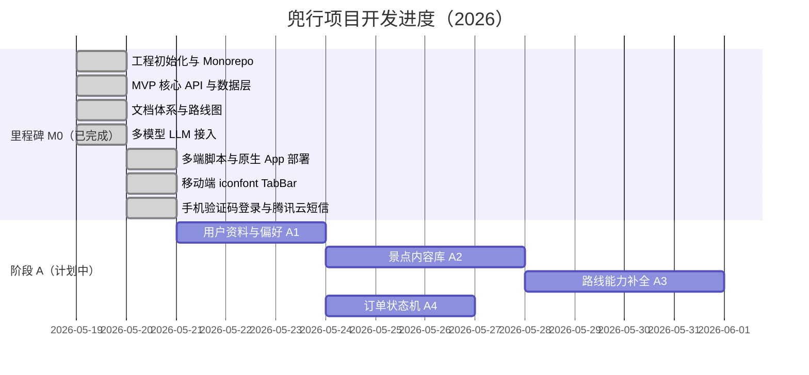

# 兜行（Douxing）功能路线图

> 依据《兜行平台最终详细设计文档》V2.0（2024年12月）与当前代码库对照编制。  
> 用于跟踪 **已完成 / 进行中 / 未开始** 功能，并按 **时间节点** 记录开发进度。

**文档版本**：3.17  
**更新日期**：2026-06-01  
**关联仓库**：`project/` Monorepo（`packages/web` · `packages/mobile` · `packages/server` · `packages/shared`）

---

## 目录

1. [进度总览](#1-进度总览)
2. [项目开发进度（时间轴）](#2-项目开发进度时间轴)
   - [2.4 开发记录（重难点与方案）](#24-开发记录重难点与方案)
3. [当前实现概况](#3-当前实现概况)
4. [模块对照总表](#4-模块对照总表)
5. [分步实施路线图](#5-分步实施路线图)
6. [与文档 Sprint 对应](#6-与文档-sprint-对应)
7. [推荐实施顺序](#7-推荐实施顺序)
8. [验收与协作说明](#8-验收与协作说明)
9. [产品待办池（新增关键点）](#9-产品待办池新增关键点)
   - [9.4 宣传类目](#94-宣传类目2026-05-29-录入)

---

## 1. 进度总览

| 维度 | 状态 | 说明 |
|------|------|------|
| **整体阶段** | 阶段 C 已完成 · G8 生产部署已落地 · **G9 国际化已验收** | C1～C5 已验收；API 可公有化至 `api.yxtao.site` |
| **当前焦点** | **H2-a + D5-a** 路线海报与分享（下一步） | **H1-c 已验收**（2026-06-01）；组件 token 化 + 地图/语音/遮罩随主题切换 |
| **下一步建议** | **H2-a + D5-a**（2026-06-10）→ 可选并行 **I2** PAI 微调 | 宣传 Sprint 后再排 **H8** · **E2** 真支付 |
| **完成度（里程碑）** | M0：**7/7** · A：**4/4** · B：**6/6** · C：**5/5** · G8：**已交付** · G9：**已验收** · 其余未开始 | 见 [时间轴](#2-项目开发进度时间轴) |

**状态图例**：`[ ]` 未开始 · `[~]` 进行中 · `[x]` 已完成

---

## 2. 项目开发进度（时间轴）

按实际开发与提交记录整理；每完成一项请更新 **完成日** 与 **状态**。



### 2.1 里程碑记录表

| 节点 ID | 完成日 | 状态 | 名称 | 交付摘要 | 关联提交/说明 |
|---------|--------|------|------|----------|----------------|
| **M0-1** | 2026-05-19 | [x] | 工程初始化 | pnpm Monorepo、Web / UniApp / Express、MySQL + Drizzle、Docker Compose | `feat(init)` |
| **M0-2** | 2026-05-19 | [x] | MVP 核心功能 | 认证、路线生成/列表/发布、打卡、成就、模拟支付订单 | `feat(mvp)` |
| **M0-3** | 2026-05-19 | [x] | 文档体系 | `docs/ROADMAP.md`、`docs/详细设计文档.md`、README 命令速查 | `docs(README)` |
| **M0-4** | 2026-05-19 | [x] | 多模型 LLM | DeepSeek / LM Studio / `auto` 降级；`llm-status`、`llm-providers`；规划页选模型 | `feat(llm)` |
| **M0-5** | 2026-05-20 | [x] | 多端与原生部署 | `dev:only`、`deploy:app`、`build:app-all`；`scripts/app-native.md` | `feat(build)` |
| **M0-6** | 2026-05-20 | [x] | 移动端 TabBar | iconfont 字体图标、`DouxingTabBar` 组件、H5/小程序/App 底部导航 | `feat(tab-bar)` |
| **M0-7** | 2026-05-20 | [x] | 手机验证码登录注册 | 验证码发送/登录 API；Web + 移动端双 Tab 登录页；腾讯云短信；mock 开发模式 | 未单独提交 |
| **A** | 2026-05-21 | [x] | 阶段 A 完成 | A1～A4 全部验收 | — |
| **B** | 2026-05-22 | [x] | 阶段 B 完成 | B1～B6 打卡与游戏化 | — |
| **C** | 2026-05-22 | [x] | 阶段 C 完成 | C1～C5 AI 规划深化 | — |
| **G8** | 2026-05-23 | [x] | 生产部署公有化 | Debian 12 + PM2 + Docker + Nginx/Certbot 一键；tsx 低内存模式；发版文档 | 见 [§ G8](./开发记录-重难点与亮点.md#g8-生产部署与-api-公有化) |
| **D** | — | [ ] | 阶段 D 完成 | D1～D5 社交 | 依赖 B 部分能力 |
| **E** | — | [ ] | 阶段 E 完成 | E1～E7 商业闭环 | 依赖 A4 |
| **F** | — | [ ] | 阶段 F 完成 | F1～F3 AR/VR | 可后置 |
| **G9** | 2026-05-27 | [x] | 国际化（i18n） | zh-CN / en-US 全主流程 UI + API 多语言；`mobileT`；Web 管理端；后端 `ApiError` 高频业务错误 | en-US 主流程手测已通过（2026-05-27） |
| **G** | — | [ ] | 阶段 G 完成 | G1～G9 平台工程 | 建议穿插 |

### 2.2 版本迭代日志（简表）

| 版本 | 日期 | 类型 | 变更摘要 |
|------|------|------|----------|
| v0.1.0 | 2026-05-19 | 初始化 | Monorepo、基础配置、Git 提交规范 |
| v0.2.0 | 2026-05-19 | MVP | 用户/路线/打卡/成就/订单 API；Web 管理端；移动端四 Tab |
| v0.2.1 | 2026-05-19 | AI | DeepSeek + LM Studio；`.env.example`；移动端模型选择 |
| v0.2.2 | 2026-05-19 | 文档 | 路线图 v1.0；详细设计 Markdown；README 完善 |
| v0.3.0 | 2026-05-20 | 工程 | 单平台 dev/build、原生 App 一键部署脚本 |
| v0.3.1 | 2026-05-20 | 移动端 | iconfont TabBar；修复 H5 底部栏与高亮同步 |
| v0.3.2 | 2026-05-20 | 认证 | 手机验证码登录/注册；腾讯云短信；密码/验证码双模式登录页 |
| v0.4.0 | 2026-05-20 | 内容库 | `attractions` 表、28 条种子、景点 API、路线关联 `attractionId` |
| v0.4.1 | 2026-05-21 | 路线互动 | 点赞/收藏、热门列表、草稿编辑、浏览量统计 |
| v0.4.5 | 2026-05-22 | 排行榜 | 周榜/月榜、打卡数/积分排行、移动端排行榜页 |
| v0.4.4 | 2026-05-22 | 成就 | achievement_definitions 表、8 种成就、配置化触发、图鉴页 |
| v0.4.3 | 2026-05-22 | 徽章 | badges/user_badges 表、11 种徽章、打卡触发解锁、移动端图鉴 |
| v0.5.0 | 2026-05-22 | AI 多轮规划 | plan_sessions 会话表、规划页对话 UI、LLM history 追问改方案 |
| v0.5.1 | 2026-05-22 | 路线解锁 | `ROUTE_UNLOCK_PAYMENT_REQUIRED` 环境开关，默认免支付直看行程 |
| v0.5.2 | 2026-05-22 | 草稿 UX | 生成后详情页隐藏内嵌「编辑草稿」；2026-05-26 **v0.6.3** 改为 hero 编辑按钮 + 弹窗，移除 `edit=1` 自动展开 |
| v0.5.3 | 2026-05-22 | AI 意图解析 | 城市/天数/预算/主题结构化抽取；约束注入 LLM；生成后校正 |
| v0.5.4 | 2026-05-22 | RAG 景点检索 | 城市+标签检索内容库；注入 LLM；生成后对齐 attractionId |
| v0.5.5 | 2026-05-22 | 多方案生成 | 首条生成 3 套候选；横向卡片选择；追问收敛为单方案 |
| v0.5.6 | 2026-05-22 | AI 微服务 | packages/ai-service FastAPI+LangChain；Node 优先调用、失败降级 |
| v0.6.0 | 2026-05-23 | 生产部署 | Debian 12 指南；deploy-server + PM2；Nginx/Certbot 自动配置；tsx 低内存；三套 env 与发版流程文档 |
| v0.6.1 | 2026-05-26 | 国际化 | `@douxing/shared` i18n 包；Web/移动端 vue-i18n；`Accept-Language` + `messageKey`；规划助手/变体/兴趣标签多语言 |
| v0.6.2 | 2026-05-26 | 体验 | 规划页 `VoiceTextComposer` 语音输入（录音 + 服务端腾讯云 ASR，替代微信同声传译插件） |
| v0.6.3 | 2026-05-26 | 路线详情 | 解锁后路线地图预览动画（`RouteMapPlayer` + `@douxing/shared` 路径模型）；草稿编辑改为 hero 编辑按钮 + 弹窗（按发布状态显隐，不自动弹出） |
| v0.6.4 | 2026-05-27 | 国际化扫尾 | 移动子页/规划/登录/语音/定位/打卡地图/Web 管理端 View；`mobileT`；`getOrderStatusI18nKey`；后端 `ApiError` + 30+ `ApiMessageKey`；en-US 主流程手测通过 |
| v0.6.5 | 2026-05-27 | H9 Phase 1 | Enricher MVP：schema、C2 交通/住宿意图、高德 Matrix 排程、跨城 mock、Prompt 收窄、详情行程展示 |
| v0.6.6 | 2026-05-27 | H9-1 UI + 修复 | 详情页 `RouteDayFlowChart` 统一展示交通→游玩→住宿；`cloneRouteDaysForSync` 保留 enrich 字段；规划对话区不展示路径 |
| v0.6.7 | 2026-05-28 | H9 Phase 2 | 高德 direction polyline + Redis 缓存；`GET /routes/:id/map-path`；酒店 RAG；详情地图接服务端路径 |
| v0.6.8 | 2026-05-29 | H9 Phase 3 | 班次库 Catalog（12+ 城市对）；可选 Juhe 实时；`scheduleNo`/`scheduleSource`；携程订票链接；闭馆冲突 `warnings` |
| v0.6.9 | 2026-05-29 | H9 Phase 4 | 玩法 RAG：`route-playbooks` + `playbook-rag.service`；段间 mode 比选；LLM 动线注入；去除虚假 `subway` 猜测 |
| v0.7.1 | 2026-05-29 | H1-b 宣传 | `DouxingEmptyState` 组件；路线/成就/徽章/打卡/排行榜/订单/首页空态统一 |
| v0.7.0 | 2026-05-29 | H1-a 宣传 | 品牌 CSS token；首页渐变 Hero + 价值主张 + 主 CTA；广场热门路线横向预览；去除「体验 MVP」文案 |
| v0.7.2 | 2026-05-29 | H1-c 宣传（部分） | 全站 `--dx-*` 皮肤；`useTheme` 蓝/青主题切换；Tab 页 Header+内容区+TabBar 布局；首页 Cover Flow 热门路线轮播；子页 Hero+筛选面板；订单页包装 |
| v0.7.3 | 2026-05-29 | H1-c 主题扫尾（部分） | `App.vue` `initAppTheme` 启动初始化；订单/个人资料页 i18n 与主题文案；`profile.theme*` 中英文 |
| v0.7.4 | 2026-06-01 | H1-c 宣传（完成） | `theme-colors.ts`；地图 polyline/语音/流程图/遮罩/成就徽章解锁态 token 化；原生 switch 随主题 |
| v0.8.0 | 2026-06-01 | I1 专属模型数据管线 | `pnpm ml:generate-dataset` / `ml:validate-dataset`；`training-data.service`；`packages/ml-training` 目录与 LoRA 配置；见 [阿里云专属模型](./阿里云-兜行专属模型训练与部署.md) |

### 2.3 下一步时间节点（计划）

| 计划完成日 | 步骤 | 目标 |
|------------|------|------|
| 2026-05-22 | C1 | 多轮对话规划（已完成） |
| 2026-05-22 | C2 | 意图结构化解析（城市/天数/预算/主题）（已完成） |
| 2026-05-22 | C3 | RAG 轻量景点检索（已完成） |
| 2026-05-22 | C4 | 一次返回 2～3 套候选路线（已完成） |
| 2026-05-22 | C5 | Python AI 微服务 FastAPI+LangChain（已完成） |
| 2026-05-23 | G8 | 生产部署公有化（Debian 12 / Nginx / Certbot / 发版流程）（已完成） |
| 2026-05-26 | G9 | 国际化框架（vue-i18n + API messageKey）（已完成） |
| 2026-05-27 | G9 扫尾 + 验收 | 全站硬编码文案迁移、Web 管理端、后端高频 `ApiError`；en-US 主流程手测通过 |
| — | G9+ | 第三语言、LLM 输出语言跟随、配置类内部错误 i18n | 见 [国际化.md](./国际化.md) |
| 2026-05-29 | **H9-3** | Phase 3 — 真班次与开放时长 | 班次库 Catalog 方案（12+城市对）；可选 Juhe 实时 API；`scheduleNo`+`scheduleSource`；携程订票链接；闭馆冲突 `warnings` |
| 2026-05-29 | **H9-4** | Phase 4 — **玩法 RAG** 与段间交通智能选型 | 3 条 playbook seed；`playbook-rag.service`；Enricher 段间 mode + i18n 推荐理由；LLM/Python 动线注入；`enricher:demo --playbook` 验收 |
| 待定 | **H9+** | 远期增强（Phase 4 之后） | playbook 扩充 · Web CRUD · POI soft 对齐 · C2 `startDate` · 开放时长 · 景区交通 schema；见 [§5 H9+](#h9-远期增强phase-4-之后) |
| — | **H8** | 位置实时重规划 | 复用 Enricher `buildDailySchedule`；GPS + 剩余 POI 一键刷新 |
| — | A3-3+ | 足迹页多路线合并动画 | `mergeRoutePaths` + H9-2 polyline |
| — | E2 | 微信支付正式联调 | 依赖 [后期待办.md](./后期待办.md) 商户号与公司主体 |
| — | D2 + D3 | 搭子需求 + 匹配 MVP | 与 H5 社交 IM 前置 |
| 2026-05-29 | **H1-a** | 宣传 Phase 1 — 首屏与品牌 token | **已完成** — CSS 变量；首页 Hero + 主 CTA + 广场热门预览；i18n 去 MVP 文案 |
| 2026-05-29 | **H1-b** | 宣传 Phase 2 — 空状态与引导 | **已完成** — `DouxingEmptyState`；路线/成就/打卡/首页等复用 |
| 2026-06-01 | **H1-c** | 宣传 Phase 4 — 全站视觉统一 | **已完成** — `theme-colors.ts`；地图/语音/流程图/遮罩/原生 switch token 化；成就/徽章解锁边框随主题 |
| 2026-06-10 | **H2-a + D5-a** | 宣传 Phase 3 — 路线海报与分享链路 | Canvas 路线海报；`onShareAppMessage`；海报 H5 链接（短期）/ 小程序码（中期可选） |
| 2026-06-01 | **I1** | 专属模型 — 训练数据生成与校验 | **已完成** — DeepSeek 批量造 SFT JSONL；Zod + POI 命中率校验；train/val 划分 |
| 待定 | **I2 + I3** | 专属模型 — PAI 微调与百炼接入 | OSS 上传 → PAI LoRA → DashScope Endpoint → API `llmProvider` 切换；见 [阿里云专属模型](./阿里云-兜行专属模型训练与部署.md) |
| 待定 | **H2-b** | 宣传 Phase 5 — 打卡/成就炫耀海报 | 打卡地图缩略 + 徽章成就模板 |
| — | **H8 / H7** | 行中智能 | 位置实时重规划 · 错过景点；宣传 Sprint 后推进 |

> 计划日随实际进度调整；完成某步后请将上表「状态」改为 `[x]` 并填写实际完成日。

### 2.4 开发记录索引（重难点与亮点）

> **详细内容**（思考过程、取舍、每任务 2～3 亮点 + 2～3 重难点）见独立文档：  
> **[开发记录-重难点与亮点.md](./开发记录-重难点与亮点.md)**

| 完成日 | 任务 | 文档章节 |
|--------|------|----------|
| 2026-05-20 | M0-7 手机验证码登录 + 腾讯云短信 | [§ M0-7](./开发记录-重难点与亮点.md#m0-7-手机验证码登录--腾讯云短信) |
| 2026-05-20 | A1 用户资料与偏好 | [§ A1](./开发记录-重难点与亮点.md#a1-用户资料与偏好) |
| 2026-05-20 | A2 景点/内容基础库 | [§ A2](./开发记录-重难点与亮点.md#a2-景点内容基础库) |
| 2026-05-20 | A2+ AI 景点同步（pending + 合并） | [§ A2+](./开发记录-重难点与亮点.md#a2-ai-景点同步pending--合并) |
| 2026-05-20 | A2++ POI 分类过滤入库 | [§ A2++](./开发记录-重难点与亮点.md#a2-poi-分类过滤入库) |
| 2026-05-20 | 高德地理编码补坐标 | [§ 高德](./开发记录-重难点与亮点.md#高德地理编码补坐标) |
| 2026-05-20 | Redis 地理编码缓存 | [§ Redis](./开发记录-重难点与亮点.md#redis-地理编码缓存) |
| 2026-05-20 | 数据库命令体系（Drizzle） | [§ Drizzle](./开发记录-重难点与亮点.md#数据库生成与使用命令drizzle) |
| 2026-05-20 | A3-1 AI 路线重新生成（prompt + 景点同步） | [§ A3-1](./开发记录-重难点与亮点.md#a3-1-ai-路线重新生成prompt--景点同步) |
| 2026-05-20 | A3-2 移动端 AI 规划全局 Loading 与中断 | [§ A3-2](./开发记录-重难点与亮点.md#a3-2-移动端-ai-规划全局-loading-与中断) |
| 2026-05-21 | A3 路线能力补全（点赞/收藏/热门/草稿/浏览量） | [§ A3](./开发记录-重难点与亮点.md#a3-路线能力补全) |
| 2026-05-21 | A4 订单状态机与超时取消 | [§ A4](./开发记录-重难点与亮点.md#a4-订单状态机) |
| 2026-05-21 | B1 打卡字段增强 | [§ B1](./开发记录-重难点与亮点.md#b1-打卡字段增强) |
| 2026-05-21 | B2 地理围栏打卡 | [§ B2](./开发记录-重难点与亮点.md#b2-地理围栏打卡) |
| 2026-05-21 | B3 打卡地图 UI | [§ B3](./开发记录-重难点与亮点.md#b3-打卡地图-ui) |
| 2026-05-22 | B4 徽章系统 | [§ B4](./开发记录-重难点与亮点.md#b4-徽章系统) |
| 2026-05-22 | B5 成就体系完善 | [§ B5](./开发记录-重难点与亮点.md#b5-成就体系完善) |
| 2026-05-22 | B6 排行榜 | [§ B6](./开发记录-重难点与亮点.md#b6-排行榜) |
| 2026-05-22 | C1 多轮对话规划 | [§ C1](./开发记录-重难点与亮点.md#c1-多轮对话规划) |
| 2026-05-22 | C4 多方案生成 | [§ C4](./开发记录-重难点与亮点.md#c4-多方案生成) |
| 2026-05-22 | C3 RAG 景点检索 | [§ C3](./开发记录-重难点与亮点.md#c3-rag-景点检索) |
| 2026-05-22 | C2 意图结构化解析 | [§ C2](./开发记录-重难点与亮点.md#c2-意图结构化解析) |
| 2026-05-22 | C5 Python AI 微服务 | [§ C5](./开发记录-重难点与亮点.md#c5-python-ai-微服务) |
| 2026-05-22 | C1+ 路线解锁支付开关 | [§ C1+](./开发记录-重难点与亮点.md#c1-路线解锁支付开关) |
| 2026-05-22 | A3++ 草稿编辑入口分离 | [§ A3++](./开发记录-重难点与亮点.md#a3-草稿编辑入口分离)（2026-05-26 演进为 [A3+++](./开发记录-重难点与亮点.md#a3-草稿编辑弹窗与发布状态)） |
| 2026-05-23 | G8 生产部署与 API 公有化 | [§ G8](./开发记录-重难点与亮点.md#g8-生产部署与-api-公有化) |
| 2026-05-26 | G9 国际化（i18n）框架 | [§ G9](./开发记录-重难点与亮点.md#g9-国际化i18n) |
| 2026-05-27 | G9 国际化验收 | [§ G9](./开发记录-重难点与亮点.md#g9-国际化i18n)（en-US 主流程手测通过） |
| 2026-05-27 | H9-1 Enricher MVP（Phase 1） | [§ H9-1](./开发记录-重难点与亮点.md#h9-1-enricher-mvpphase-1) |
| 2026-05-28 | H9-2 路网 polyline + 酒店 RAG（Phase 2） | [§ H9-2](./开发记录-重难点与亮点.md#h9-2-路网-polyline-与酒店-ragphase-2) |
| 2026-05-27 | H9-1 UI 行程流程图 + enrich 入库修复 | [§ H9-1 UI](./开发记录-重难点与亮点.md#h9-1-ui-行程流程图与展示策略) |
| 2026-05-27 | H9 方案定稿（LLM 排 POI + Enricher） | [§ H9](./开发记录-重难点与亮点.md#h9-住宿与交通编排llm-排-poi--后端-enricher) |
| 2026-05-29 | H9-4 玩法 RAG（Phase 4） | [§ H9-4](./开发记录-重难点与亮点.md#h9-4-玩法-rag-与段间交通phase-4) |
| 2026-05-29 | H1-c 全站视觉统一（部分） | [§ H1-c](./开发记录-重难点与亮点.md#h1-c-全站视觉统一部分) |
| 2026-06-01 | I1 ML 训练数据生成与校验 | [§ I1](./开发记录-重难点与亮点.md#i1-ml-训练数据生成与校验) |
| 2026-05-26 | A3-3 路线详情地图预览动画 | [§ A3-3](./开发记录-重难点与亮点.md#a3-3-路线详情地图预览动画) |
| 2026-05-26 | A3+++ 草稿编辑弹窗 | [§ A3+++](./开发记录-重难点与亮点.md#a3-草稿编辑弹窗与发布状态) |

新任务完成后：在独立文档按附录模板追加一章，并在此表增加一行索引。

---

## 3. 当前实现概况

### 3.1 已完成（M0 · 对应设计文档 Sprint 1–2 骨架）

| 能力 | 完成日 | 说明 |
|------|--------|------|
| 工程脚手架 | 2026-05-19 | pnpm Monorepo、Web / UniApp / Express、MySQL + Drizzle |
| 用户认证 | 2026-05-20 | 注册、登录、JWT、`/auth/me`、RBAC；**手机验证码登录/注册**（`/auth/sms/send`、`/auth/sms/login`）；密码/验证码双模式登录页（Web + 移动端） |
| AI 路线生成 | 2026-05-22 | **DeepSeek** / **LM Studio** / `auto` 模板降级；**多轮对话**；**意图解析**；**RAG 内容库检索** |
| 路线管理 | 2026-05-28 | 生成、列表、详情、发布；解锁可选；**详情页地图预览**（服务端 polyline）+ **行程流程图**；规划对话区仅消息与候选卡片；草稿 **hero 编辑弹窗** |
| 打卡 | 2026-05-21 | 含城市/积分/照片/GPS 围栏；列表 + 地图足迹、时间筛选 |
| 徽章 | 2026-05-22 | 11 种徽章（城市/成就/特殊）；打卡条件触发；移动端图鉴展示 |
| 成就 | 2026-05-22 | 8 种配置化成就；打卡触发；独立图鉴页 |
| 排行榜 | 2026-05-22 | 周榜/月榜；打卡数/积分；移动端排行榜页 |
| 订单 | 2026-05-19 | 路线解锁订单、`pending` → 模拟支付 |
| 移动端 | 2026-05-20 | Tab：首页 / 规划 / 路线 / 我的；iconfont 底栏；登录注册（验证码 + 密码） |
| 管理端 | 2026-05-19 | 路线、订单、打卡列表（admin） |
| 多端脚本 | 2026-05-20 | `dev:only`、`deploy:app`、H5 / 微信小程序 / Android / iOS |
| 生产部署 | 2026-05-23 | `deploy:server`、PM2、Docker MySQL+Redis、Nginx 反代、Certbot；`docs/启动与部署流程.md` |
| 国际化 | 2026-05-27 | zh-CN / en-US 全主流程已验收；shared + mobile/web vue-i18n；`mobileT`；Web 管理端；`localeMiddleware` + `ApiMessageKey` / `ApiError` |
| 语音输入 | 2026-05-26 | 规划页 `VoiceTextComposer`；H5 Web Speech / 小程序·App 录音上传 + `POST /api/speech/transcribe`（腾讯云 ASR） |
| 景点库 | 2026-05-20 | `attractions` 表 + 28 条种子；路线生成自动关联 `attractionId` |
| 数据表 | 2026-05-22 | `users`、`travel_routes`、`plan_sessions`、`plan_session_messages`、`check_ins`、`achievements`、`badges`、`orders` 等 |

### 3.2 主要 API（已实现）

```
GET  /api/health
POST /api/auth/register
POST /api/auth/login
POST /api/auth/sms/send
POST /api/auth/sms/login
GET  /api/auth/me
GET  /api/users/me
PUT  /api/users/me
POST /api/users/me/avatar

GET  /api/routes/llm-status
GET  /api/routes/llm-providers
POST /api/routes/generate
POST /api/routes/plan-sessions
GET  /api/routes/plan-sessions
GET  /api/routes/plan-sessions/:id
POST /api/routes/plan-sessions/:id/messages
POST /api/routes/:id/regenerate
GET  /api/routes
GET  /api/routes/hot
GET  /api/routes/:id
GET  /api/routes/:id/map-path
PUT  /api/routes/:id
POST /api/routes/:id/like
POST /api/routes/:id/favorite
POST /api/routes/:id/publish

POST /api/checkins
GET  /api/checkins

GET  /api/achievements
GET  /api/achievements/catalog
GET  /api/achievements/mine

GET  /api/badges
GET  /api/badges/mine

GET  /api/leaderboard

GET  /api/attractions
GET  /api/attractions/cities
GET  /api/attractions/:id

POST /api/orders
GET  /api/orders/payment-config
POST /api/orders/:id/pay
POST /api/orders/:id/cancel
GET  /api/orders
POST /api/speech/transcribe
```

### 3.3 默认账号（seed 演示用户）

执行 `pnpm db:seed` 或 `pnpm bootstrap` 后写入数据库（定义见 `packages/server/src/db/seed.ts`）。**生产环境须改密或禁用 demo 账号。**

| 用户名 | 密码 | 用途 |
|--------|------|------|
| **demo** | **demo123** | 移动端 / 小程序体验（路线、打卡、AI 规划联调） |
| admin | admin123 | Web 管理端 |

**小程序登录：** 用户名 `demo`，密码 `demo123`（密码登录 Tab，非验证码登录）。

若提示账号不存在：`pnpm db:seed` 后重试。

---

## 4. 模块对照总表

| 设计文档章节 | 模块 | 已实现 | 未实现 / 仅简化 |
|-------------|------|--------|----------------|
| §2 | 系统架构 | 单体 Express、多端脚本 | 微服务、K8s、API 网关、消息队列 |
| §3 | AI 智能规划 | 单轮/多轮 LLM + 模板；plan_sessions 追问改方案；**语音输入（ASR）**；**H9 全 Phase** LLM 排 POI + Enricher 住/行 + 路网 polyline + Catalog 班次 + **玩法 RAG**；**C3 景点 RAG** | H8 实时重规划；H3 角色扮演；H7 错过景点；[H9+ 远期增强](#h9-远期增强phase-4-之后)；多 Agent、向量库、图片输入 |
| §4.3 | 打卡地图 | GPS 围栏、地图足迹、照片字段；**路线详情 POI 路径动画**（高德 direction polyline，失败降级直线） | 热力图；足迹页多路线 `mergeRoutePaths` 动画；**错过景点**检测与复盘（H7） |
| §4.6 | 成就系统 | 8 种配置化成就 + 徽章 + 排行榜 | 事件驱动（Kafka）；**旅行游戏化**任务链/关卡（H4） |
| §4.4 | 搭子匹配 | — | 发布需求、匹配算法、邀请组队；**社交 IM 聊天**（H5） |
| §4.5 | 盲盒旅行 | — | 加权随机、揭晓、保底 |
| §4.7 | 社交图谱 | — | Neo4j / 关注关系 |
| §5.3 | 订单管理 | 路线解锁、MVP 状态机与超时取消 | 多类型、退款/售后 |
| §5.4 | 支付 | 模拟支付；路线解锁可 `.env` 关闭（默认免支付） | 微信对账、生产强校验 |
| §5.5 | 服务者认证 | — | 申请、审核、信用分 |
| §5.6 | CPS 分佣 | — | 推广员、结算 |
| §5.7 | 数字商品 | — | 手绘地图、藏品等 |
| §6 | AR/VR | — | AR 导航、讲解、全景、虚拟合影 |
| §7 | 数据存储 | MySQL | Redis、ES、Milvus、Neo4j、OSS |
| §8 | 安全合规 | JWT、RBAC；短信验证码登录 | 脱敏、审计、OAuth、等保；**实名身份认证**（H6）；验证码 Redis 持久化（G1） |
| §9 | 部署运维 | Docker MySQL+Redis、PM2、Nginx HTTPS、deploy-server、Debian 12 指南 | K8s、Prometheus、ELK |
| §11 | 测试 | — | 单元 / 集成 / E2E、压测 |
| §12 | 接口规范 | REST + **`Accept-Language` / `messageKey`**（G9 已落地，高频业务错误已 `ApiError`） | WebSocket、完整 v1 清单、配置类内部错误 i18n |
| 国际化 | 界面与 API 多语言 | **G9 已验收**：全页 vue-i18n、shared 文案、locale 中间件、Web 管理端；en-US 主流程手测通过 | 第三语言、LLM 输出语言跟随 |
| §13 | 前沿技术 | — | Web3、联邦学习等 |
| 移动端 UX | iconfont TabBar、四 Tab | **H1-a/b/c 已完成**；全站 `--dx-*` token + 双主题；见 [§5 宣传类目](#宣传类目h1--h2--d5-最小版分-phase-实施) | **H2-a** 路线海报；Web 管理端视觉未纳入 |
| 分享与传播 | 广场公开路线 | **宣传类目 H2-a～b + D5-a**（路线海报、小程序转发、H5 二维码）；[§5 宣传类目](#宣传类目h1--h2--d5-最小版分-phase-实施) | D5 完整 H5 只读页 + 搭子链分享 |

---

## 5. 分步实施路线图

每一步力求 **独立可交付、可验收**。完成某步后请：

1. 将下表「状态」改为 `[x]`，填写「完成日」  
2. 在 [§2.1 里程碑记录表](#21-里程碑记录表) 或 [§2.3 计划表](#23-下一步时间节点计划) 更新实际日期  
3. 在 [§2.2 版本迭代日志](#22-版本迭代日志简表) 追加一行  

---

### 阶段 A：补齐 MVP 缺口（优先，计划 2026-05-21 ～ 2026-06-07）

| 步 | 状态 | 计划完成 | 名称 | 设计文档 | 交付内容 | 验收标准 |
|----|------|----------|------|----------|----------|----------|
| A1 | [x] | 2026-05-20 | 用户资料与偏好 | §7.2.1、§12.2.1 | `PUT /users/me`、头像、兴趣标签；移动端编辑页 | 修改资料持久化 |
| A2 | [x] | 2026-05-20 | 景点/内容基础库 | §3.5、内容服务 | `attractions` 表 + 种子数据（城市、坐标、标签） | 路线可关联真实景点 ID |
| A3 | [x] | 2026-05-21 | 路线能力补全 | §12.2.2 | 点赞/收藏、热门列表、草稿编辑、浏览量 | 列表筛选与统计可用 |
| A4 | [x] | 2026-05-21 | 订单状态机 | §5.3 | `pending→paid→completed/cancelled`、超时取消 | 状态流转正确、不可重复支付 |

---

### 阶段 B：打卡与游戏化（§4，计划 2026-06 起，约 2～3 周）

| 步 | 状态 | 计划完成 | 名称 | 设计文档 | 交付内容 | 验收标准 |
|----|------|----------|------|----------|----------|----------|
| B1 | [x] | 2026-05-21 | 打卡字段增强 | §4.3.4 | `city_code`、`photos`、`points_earned` 等 | 打卡含城市、积分、可选图 |
| B2 | [x] | 2026-05-21 | 地理围栏打卡 | §4.3.3 | GPS 上报、距离 ≤500m、简单防作弊 | 远离景点无法打卡 |
| B3 | [x] | 2026-05-21 | 打卡地图 UI | §4.3 | UniApp 地图展示打卡点、按时间筛选 | 地图可见足迹 |
| B4 | [x] | 2026-05-22 | 徽章系统 | §4.3.4 | `badges`、`user_badges`、条件触发 | 达成条件解锁徽章 |
| B5 | [x] | 2026-05-22 | 成就体系完善 | §4.6 | 成就配置表、8 种类型 | 多类型成就可触发 |
| B6 | [x] | 2026-05-22 | 排行榜 | §4.2 | 周榜/月榜（打卡数、积分） | 移动端排行榜页 |

---

### 阶段 C：AI 规划深化（§3，约 2～4 周）

| 步 | 状态 | 计划完成 | 名称 | 设计文档 | 交付内容 | 验收标准 |
|----|------|----------|------|----------|----------|----------|
| C1 | [x] | 2026-05-22 | 多轮对话规划 | §3.3、§3.4 | 会话表、带 history 的生成接口 | 可追问并调整方案 |
| C2 | [x] | 2026-05-22 | 意图结构化解析 | §3.4.3 | 抽取城市/天数/预算/主题 | 生成结果符合约束 |
| C3 | [x] | 2026-05-22 | RAG 景点检索（轻量） | §3.5 | MySQL 全文/标签检索或本地向量 | 景点来自内容库 |
| C4 | [x] | 2026-05-22 | 多方案生成 | §3.7 | 一次返回 2～3 条候选路线 | 用户可选择方案 |
| C5 | [x] | 2026-05-22 | Python AI 微服务（可选） | §1.4 | `packages/ai-service` + FastAPI/LangChain | Node 可调用，失败降级 |
| C6 | [x] | 2026-06-01 | ML 训练数据管线 | §3、专属模型 | `ml:generate-dataset` / `ml:validate-dataset`；`training-data.service`；`packages/ml-training` | 种子 prompt → DeepSeek 造 SFT JSONL → Zod + POI 命中率校验 → train/val 划分 |

---

### 阶段 I：专属模型（§3 增强，2026-06-01 录入）

> 与阶段 C/H9 并行；完整操作见 **[阿里云-兜行专属模型训练与部署.md](./阿里云-兜行专属模型训练与部署.md)**。  
> **目标**：在 RAG + Enricher 架构不变前提下，用 LoRA 微调提升 POI JSON 合法率与 RAG 命中率，降低延迟与推理成本。

| 步 | 状态 | 计划完成 | 名称 | 依赖 | 交付内容 | 验收标准 |
|----|------|----------|------|------|----------|----------|
| **I1** | [x] | 2026-06-01 | **训练数据生成与校验** | C2、C3、H9-4、DeepSeek | `generate-training-dataset.ts`；`validate-training-dataset.ts`；`buildTrainingSample` 复用线上 prompt 链；`packages/ml-training/datasets/` | `pnpm ml:generate-dataset` 产出 `raw.jsonl`；`pnpm ml:validate-dataset -- --split` 产出 train/val；无效样本被过滤 |
| **I2** | [ ] | 待定 | **PAI LoRA 微调** | I1、阿里云 OSS | 上传 train/val 至 OSS；PAI Model Gallery 按 `distill-qwen-7b-lora.yaml` 训练 | 微调任务成功；模型 artifact 可下载或注册百炼 |
| **I3** | [ ] | 待定 | **百炼推理接入与 A/B** | I2、G8 | DashScope Endpoint；server `llmProvider` 新增专属模型选项；失败降级 DeepSeek | 生产可切换 provider；JSON 合法率与 POI 命中率优于基线（见阿里云 doc §8） |

**推荐实施顺序（专属模型）**：`I1`（已完成）→ 扩充 `prompts-seed.jsonl` 并批量造数 → `I2` → `I3`；与 **H2-a** 宣传 Sprint 可并行（不同人力线）。

---

### 阶段 D：社交（§4.4、§4.7，约 2～3 周）

| 步 | 状态 | 计划完成 | 名称 | 设计文档 | 交付内容 | 验收标准 |
|----|------|----------|------|----------|----------|----------|
| D1 | [ ] | — | 关注/好友 | §4.7 | `follows` 表（MySQL 先行） | 关注与粉丝列表 |
| D2 | [ ] | — | 搭子需求发布 | §4.4 | `match_requests` 表 | 发布与我的需求列表 |
| D3 | [ ] | — | 搭子匹配推荐 | §4.4.2 | 标签+时间+地点加权打分 | Top N 推荐与分数 |
| D4 | [ ] | — | 邀请与组队 | §4.4.5 | 邀请/接受、小队表 | 邀请流程闭环 |
| D5 | [~] | — | 社交分享 | Sprint 3–4 | **D5-a**（H5 只读 + 小程序卡片 + 海报，见 [宣传类目](#宣传类目h1--h2--d5-最小版分-phase-实施)）；完整版含搭子链分享 | 他人可打开只读页；可保存/转发海报图 |

---

### 阶段 E：商业闭环（§5，约 3～4 周）

| 步 | 状态 | 计划完成 | 名称 | 设计文档 | 交付内容 | 验收标准 |
|----|------|----------|------|----------|----------|----------|
| E1 | [ ] | — | 多类型订单 | §5.3.1 | service/package/blindbox/vip | 各类型可创建订单 |
| E2 | [ ] | — | 真实支付 | §5.4 | 微信支付（小程序或 H5）+ 回调 | 沙箱真实支付一笔 |
| E3 | [ ] | — | 盲盒旅行 | §4.5 | SKU、加权随机、揭晓时间 | 付费后按时揭晓 |
| E4 | [ ] | — | 服务者认证 | §5.5 | 申请、审核、服务者角色 | 管理端审核通过/拒绝 |
| E5 | [ ] | — | 服务预约订单 | §5 | 时段预约、与服务者绑定 | 下单到完成流程 |
| E6 | [ ] | — | CPS 分佣 | §5.6 | 推广员、佣金、待结算记录 | 订单完成后生成佣金 |
| E7 | [ ] | — | 数字商品 | §5.7 | 虚拟商品下单与下载 | 购买后可下载/预览 |

---

### 阶段 F：AR/VR 与前沿（§6、§13，可后置）

| 步 | 状态 | 计划完成 | 名称 | 设计文档 | 交付内容 | 验收标准 |
|----|------|----------|------|----------|----------|----------|
| F1 | [ ] | — | VR 全景预览 | §6.6 | 景点挂全景 URL + 播放器 | 详情页可全景浏览 |
| F2 | [ ] | — | AR 讲解（简化） | §6.4 | 景点语音+图文讲解 | 景点页可播放 |
| F3 | [ ] | — | 数字藏品（可选） | §13.1 | 链下藏品或联盟链对接 | 购买与展示 |

---

### 阶段 G：平台与工程质量（建议穿插）

| 步 | 状态 | 计划完成 | 名称 | 设计文档 | 交付内容 | 验收标准 |
|----|------|----------|------|----------|----------|----------|
| G1 | [~] | — | Redis 缓存 | §7.3 | 热门路线、会话、限流 | docker-compose 含 Redis；生产 compose 已启用 |
| G2 | [ ] | — | 对象存储 | §7 | MinIO/OSS 上传头像与打卡图 | 图片 URL 可访问 |
| G3 | [ ] | — | 通知服务 | §2.2.3 | 站内消息 + 微信订阅消息 | 关键事件有通知 |
| G4 | [ ] | — | 管理端数据分析 | 数据分析服务 | Dashboard 图表 | 用户/订单/打卡趋势 |
| G5 | [~] | — | 限流与网关 | §2.2.2 | Nginx 反代 + rate limit | 超限 429 |
| G6 | [~] | — | 安全合规 | §8 | 脱敏、审计日志、HTTPS 说明 | 敏感字段已脱敏 |
| G7 | [ ] | — | 自动化测试 | §11 | API 集成测试 + 核心 E2E | CI `pnpm test` 通过 |
| G8 | [x] | 2026-05-23 | 生产部署 | §9 | Debian 12 + deploy-server + Nginx/Certbot 自动 + tsx 低内存 + 发版文档 | `curl https://api.yxtao.site/api/health` |
| G9 | [x] | 2026-05-27 | 国际化（i18n） | §12、产品出海 | shared/mobile/web i18n；`mobileT`；Web 管理端 View；`ApiError` + 旧中文兼容映射 | zh-CN / en-US 切换后全主流程 UI 无硬编码；API `message` 随 `Accept-Language` 变化（已手测） |

---

### 阶段 H：体验深化与智能行程（新增待办，2026-05-27 录入）

> 与阶段 C/D/E 并行规划；详细说明与依赖见 [§9](#9-产品待办池新增关键点)。  
> **说明**：C1 已覆盖「规划页多轮对话」；H5 指规划外的 **社交/搭子 IM**，二者不重复。

| 步 | 状态 | 计划完成 | 名称 | 设计文档 | 交付内容 | 验收标准 |
|----|------|----------|------|----------|----------|----------|
| H1 | [x] | — | 界面包装（总览） | 产品体验 | **H1-a～c** 分 Phase；见 [宣传类目](#宣传类目h1--h2--d5-最小版分-phase-实施) | 主流程页面风格一致；切换 zh-CN/en-US 无布局破版；双主题下图/map/switch 同步 |
| H2 | [ ] | — | 分享海报生成（总览） | §4、D5 | **H2-a～b** + **D5-a**；见 [宣传类目](#宣传类目h1--h2--d5-最小版分-phase-实施) | 生成海报含二维码或小程序码；与 D5 分享链路打通 |
| H3 | [ ] | — | AI 角色扮演 | §3.3 | 可选旅行 persona（本地向导/旅伴/亲子导游等）；system prompt + 语气模板；规划对话可切换角色 | 同需求不同角色回复风格可区分；i18n 人设文案 |
| H4 | [ ] | — | 旅行游戏化 | §4.6 | 行程内任务链/关卡（如「今日完成 3 打卡」）；与徽章成就联动；可选积分加倍 | 进行中的路线可见游戏进度；完成任务触发成就/徽章 |
| H5 | [ ] | — | 社交聊天对话 | §4.4、§4.7 | 搭子/好友 IM（文本+可选语音）；会话列表；与 match_requests / follows 关联 | 两名用户可互发消息；未读与基础风控 |
| H6 | [ ] | — | 实名身份认证 | §8 | 身份证+人脸核身（腾讯云等）；`users.real_name_verified`；敏感能力门禁（提现/服务者等） | 未实名与已实名能力区分；核身结果可审计；见 [后期待办](./后期待办.md) 资质 |
| H7 | [ ] | — | 错过景点补救 | §3、§4.3 | 对比计划 POI 与打卡/GPS 轨迹，识别「应到未到」；推送补救推荐或次日替补 | 路线进行中可看到遗漏景点列表；一键加入剩余行程 |
| H8 | [ ] | — | 位置实时重规划 | §3.4 | 基于当前 GPS + 剩余 POI，AI 动态调整「今日剩余/明日」推荐；用户确认后写回草稿 | 偏离计划或临时变更位置后，可一键刷新推荐；不静默改已发布路线 |
| H9 | [x] | 2026-05-29 | 住宿与交通编排（总览） | §3.7 | **LLM 只排 POI + 后端 Enricher 补全住/行**；H9-1～H9-4 四 Phase 已全部验收；[开发记录](./开发记录-重难点与亮点.md#h9-住宿与交通编排llm-排-poi--后端-enricher) | 生成路线含 lodging/transit/班次/playbook 推荐理由；西湖线无虚假地铁 |

#### H9 住宿与交通：分 Phase 实施

> **架构**：LLM 负责「玩什么」（`days[].attractions` POI 列表）；`route-enricher.service` 负责酒店选址、市内/跨城交通段、时刻表与耗时（高德 Matrix + 规则算法）。  
> **C3 vs H9-4**：C3 **景点 RAG** 检索「有哪些 POI」；H9-4 **玩法 RAG** 检索「怎么玩、两点之间怎么走」（经典动线、段间交通共识）。  
> **术语**：POI 定义见 [开发记录 A2++](./开发记录-重难点与亮点.md#a2-poi-分类过滤入库)；Enricher 说明见 [开发记录 H9](./开发记录-重难点与亮点.md#h9-住宿与交通编排llm-排-poi--后端-enricher)。

| 步 | 状态 | 计划完成 | 名称 | 依赖 | 交付内容 | 验收标准 |
|----|------|----------|------|------|----------|----------|
| **H9-1** | [x] | 2026-05-27 | **Phase 1 — Enricher MVP** | C2、C3、A2、高德 geocode、G9 | 下表 **H9-1a～g** 全部完成 | 生成路线含 `lodging`/`transit`；切换天数可见耗时；意图识别交通/住宿偏好 |
| H9-1a | [x] | 2026-05-27 | 行程 Schema 扩展 | G9 | `@douxing/shared`：`RouteTransitSegment`；`RouteDayPlan.lodging` / `transit[]`；Node Zod + Python Pydantic 对齐；旧 `routeDetail` 向后兼容 | `pnpm --filter @douxing/shared build` 通过；无坐标旧路线仍可展示 |
| H9-1b | [x] | 2026-05-27 | 交通/住宿意图（C2 扩展） | H9-1a | `TravelIntentSnapshot` 增加 `transportPreference`、`lodgingArea`、`lodgingTier`；规则解析「高铁/飞机/住西湖边/经济型酒店」 | 规划会话 `intentSnapshot` 含新字段；注入 Enricher 约束块 |
| H9-1c | [x] | 2026-05-27 | Enricher 核心与管道挂接 | H9-1a、H9-1b | `server/services/route-enricher.service.ts`；`generateRoute` 在 LLM/模板之后调用；输出写回 `routeDetail`；C1/C4 降级链共用 | 单轮 generate 与 plan-session 追问均经 Enricher；改 POI 后交通重算 |
| H9-1d | [x] | 2026-05-27 | 高德 Matrix 市内排程 | H9-1c、[高德 geocode](./开发记录-重难点与亮点.md#高德地理编码补坐标) | `amap-direction.service.ts`（Distance Matrix）；最近邻 + 2-opt + 前向时刻；Redis 缓存；失败 Haversine 降级并标 `estimated` | 市内段含 `durationMinutes`、交通方式；配额可控 |
| H9-1e | [x] | 2026-05-27 | 跨城大交通 mock | H9-1c | `city-pair` 模板 JSON；`kind=intercity` 段 + mock `bookingUrl`；i18n「参考耗时/演示链接」 | 跨城日有结构化大交通段；不误导为真实班次 |
| H9-1f | [x] | 2026-05-27 | LLM Prompt 收窄 | H9-1c、C5 | Node `llm-client.service.ts` + Python `ai-service`：只排 POI；禁止编造 transit/lodging 时刻；笼统用餐仍 `poiType=meal` | Enricher 输出覆盖 LLM 内交通字段；双端 prompt 一致 |
| H9-1g | [x] | 2026-05-27 | 详情页行程流程图 | H9-1c、G9 | `RouteDayFlowChart` + `buildRouteDayFlow`：按时刻合并 transit/play/lodging 竖向时间轴；多日 Tab；打卡按钮；**规划页对话区不展示**（进详情查看） | 解锁后可见完整路径；zh-CN/en-US；旧路线需重新生成才有 enrich 数据 |
| **H9-2** | [x] | 2026-05-28 | **Phase 2 — 路网与酒店 RAG** | H9-1、A2 | 高德 direction polyline；`GET /routes/:id/map-path`；酒店 RAG 加强；详情页接服务端路径 | 地图 polyline 与 Enricher 耗时一致；酒店优先来自内容库 |
| **H9-3** | [x] | 2026-05-29 | **Phase 3 — 真班次与开放时长** | H9-2 | 班次库 Catalog（12+城市对）+ 可选 Juhe 实时；`RouteTransitSegment.scheduleNo/source`；携程订票链接；attractions 开放时长基础；Enricher 闭馆冲突 `warnings` | 跨城大交通可订票向（第三方跳转）；流程图展示车次号与订票链接；i18n 「前往第三方订票」/「演示链接」区分 |
| **H9-4** | [x] | 2026-05-29 | **Phase 4 — 玩法 RAG 与段间交通** | H9-1、C3、A2 | 下表 **H9-4a～d** | 西湖等景区不再推荐地铁；段间方式与攻略共识一致；流程图可展示推荐理由 |
| H9-4a | [x] | 2026-05-29 | 段间交通规则止血 | H9-1d | `pickLocalTransitMode`：无地铁 API 不猜 `subway`；距离分层 walk/bus/taxi/drive；景区簇优先步行/观光车 | 杭州西湖经典线无「坐地铁」段 |
| H9-4b | [x] | 2026-05-29 | 玩法知识库 + Playbook RAG | A2、C3 | `data/route-playbooks.ts`（西湖/故宫/外滩）；`playbook-rag.service.ts` 检索 | 按「杭州+西湖」可命中 playbook；`enricher:demo --playbook` 输出动线 |
| H9-4c | [x] | 2026-05-29 | LLM 动线骨架注入 | H9-4b、H9-1f | `formatPlaybookContextForLlm` 注入 Node LLM + Python ai-service；`generateRoute` 全链路挂接 | 生成 POI 顺序与热门攻略大体一致 |
| H9-4d | [x] | 2026-05-29 | Enricher 段间 mode 比选 | H9-4a、H9-4b | `buildTransitLeg` 读 playbook 边；`formatPlaybookTransitDescription` i18n | 流程图展示「建议步行/观光车」及简要原因 |

**推荐实施顺序（Phase 4）**：`H9-4a`（可先独立交付）→ `H9-4b` → `H9-4c ∥ H9-4d`。

**推荐实施顺序（Phase 1）**：`H9-1a → H9-1b → H9-1c → H9-1d ∥ H9-1e → H9-1f → H9-1g`（1d/1e 可在 1c 后并行）。

#### H9+ 远期增强（Phase 4 之后）

> **H9-1～H9-4 已验收**；以下为体验与数据质量增量，按需排期，不阻塞 H8/E2。  
> 详细背景与取舍见 [开发记录 § H9-4 远期增强](./开发记录-重难点与亮点.md#h9-4-玩法-rag-与段间交通phase-4)。

| 步 | 状态 | 优先级 | 名称 | 依赖 | 交付内容 | 验收标准 |
|----|------|--------|------|------|----------|----------|
| **H9+-1** | [ ] | P0.5 | Playbook 库扩充 | H9-4b | 更多城市/景区 seed；从 `route-templates` 批量迁移；与 C3 景点名 alias 对齐 | TOP 10 旅游城市各有 ≥1 条 playbook；检索命中率可观测 |
| **H9+-2** | [ ] | P0.5 | Web 管理端 Playbook CRUD | H9+-1、G9 | 管理端维护动线、`classicOrder`、段间边（from/to/mode/reasonKey）；i18n 摘要 | 运营可增删改 playbook，无需发版改代码 |
| **H9+-3** | [ ] | P1 | Enricher POI 顺序 soft 对齐 | H9-4c | 对 playbook `classicOrder` 算编辑距离；超阈值时 Enricher 重排或写 `warnings[]` | LLM 乱序时，详情 POI 顺序仍贴近经典线 |
| **H9+-4** | [ ] | P1 | C2 解析 `startDate` | C2、H9-3 | 意图快照增加出发日期；注入 Enricher 与 Catalog/Juhe 班次查询 | 「下周三去杭州」类 prompt 跨城段日期与班次一致 |
| **H9+-5** | [ ] | P1 | 开放时长数据补全 | H9-3、A2 | `attractions.openHours` 批量录入/同步；闭馆日与 playbook 动线联动换序 | 故宫等闭馆日自动 warning 或调序 |
| **H9+-6** | [ ] | P2 | 景区交通 schema 扩展 | H9-4d | `RouteTransitMode` 或 `transit.vehicleType` 区分观光车/游船/索道；流程图图标与 i18n | 不再用 `bus` 代指观光车；游船段可展示专用标签 |
| **H9+-7** | [ ] | P2 | Juhe 实时班次（可选） | H9-3 | 配置 `JUHE_API_KEY` + `INTERCITY_PROVIDER=juhe/auto`；生产监控与降级 | 有 Key 时跨城段 `scheduleSource=juhe`；无 Key 仍走 Catalog |
| **H9+-8** | [ ] | P3 | Playbook 外部检索更新 | H9+-2 | 官方导览/攻略摘要入库管道（非每次规划实时爬取）；人工审核后写入 playbook 库 | 新城市 playbook 可半自动更新，质量可控 |

**推荐实施顺序（H9+）**：`H9+-1 → H9+-2`（数据 + 运营）∥ `H9+-4 + H9+-5`（排程准确）→ `H9+-3` → `H9+-6`；`H9+-7`、`H9+-8` 视商务与数据源按需启用。

#### 宣传类目：H1 + H2 + D5 最小版（分 Phase 实施）

> **录入日期**：2026-05-29  
> **产品目标**：降低认知门槛、提升首屏信任感、让用户愿意转发；解决当前「功能齐全但对外仍像内部 Demo」的问题。  
> **用户价值链**：**第一眼懂**（H1-a）→ **愿意试**（H1-b 引导）→ **试完愿意晒**（H2-a + D5-a）→ **全站一致**（H1-c）。  
> **设计约定**：品牌调性默认 **旅行探索感**（蓝绿渐变 + 地图元素，延续 `#1677ff` 主色）；详见 **[品牌视觉规范.md](./品牌视觉规范.md)**。海报二维码 **短期 H5 只读链接、中期微信服务端小程序码 API**（需后端，不阻塞 H2-a MVP）。  
> **改动范围**：首 Sprint 以 `packages/mobile` 为主，复用 `fetchPlazaRoutes`；H2-a 无强制后端依赖；D5-a 中期可增 `GET /share/routes/:id` 只读页。

| 步 | 状态 | 计划完成 | 名称 | 依赖 | 交付内容 | 验收标准 |
|----|------|----------|------|------|----------|----------|
| **H1-a** | [x] | 2026-05-29 | **Phase 1 — 首屏与品牌 token** | G9 | `App.vue` 或 `styles/theme.css` 写入 `--dx-primary` 等 CSS 变量；首页渐变 Hero + 一句价值主张 + 主 CTA「开始规划」；广场热门路线横向/列表预览；i18n 去除「登录体验 MVP」等内部用语 | 未登录用户 3 秒内理解产品价值并可进入规划；zh-CN/en-US 文案同步 |
| **H1-b** | [x] | 2026-05-29 | **Phase 2 — 空状态与引导** | H1-a | `DouxingEmptyState` 组件（插画位 + 标题 + 副文案 + 可选 CTA）；路线列表、成就、打卡、广场等空态复用 | 空列表不再仅一行字；引导按钮可跳转规划或登录 |
| **H2-a** | [ ] | 2026-06-10 | **Phase 3 — 路线分享海报** | H1-a、A3 | 路线详情「生成海报」；Canvas 绘制（路线名 + 天数 + 亮点 POI + 品牌底栏 + 二维码位）；保存相册；微信小程序 `onShareAppMessage` 转发卡片 | 用户可生成 PNG 并保存/转发；好友点击卡片进入路线详情 |
| **D5-a** | [ ] | 2026-06-10 | **分享链路最小版** | H2-a | 海报右下角 **H5 只读链接**（短期，配置 `VITE_H5_BASE_URL`）；中期可选服务端 **小程序码** API + 只读详情页（未登录可浏览已公开路线） | 扫码或打开 H5 链接可只读浏览路线摘要；与 H2-a 海报二维码打通 |
| **H1-c** | [x] | 2026-06-01 | **Phase 4 — 全站视觉统一** | H1-a、H1-b | 规划/路线/我的/登录/订单/打卡等子页 Hero + token；`initAppTheme`；`useTheme` 蓝青切换；Tab 页布局；`theme-colors.ts` 运行时地图/switch 色 | 主流程视觉一致；切换主题后地图 polyline、语音按钮、规划遮罩、成就解锁态同步变色 |
| **H2-b** | [ ] | 待定 | **Phase 5 — 打卡/成就炫耀海报** | H2-a、B3、B4 | 打卡地图缩略图海报；徽章/成就炫耀模板；成就页、打卡地图页入口 | 用户可生成打卡/成就炫耀图并分享 |

**推荐实施顺序（宣传类目）**：`H1-a → H1-b ∥ H2-a + D5-a → H1-c → H2-b`。

**第一 Sprint（约 3～5 天，建议优先）**：`H1-a + H2-a + D5-a` — 首页改版 + 路线海报 + 小程序转发，对外可从「内部 Demo」变为「可发给朋友试用」。

**与 D5 完整版关系**：D5 表格中的「社交分享」含 H5 只读页、小程序卡片、海报；**D5-a** 为本阶段最小可验收子集，验收后可标记 D5 为 `[~]`，完整 D5 待 H2-b 与搭子链（D2/D3）合并推进。

---

## 6. 与文档 Sprint 对应

| 设计文档 Sprint | 时间（文档） | 路线图阶段 | 实际进度 |
|----------------|-------------|------------|----------|
| Sprint 1–2 | MVP | **M0（已完成）** | 2026-05-19 ～ 2026-05-20（含 M0-7 验证码登录） |
| Sprint 1–2 补全 | MVP 缺口 | **阶段 A** | 计划 2026-05-21 起 |
| Sprint 5–6 | AI 增强 | **C + F** | C1～C5 已完成（2026-05-22）；M0 已含基础 LLM |
| Sprint 3–4 | 社交功能 | **B + D** | B 已完成（2026-05-22）；D 未开始 |
| Sprint 7–8 | 商业闭环 | **E** | 未开始 |
| 基础设施 | 贯穿 | **G（G8/G9 已完成，G1/G5/G6 部分）** | G8 2026-05-23；G9 2026-05-26～27 |

---

## 7. 推荐实施顺序

### 7.1 按产品目标选线

| 目标 | 建议步骤顺序 |
|------|-------------|
| 产品尽快好用 | A1 → A2 → B2 → B4 |
| AI 对齐设计文档 | C2 → C3 → C4 → C5 |
| 商业化变现 | A4 → E1 → E2 → E3 |
| 社交差异化 | D1 → D2 → D3 → **H5** → D5 + **H2** |
| 智能行程升级 | **H9-1**（a→g）→ **H9-2** → **H9-4a**（止血）→ **H9-4b～d**（玩法 RAG）→ **H9-3** → **H8** → **H7** → C2/C3 增强 |
| **大众接受 / 宣传传播** | **[H1-c 收尾](#宣传类目h1--h2--d5-最小版分-phase-实施) → [H2-a](#宣传类目h1--h2--d5-最小版分-phase-实施) + D5-a → H2-b** | 全站 token 统一 → 分享海报 → 打卡炫耀 |
| **专属模型降本增效** | **[I1](#阶段-i专属模型2026-06-01-录入)**（已完成）→ 扩充 seed → **I2** PAI → **I3** 百炼接入 | 与宣传 Sprint 可并行 |
| 沉浸与传播（深化） | **H1-c** → **H3** → **H4** → **H2-b** |
| 合规与安全 | **H6** → E2 → [后期待办](./后期待办.md) |
| 工程可上线 | G8（已完成）→ G7 → G2 → E2 真支付 |
| 小程序提审 / 出海 | **[宣传类目 Sprint](#宣传类目h1--h2--d5-最小版分-phase-实施)** → 合规 [后期待办](./后期待办.md) → E2 真支付 |

### 7.2 最小可行迭代（对齐时间节点）

| 迭代 | 计划周期 | 步骤 | 目标 |
|------|----------|------|------|
| 迭代 0 | 2026-05-19 ～ 05-20 | M0-1 ～ M0-7 | **已完成** — MVP 可演示、多端可跑、验证码登录 |
| 迭代 1 | 2026-05-21 ～ 05-24 | A1 | 用户可完善资料 |
| 迭代 2 | 2026-05-25 ～ 06-02 | A2 + A4 | 景点库 + 订单更可靠 |
| 迭代 3 | 2026-06-03 ～ 06-14 | B4 + B5 + A3 | 徽章成就 + 路线互动 |
| 迭代 4 | 2026-05-22 ～ 06-12 | C1～C5 | 对话式规划 + 约束 + RAG + 多方案 + Python AI 服务（已完成） |
| 迭代 7 | 2026-05-23 | G8 | **已完成** — 生产 API 公有化、HTTPS、发版流程 |
| 迭代 7.5 | 2026-05-26 ～ 05-27 | G9 | **已完成** — 中英文 UI + API 多语言；en-US 主流程手测通过 |
| 迭代 8 | 2026-07 起 | D2 + D3 | 搭子匹配 MVP |
| 迭代 9 | 2026-07 起 | E2 + E3 | 真支付 + 盲盒 |
| 迭代 10 | 2026-05-27 | **H9-1**（Enricher MVP） | **已完成** — Schema · C2 扩展 · Enricher · Matrix · mock 大交通 · Prompt · 详情流程图 |
| 迭代 10b | 2026-05-28 | **H9-2** | 高德 direction polyline · 酒店 RAG · 地图与耗时一致 |
| 迭代 10c | 2026-05-29 | **H9-3** | 班次库 Catalog 方案 · 可选 Juhe 实时 · 开放时长 · 闭馆冲突提示 |
| 迭代 10d | 2026-05-29 | **H9-4** | **已完成** — 玩法 RAG · 段间交通比选 · 景区规则止血 |
| 迭代 10e | 2026-06 上旬 | **宣传类目 Sprint** | **H1-c 收尾 + H2-a + D5-a** — 全站 token · 路线海报 · 小程序分享 |
| 迭代 10f | 2026-06-01 | **I1** | **已完成** — ML 训练数据生成与校验管线 |
| 迭代 10g | 待定 | **I2 + I3** | PAI LoRA 微调 · 百炼推理接入 · A/B 对比 |
| 迭代 11a | 2026-06 上旬 | H1-b + H1-c | 空状态组件 · 全站视觉统一（H1-b 已完成；H1-c 收尾中） |
| 迭代 11b | 待定 | H2-b | 打卡/成就炫耀海报 |
| 迭代 11c | 2026-08 起 | H3 + H4 | 角色扮演 · 旅行游戏化 |
| 迭代 10f | 2026-07 起 | H8 + H7 | 实时重规划 · 错过景点（宣传 Sprint 后） |
| 迭代 12 | 待定 | H5 + H6 | 社交 IM · 实名认证（依赖资质） |

### 7.3 新增待办（H 阶段）推荐优先级

| 优先级 | 步骤 | 理由 |
|--------|------|------|
| **P0** | **[H1-c 收尾](#宣传类目h1--h2--d5-最小版分-phase-实施) + [H2-a、D5-a](#宣传类目h1--h2--d5-最小版分-phase-实施)** | 组件 token 化 → 路线海报 + 分享链路；目标 2026-06-10 可对外转发 |
| P0 | H8、H7 | H9 四 Phase 已交付；宣传 Sprint 后推进行中智能 |
| P0.5 | [I2、I3](#阶段-i专属模型2026-06-01-录入) | 专属模型 PAI 微调与百炼接入；I1 数据管线已就绪 |
| P0.5 | [H9+-1、H9+-2](#h9-远期增强phase-4-之后) | Playbook 库扩充 + Web CRUD；见 H9+ 表 |
| P1 | H2-b | 打卡/成就炫耀海报；宣传类目 Phase 5 |
| P1 | H9+-3、H9+-4、H9+-5 | POI 顺序对齐、出发日期、开放时长 |
| P2 | H3、H4 | 差异化体验与游戏化，可并行设计 |
| P3 | H5 | 依赖 D 阶段社交关系链 |
| P3 | H6 | 依赖公司主体与第三方核身资质，见 [后期待办](./后期待办.md) |

---

## 8. 验收与协作说明

### 8.1 单步完成检查清单

- [ ] 数据库迁移已添加（`packages/server/drizzle/`）
- [ ] 类型已同步到 `@douxing/shared`
- [ ] API 已在 `README.md` 或本文档补充
- [ ] 移动端 / 管理端页面可演示
- [x] **国际化**：用户可见文案已入 i18n 包（移动 + Web）；API 使用 `ApiMessageKey`；zh-CN / en-US 均已添加；en-US 主流程手测已通过（2026-05-27，见 [国际化.md](./国际化.md#en-us-验收清单)）
- [ ] `pnpm --filter @douxing/server exec tsc --noEmit` 通过
- [ ] 本地 `pnpm dev` 可端到端走通
- [ ] **本文档** §2.1 / §5 对应步骤状态与完成日已更新

### 8.2 分支与提交建议

- 分支命名：`feat/roadmap-a1-user-profile`（与步骤编号对应）
- 提交格式：`feat(user): 添加用户资料编辑接口`（Conventional Commits）

### 8.3 如何指定开发任务

```text
做路线图第 A1 步：用户资料与偏好
```

```text
做路线图 H9-1c：Enricher 核心与管道挂接
```

```text
做路线图 H1-a：宣传 Phase 1 — 首屏与品牌 token
```

以对应步骤表格中的「交付内容」「验收标准」为完成定义。H9 子步见 [§5 H9 分 Phase](#h9-住宿与交通分-phase-实施)；**H9-1** 在 **H9-1a～g** 全部 `[x]` 后标完成。宣传类目子步见 [§5 宣传类目](#宣传类目h1--h2--d5-最小版分-phase-实施)；**H1** 在 **H1-a～c** 全部 `[x]` 后标完成，**H2** 在 **H2-a～b** 全部 `[x]` 后标完成。

---

## 9. 产品待办池（新增关键点）

> **录入日期**：2026-05-27  
> 以下 9 项为产品侧新增关键点，已映射为阶段 **H1～H9**（见 [§5 阶段 H](#阶段-h体验深化与智能行程新增待办2026-05-27-录入)）。与 [后期待办.md](./后期待办.md)（合规资质）区分：本文侧重 **功能交付**。

### 9.1 总览

| ID | 名称 | 类别 | 关联 §5 | 依赖 | 状态 |
|----|------|------|---------|------|------|
| H1 | 界面包装 | 体验 / 视觉 · **宣传** | [H1-a～c](#宣传类目h1--h2--d5-最小版分-phase-实施) | G9 i18n | [x] |
| H2 | 生成海报 | 分享 / 传播 · **宣传** | [H2-a～b、D5-a](#宣传类目h1--h2--d5-最小版分-phase-实施) | A3 路线详情 | [ ] |
| H3 | 角色扮演 | AI 交互 | H3 | C1 多轮规划 | [ ] |
| H4 | 旅行游戏 | 游戏化 | H4 | B4～B6 徽章成就 | [ ] |
| H5 | 聊天对话 | 社交 IM | H5 | D1～D4 搭子链 | [ ] |
| H6 | 实名身份认证 | 合规 / 安全 | H6 | 公司主体、核身 SDK | [ ] |
| H7 | 错过景点 | 行中智能 | H7 | B2 GPS、C3 景点库 | [ ] |
| H8 | 位置实时变更 AI 推荐 | 行中智能 | H8 | H7、B2、C1～C3 | [ ] |
| H9 | 住宿与交通 | 规划增强 | [H9-1～3](#h9-住宿与交通分-phase-实施) | C2 意图、A2 内容库、高德 | [x] |

### 9.2 功能说明

| ID | 用户价值 | 交付要点 |
|----|----------|----------|
| **H1 界面包装** | 提升品牌感与首屏留存 | 设计规范（色/字/间距）；空状态插画；规划/路线/我的等核心页视觉升级；关键动效（加载、地图、成就解锁） |
| **H2 生成海报** | 便于社交传播与拉新 | 模板：路线封面+天数+亮点 POI；打卡地图缩略；成就/徽章炫耀；输出 PNG；带小程序码或 H5 链接 |
| **H3 角色扮演** | 对话更有趣、场景更贴合 | 可选 AI 人设（如「杭州本地向导」「亲子游教练」）；影响语气与推荐侧重；与会员/场景绑定可扩展 |
| **H4 旅行游戏** | 提高行中参与度 | 行程绑定任务（连续打卡、隐藏 POI、主题挑战）；进度条与奖励；与现有徽章/成就/积分打通 |
| **H5 聊天对话** | 搭子沟通闭环 | **非**规划页助手（C1 已有）；用户间单聊/小队群聊；文本为主，可选语音；举报与敏感词基础策略 |
| **H6 实名身份认证** | 满足监管与高信任场景 | 身份证 OCR + 人脸比对；状态字段与 API；门禁：服务者入驻、提现、部分社交能力；日志脱敏 |
| **H7 错过景点** | 减少「白跑一趟」遗憾 | 计划 POI vs 实际打卡/轨迹对比；列表展示遗漏项；推荐替补时段或附近同类景点 |
| **H8 位置实时重规划** | 临时改计划仍省心 | 监听/手动触发当前位置；AI 重排剩余时段 POI；用户确认后更新草稿；显著提示变更 diff |
| **H9 住宿与交通** | 路线更可执行 | **LLM 排 POI + 后端 Enricher**；Phase 1～4（H9-1/2/3/4）**已全部完成**；Catalog 班次 + 玩法 RAG（3 条 seed）；Juhe 为可选增强；**远期**见 [H9+](#h9-远期增强phase-4-之后)（playbook 扩充、startDate、开放时长、景区交通 schema） |

### 9.3 与现有能力关系

```text
规划对话（C1 已有）          社交 IM（H5 待做）
        │                              │
        └─ H3 角色扮演 ── H9 住/行 ── H9-4 玩法 RAG ── H8 实时重规划 ── H7 错过景点
                              │
                    B2 定位 / 打卡 ── H4 旅行游戏 ── H2 海报分享
                              │
                    H1 界面包装（横切）    H6 实名（横切合规）
```

### 9.4 宣传类目（2026-05-29 录入）

> 产品决策：**优先宣传类目**，再推进 H8/E2。详细分 Phase 表见 [§5 宣传类目](#宣传类目h1--h2--d5-最小版分-phase-实施)。

| Phase | 步骤 | 核心交付 | 计划完成 |
|-------|------|----------|----------|
| 1 | H1-a | 品牌 token、首页 Hero、广场热门、对外文案 | 2026-05-29 ✓ |
| 2 | H1-b | `DouxingEmptyState`、各页空态引导 | 2026-05-29 ✓ |
| 3 | H2-a + D5-a | 路线 Canvas 海报、小程序转发、H5 二维码 | 2026-06-10 |
| 4 | H1-c | 规划/路线/我的/登录/订单/子页 Hero；`initAppTheme`；主题切换；Tab 布局；组件 token 化 | 2026-06-01 ✓ |
| 5 | H2-b | 打卡地图、徽章/成就炫耀海报 | 待定 |
| — | I1 | ML 训练数据 `generate` / `validate` / train·val 划分 | 2026-06-01 ✓ |
| — | I2～I3 | PAI LoRA + 百炼 Endpoint + API 接入 | 待定 |

**第一 Sprint 范围**：Phase 1 + Phase 3（`H1-a + H2-a + D5-a`），约 3～5 天。

### 9.5 维护约定

1. 启动开发某 H 步时，在 §5 表格填写「计划完成」并在 §2.3 追加一行（**H9 子步 H9-1a～g**、**宣传子步 H1-a～c / H2-a～b / D5-a** 同理）。  
2. 验收后更新 §9.1 状态为 `[x]`，在 §2.2 追加版本记录，并在 [开发记录-重难点与亮点.md](./开发记录-重难点与亮点.md) 追加章节。  
3. 新功能默认纳入 **G9 国际化**（移动 + Web + API）。

---

## 附录 A：技术栈（设计 vs 当前）

| 层级 | 设计文档 | 当前实现（截至 2026-05-20） |
|------|----------|---------------------------|
| Web | Vue 3 + Element Plus | Vue 3 + Vite（无 Element Plus） |
| 移动 | UniApp | UniApp Vue3；H5 / 微信小程序 / App；iconfont TabBar |
| 后端 | Node + 独立 Python AI | Node Express + 可选 `packages/ai-service`；腾讯云短信 |
| AI | Qwen + LangChain | **DeepSeek** + **LM Studio** + Python LangChain 微服务 + 模板降级；**I1** SFT 数据管线（LoRA 训练待 I2） |
| 数据库 | MySQL + Redis + Milvus + Neo4j | MySQL only |
| 部署 | Docker + K8s | Docker MySQL/Redis + PM2 + Nginx HTTPS + Debian 12 部署脚本 |

---

## 附录 B：相关文档

| 文档 | 路径 |
|------|------|
| 项目说明 | [README.md](../README.md) |
| 详细设计（Markdown） | [docs/详细设计文档.md](./详细设计文档.md) |
| 启动与部署流程 | [docs/启动与部署流程.md](./启动与部署流程.md) |
| 生产部署（Debian 12） | [docs/deploy-production.md](./deploy-production.md) |
| 环境配置与打包 | [docs/env-environments.md](./env-environments.md) |
| 开发记录（重难点与亮点） | [docs/开发记录-重难点与亮点.md](./开发记录-重难点与亮点.md) |
| 国际化（i18n） | [docs/国际化.md](./国际化.md) |
| 品牌视觉规范（H1） | [docs/品牌视觉规范.md](./品牌视觉规范.md) |
| 专属模型训练与部署 | [docs/阿里云-兜行专属模型训练与部署.md](./阿里云-兜行专属模型训练与部署.md) |
| 后期待办（合规资质） | [docs/后期待办.md](./后期待办.md) |
| 产品待办（H 阶段） | [ROADMAP.md §9](./ROADMAP.md#9-产品待办池新增关键点) |
| 微信小程序 | [scripts/mp-weixin.md](../scripts/mp-weixin.md) |
| 原生 App 部署 | [scripts/app-native.md](../scripts/app-native.md) |

---

## 附录 C：维护说明

1. **每完成一步**：更新 §5 状态为 `[x]`，填写「完成日」；同步 §2.1 或 §2.2。  
2. **每完成一项任务**：在 [开发记录-重难点与亮点.md](./开发记录-重难点与亮点.md) 追加一章（含思考过程；每章 2～3 亮点 + 2～3 重难点），并在 §2.4 索引表增加一行。  
3. **每发布版本**：在 §2.2 追加版本行（如 v0.3.2）。  
4. **计划变更**：只改 §2.3 与 §5「计划完成」列，保留历史于 Git 提交记录。  
5. **README**：MVP / API 有重大变更时同步 [README.md](../README.md)。  
6. **国际化**：任何新功能默认纳入 G9 范围；不得跳过 i18n 验收（移动 + Web + API）。  
7. **产品待办**：新增关键点先录入 [§9](#9-产品待办池新增关键点)，再拆为 H 步或并入 D/E 阶段。

---

*文档版本 3.17 · 最后更新：2026-06-01*
