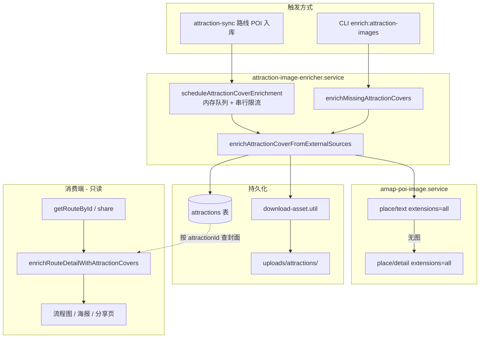

# 代码解析与审核文档

> 本文档用于：**每次功能开发完成后**，记录「实现了什么、怎么实现、运行步骤、审核要点」，便于后期 Code Review 与交接维护。  
> 文首为**通用模板**；后文以 **A2+++ Phase 1：高德 POI 图自动拉取** 为完整示例。

---

## 一、通用模板（复制后填写）

每次新功能或较大改动，在本文件末尾追加一节，或单独新建 `docs/代码解析-<功能名>.md`，至少包含以下字段。

### 1.1 基本信息

| 项 | 内容 |
|----|------|
| **功能名称** | （例：景点封面高德 POI 图自动拉取） |
| **路线图编号** | （例：A2+++ Phase 1） |
| **完成日期** | YYYY-MM-DD |
| **关联 PR / 分支** | （可选） |
| **负责人** | |

### 1.2 功能目标（What）

用 1～3 句话说明用户/业务侧可见结果，例如：

- 无封面景点可自动从高德 POI 拉取缩略图并持久化；
- 路线详情 / 海报 / 分享页展示封面，无需改 `route_detail` JSON。

### 1.3 涉及文件清单（Where）

| 路径 | 职责 |
|------|------|
| `packages/...` | （逐文件说明） |

### 1.4 架构与数据流（How — 宏观）

用 ASCII 或 Mermaid 画出主链路，标注**同步 / 异步**、**读 / 写**、**外部依赖**。

### 1.5 核心实现原理（How — 微观）

分模块说明：

1. **入口**：谁调用、何时触发；
2. **核心算法 / 策略**：匹配规则、回退、限流、幂等；
3. **持久化**：写哪张表、哪些字段、文件存哪；
4. **对外暴露**：API / CLI / 消费端如何读到结果。

### 1.6 运行步骤（Runbook）

| 步骤 | 命令 / 操作 | 预期结果 |
|------|-------------|----------|
| 1 | | |
| 2 | | |

### 1.7 配置与环境变量

| 变量 | 默认值 | 说明 |
|------|--------|------|
| | | |

### 1.8 审核检查清单（Review Checklist）

- [ ] 是否符合 i18n 规范（用户可见文案无硬编码）？
- [ ] 错误是否走 `ApiMessageKey` / `ApiError`？
- [ ] 是否有 SQL 注入 / 未校验输入？
- [ ] 外部 API 是否有超时、限流、失败降级？
- [ ] 是否破坏已有数据结构兼容性？
- [ ] 密钥是否只从环境变量读取？
- [ ] 迁移是否已写入 `drizzle/meta/_journal.json`？
- [ ] 是否有必要的日志（不含敏感信息）？

### 1.9 已知限制与后续

- 当前不做的事；
- Phase 2 预留点。

---

## 二、示例：A2+++ Phase 1 — 高德 POI 图自动拉取

### 2.1 基本信息

| 项 | 内容 |
|----|------|
| **功能名称** | 景点封面 — 高德 POI 图自动拉取与持久化 |
| **路线图编号** | A2+++ Phase 1（Phase 0 为 schema + 运营上传 + 展示注入） |
| **完成日期** | 2026-06-01 |
| **前置文档** | [开发记录-重难点与亮点.md](./开发记录-重难点与亮点.md) § A2+++、[amap-geocoding.md](./amap-geocoding.md) |

### 2.2 功能目标（What）

1. **批量补全**：对 `attractions` 表中「无封面」的已发布 / 待审核景点，按「名称 + 城市」调用高德 POI 接口取图，下载到本地 `uploads/attractions/`，并写入 `cover_image_url`、`image_source=amap` 等合规字段。
2. **自动触发**：AI 路线同步 POI 入库（新建或合并且无封面）时，**异步**排队拉取，不阻塞路线生成主链路。
3. **消费不变**：路线 JSON 仍不存封面；读路线时通过 `enrichRouteDetailWithAttractionCovers` 按 `attractionId` 注入 `coverImageUrl`（Phase 0 已有）。

### 2.3 涉及文件清单（Where）

| 路径 | 职责 |
|------|------|
| `packages/server/drizzle/0018_attraction_cover_image.sql` | DB 迁移：封面 URL、来源、授权、拉取时间 |
| `packages/server/drizzle/meta/_journal.json` | Drizzle 迁移登记（**必须**与 sql 同步，否则 migrate 会跳过） |
| `packages/server/src/db/schema/attractions.ts` | Drizzle schema 定义封面相关列 |
| `packages/server/src/config/amap.ts` | `isAmapImageEnrichEnabled`、`getAmapImageFetchDelayMs` |
| `packages/server/src/services/amap-poi-image.service.ts` | 调用高德 place/text、place/detail 解析 POI 图片 URL |
| `packages/server/src/utils/download-asset.util.ts` | HTTP 下载图片，校验类型与大小，写入磁盘 |
| `packages/server/src/services/attraction-image-enricher.service.ts` | **编排层**：单条/批量补全、异步队列、持久化 |
| `packages/server/src/services/attraction.service.ts` | `getAttractionForCoverEnrich`、`updateAttractionCoverImage` |
| `packages/server/src/services/attraction-sync.service.ts` | 路线 POI 同步后 `scheduleAttractionCoverEnrichment` |
| `packages/server/src/services/route-attraction-media.service.ts` | 读路线时注入封面（Phase 0，本功能不修改持久化结构） |
| `packages/server/src/scripts/enrich-attraction-images.ts` | 批量 CLI 入口 |
| `packages/server/package.json` | 脚本 `enrich:attraction-images` |
| `packages/shared/src/constants.ts` | `AttractionImageSource.AMAP` 等枚举 |
| `.env.example` | `AMAP_IMAGE_ENRICH_ENABLED`、`AMAP_IMAGE_FETCH_DELAY_MS` |

### 2.4 架构与数据流



**设计要点**：

- **写路径**与**读路径**分离：封面只写在 `attractions` 表；`route_detail` JSON 不改。
- **异步**：路线同步用 fire-and-forget 队列，避免高德延迟拖慢 `generateRoute`。
- **不覆盖人工**：`image_source=manual` 的封面跳过自动拉取。

### 2.5 核心实现原理

#### 2.5.1 高德 POI 搜图（`amap-poi-image.service.ts`）

| 步骤 | 说明 |
|------|------|
| 1 | 开关：`isAmapImageEnrichEnabled()`（默认跟随 `AMAP_ENABLED` + `AMAP_WEB_KEY`） |
| 2 | **主路径**：`GET /v3/place/text`，参数 `keywords=景点名`、`city=城市`、`citylimit=true`、`extensions=all`，从前 3 条 POI 中取第一条带 `photos` 的记录 |
| 3 | **回退**：若 text 无图但命中 POI，再用 `extensions=base` 取 `poiId`，调用 `GET /v3/place/detail?id=...&extensions=all` |
| 4 | **兼容**：高德 `photos` 可能是对象数组或字符串，`normalizeAmapPhotos` 统一为 `{ url, title? }[]` |
| 5 | **超时**：复用 `AMAP_GEOCODE_TIMEOUT_MS`，`AbortController` 中断请求 |

原理：与现有地理编码（`amap-geocode.service.ts`）共用 Key 与超时配置，但 **place/text 必须 `extensions=all` 才返回 photos**，与 geocode 用的 `extensions=base` 不同。

#### 2.5.2 图片下载（`download-asset.util.ts`）

| 步骤 | 说明 |
|------|------|
| 1 | `fetch(imageUrl)` + 15s 超时 |
| 2 | 校验 `Content-Type` 以 `image/` 开头 |
| 3 | 体积上限 **3MB**（与运营上传 multer 限制一致） |
| 4 | 无扩展名时按 Content-Type 或 URL 推断 `.jpg/.png/...` |
| 5 | 写入 `attractionCoversDir`，文件名 `{id}-amap-{timestamp}` |

原理：**不把高德外链直接存库**，避免外链失效、防盗链、小程序 Canvas 跨域；与 Phase 0 运营上传路径一致（`/uploads/attractions/`）。

#### 2.5.3 编排层（`attraction-image-enricher.service.ts`）

**单条补全** `enrichAttractionCoverFromExternalSources`：

```
检查开关 → 跳过 manual 封面 → 跳过已有封面(除非 force)
  → fetchAmapPoiCoverImage(name, city)
  → persistAmapCoverImage (dryRun 则只返回 URL 不写盘)
  → updateAttractionCoverImage(image_source=amap, attribution=高德地图 POI · …)
```

**批量** `enrichMissingAttractionCovers`：

- SQL：`cover_image_url IS NULL AND status IN (1,2)`，按 `updated_at` 排序，`limit` 默认 50、最大 200。
- 循环调用单条补全，每条之间 `sleep(AMAP_IMAGE_FETCH_DELAY_MS)`，降低配额压力。

**异步队列** `scheduleAttractionCoverEnrichment`：

- Promise 链串行限流，作 fire-and-forget **兜底**（同步 await 失败或未走 sync 的场景）。

**同步 await**（主路径）：

- `syncAttractionsFromRouteDetail` 收集 `pendingCoverIds`，结束时 `await enrichAttractionCoversForIds(...)`。
- `createRouteFromPrompt` 返回前走 `getRouteById`，响应含注入后的 `coverImageUrl`。

**读路线兜底**：

- `enrichRouteDetailWithAttractionCovers` 对仍无封面的 ID 再 await 补拉（最多 16 条），再注入。

**封面查询**：

- `getAttractionsByIdsForRouteMedia` 含 **active + pending**（AI 新建景点多为 pending）。

**磁盘策略**（`local-upload.util.ts`）：

- 每景点 amap 封面固定 `{id}-amap.*`，重复拉图**覆盖**旧文件。
- `updateAttractionCoverImage` 替换路径时删除上一张本机文件。
- 增长与**景点数**近似线性（非按生成次数堆叠）；图片占**磁盘**非内存。

#### 2.5.4 与路线同步的衔接（`attraction-sync.service.ts`）

```text
syncAttractionsFromRouteDetail
  → 匹配合并 / 新建 pending
  → 收集无封面 ID → await enrichAttractionCoversForIds
  → scheduleAttractionCoverEnrichment（兜底）
```

### 2.6 代码运行步骤（Runbook）

#### 前置条件

```bash
# 1. 确保迁移已执行（0018 须在 journal 中登记）
pnpm db:migrate

# 2. 配置 .env
# AMAP_WEB_KEY=你的Web服务Key
# AMAP_ENABLED=true
# AMAP_IMAGE_ENRICH_ENABLED=true   # 可选，默认跟随 AMAP_ENABLED
# AMAP_IMAGE_FETCH_DELAY_MS=300    # 可选
```

#### 批量补全（CLI）

| 步骤 | 命令 | 预期 |
|------|------|------|
| 预览 | `pnpm enrich:attraction-images -- --dry-run --limit=5` | 日志 `would update #id 名称`，不写库、不下载 |
| 正式 | `pnpm enrich:attraction-images -- --limit=50` | `uploads/attractions/` 出现文件，DB `cover_image_url` 有值 |
| 统计 | 查看最后一行 | `{ scanned, updated, failed, skipped }` |

#### 自动补全（路线生成）

1. 用户 AI 规划路线 → `syncAttractionsFromRouteDetail` 写入 POI 并 **await** 高德拉图。
2. `getRouteById` / 创建路线响应 → `enrichRouteDetailWithAttractionCovers` 注入封面。
3. 移动端行程路径 / 手帐海报消费 `coverImageUrl`；缩略图支持 `uni.previewImage` 大图预览。

#### 磁盘与运维

| 项 | 说明 |
|----|------|
| 路径 | `packages/server/uploads/attractions/` |
| 命名 | `{attractionId}-amap.jpg`（覆盖式，非 timestamp 堆叠） |
| 粗算 | 单张约 200～500KB；1 万景点约 2～5GB |
| 监控 | 生产关注该目录体积；多机需共享盘或 OSS |
| 清理 | 换封面时自动删旧文件；历史 `{id}-amap-{ts}` 可一次性脚本清理（待办） |

#### 验证消费端

- 移动端路线详情 `RouteDayFlowChart`：节点缩略图；
- 分享页 `share/route.vue`、海报 `diary-page` 模板：有 `coverImageUrl` 时绘真图。

### 2.7 配置与环境变量

| 变量 | 默认值 | 说明 |
|------|--------|------|
| `AMAP_WEB_KEY` | — | 必填，Web 服务类型 Key |
| `AMAP_ENABLED` | `true` | `false` 时关闭高德（含拉图） |
| `AMAP_IMAGE_ENRICH_ENABLED` | 跟随 `AMAP_ENABLED` | 显式 `false` 关闭封面补全 |
| `AMAP_IMAGE_FETCH_DELAY_MS` | `300` | 批量/队列请求间隔（毫秒） |
| `AMAP_GEOCODE_TIMEOUT_MS` | `8000` | place 接口超时（与 geocode 共用） |

### 2.8 数据库字段说明

| 列 | 类型 | 含义 |
|----|------|------|
| `cover_image_url` | varchar(512) | 相对路径 `/uploads/attractions/...` 或合规外链 |
| `image_source` | varchar(32) | `manual` / `amap` / `wikimedia` / … |
| `image_license` | varchar(128) | 本功能写 `amap_poi` |
| `image_attribution` | varchar(256) | 例：`高德地图 POI · 岳麓山 · POI:B0xxx` |
| `image_fetched_at` | timestamp | 最近一次写入封面的时间 |

### 2.9 审核检查清单（本功能专用）

- [x] 密钥仅从 `AMAP_WEB_KEY` 环境变量读取
- [x] 不覆盖 `image_source=manual` 封面
- [x] 高德请求有超时；批量/队列有 delay
- [x] 下载校验 Content-Type 与 3MB 上限
- [x] DB 只存相对路径，接口层 `resolvePublicAssetUrl` 拼公网 URL
- [x] 迁移 `0018` 已加入 `_journal.json`（否则 migrate 静默跳过）
- [x] CLI 支持 `--dry-run`，便于审核前验证
- [x] pending 景点可注入封面；sync 主路径 await 拉图
- [x] 单景点单文件 + 替换删旧，避免磁盘按次数堆叠
- [ ] 未接入 OSS（生产多机 / 大库量建议迁移）
- [ ] 无 Wikimedia fallback（Phase 1 后续项）

### 2.10 已知限制与后续

| 限制 | 说明 |
|------|------|
| POI 匹配 | 依赖「名称 + 城市」文本搜索，同名/错城可能取错图 |
| 配额 | 大量景点需控制 `limit` 与 `DELAY`，避免高德日配额耗尽 |
| 存储 | 本地 `uploads` 按景点线性增长；已覆盖式存储 + 删旧；OSS 待接 |
| 失败静默 | 无图时 `skipped++`；读路线时仍会尝试兜底补拉 |

**后续 Phase 1+**：OSS、Wikimedia fallback、孤儿文件清理脚本、管理端强制刷新 API。

### 2.11 关键函数速查

| 函数 | 文件 | 作用 |
|------|------|------|
| `fetchAmapPoiCoverImage` | amap-poi-image.service | 名称+城市 → POI 首图 URL |
| `downloadImageToFile` | download-asset.util | 远程 URL → 本地文件 |
| `tryDeleteAttractionCoverFile` | local-upload.util | 替换封面时删旧文件 |
| `enrichAttractionCoverFromExternalSources` | attraction-image-enricher | 单景点完整链路 |
| `enrichAttractionCoversForIds` | attraction-image-enricher | 批量按 ID await 拉图 |
| `enrichMissingAttractionCovers` | attraction-image-enricher | CLI 扫描无封面 |
| `scheduleAttractionCoverEnrichment` | attraction-image-enricher | Promise 链兜底 |
| `getAttractionsByIdsForRouteMedia` | attraction.service | 注入查询（含 pending） |
| `enrichRouteDetailWithAttractionCovers` | route-attraction-media | 读路线时注入 + 兜底拉图 |

---

## 三、示例：H2-a 手帐内容与行程展示增强

| 项 | 内容 |
|----|------|
| **完成日** | 2026-06-01（v0.8.5～v0.8.7） |
| **关联代码** | `poster/build-poster-payload.ts`、`poster/poster-layout.ts`、`poster/draw-kind-badge.ts`、`poster/draw-poster-images.ts`、`poster/templates/*`、`RoutePosterSheet.vue`、`RouteDayFlowChart.vue`、`utils/route-map.ts` |

### 问题与方案

| 问题 | 方案 |
|------|------|
| 手帐只展示部分 `attractions`，无交通/住宿 | Payload 改用 `buildRouteDayFlow`；**v0.8.7 起全量节点、全量天数** |
| 日记每天只 1 条、固定画布裁切 | 模板列全节点；`measurePosterHeight` 两阶段测高；`measureItemTitleRowHeight` 与绘制对齐 |
| 出现「还有 N 项」却不展开 | v0.8.7 取消 8 项/5 天 payload 截断；画布随内容增高（上限 4096px） |
| 海报底栏 QR 空白 | 三层兜底：H5 → `wxacode` PNG → URL Link；见 [env-environments §8](./env-environments.md#8-海报二维码配置) |
| 描述/简介出现 `…` | 取消 80 字截断；`WRAP_LINES_UNLIMITED` 换行 |
| 每天仅 1 张图 | `highlightImages` 最多 3 张 + `drawDiaryPhotoStrip` |
| 标签在标题上方 | `drawItemTitleRow`：标签左、标题右同一行 |
| 分列模板日标题下半截断 | 列标题条高度随 `day.label` 换行 |
| 地图点只有序号 | `buildRoutePoiMarkers` 常驻 callout：`序号. 景点名` |

### 生成流程（海报）

```text
路线：detail.vue → buildPosterPayload（含 options）
  → RoutePosterSheet 选模板/选项
  → fillThemedBackground（v0.8.9 主题底纹）
  → registry[templateId].render → canvas-export

炫耀：checkins/achievements/badges 页
  → buildCheckinPosterPayload / buildGamificationPosterPayload
  → checkin-map / achievement-showcase 模板
  → PosterThemeChipRow 切换 themePresetId（与路线海报共用 storage）
```

关键模块：`draw-poster-background.ts`（主题底纹）· `checkin-map.ts`（足迹缩略图+spread）· `achievement-showcase.ts`（徽章网格）。

```text
buildPosterPayload(route)   // 全量 days × 全量 flow 节点
  → RoutePosterSheet：query Canvas(1334) → measurePosterHeight(ctx)
  → 设置 canvas 实测高度 → loadPosterImages
  → 无 H5 时 loadPosterWxacode / fetchRouteShareLink
  → renderPoster → canvas-export
```

### 审核要点

- [ ] 与详情「行程路径」节点顺序、类型一致；**无「还有 N 项」截断**  
- [ ] 2 天及以上路线在 `diary-page` 下可见多张日卡片；**节点数与详情一致**  
- [ ] 长描述、长副标题完整展示且画布无底部裁切  
- [ ] en-US 长文案 `wrapText` 不破版  
- [ ] 无封面时照片条/占位降级，不阻塞导出  
- [ ] 地图预览各点可见名称气泡（非仅点击）  
- [ ] 海报底栏有可扫 QR（H5 或小程序码）；生产 API 已配微信密钥或打包 env 已配 H5
- [ ] 四类海报切换 forest/ocean/sunset/classic 底纹正常（非纯色）
- [ ] 徽章双列标题完整；足迹地图缩略图+短标签不严重重叠

---

## 四、示例：路线地图打卡点名称标注

| 项 | 内容 |
|----|------|
| **完成日** | 2026-06-01（v0.8.6） |
| **关联代码** | `utils/route-map.ts`（`buildRoutePoiMarkers`）、`components/route-map/RouteMapPlayer.vue` |

### 实现要点

- 有效坐标 POI 生成 `markers`；`title` 仍为完整名称（系统默认行为）。  
- `label`：序号圆标（主题色底）。  
- `callout`：`display: 'ALWAYS'`，`content` 为 `formatPoiMarkerCallout(name, order)`，白底气泡 + 细边框。  
- 名称过长时在气泡内截断（约 28 字），避免密集路线重叠不可读。

### 审核要点

- [ ] 解锁后地图预览、全屏地图均使用同一 `displayMarkers`  
- [ ] 无坐标站点仍走 `hiddenSpots` 提示，不生成 marker  

---

## 五、后续功能如何追加文档

1. 复制 **§ 一、通用模板** 到新章节或新文件。
2. 填写 **§ 2.4～2.11** 同级别的小节（架构图、原理、Runbook、Review 清单）。
3. 在 [README.md](./README.md) 文档索引中增加一行链接。
4. 若与 [开发记录-重难点与亮点.md](./开发记录-重难点与亮点.md) 某节对应，互链路线图编号。

---

## 六、修订记录

| 日期 | 说明 |
|------|------|
| 2026-06-01 | 初版：通用模板 + A2+++ 高德 POI 封面拉取完整解析 |
| 2026-06-01 | 补充：sync await、pending 注入、磁盘策略、手帐内容增强 §3 |
| 2026-06-01 | v0.8.6：手帐多天/多图/完整描述/标签同行/测高；地图打卡点名称 §4 |
