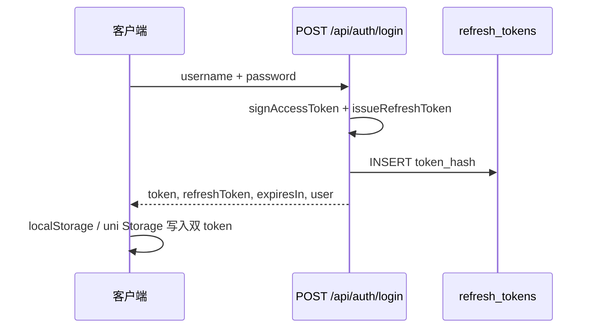
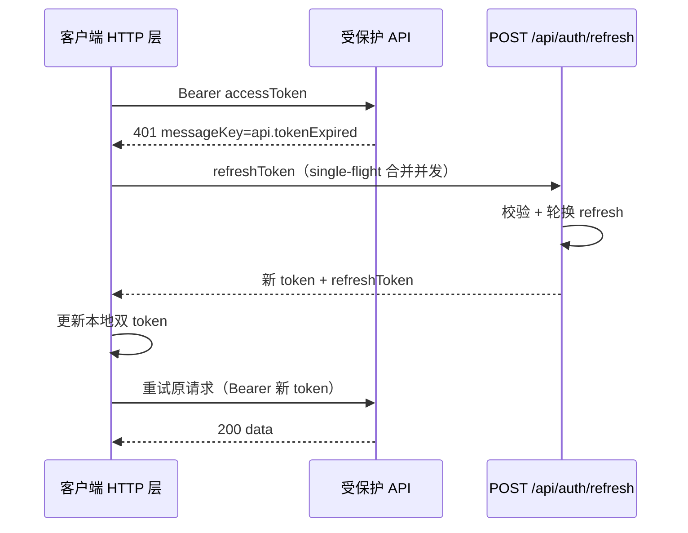

# 双 Token 认证与无感刷新

> **版本**：1.0  
> **更新日期**：2026-07-07  
> **适用端**：`packages/server` · `packages/web` · `packages/pc` · `packages/mobile` · `@douxing/shared`

---

## 1. 概述

兜行采用 **Access Token（JWT，短效）+ Refresh Token（opaque，长效，可轮换）** 双 Token 方案：

| Token | 形态 | 默认有效期 | 存储位置 | 用途 |
|-------|------|-----------|----------|------|
| **Access Token** | JWT | **15 分钟**（`JWT_ACCESS_EXPIRES_IN`） | 客户端 `douxing_token` | 请求头 `Authorization: Bearer` |
| **Refresh Token** | 随机串（服务端存 SHA-256 哈希） | **30 天**（`JWT_REFRESH_EXPIRES_IN`） | 客户端 `douxing_refresh_token` | 仅用于 `POST /api/auth/refresh` |

**目标**：Access Token 过期后，客户端在 **用户无感知** 的情况下自动续期并重试原请求；Refresh Token 过期或吊销后，引导重新登录。

详细思考过程与踩坑见 [开发记录-重难点与亮点.md § G5](./开发记录-重难点与亮点.md#g5-双-token-无感刷新2026-07-07)。

---

## 2. 端到端流程

### 2.1 登录



登录、注册、短信登录三条入口均返回 `LoginResult`：

```typescript
interface LoginResult {
  token: string;           // Access Token
  refreshToken: string;    // Refresh Token 明文（仅此一次完整下发）
  expiresIn: number;       // Access Token 秒数
  user: UserInfo;
}
```

### 2.2 业务请求与无感刷新



**Single-flight**：同一时刻多个请求 401 时，只发起 **一次** refresh，其余请求等待同一 Promise（`@douxing/shared` 的 `createTokenRefreshCoordinator`）。

### 2.3 登出

```text
POST /api/auth/logout  { "refreshToken": "..." }
→ 服务端吊销该 refresh（revoked_at）
→ 客户端 clearAuth / userStore.logout()
```

登出接口失败 **不阻塞** 本地清会话。

---

## 3. 后端实现要点

| 模块 | 路径 | 说明 |
|------|------|------|
| 表结构 | `refresh_tokens` | `token_hash`、`expires_at`、`revoked_at`；迁移 `0036_refresh_tokens.sql` |
| Service | `refresh-token.service.ts` | `issueRefreshToken` · `rotateRefreshToken` · `revokeRefreshToken` |
| 路由 | `routes/auth.ts` | `POST /refresh` · `POST /logout`；登录类接口走 `buildLoginResult` |
| 中间件 | `middleware/auth.ts` | JWT 无效/过期 → `401` + `api.tokenExpired` |

**Refresh Token 安全**：

- 数据库 **仅存 SHA-256 哈希**，明文仅登录/刷新响应中返回一次
- **轮换（Rotation）**：每次 refresh 吊销旧 token、签发新 refresh，降低泄露窗口
- 用户被禁用 / 删除时，refresh 校验失败并吊销刚签发的新 token

**环境变量**（`.env.example`）：

```env
JWT_SECRET=change-me-in-production
JWT_ACCESS_EXPIRES_IN=15m
JWT_REFRESH_EXPIRES_IN=30d
# 兼容：未设 JWT_ACCESS_EXPIRES_IN 时回退 JWT_EXPIRES_IN（默认 7d）
JWT_EXPIRES_IN=7d
```

**部署前**：`pnpm --filter @douxing/server db:migrate`

---

## 4. 客户端实现要点

### 4.1 本地存储键（`@douxing/shared`）

| 常量 | 值 |
|------|-----|
| `AUTH_TOKEN_KEY` | `douxing_token` |
| `AUTH_REFRESH_TOKEN_KEY` | `douxing_refresh_token` |
| `AUTH_USER_KEY` | `douxing_user` |

### 4.2 Web 管理端（`packages/web`）

| 模块 | 行为 |
|------|------|
| `api/http.ts` | axios 拦截器：401 + `api.tokenExpired` → refresh → 重试；refresh 走裸 axios 防循环 |
| `utils/session.ts` | `ensureSessionBootstrapped()`：路由守卫 await 会话恢复；bootstrap 期间 **禁止** unauthorizedHandler 跳转 |
| `router/index.ts` | `idle`/`checking` 时 await bootstrap，**禁止** `return false` 取消导航（避免刷新白屏） |
| `stores/user.ts` | `updateTokens` · `setAuth(..., refreshToken?)` · logout 清双 token |
| `main.ts` | 先 `setupHttpAuthHandlers`，再 `mount`；bootstrap 由路由守卫触发 |

### 4.3 PC 用户端（`packages/pc`）

与 Web 同构：`http.ts` 拦截器 · `session.ts` bootstrap · `main.ts` 先注册 handler 再 mount · 登出调 `logoutSession`。

### 4.4 移动端（`packages/mobile`）

| 模块 | 行为 |
|------|------|
| `utils/auth-storage.ts` | 双 token 读写 · `clearAuth` |
| `utils/auth-refresh.ts` | refresh / logout 远程吊销 · single-flight |
| `utils/request.ts` | `uni.request` 401 + `api.tokenExpired` → refresh → 重试 |
| `App.vue` | 注册 `setUnauthorizedHandler` → `reLaunch` 登录页 |

**SSE / 上传等特殊路径**：仍直接读 `getStoredToken()`；refresh 成功后 storage 已更新，后续请求自动带新 token。长连接 SSE 若 token 中途过期，需业务侧重连（与改造前一致）。

---

## 5. API 速查

| 方法 | 路径 | 鉴权 | 说明 |
|------|------|------|------|
| POST | `/api/auth/login` 等 | 公开 | 返回 `LoginResult`（含双 token） |
| POST | `/api/auth/refresh` | 公开 | Body: `{ refreshToken }` → `RefreshTokenResult` |
| POST | `/api/auth/logout` | 公开 | Body: `{ refreshToken? }` 吊销 |
| GET | `/api/auth/me` | 登录 | 校验 Access Token |

**RefreshTokenResult**：

```typescript
interface RefreshTokenResult {
  token: string;
  refreshToken: string;
  expiresIn: number;
}
```

**错误码**（`ApiMessageKey`）：

| Key | 场景 |
|-----|------|
| `api.tokenExpired` | Access Token 无效或过期（客户端应尝试 refresh） |
| `api.unauthorized` | 未带 Bearer |
| `api.refreshTokenInvalid` | Refresh 不存在或已吊销 |
| `api.refreshTokenExpired` | Refresh 过期或用户不可用 |

---

## 6. 兼容与迁移

| 场景 | 行为 |
|------|------|
| 旧客户端（仅 `douxing_token`） | 登录接口仍返回 `token`；无 refresh 时 401 后无法续期，需重新登录 |
| 旧会话（7 天单 JWT 未过期） | 在 JWT 自然过期前仍可用；过期后须重新登录以获取双 token |
| 数据库未迁移 | `issueRefreshToken` 失败 → 登录 500；须先 `db:migrate` |

---

## 7. 验收清单

- [ ] 登录后 localStorage / Storage 存在 `douxing_token` 与 `douxing_refresh_token`
- [ ] Access 过期后任意 API 自动 refresh 并成功（Network 可见 `/auth/refresh` 一次）
- [ ] 管理端 **F5 刷新** 不出现白屏，Console 无路由 abort
- [ ] 登出后 `/auth/refresh` 用旧 refresh 返回 401
- [ ] zh-CN / en-US 下 refresh 相关错误文案随 `Accept-Language` 变化
- [ ] 并发 10 个 401 请求仅触发 **1 次** refresh

---

## 8. 相关文档

- [API接口文档.md §4](./API接口文档.md#4-认证-auth)
- [openapi.yaml](./openapi.yaml) — Apifox 导入
- [开发记录-重难点与亮点.md § G5](./开发记录-重难点与亮点.md#g5-双-token-无感刷新2026-07-07)
- [PC双平台分工.md](./PC双平台分工.md) — 双端 JWT 共用说明
- [国际化.md](./国际化.md) — `ApiMessageKey` 规范

**维护约定**：变更 auth 路由、token 有效期或客户端拦截逻辑时，同步更新本文档、`API接口文档.md`、`openapi.yaml` 与重难点 § G5。
