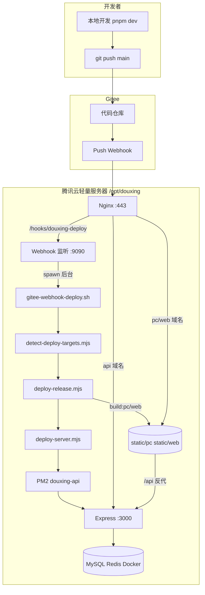
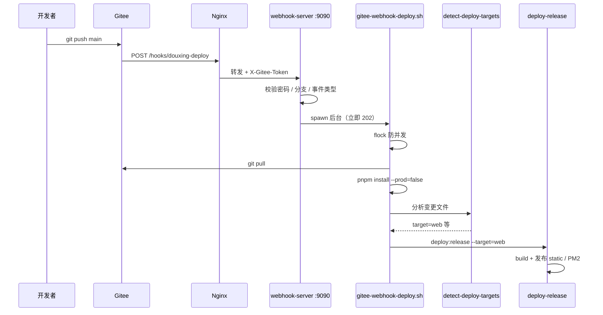
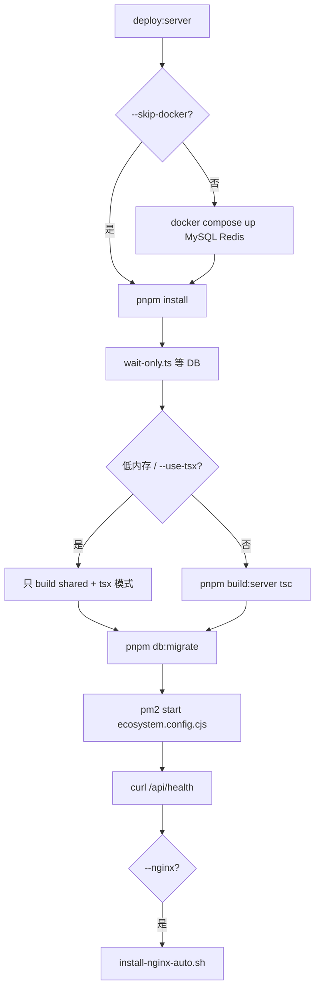

# 兜行 · 发版流程与 CI/CD 解析

> 本文说明：**从代码提交到线上生效**的完整链路、各脚本职责、实现原理，以及首次手动配置与后续 CI/CD 参考。  
> 速查命令见 [服务端命令手册](服务端命令手册.md) · 生产步骤见 [deploy-production.md](deploy-production.md)

**最后更新**：2026-06-11

---

## 目录

1. [架构总览](#1-架构总览)
2. [发版模式对比](#2-发版模式对比)
3. [自动发版全流程（当前方案）](#3-自动发版全流程当前方案)
4. [各阶段实现原理](#4-各阶段实现原理)
5. [脚本职责清单](#5-脚本职责清单)
6. [手动首次配置（一次性）](#6-手动首次配置一次性)
7. [环境变量说明](#7-环境变量说明)
8. [Nginx 与域名拓扑](#8-nginx-与域名拓扑)
9. [增量发版规则](#9-增量发版规则)
10. [各端发版内容](#10-各端发版内容)
11. [Git 与产物规范](#11-git-与产物规范)
12. [故障排查决策树](#12-故障排查决策树)
13. [迁移到其他 CI/CD 的参考](#13-迁移到其他-ci/cd-的参考)

---

## 1. 架构总览



**核心设计**

| 原则 | 说明 |
|------|------|
| **构建在服务器** | 无 Gitee Go 云端构建；push 后服务器 `git pull` + `pnpm build` |
| **Webhook 与 API 分离** | 监听 `:9090`，发版重启 PM2 不影响 Webhook 接收 |
| **增量发版** | 按变更 package 只构建 server / pc / web |
| **Nginx 配一次** | 域名与 HTTPS 首次手动；之后只更新 `static/` 与 PM2 |
| **Monorepo + pnpm** | `packages/*` workspace，共享 `@douxing/shared` |

---

## 2. 发版模式对比

| 模式 | 触发 | 构建位置 | 适用 |
|------|------|----------|------|
| **A. Webhook 自动（当前）** | `git push` | 服务器 | 小团队、单服务器、已打通 Gitee |
| **B. SSH 手动** | 登录跑脚本 | 服务器 | 调试、紧急热修 |
| **C. Gitee Go** | push / tag | Gitee 云端 | 需 PR 门禁、云端日志（本项目已弃用） |
| **D. GitHub Actions 等** | push | 云端 runner | 仓库在 GitHub 时 |
| **E. Cron 拉取** | 定时 | 服务器 | 无 Webhook 时的兜底 |

当前生产推荐 **A**；B 作为补充；C/D 见 [§13](#13-迁移到其他-cicd-的参考)。

---

## 3. 自动发版全流程（当前方案）

### 3.1 时序



### 3.2 开发者日常操作

```bash
# 1. 本地可选自检
pnpm build:ci

# 2. 提交并推送
git commit -m "feat(web): 订单页 [deploy:web]"
git push origin main

# 3. 查看服务器日志（可选 SSH）
tail -f /opt/douxing/logs/webhook-deploy.log
```

**无需 SSH 即可完成发版**（前提：Webhook、Nginx、PM2 已一次性配好）。

---

## 4. 各阶段实现原理

### 4.1 Webhook 接收 — `gitee-webhook-server.mjs`

| 项 | 说明 |
|----|------|
| 监听 | `127.0.0.1:9090`，路径 `/hooks/douxing-deploy` |
| 鉴权 | Header `X-Gitee-Token` === `.env` 的 `WEBHOOK_SECRET` |
| 事件 | `Push Hook` / `push_hooks`；测试请求返回 200 不发版 |
| 分支 | 仅 `WEBHOOK_DEPLOY_BRANCHES`（如 main） |
| 行为 | `spawn` 后台执行 `gitee-webhook-deploy.sh`，**不阻塞** HTTP 响应 |
| 传参 | 环境变量：`WEBHOOK_BEFORE/AFTER`、变更文件列表、commit message |

**systemd 托管**：`douxing-webhook.service` → `install-webhook-service.sh` 安装。

### 4.2 发版入口 — `gitee-webhook-deploy.sh`

| 步骤 | 命令/逻辑 | 原理 |
|------|-----------|------|
| 日志 | `tee` 或重定向到 `logs/webhook-deploy.log` | 后台运行时终端无输出 |
| 并发锁 | `flock /tmp/douxing-deploy.lock` | 连续 push 不重叠构建 |
| 拉代码 | `git pull origin $BRANCH` | 与 Gitee 同步 |
| 装依赖 | `pnpm install --frozen-lockfile --prod=false` | `NODE_ENV=production` 时仍装 devDependencies（tsx/vite 构建需要） |
| 算 target | `node detect-deploy-targets.mjs` | 见 [§9](#9-增量发版规则) |
| 发版 | `pnpm deploy:release --target=... --skip-docker` | 统一发版入口 |

### 4.3 目标检测 — `detect-deploy-targets.mjs`

**输入优先级**

1. commit message 中的 `[deploy:web]` / `[deploy:all]`
2. `git diff --name-only $before $after`（Gitee payload 传入）
3. Webhook 预解析的 `WEBHOOK_CHANGED_FILES`
4. 兜底 `git diff HEAD~1 HEAD`

**输出**：stdout 打印 `server,pc,web` 等逗号分隔；无变更则空输出 → 脚本跳过发版。

### 4.4 统一发版 — `deploy-release.mjs`

**解析 `--target=`**（支持 `--target=web` 与 `--target web` 两种写法）。

| target | 行为 |
|--------|------|
| `server` | 调用 `deploy-server.mjs` |
| `pc` | `pnpm build:pc` → 复制到 `$STATIC_ROOT/pc` |
| `web` | `pnpm build:web` → 复制到 `$STATIC_ROOT/web` |

静态发布逻辑：`packages/*/dist` → `cp -r` → `/opt/douxing/static/{pc,web}`。

Nginx **不在此步骤安装**（`--skip-nginx` 或单独脚本）；仅可选生成 `deploy/nginx/douxing-*.conf` 模板文件。

### 4.5 后端发版 — `deploy-server.mjs`



**tsx 模式**（2G 轻量机推荐）：跳过 `tsc`，PM2 用 `tsx` 直接跑 `packages/server/src/index.ts`（见 `deploy/ecosystem.config.cjs`）。

### 4.6 前端构建

| 包 | 命令 | 产物 |
|----|------|------|
| shared | `pnpm --filter @douxing/shared build` | 各端依赖的 TS 库 |
| pc | `vue-tsc -b && vite build` | `packages/pc/dist` |
| web | `vue-tsc -b && vite build` | `packages/web/dist` |

构建时 API 地址来自根目录 `.env` 的 `VITE_API_BASE_URL` / `API_PUBLIC_BASE_URL_*`。

### 4.7 进程与容器

| 组件 | 管理方式 | 端口 |
|------|----------|------|
| API | PM2 `douxing-api` | 3000 |
| AI 微服务（可选） | PM2 `douxing-ai-service` | 8100 |
| MySQL | Docker `deploy/docker-compose.prod.yml` | 127.0.0.1:3307 |
| Redis | Docker 同上 | 127.0.0.1:6379 |
| Webhook | systemd `douxing-webhook` | 9090 |
| 对外 | Nginx | 80 / 443 |

---

## 5. 脚本职责清单

### 5.1 发版主链路

| 脚本 | 触发方式 | 作用 |
|------|----------|------|
| `gitee-webhook-server.mjs` | systemd 常驻 | 接收 Gitee POST，鉴权，spawn 发版 |
| `gitee-webhook-deploy.sh` | Webhook / 手动 | pull → install → 检测 target → release |
| `detect-deploy-targets.mjs` | 被 webhook 调用 | 变更路径 → server,pc,web |
| `deploy-release.mjs` | pnpm deploy:release | 按 target 调度 server/pc/web |
| `deploy-server.mjs` | release 或单独调用 | Docker、构建、迁移、PM2、Nginx 提示 |
| `pm.mjs` | 被各脚本 import | 统一 pnpm/npm；生产 install 加 `--prod=false` |

### 5.2 静态站 + Nginx

| 脚本 | 作用 |
|------|------|
| `deploy-pc-site.sh` | PC 构建 + `install-nginx-pc.sh` |
| `deploy-web-site.sh` | Web 构建 + `install-nginx-web.sh` |
| `deploy-static-sites.sh` | PC + Web 依次部署 |
| `install-nginx-pc.sh` | 从模板生成 PC 站点配置 → sites-enabled |
| `install-nginx-web.sh` | 同上，Web 管理端 |
| `install-nginx-certbot.sh` | API 域名 Certbot HTTPS |
| `install-nginx-ssl.sh` | 已有证书配置 HTTPS |
| `install-nginx-conf.sh` | API HTTP 反代 |
| `install-nginx-auto.sh` | deploy-server 内部：自动选 conf/certbot/ssl |
| `verify-webhook-nginx.sh` | 检查 Webhook 反代是否生效 |

### 5.3 Webhook / CI 辅助

| 脚本 | 作用 |
|------|------|
| `install-webhook-service.sh` | 安装 systemd + Nginx snippet |
| `ci-build.sh` | 本地/CI 全量构建校验（shared+pc+web+server） |
| `gitee-deploy-remote.sh` | Gitee Go SSH 发版（已弃用方案备用） |

### 5.4 运维 / 初始化

| 脚本 | 作用 |
|------|------|
| `setup-debian12.sh` | Node、Docker、pnpm、PM2 一键安装 |
| `setup-ubuntu22.sh` / `setup-opencloudos9.sh` | 其它发行版 |
| `diagnose-server.sh` | API/Docker/PM2/Nginx 诊断 |
| `add-swap.sh` | 低内存加 swap |
| `fix-mysql-password.mjs` | 同步 Docker MySQL 密码与 .env |

### 5.5 不在服务器 Webhook 链路内

| 脚本 | 说明 |
|------|------|
| `deploy-app.mjs` | 原生 App / 移动端资源 |
| `deploy.mjs` (bootstrap) | 本地开发环境一键初始化 |
| `run-dev-all.mjs` 等 | 本地 dev |

---

## 6. 手动首次配置（一次性）

按顺序执行，**完成后日常只需 push**。

### 阶段 0：前置

- [ ] 域名备案，DNS：`api` / `pc` / `web` / `hooks` → 服务器 IP
- [ ] 腾讯云防火墙：22、80、443
- [ ] Gitee 仓库可读（服务器 deploy key 或 HTTPS）

### 阶段 1：系统与代码

```bash
cd /opt && git clone git@gitee.com:tyxgo/douxing.git douxing && cd douxing
sudo bash scripts/setup-debian12.sh
# 重新 SSH 登录
cp deploy/env.production.example .env && nano .env
pnpm install --frozen-lockfile --prod=false
```

### 阶段 2：后端

```bash
pnpm deploy:server --skip-docker --use-tsx   # 或完整 deploy:server
curl http://127.0.0.1:3000/api/health
pm2 startup && pm2 save
```

### 阶段 3：Nginx 四站点

```bash
sudo bash scripts/install-nginx-certbot.sh api.yxtao.site you@example.com
sudo bash scripts/deploy-pc-site.sh pc.yxtao.site --certbot
sudo bash scripts/deploy-web-site.sh web.yxtao.site --certbot
sudo bash scripts/install-webhook-service.sh --nginx-domain hooks.yxtao.site
sudo nginx -t && sudo systemctl reload nginx
```

### 阶段 4：Gitee Webhook

| 配置项 | 值 |
|--------|-----|
| URL | `https://hooks.yxtao.site/hooks/douxing-deploy` |
| 密码 | = `.env` 的 `WEBHOOK_SECRET` |
| 事件 | Push |

```bash
curl -s http://127.0.0.1:9090/health
bash scripts/verify-webhook-nginx.sh hooks.yxtao.site
```

### 阶段 5：验证自动发版

```bash
# 本地改一行 packages/web 下代码，push
tail -f /opt/douxing/logs/webhook-deploy.log
curl -I https://web.yxtao.site/
```

---

## 7. 环境变量说明

| 变量 | 作用 | 示例 |
|------|------|------|
| `API_PUBLIC_BASE_URL_PROD` | API 对外地址 | `https://api.yxtao.site` |
| `VITE_API_BASE_URL` | 前端构建时 API 前缀 | `https://api.yxtao.site/api` |
| `STATIC_ROOT` | 静态发布根目录 | `/opt/douxing/static` |
| `PC_NGINX_DOMAIN` | PC 域名 | `pc.yxtao.site` |
| `WEB_NGINX_DOMAIN` | 管理端域名 | `web.yxtao.site` |
| `SERVER_PORT` | API 端口 | `3000` |
| `SERVER_RUNTIME` | `tsx` 跳过后端 tsc | `tsx` |
| `WEBHOOK_SECRET` | Webhook 密码 | 随机 32+ 字符 |
| `WEBHOOK_DEPLOY_MODE` | `auto` / `full` | `auto` |
| `WEBHOOK_DEPLOY_ALLOW` | 允许自动发的 target | `server,pc,web` |
| `DATABASE_URL` | MySQL 连接 | `mysql://...@127.0.0.1:3307/douxing` |
| `JWT_SECRET` | 鉴权 | 必填 |

完整模板：`deploy/env.production.example`

---

## 8. Nginx 与域名拓扑

**一个 Nginx 进程，多个 `server {}` 虚拟主机：**

```
api.yxtao.site   → proxy_pass 127.0.0.1:3000     （纯 API）
pc.yxtao.site    → root static/pc + /api 反代
web.yxtao.site   → root static/web + /api 反代
hooks.yxtao.site → proxy_pass 127.0.0.1:9090     （Webhook）
```

模板文件（入 Git）：`deploy/nginx/douxing-*.conf.template`  
生成文件（不入 Git）：`deploy/nginx/douxing-*.conf` → 复制到 `/etc/nginx/sites-available/`

SPA 路由：`try_files $uri $uri/ /index.html`

---

## 9. 增量发版规则

### 9.1 路径 → target

| 变更路径 | target |
|----------|--------|
| `packages/server/` | server |
| `packages/pc/` | pc |
| `packages/web/` | web |
| `packages/shared/` | server, pc, web |
| `packages/ai-service/` | server |
| `pnpm-lock.yaml`、`deploy/`、根 `package.json` | 全部 ALLOW |
| `docs/`、`.workflow/` | **跳过** |
| `packages/mobile/` | **跳过**（走微信上传，非服务器静态） |

### 9.2 Commit 指令（覆盖路径检测）

```text
[deploy:web]      → 只发 web
[deploy:server]   → 只发 server
[deploy:all]      → 发 WEBHOOK_DEPLOY_ALLOW 全部
```

### 9.3 模式

| `WEBHOOK_DEPLOY_MODE` | 行为 |
|-----------------------|------|
| `auto` | 按上表检测 |
| `full` | 每次 server+pc+web 全量 |

---

## 10. 各端发版内容

| 端 | 是否 Webhook 自动 | 发版内容 | 访问方式 |
|----|-------------------|----------|----------|
| **API** | ✅ server target | PM2 重启、迁移 | `api.yxtao.site` |
| **PC** | ✅ pc target | Vite 构建 → static/pc | `pc.yxtao.site` |
| **Web 管理端** | ✅ web target | Vite 构建 → static/web | `web.yxtao.site` |
| **H5** | ❌ | UniApp 构建，需单独部署 | — |
| **微信小程序** | ❌ | 开发者工具上传 | 微信公众平台 |

---

## 11. Git 与产物规范

### 11.1 服务器 Git 原则

- **只** `git pull`，禁止 `add/commit/push`
- 误 add：`git restore --staged .`

### 11.2 不入 Git 的生成物（`.gitignore`）

`static/` · `.env` · `logs/` · `deploy/nginx/douxing-*.conf` · `*.tsbuildinfo` · `.venv/` · 证书目录 · `packages/server/uploads/`

### 11.3 lockfile

服务器使用 `--frozen-lockfile`；本地改依赖后**必须**提交 `pnpm-lock.yaml`。

---

## 12. 故障排查决策树

```
push 后没反应？
├─ Gitee Webhook 日志非 202 → 查 Nginx / WEBHOOK_SECRET / hooks 域名
├─ 202 但无发版 → tail webhook-deploy.log
│   ├─ "无需要发版" → 只改了 docs；或加 [deploy:xxx]
│   ├─ flock 跳过 → 上次发版未完成，等或删 /tmp/douxing-deploy.lock
│   └─ ERR_PNPM_OUTDATED_LOCKFILE → 本地更新 lockfile 后 push
├─ tsx MODULE_NOT_FOUND → pnpm install --prod=false
├─ PC/Web 404 → Nginx 未配或 static 未构建
└─ API 502 → pm2 logs douxing-api
```

---

## 13. 迁移到其他 CI/CD 的参考

若将来改用 **Gitee Go / GitHub Actions / Jenkins**：

| 当前步骤 | CI 等价物 |
|----------|-----------|
| Webhook 触发 | pipeline `on: push` |
| `git pull` | checkout（CI 内）或 SSH deploy pull |
| `detect-deploy-targets.mjs` | `paths-filter` / 自定义 script |
| `ci-build.sh` | CI job：lint + build 校验 |
| `deploy-release.mjs` | deploy job（SSH 到服务器执行或 rsync 产物） |
| Nginx | 仍是一次性 infra，不进 pipeline |

**最小迁移**：保留服务器脚本，CI 仅在 push 后 SSH 执行：

```bash
ssh user@server 'cd /opt/douxing && git pull && bash scripts/gitee-webhook-deploy.sh'
```

**完全云端构建**：CI build 产物 → rsync `static/` 和 `packages/server/dist` → 服务器 PM2 reload（需改 `deploy-release` 支持 `--skip-build` +  artifact 上传）。

---

## 附录：pnpm 命令 → 脚本映射

| pnpm 命令 | 底层脚本 |
|-----------|----------|
| `pnpm deploy:release` | `deploy-release.mjs` |
| `pnpm deploy:server` | `deploy-server.mjs` |
| `pnpm deploy:pc-site` | `deploy-pc-site.sh` |
| `pnpm deploy:web-site` | `deploy-web-site.sh` |
| `pnpm build:ci` | `ci-build.sh` |
| `pnpm detect:deploy-targets` | `detect-deploy-targets.mjs` |
| `pnpm webhook:serve` | `gitee-webhook-server.mjs` |
| `pnpm diagnose:server` | `diagnose-server.sh` |

---

*文档版本：2026-06-11 · 对应当前 Webhook + 服务器构建方案*
