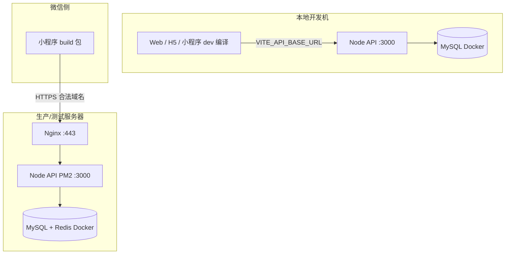
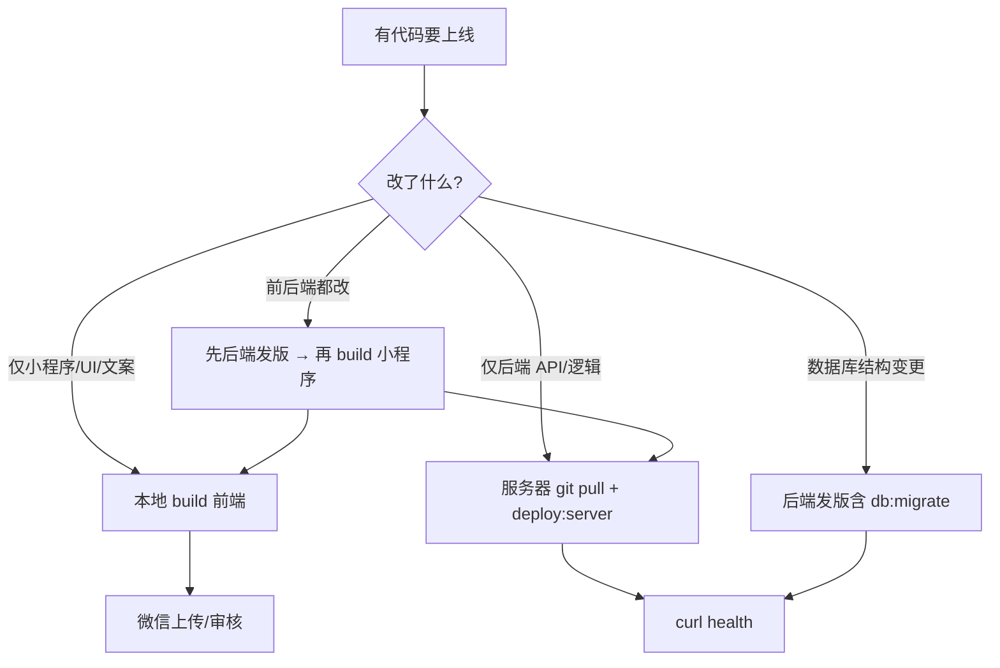

# 兜行 · 启动与部署流程总览

> 汇总**开发环境**、**测试环境**、**生产环境**的启动命令、**发版流程**与打包部署。  
> 详细运维见 [deploy-production.md](./deploy-production.md)，环境变量见 [env-environments.md](./env-environments.md)。

> **包管理器**：下文命令默认写 `pnpm`；未安装 pnpm 时用 `npm run`（例：`pnpm dev` → `npm run dev`，`pnpm dev:only server` → `npm run dev:only -- server`）。详见 [包管理与命令.md](./包管理与命令.md)。

**域名约定**

| 环境 | API 地址 | 前端 env 文件 |
|------|----------|---------------|
| 本地开发 | `.env.local` 或默认 `127.0.0.1:3000` | `.env.local` + `.env.development` |
| 测试 | `https://api-test.yxtao.site/api` | `.env.staging` |
| 生产 | `https://api.yxtao.site/api` | `.env.production` |

> 执行 **`pnpm env:status`** 可查看当前生效的 API 地址。详见 [env-environments.md](./env-environments.md)。  
> **品牌域名候选**（`douxingai` / `douxingtravel`，后期注册与迁移）：见 [域名规划.md](./域名规划.md)。

---

## 1. 架构与职责划分



| 层级 | 运行位置 | 配置来源 | 典型命令 |
|------|----------|----------|----------|
| 后端 API | 本地或服务器 | 根目录 `.env` | `pnpm dev:server` / `pnpm deploy:server`（npm 见 [包管理与命令.md](./包管理与命令.md)） |
| 前端/H5/小程序 | **本地编译** | `.env.local` / `.staging` / `.production` | `pnpm dev:*` / `pnpm build:*` |
| 数据库 | Docker（本地/服务器） | `.env` 中 `DATABASE_URL` | `docker compose` / `pnpm db:*` |
| 公网入口 | 仅服务器 | Nginx + Certbot | `install-nginx-certbot.sh` |

**要点**：`VITE_*` 在**打包时**写入前端；`API_PUBLIC_BASE_URL`、JWT、数据库等由**后端 `.env`** 在运行时读取。

---

## 2. 环境文件速查

| 文件 | 用途 |
|------|------|
| `.env.example` | 本地后端模板，复制为 `.env` |
| `.env` | 后端运行时（数据库、密钥、端口）。**禁止写 `VITE_*`** |
| `.env.local` | 本机专用（gitignore）：dev API 局域网 IP、微信 CLI |
| `.env.development` | dev 共享前端项（如 `VITE_H5_BASE_URL`） |
| `.env.staging` | 测试包 `pnpm build:*:staging` |
| `.env.production` | 生产包 `pnpm build:*` |
| `deploy/env.production.example` | 生产服务器 `.env` 模板 |
| `deploy/env.staging.example` | 测试服务器 `.env` 模板 |

**切换环境**：本地 `pnpm dev` · 测试 `pnpm build:*:staging` · 生产 `pnpm build:*`（一般不用改文件）。

---

## 3. 开发环境（本地）

### 3.1 首次初始化

```bash
# 1. 安装依赖
pnpm install

# 2. 后端配置
cp .env.example .env
# 编辑 .env：DATABASE_URL、JWT_SECRET 等

# 3. 一键：Docker MySQL + 迁移 + 种子 + 全量构建（可选）
pnpm bootstrap
# 或跳过 Docker（本机已有 MySQL）：
pnpm bootstrap --skip-docker

# 4. 仅数据库
pnpm db:setup    # migrate + seed
```

默认账号：`admin / admin123`（seed 后）。

### 3.2 日常启动

**方式 A：全部一起启动（推荐）**

```bash
pnpm dev
```

同时启动：API、Python AI 服务、**Web 管理端**、**PC 用户端**、H5、微信小程序 dev 编译、Android App dev。

管理端（`:5173`）与 PC 用户端（`:5176`）Vite 就绪后会**自动打开浏览器**；小程序编译完成后自动打开微信开发者工具。

```bash
pnpm env:status   # 可选：确认 API 是否指向本地
```

**方式 B：按需单独启动**

```bash
pnpm dev:server        # 后端 http://127.0.0.1:3000
pnpm dev:web           # 管理端 http://localhost:5173（自动打开浏览器）
pnpm dev:pc            # PC 用户端 http://localhost:5176（自动打开浏览器）
pnpm dev:admin         # 后端 + 管理端（:3000 + :5173）
pnpm dev:mobile        # H5 http://localhost:5174
pnpm dev:mp-weixin     # 小程序 dev 编译（自动打开开发者工具）
pnpm dev:ai-service    # Python AI 服务（:8100，pnpm dev 已包含）
```

**方式 C：一键部署并进入 dev**

```bash
pnpm bootstrap:dev     # Docker + 迁移 + 直接 pnpm dev
```

### 3.3 开发访问地址

| 端 | 地址 / 导入路径 |
|----|-----------------|
| 后端 API | http://127.0.0.1:3000/api/health |
| 管理端 | http://localhost:5173（`dev:web` / `pnpm dev` 自动打开） |
| PC 用户端 | http://localhost:5176（`dev:pc` / `pnpm dev` 自动打开） |
| H5 | http://localhost:5174 |
| 微信小程序 | 微信开发者工具导入 `packages/mobile/dist/dev/mp-weixin`（`dev:mp-weixin` 自动打开工具） |

小程序开发阶段：勾选「不校验合法域名、web-view、TLS 版本」。

### 3.4 浏览器自启动（可选）

| 端 | 脚本 | 默认地址 | 实现 |
|----|------|----------|------|
| Web 管理端 | `pnpm dev:web` | http://localhost:5173 | `scripts/dev-web.mjs` |
| PC 用户端 | `pnpm dev:pc` | http://localhost:5176 | `scripts/dev-pc.mjs` |
| 微信小程序 | `pnpm dev:mp-weixin` | 导入 `dist/dev/mp-weixin` | `scripts/dev-mp-weixin.mjs` |

环境变量（均可选）：

| 变量 | 说明 |
|------|------|
| `DOUXING_NO_OPEN=1` | 禁用上述全部自动打开（浏览器 + 微信开发者工具） |
| `DOUXING_WEB_OPEN_URL` | 覆盖管理端打开地址（默认 `http://localhost:5173/`） |
| `DOUXING_PC_OPEN_URL` | 覆盖 PC 端打开地址（默认 `http://localhost:5176/`） |

端口被占用时 Vite 可能换端口，脚本会从输出中解析实际 `Local:` 地址再打开。

### 3.5 停止服务

```bash
pnpm stop              # 停止 dev 进程 + Docker
pnpm stop:dev          # 仅停 dev，保留 Docker
pnpm stop:docker       # 仅停 Docker
```

---

## 4. 测试环境（可选）

适用于体验版联调、预发布验证。

### 4.1 测试服务器部署 API

```bash
cd /opt/douxing
cp deploy/env.staging.example .env
vim .env                 # 默认端口 3001、库名 douxing_staging

pnpm deploy:server
pnpm deploy:server --nginx api-test.yxtao.site --skip-docker --skip-build
sudo bash scripts/install-nginx-certbot.sh api-test.yxtao.site
```

### 4.2 本地打测试包

```bash
pnpm build:mp-weixin:staging   # 小程序 → packages/mobile/dist/build/mp-weixin
pnpm build:web:staging         # 管理端
pnpm build:mobile:staging      # H5
```

微信公众平台添加合法域名：`https://api-test.yxtao.site` → 上传为**体验版**。

---

## 5. 生产环境（服务器）

### 5.1 服务器首次初始化（Debian 12）

```bash
cd /opt
sudo mkdir -p douxing && sudo chown "$USER:$USER" douxing
git clone <仓库地址> douxing
cd douxing

sudo bash scripts/setup-debian12.sh
# 重新 SSH 登录（docker 组生效）

cp deploy/env.production.example .env
vim .env                 # 域名、密码、JWT、DeepSeek 等
```

腾讯云防火墙放行：**22、80、443**。DNS：`api.yxtao.site` → 服务器公网 IP。

### 5.2 部署 API（核心命令）

```bash
cd /opt/douxing

# 完整部署：Docker(MySQL+Redis) + 构建 + 迁移 + PM2
pnpm deploy:server

# 低内存机器（2G）推荐：跳过 server tsc，tsx 直跑
pnpm deploy:server --skip-docker --use-tsx

# 常用变体
pnpm deploy:server --skip-docker          # 本机 MySQL
pnpm deploy:server --skip-build           # 仅重启 PM2（代码已构建）
pnpm deploy:server:check                  # 检查环境
```

验证本机 API（**必须先通过再配 Nginx**）：

```bash
curl http://127.0.0.1:3000/api/health
pnpm exec pm2 status
pnpm exec pm2 logs douxing-api --lines 30
```

可选演示数据：`pnpm db:seed`

### 5.3 配置 HTTPS（Nginx，已与 deploy:server 合并）

在 `.env` 中设置（`deploy/env.production.example` 已含）：

```env
API_PUBLIC_BASE_URL=https://api.yxtao.site
NGINX_DOMAIN=api.yxtao.site
NGINX_AUTO_SETUP=true
NGINX_CERTBOT_EMAIL=你的邮箱@example.com   # 首次自动 Certbot
```

之后**一条命令**完成 API + Nginx + 首次 HTTPS：

```bash
pnpm deploy:server --skip-docker --use-tsx
```

- **HTTPS 已通** → 自动跳过，不会重复配置  
- **已有 Certbot SSL** → 仅 reload，不覆盖配置文件  
- 跳过 Nginx：`pnpm deploy:server --skip-nginx`

手动分步（可选）：

```bash
sudo bash scripts/install-nginx-certbot.sh api.yxtao.site 你的邮箱@example.com
```

### 5.4 开机自启

```bash
pnpm exec pm2 startup
pnpm exec pm2 save
```

### 5.5 生产环境更新发布

见 [§6 发版流程](#6-发版流程日常迭代)。

故障诊断：`bash scripts/diagnose-server.sh`

---

## 6. 发版流程（日常迭代）

> **发版** = 代码或配置变更后，把新版本部署到测试/生产环境。  
> **服务器重启** ≠ 发版：PM2、Docker、Nginx 配置好开机自启后，重启一般**不用**重跑部署命令（见 [§6.6](#66-服务器重启-vs-发版)）。

### 6.1 发版类型怎么选



| 变更内容 | 服务器要做什么 | 本地要做什么 |
|----------|----------------|--------------|
| 仅小程序页面/样式 | **不用动** | `pnpm build:mp-weixin` → 上传微信 |
| 仅管理端 Web | **不用动**（若 API 未变） | `pnpm build:web` → 部署静态资源 |
| 仅后端接口/逻辑 | `git pull` + `deploy:server` | 若小程序调了新接口，再 build 小程序 |
| 数据库 migration | `deploy:server`（自动 migrate） | 按接口变更决定是否 build 前端 |
| 改服务器 `.env` | `deploy:server --skip-build` | 前端 env 变了才 build |
| 改 Nginx/HTTPS | 仅 Nginx / certbot | 不用 build |

### 6.2 标准生产发版（推荐顺序）

**适用**：功能开发完成，从 `dev` 分支合并后上线生产。

> **已配置 Gitee Webhook 时（推荐）**：本地 `git push origin main` 后，服务器自动 `git pull` + 按变更 package 增量发版（server / pc / web），**无需 SSH**。原理与故障排查见 [发版流程与CI-CD解析.md](./发版流程与CI-CD解析.md) · 命令速查见 [服务端命令手册.md](./服务端命令手册.md)。

#### 方式 A：Webhook 自动发版（推荐，日常迭代）

```bash
# 本地（可选自检）
pnpm build:ci

# 推送即触发服务器发版
git push origin main

# 服务器查看发版日志（SSH，可选）
tail -f /opt/douxing/logs/webhook-deploy.log
```

提交信息可强制指定发版范围（优先级高于路径检测）：`[deploy:web]`、`[deploy:server]`、`[deploy:all]`。

#### 方式 B：手动 SSH 发版（Webhook 未配置或 hotfix）

#### 第一步：本地确认

```bash
pnpm install
pnpm dev:server          # 本地冒烟
pnpm build:mp-weixin     # 确认生产包能编过（若本次含前端）
```

#### 第二步：服务器发后端（SSH 登录生产机）

```bash
cd /opt/douxing

# 拉代码（lock 冲突时先 checkout）
git checkout -- pnpm-lock.yaml 2>/dev/null || true
git pull

# 发版（按机器内存选一种）
pnpm deploy:server --skip-docker --use-tsx    # 2G 轻量机推荐
# pnpm deploy:server --skip-docker            # 4G+ 可完整 tsc

# 验证
curl http://127.0.0.1:3000/api/health
curl https://api.yxtao.site/api/health
pnpm exec pm2 logs douxing-api --lines 20
```

`deploy:server` 会自动：`pnpm install` → 构建 → **`pnpm db:migrate`** → PM2 reload。

#### 第三步：本地打小程序生产包（若本次含前端）

```bash
# 本地开发机
pnpm build:mp-weixin
```

确认 `.env.production`：

```env
VITE_API_BASE_URL=https://api.yxtao.site/api
```

#### 第四步：微信侧发布

1. 微信开发者工具导入 `packages/mobile/dist/build/mp-weixin`
2. 预览 / 真机验证核心流程（登录、规划、上传等）
3. **上传** → 微信公众平台 **提交审核**
4. 审核通过后 **发布** 正式版

> 体验版/内测可先走测试包：`pnpm build:mp-weixin:staging` + 体验版，验证通过再发生产包。

#### 第五步：发版后验证

| 检查项 | 命令 / 操作 |
|--------|-------------|
| API 健康 | `curl https://api.yxtao.site/api/health` |
| 登录接口 | 小程序登录 / Postman |
| 图片上传 | 头像、打卡（uploadFile 域名） |
| PM2 状态 | `pnpm exec pm2 status` |
| 错误日志 | `pnpm exec pm2 logs douxing-api --lines 50` |

### 6.3 测试环境发版（体验版）

```bash
# --- 服务器（测试 API）---
cd /opt/douxing
git pull
pnpm deploy:server --skip-docker --use-tsx   # 测试 .env 端口一般为 3001
curl http://127.0.0.1:3001/api/health

# --- 本地 ---
pnpm build:mp-weixin:staging
# 微信开发者工具导入 build 目录 → 上传 → 设为体验版
```

### 6.4 按场景的快速发版命令

**只改后端（hotfix）**

```bash
cd /opt/douxing && git pull
pnpm deploy:server --skip-docker --skip-build   # 仅重载 PM2，最快
# 若改了 .ts 源码：
pnpm deploy:server --skip-docker --use-tsx
```

**只改小程序（不动 API）**

```bash
# 仅本地，服务器无需 SSH
pnpm build:mp-weixin
# 微信开发者工具上传
```

**改了数据库 schema（有新 migration 文件）**

```bash
cd /opt/douxing && git pull
pnpm deploy:server --skip-docker --use-tsx      # 会执行 db:migrate
# 确认迁移成功后再发小程序
pnpm build:mp-weixin
```

**只改服务器环境变量（`.env`）**

```bash
vim /opt/douxing/.env
pnpm deploy:server --skip-docker --skip-build   # 让 PM2 重新加载 env
```

**依赖变更（`package.json` / lock 文件）**

```bash
git pull
pnpm deploy:server --skip-docker --use-tsx      # 会 pnpm install --frozen-lockfile
```

### 6.5 发版前 / 发版后 checklist

**发版前**

```
[ ] 代码已合并到要发布的分支（如 dev / main）
[ ] 本地 dev 冒烟通过
[ ] 若有 migration，已在本地或测试库验证
[ ] 生产 .env 无需临时调试开关（SMS_DEV_EXPOSE_CODE=false 等）
[ ] 若含前端：.env.production 域名正确
[ ] 若含支付/回调：WECHAT_PAY_NOTIFY_URL 等 HTTPS 地址正确
```

**发版后**

```
[ ] curl https://api.yxtao.site/api/health
[ ] pm2 status 为 online
[ ] 小程序真机走一遍主流程
[ ] 查看 pm2 logs 无持续报错
[ ] （可选）微信公众平台确认版本号已更新
```

### 6.6 服务器重启 vs 发版

| 事件 | 是否需要重新发版 | 说明 |
|------|------------------|------|
| 腾讯云重启 / 断电恢复 | **否** | Docker `restart: always` + `pm2 startup` 已配置时自动恢复 |
| `git pull` 新代码 | **是** | 执行 `deploy:server` |
| 只改小程序 | **否**（服务器） | 本地 build + 微信上传 |
| 证书续期（certbot renew） | **否** | 自动续期，无需 redeploy API |
| PM2 进程 crash | **否** | `pnpm exec pm2 restart deploy/ecosystem.config.cjs` |
| 首次部署 / 换机器 | **是** | 走 §5 完整初始化 |

重启后若 API 未起来，排查即可，**不必从头**跑 Nginx/Certbot/setup：

```bash
docker ps
pnpm exec pm2 status
sudo systemctl status nginx
# 必要时：
docker compose -f deploy/docker-compose.prod.yml up -d
pnpm exec pm2 restart deploy/ecosystem.config.cjs
```

### 6.7 回滚（简要）

**后端回滚**

```bash
cd /opt/douxing
git log --oneline -5              # 找到上一稳定 commit
git checkout <稳定commit>
pnpm deploy:server --skip-docker --use-tsx
```

> 若 migration 已执行且不可逆，需按 migration 说明手动处理数据库，不能仅靠 git checkout。

**小程序回滚**

微信公众平台 → 版本管理 → 回退到上一正式版（无需动服务器）。

---

## 7. 打包部署流程（前端 / 小程序）

前端包在**本地开发机**构建，产物上传到对应平台；**不在服务器上 build 小程序**。

### 7.1 流程总览

```
本地改代码
    ↓
选择环境对应的 build 命令（读取 .env.development / .staging / .production）
    ↓
产物目录
    ↓
上传 / 导入（微信开发者工具、静态托管、App 打包）
```

### 7.2 微信小程序（主端）

| 阶段 | 命令 | 读取 env | 产物目录 | 发布方式 |
|------|------|----------|----------|----------|
| 开发 | `pnpm dev:mp-weixin` | `.env.local` + `.env.development` | `dist/dev/mp-weixin` | 开发者工具导入，不校验域名 |
| 测试 | `pnpm build:mp-weixin:staging` | `.env.staging` | `dist/build/mp-weixin` | 上传 → 体验版 |
| 生产 | `pnpm build:mp-weixin` | `.env.production` | `dist/build/mp-weixin` | 上传 → 提交审核 → 正式版 |

**生产发布完整步骤**（与 [§6.2](#62-标准生产发版推荐顺序) 第三步～第四步一致）：

1. 确认 `.env.production` 中 `VITE_API_BASE_URL=https://api.yxtao.site/api`
2. 确认服务器 API 与 HTTPS 正常
3. 微信公众平台配置合法域名：`https://api.yxtao.site`（request / uploadFile / downloadFile）
4. 本地执行：

```bash
pnpm build:mp-weixin
```

5. 微信开发者工具导入 `packages/mobile/dist/build/mp-weixin`
6. 上传代码 → 公众平台提交审核 → 发布

### 7.3 管理端 Web

```bash
pnpm build:web              # 生产 → packages/web/dist
pnpm build:web:staging      # 测试
pnpm preview:web            # 本地预览生产构建
```

将 `dist` 部署到 Nginx / OSS / CDN 静态托管。

### 7.4 移动端 H5

```bash
pnpm build:mobile           # 生产
pnpm build:mobile:staging   # 测试
```

### 7.5 原生 App（可选）

```bash
pnpm build:app-android
pnpm build:app-ios
pnpm build:app-all
pnpm deploy:app             # 一键 App 部署脚本
```

### 7.6 后端构建（生产服务器）

```bash
pnpm build:server           # shared + server 编译到 dist/
# 低内存替代：pnpm deploy:server --use-tsx（不编译 server）
```

---

## 8. 命令速查表

### 8.1 开发

| 命令 | 说明 |
|------|------|
| `pnpm bootstrap` | 本地首次：Docker + 依赖 + 迁移 + 构建 |
| `pnpm bootstrap:dev` | 本地首次 + 直接 `pnpm dev` |
| `pnpm dev` | 启动 API + AI + Web + PC + H5 + 小程序 dev（Web/PC 自动打开浏览器） |
| `pnpm dev:web` | 仅 Web 管理端（`:5173`，自动打开浏览器） |
| `pnpm dev:pc` | 仅 PC 用户端（`:5176`，自动打开浏览器） |
| `pnpm dev:admin` | 后端 + 管理端 |
| `pnpm env:status` | 查看当前环境 API 与配置文件 |
| `pnpm dev:server` | 仅后端 |
| `pnpm dev:mp-weixin` | 仅小程序 dev 编译 |
| `pnpm db:migrate` | 数据库迁移 |
| `pnpm db:seed` | 填充演示数据 |
| `pnpm stop` | 停止全部 |

### 8.2 打包

| 命令 | 环境 | 产物 |
|------|------|------|
| `pnpm build:mp-weixin` | 生产 | `packages/mobile/dist/build/mp-weixin` |
| `pnpm build:mp-weixin:staging` | 测试 | 同上 |
| `pnpm build:web` | 生产 | `packages/web/dist` |
| `pnpm build:mobile` | 生产 H5 | `packages/mobile/dist/build/h5` |
| `pnpm build:server` | 生产后端 | `packages/server/dist` |

### 8.3 生产服务器

| 命令 | 说明 |
|------|------|
| `pnpm deploy:server` | 完整生产部署 |
| `pnpm deploy:server:tsx` | 低内存部署（tsx 模式） |
| `pnpm deploy:server --skip-build` | 仅重载 PM2 |
| `pnpm deploy:release` | 统一发版（server / pc / web，可 `--target=`） |
| `pnpm deploy:pc` / `pnpm deploy:pc-site` | 仅 PC 静态构建 + Nginx 部署 |
| `pnpm deploy:web-site` | 仅 Web 管理端静态构建 + Nginx 部署 |
| `sudo bash scripts/install-nginx-certbot.sh` | Nginx + Let's Encrypt |
| `sudo bash scripts/install-nginx-ssl.sh` | 已有证书安装 HTTPS |
| `bash scripts/diagnose-server.sh` | 故障诊断 |
| `pnpm exec pm2 logs douxing-api` | 查看 API 日志 |

### 8.4 发版（最常用）

| 场景 | 命令 |
|------|------|
| **日常发版（Webhook）** | `git push origin main`（服务器自动增量发版） |
| 生产后端发版（手动） | `git pull && pnpm deploy:server --skip-docker --use-tsx` |
| PC/Web 静态发版 | `pnpm deploy:release -- --target=pc,web --skip-docker` |
| 后端 hotfix 快更 | `git pull && pnpm deploy:server --skip-docker --skip-build` |
| 生产小程序 | `pnpm build:mp-weixin` → 微信上传审核 |
| 测试体验版 | `pnpm build:mp-weixin:staging` → 体验版 |
| 发版后验证 | `curl https://api.yxtao.site/api/health` |

---

## 9. 典型场景 checklist

### 9.1 新人本地跑起来

```
[ ] pnpm install
[ ] cp .env.example .env 并配置
[ ] pnpm bootstrap --skip-docker（或含 Docker）
[ ] pnpm dev
[ ] 浏览器自动打开 localhost:5173（管理端）与 :5176（PC）；或手动访问
[ ] H5 可选：localhost:5174
[ ] 微信工具导入 dist/dev/mp-weixin（或 dev:mp-weixin 自动打开）
```

### 9.2 生产 API 首次上线

```
[ ] setup-debian12.sh
[ ] cp deploy/env.production.example .env
[ ] pnpm deploy:server
[ ] curl 127.0.0.1:3000/api/health
[ ] DNS + 防火墙 80/443
[ ] install-nginx-certbot.sh
[ ] curl https://api.yxtao.site/api/health
[ ] pm2 startup && pm2 save
```

### 9.3 小程序发正式版

完整步骤见 [§6.2](#62-标准生产发版推荐顺序)。

```
[ ] 后端已发版且 HTTPS 正常
[ ] 微信合法域名已配置
[ ] pnpm build:mp-weixin
[ ] 开发者工具导入 build 目录
[ ] 真机验证 → 上传 → 审核 → 发布
```

### 9.4 只改后端 hotfix

见 [§6.4](#64-按场景的快速发版命令)。

### 9.5 只改前端 / 小程序

见 [§6.4](#64-按场景的快速发版命令)。

---

## 10. 常见问题

**改 `.env.local` 后小程序仍连旧地址？**  
`VITE_*` 编译时写入 JS。须 Ctrl+C 重启 `pnpm dev`，微信开发者工具重新编译。执行 `pnpm env:status` 核对。

**真机 uploadFile 连 127.0.0.1？**  
在 `.env.local` 配置电脑局域网 IP（`VITE_API_BASE_URL=http://192.168.x.x:3000/api`），或打测试/生产包 `pnpm build:mp-weixin`。

**`git pull` 报 untracked file would be overwritten？**  
备份或删除冲突文件后 pull，例如：`mv scripts/install-nginx-ssl.sh scripts/install-nginx-ssl.sh.bak && git pull`

**`pnpm build:server` 在 2G 服务器卡住？**  
`Ctrl+C` 后执行 `pnpm deploy:server --skip-docker --use-tsx`。新版脚本在内存 ≤4G 时会**自动 tsx**，不再跑 server 的 `tsc`。仅生成 Nginx：`pnpm deploy:server --nginx-only api.yxtao.site`。

**服务器重启后要重跑 deploy 吗？**  
不用。见 [§6.6](#66-服务器重启-vs-发版)。仅当 `git pull` 了新代码或改了 `.env` 才需要 `deploy:server`。

**头像/图片 URL 仍是 HTTP 或 localhost？**  
服务器 `.env` 设置 `API_PUBLIC_BASE_URL=https://api.yxtao.site` 后 `pnpm deploy:server --skip-build`。

---

## 11. 相关文档

| 文档 | 内容 |
|------|------|
| [发版流程与CI-CD解析.md](./发版流程与CI-CD解析.md) | Webhook 自动发版全链路、增量规则、故障排查 |
| [服务端命令手册.md](./服务端命令手册.md) | 生产服务器命令速查 |
| [env-environments.md](./env-environments.md) | 三套环境变量详解 |
| [deploy-production.md](./deploy-production.md) | Debian 12 生产部署、Nginx、安全清单 |
| [../scripts/README.md](../scripts/README.md) | scripts 目录各脚本用途 |
| [../scripts/mp-weixin.md](../scripts/mp-weixin.md) | 微信小程序专项说明 |
| [../scripts/app-native.md](../scripts/app-native.md) | iOS / Android 部署 |
