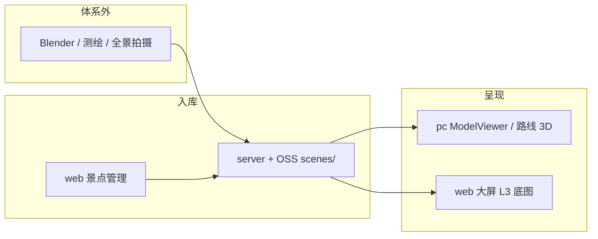

# 数字孪生与三维建模

> **定位**：兜行在旅游场景下的 **轻量旅行孪生**、**三维资产呈现** 与 **运营空间可视化** 专题方案。  
> **与数据中台区分**：ROADMAP **DT1～DT5** 指 **数据中台（Data Platform）**；本文件 **Digital Twin（数字孪生）** 指 F 线 **F0～F6**。  
> **关联**：详细设计 [§6.7](./详细设计文档.md#67-数字孪生与三维建模实施补充) · [§17.5](./详细设计文档.md#175-数字孪生与三维建模实施补充) · [数据中台 DT5](./数据中台.md#9-dt5-旅行运营大屏规划) · ROADMAP [阶段 F](./ROADMAP.md#阶段-farvr-数字孪生与三维建模可后置)

**文档版本**：1.1  
**更新日期**：2026-06-26  
**状态**：方案定稿；**代码未启动**，不阻塞 J1 / H9-3 / PC P5

---

## 1. 适用范围与产品定义

### 1.1 在兜行中的定义

旅游类产品不必做成智慧城市 **CIM 级** 全域孪生。兜行采用分层能力：

| 孪生层级 | 含义 | 典型场景 | 前端落点 |
|----------|------|----------|----------|
| **L1 路线孪生** | 规划路径、路网 polyline、实际打卡轨迹时空对照 | 路线 3D 回放；规划 vs 实走 | **`packages/pc`** |
| **L2 景点孪生** | 单 POI 全景、glTF 地标、讲解 | 出行前预览；沉浸导览 | **`packages/pc`** |
| **L3 城市孪生** | 城区三维底图 + 全站旅行分布叠加 | 运营投屏大屏 | **`packages/web`** `/screen/travel`（[DT5](./数据中台.md#9-dt5-旅行运营大屏规划)） |

**默认交付重心**：L1 → L2；L3 与 DT5 大屏合并规划，按需启用 3D 底图（Cesium）。

### 1.2 端策略（定稿）

| 端 | 3D / 孪生 | 说明 |
|----|-----------|------|
| **`packages/pc`（:5176）** | **做** | C 端电脑唯一 3D 消费端：路线 3D、模型、全景、个人足迹孪生 |
| **`packages/web`（:5173）** | **运营向** | 3D **资产入库/审核**；**旅行运营大屏**（全站分布，非个人孪生） |
| **`packages/mobile`** | **不做 3D** | 保持 2D `map` / Leaflet 等价能力；不投入 WebGL |

**不为 F0～F4 单独起第四套用户端应用**；不为第一阶段单独部署 `screen.yxtao.site`（大屏走路由 `/screen/travel` 全屏布局即可）。

### 1.3 三条产品能力对照

| 能力 | 数据粒度 | 是否「美术建模」 | 落点 |
|------|----------|------------------|------|
| **个人数字孪生** | 单用户、单路线 | 折线为程序化几何；POI 可挂模型 | **pc** F0/F4 |
| **三维建模（资产）** | 单景点静态 GLB/全景 | **是**（体系外生产 → 入库） | **web + server** F2；**pc** 播放 |
| **全站旅行分布大屏** | 全站聚合、脱敏 | 否（2D 为主）；L3 可叠 tileset | **web DT5** |

---

## 2. 三维建模：三线分工

**三维建模**在兜行内拆为三条链，勿与「孪生运行时」混为一谈：



| 链条 | 含义 | 落点 | 阶段 |
|------|------|------|------|
| **① 内容生产** | 产出 glTF、全景、3D Tiles | **体系外**（Blender、Insta360、倾斜摄影供应商） | — |
| **② 资产管线** | 上传、绑 URL、审核、`scene_type` | **server** + **web** `attractions/manage` | F0/F2 |
| **③ 场景呈现** | Three.js 加载、路线叠加 | **pc**（用户）；**web** 小窗预览；**DT5** 大屏底图 | F0～F4 / L3 |

**不在兜行内做在线建模编辑器**（非 BIM/CAD 平台）。内容团队日更模型时，远期可增 `packages/scene-studio`（批处理/版本），仍非 Blender 替代品。

### 2.1 内容生产（体系外）

| 方式 | 产出 | 适用 |
|------|------|------|
| 360° 全景 | `panorama_url` | F1，非几何建模 |
| 地标简模 | glTF/GLB | F2，Blender / SketchUp 外包 |
| 倾斜摄影 | 3D Tiles | L3 / DT5 二期，测绘交付 |
| 程序化几何 | 3D 折线、拉伸体 | F0，代码生成 |

### 2.2 资产管线（web + server）

对齐景点封面 **A2+++** 模式：

- OSS 前缀：`scenes/{attractionId}/`（与 `attractions/` 封面并列）
- 管理端：扩展 `AttractionsManageView` — 绑 URL / 上传 GLB / 预览 / 上下架
- 服务端：体积校验、可选 Draco 压缩异步任务（F2+）
- API：`PUT /api/attractions/admin/:id/scene`

### 2.3 场景呈现（pc 主战场）

| 场景 | 组件（规划） | 路由 |
|------|--------------|------|
| 路线 3D 折线 | `RouteScene3DTab` | pc 路线详情 |
| glTF 地标 | `ModelViewer` | pc 景点/路线 POI |
| 全景 | `PanoramaViewer` | pc 景点详情 |
| 规划 vs 打卡 | `RouteTwinView` | pc F4 |
| 运营审核预览 | 轻量 `ModelViewer` 弹窗 | web 管理端 |

可选 **`packages/scene-viewer`**（F2 后）：`ModelViewer`、`PanoramaViewer`、`RoutePolyline3D` 供 pc / web / DT5 复用。

---

## 3. 架构落点（定稿）

```
packages/
├── shared/          # SceneType、RouteTwinPayload、AnalyticsGeo*（与 DT5 共享类型）
├── server/          # scene/twin API · analytics/geo/*（DT5）
├── pc/              # ★ 用户 3D/孪生（Three.js）
├── web/
│   ├── views/attractions/   # 场景资产绑定（F2）
│   ├── views/screen/        # ★ 旅行运营大屏 DT5（全屏布局）
│   └── layouts/ScreenLayout.vue
└── mobile/          # 仅 2D，不做 3D
```

| 问题 | 答案 |
|------|------|
| 用户 3D 放哪？ | **pc**，不放 web 管理端 |
| 模型谁管？ | **web** 景点管理 + **server** OSS |
| 全站分布大屏放哪？ | **web** `/screen/travel`（[DT5](./数据中台.md#9-dt5-旅行运营大屏规划)） |
| 何时另起 `packages/screen`？ | 展厅 24h 轮播、与后台账号隔离、或 Cesium 包体拖垮 `dev:web` 时 |

---

## 4. 技术体系

### 4.1 已有（底座）

| 体系 | 技术 | 用途 |
|------|------|------|
| Monorepo | pnpm、TypeScript、`@douxing/shared` | 跨端类型、`RoutePath` |
| Web 前端 | Vue 3、Vite、Pinia（**pc** / **web**） | C 端与管理端 |
| 管理 UI | Ant Design Vue 4、ECharts 6 | DT1 看板 |
| 后端 | Express 5、Drizzle、MySQL 8 | API、聚合 |
| 缓存 | Redis | polyline、地理编码 |
| 存储 | OSS / `uploads` | 封面；远期 `scenes/` |
| 2D GIS | Leaflet、高德瓦片、GCJ-02 | 打卡地图 |
| LBS | 高德 Web 服务 | 编码、direction、POI |
| i18n | vue-i18n、ApiMessageKey | G9 |

### 4.2 待引入（F 线 / DT5）

| 体系 | 技术 | 用途 | 落点 |
|------|------|------|------|
| WebGL 渲染 | **Three.js** | glTF、全景、路线 3D 折线 | **pc**；web 预览 |
| 3D 资产格式 | **glTF 2.0 / GLB** | 地标模型 | OSS + F2 |
| 全景 | 等距柱状图 + Three | F1 | pc |
| 可选全球 3D | **CesiumJS**、**3D Tiles** | L3 城市底图、大屏地球 | web DT5 二期 |
| 地图 3D 备选 | 高德 3D / Mapbox GL 3D | 城市鸟瞰 | 路径 B，与 Three 可并存 |
| 空间统计 BI | **ECharts Geo**、漏斗/桑基 | 省市区分布、用户路径漏斗 | web DT5 |
| 热力 | Leaflet.heat（或 ECharts heatmap） | 打卡密度 | web DT5 |
| 压缩 | Draco / meshopt（可选） | GLB 体积 | server 异步 |

### 4.3 体系外 / 远期

| 技术 | 关联 |
|------|------|
| Blender、SketchUp、Metashape | 模型生产 |
| ARKit / ARCore | F6 AR 导航 |
| ClickHouse | DT4 OLAP |
| PostGIS、Kafka、Neo4j | 详细设计远期，当前未用 |

### 4.4 明确不做（当前阶段）

- 移动端 / 小程序 **WebGL 3D**
- 自研 **在线建模器**
- **Unity / Unreal** 客户端（除远期原生 AR）
- 工业孪生栈（IoT、BIM、OPC-UA）
- 为 DT5 / F0 单独第四套 **独立域名前端**（一期在 web 内扩展）

### 4.5 按模块对照

| 模块 | 主要技术体系 |
|------|----------------|
| PC 个人 3D / 孪生 | Vue3 + **Three.js** + WebGL + glTF + 高德坐标 + `RoutePath` |
| 三维建模入库 | **OSS** + Express + **web** + 体系外 Blender/全景/测绘 |
| 运营旅行大屏 DT5 | Vue3 + **ECharts** + **Leaflet 热力** + MySQL 聚合 +（可选 Cesium） |
| 2D 地图（现状） | Leaflet + 高德 + GCJ-02 |

---

## 5. 当前基础与缺口

### 5.1 已具备

| 能力 | 实现 |
|------|------|
| 景点坐标、路线路径 | `attractions`、`RoutePath`、`map-path` |
| 2D 路线动画 | `RouteMapPlayer`（pc） |
| 打卡聚合地图 | Leaflet（web/pc） |
| 城市 Top N | `GET /api/analytics/top-cities`（DT1） |
| 封面 OSS 模式 | A2+++，可复用到 `scenes/` |

### 5.2 缺口

| 缺口 | 阶段 |
|------|------|
| Three.js / Cesium 依赖 | F0 / DT5 二期 |
| `attractions` 场景字段 | F0 |
| `analytics/geo/*` 聚合 API | DT5 |
| `ScreenLayout` + `/screen/travel` | DT5 |
| glTF 管线、Draco | F2+ |

---

## 6. 数据与 API（规划）

### 6.1 `attractions` 扩展（F0）

```sql
model_3d_url      VARCHAR(512)
panorama_url      VARCHAR(512)
scene_type        VARCHAR(16)    -- none | panorama | model | tileset
elevation         DECIMAL(8,2)
scene_meta        JSON
```

### 6.2 孪生 / 场景 API（F 线）

| 方法 | 路径 | 说明 |
|------|------|------|
| GET | `/api/attractions/:id/scene` | 景点场景元数据（C 端） |
| GET | `/api/routes/:id/twin` | `map-path` + 打卡轨迹 |
| PUT | `/api/attractions/admin/:id/scene` | 管理端绑资产 |

### 6.3 地理分析 API（DT5，管理员）

| 方法 | 路径 | 说明 |
|------|------|------|
| GET | `/api/analytics/geo/distribution` | 省/市打卡量、网格热力（聚合） |
| GET | `/api/analytics/geo/flows` | 城际 OD Top N（可选） |
| GET | `/api/analytics/journey-funnel` | 全站用户路径漏斗 |

**隐私**：大屏仅返回聚合数据；小样本城市合并；禁止可识别个人的轨迹导出。

---

## 7. 与 DT5 运营大屏的关系

| 维度 | DT5 大屏 | F 线 3D/孪生 |
|------|----------|--------------|
| 观众 | 运营 / 决策 | C 端用户（pc） |
| 数据 | 全站聚合 | 单用户/单路线 |
| 主视觉 | ECharts 地图 + 漏斗（2D） | Three.js 场景 |
| 3D 建模作用 | L3 **底图**（tileset）；非建模工作台 | L2 **景点模型**消费 |
| 文档 | [数据中台.md §9](./数据中台.md#9-dt5-旅行运营大屏规划) | 本文 F0～F6 |

**推荐顺序**：DT5 **2D 大屏** 可先于 F2 美术模型；DT5 加 Cesium 与 F-L3 同步。

---

## 8. ROADMAP 阶段 F

| 步 | 名称 | 验收要点 |
|----|------|----------|
| **F0** | 3D 底座 + PC 路线 3D POC | 场景字段；scene/twin API；pc 3D Tab；无资产降级 2D |
| **F1** | VR 全景 | `panorama_url`；pc 全景播放器 |
| **F2** | 景点 3D 模型 | web 绑 GLB；pc `ModelViewer` |
| **F3** | 讲解（简化） | 语音+图文（pc） |
| **F4** | 足迹孪生 | 规划 vs 打卡 3D（pc） |
| **F5** | 数字藏品（可选） | §13.1 |
| **F6** | AR 实景导航（远期） | 原生 AR |

**推荐顺序**：`F0` → `F1` → `F2` → `F3` → `F4`。  
**触发时机**：J1 或 PC P5 后；与 **DT5** 可按运营需求并行（不同人力）。

---

## 9. 风险与约束

| 风险 | 应对 |
|------|------|
| 3D 内容成本 | 先全景（F1）后简模（F2）；TOP 景点优先 |
| 端策略 | **仅 pc 做 3D**；mobile 保持 2D |
| 大屏隐私 | 网格聚合、k-匿名 |
| 包体 | `scene-viewer` 异步加载；Cesium 仅大屏路由 |
| 测绘合规 | 倾斜摄影需资质 |

---

## 10. 验收自检

- [ ] zh-CN / en-US：3D 与 DT5 文案无硬编码
- [ ] API 错误随 `Accept-Language`
- [ ] glTF/全景 HTTPS；pc 无资产时降级 2D
- [ ] 管理端可审核/禁用场景资产
- [ ] DT5 仅 admin 可访问；数据为聚合结果

---

## 11. 相关文档

| 文档 | 用途 |
|------|------|
| [数据中台.md](./数据中台.md) | DT1～**DT5**、大屏 API |
| [ROADMAP.md](./ROADMAP.md) | F0～F6、DT5 步骤 |
| [详细设计文档.md §6.7 / §17.5](./详细设计文档.md#175-数字孪生与三维建模实施补充) | 实施摘要 |
| [amap-geocoding.md](./amap-geocoding.md) | 高德与 GCJ-02 |
| [下一步工作.md](./下一步工作.md) | 排期与触发条件 |

---

<p align="center"><sub>兜行产品技术部 · 数字孪生专题 v1.1 · 2026-06-10</sub></p>
