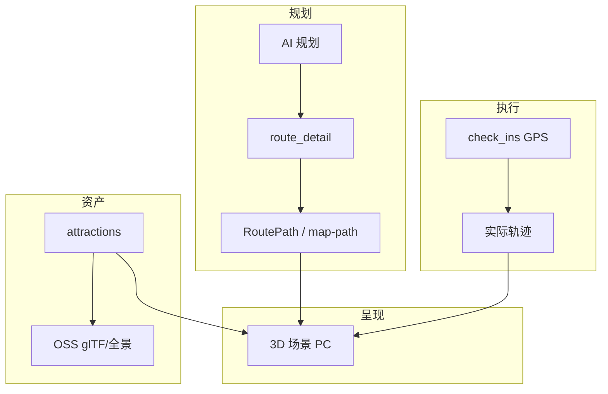

# 数字孪生与三维建模

> **定位**：兜行在旅游场景下的 **轻量旅行孪生** 与 **三维呈现** 专题方案。  
> **与数据中台区分**：ROADMAP 中的 **DT1～DT4** 指 **数据中台（Data Platform）**，与本文件的 **Digital Twin（数字孪生）** 无关。  
> **关联**：详细设计 [§6 AR/VR](./详细设计文档.md#6-arvr增强体验设计) · [§4.3 打卡地图](./详细设计文档.md#43-打卡地图系统) · ROADMAP [阶段 F](./ROADMAP.md#阶段-farvr-数字孪生与三维建模可后置)

**文档版本**：1.0  
**更新日期**：2026-06-10  
**状态**：已录入路线图；**代码未启动**，不阻塞模块 A 主链（J1 / H9-3 / PC P5）

---

## 1. 适用范围与产品定义

### 1.1 在兜行中的定义

旅游类产品不必做成智慧城市 **CIM 级** 全域孪生。兜行采用 **「个人 / 路线级旅行孪生」**：

| 孪生层级 | 含义 | 典型场景 |
|----------|------|----------|
| **L1 路线孪生** | AI 规划路径、高德路网 polyline、实际打卡轨迹在同一时空对照 | 路线详情 3D 回放；规划 vs 实走对比 |
| **L2 景点孪生** | 单 POI 的 360° 全景、glTF 地标模型、图文/语音讲解 | 出行前预览；景点页沉浸导览 |
| **L3 城市孪生** | 城区三维底图 + 实时人流/交通叠加 | 运营大屏；**远期、高成本** |

**默认交付重心**：L1 → L2；L3 按需。

### 1.2 与核心价值的关系

- 对齐详细设计 **「沉浸化」** 价值主张与 §4.3「旅行地图 · 3D 地图渲染 + 截图分享」。
- 与 **手帐 / 炫耀海报 / 打卡地图** 形成传播闭环：2D 地图已落地（Leaflet、UniApp `map`），3D 为 **PC / H5 差异化增强**。
- **不阻塞** J1 旅程相册、S 线 RBAC、M 线发单接单。

---

## 2. 当前基础（2026-06-10）

### 2.1 已具备

| 能力 | 实现 | 代码 / API |
|------|------|------------|
| 景点坐标 | `attractions.latitude/longitude`（GCJ-02） | Drizzle schema |
| 路线路径模型 | `RoutePath`（POI + 分段 polyline） | `@douxing/shared/route-path.ts` |
| 路网增强 | 高德 direction → `GET /api/routes/:id/map-path` | `route-map-path.service.ts` |
| 2D 路线动画 | `RouteMapPlayer` | mobile / pc |
| 打卡聚合地图 | Leaflet + 高德瓦片 | web / pc `/checkins/map` |
| 地理编码 / 封面 | 高德 Web 服务 | [amap-geocoding.md](./amap-geocoding.md) |
| 对象存储规划 | 景点封面 OSS（A2+++）；J 线 `photos/` | G2 / [旅行照片存储系统.md](./旅行照片存储系统.md) |

### 2.2 缺口

| 缺口 | 说明 |
|------|------|
| 3D 引擎 | 依赖中无 Three.js / Cesium / Mapbox GL 3D |
| 3D 资产字段 | `attractions` 无 `model3dUrl`、`panoramaUrl`、`sceneType` |
| 3D 资产管线 | 无 glTF 转换、LOD、CDN 分发流程 |
| 小程序 WebGL | UniApp 微信小程序包体与性能受限，**3D 宜 PC-first** |

---

## 3. 技术路径

### 3.1 路径 A：轻量 Web3D（推荐首选）

| 能力 | 技术选型 | 接入端 |
|------|----------|--------|
| 地形 / 倾斜摄影 | CesiumJS 或 Mapbox GL 3D | PC（`:5176`） |
| 地标模型 | glTF/GLB + Three.js | PC / H5 |
| 全景 | 等距柱状投影 + Three.js 全景播放器 | PC / H5；小程序可用 web-view 或降级 H5 |
| 路线叠加 | 复用 `RoutePath.segments[].points` → 3D 折线 | 共享 `route-path.ts` |

### 3.2 路径 B：地图厂商 3D

- **高德 3D 地图**：与现有 `AMAP_WEB_KEY`、GCJ-02 坐标体系统一；定制性弱，适合城市鸟瞰。
- 与路径 A **可并存**：厂商底图 + 自研 POI 模型叠加。

### 3.3 路径 C：完整孪生平台（远期）

- 倾斜摄影 / BIM / 人工建模内容生产
- 独立 **3D 资产微服务**（转换、审核、版本）
- 实时数据总线（天气、客流、班次 — 部分可与 H9 Enricher 打通）
- AR 实景导航（ARKit/ARCore，§6.3）

**主要瓶颈**为 **3D 内容生产成本**，而非 Monorepo 架构。

---

## 4. 数据与 API 设计（规划）

### 4.1 `attractions` 扩展字段（F0）

```sql
-- 规划字段（F0 迁移时落地）
model_3d_url      VARCHAR(512)   -- glTF/GLB，OSS HTTPS
panorama_url      VARCHAR(512)   -- 360° 全景图或切片 manifest
scene_type        VARCHAR(16)    -- none | panorama | model | tileset
elevation         DECIMAL(8,2)   -- 可选，米
scene_meta        JSON           -- 相机默认位、包围盒、授权信息
```

| `scene_type` | 说明 |
|--------------|------|
| `none` | 仅 2D 地图（默认） |
| `panorama` | 全景预览（F1） |
| `model` | glTF 地标（F2） |
| `tileset` | 3D Tiles / 倾斜摄影（远期 L3） |

### 4.2 共享类型（`@douxing/shared`）

规划新增（F0）：

- `AttractionSceneMeta` — 场景元数据
- `RouteTwinPayload` — 规划 `RoutePath` + 可选 `check_ins` 轨迹 + 时间轴
- `SceneType` 常量

### 4.3 API（规划）

| 方法 | 路径 | 说明 | 阶段 |
|------|------|------|------|
| GET | `/api/attractions/:id/scene` | 景点 3D/全景资源元数据 | F0 |
| GET | `/api/routes/:id/twin` | 路线孪生载荷（`map-path` + 打卡轨迹） | F0 / F4 |
| PUT | `/api/attractions/admin/:id/scene` | 管理端绑定资产 URL | F0 |

**约定**：

- 响应走 `ApiMessageKey` + `localeMiddleware`（G9）。
- 大文件仅存 OSS URL，API 不直传 glTF 二进制。
- 坐标系：**GCJ-02** 与高德一致；若引入 WGS84 引擎需在服务端或前端做转换。

### 4.4 包结构（规划）

```
packages/
├── shared/     # SceneType、RouteTwinPayload、i18n keys
├── server/     # scene 字段迁移 + twin/scene 路由
├── pc/         # 首选：Three.js / Cesium 试验（路线详情 3D Tab）
├── web/        # 管理端：3D 资产审核与绑定
└── mobile/     # 2D 为主；全景 F1 可用 web-view 或跳转 H5
```

可选：后续抽 `packages/scene-viewer` 供 pc / web 复用。

---

## 5. 产品场景与优先级

| 场景 | 用户价值 | 可行性 | ROADMAP | 端策略 |
|------|----------|--------|---------|--------|
| 路线 3D 回放 | 高；与手帐传播协同 | 高 | **F0** | PC 先做 |
| 景点 360° 全景 | 出行前决策 | 中高 | **F1** | PC / H5 |
| 地标 glTF 模型 | 沉浸导览 | 中（内容贵） | **F2** | PC / H5 |
| 规划 vs 打卡孪生 | 社交炫耀、复盘 | 中 | **F4** | PC；2D 海报可继续用 |
| AR 讲解 | 现场体验 | 中 | **F3** | 移动端语音+图文先行 |
| AR 实景导航 | 高但重 | 低 | **F6** 远期 | 原生 AR |
| 城市级运营孪生 | 运营向 | 低 | 按需 | Web 管理端大屏 |

---

## 6. 与现有模块衔接



| 模块 | 衔接方式 |
|------|----------|
| H9 Enricher | 班次/开放时段 → 孪生时间轴标注（F4+） |
| J 旅程相册 | 打卡照片 → 3D POI 锚点贴图（F4+） |
| H2 海报 | 2D 足迹地图已交付；3D 截图可作为新模板素材（远期） |
| G2 OSS | `attractions/` 封面已有；扩展 `scenes/{id}/` 前缀 |
| G9 i18n | 3D 页文案、场景加载错误须 `zh-CN` / `en-US` |

---

## 7. 风险与约束

| 风险 | 应对 |
|------|------|
| 3D 内容匮乏 | 先全景图过渡；TOP 景点采购/拍摄；众包 UGC 审核 |
| 小程序 WebGL | 3D 功能 PC-first；小程序保留 2D `map` |
| 坐标系偏差 | 统一 GCJ-02；文档注明转换规则 |
| 性能与包体 | glTF LOD、按需加载、路由级 code-split |
| 测绘合规 | 无人机/倾斜摄影需景区与测绘资质 |
| 主链排期 | F 线整体后置；F0 POC 可在 P5 后单独立项 |

---

## 8. ROADMAP 阶段 F 对照

完整步骤表见 [ROADMAP § 阶段 F](./ROADMAP.md#阶段-farvr-数字孪生与三维建模可后置)。

| 步 | 名称 | 验收要点 |
|----|------|----------|
| **F0** | 3D 底座 + 路线 3D 预览 POC | `attractions` 场景字段；`GET /scene`；PC 路线详情 3D Tab 可播 polyline |
| **F1** | VR 全景预览 | 景点挂 `panorama_url`；详情页可全景浏览 |
| **F2** | 景点 3D 模型 | glTF 播放器；管理端可绑定模型 |
| **F3** | AR 讲解（简化） | 语音 + 图文；不强制 AR 相机 |
| **F4** | 旅行足迹孪生地图 | 规划路径 vs 打卡轨迹 3D 叠加 |
| **F5** | 数字藏品（可选） | §13.1 链下或联盟链 |
| **F6** | AR 实景导航（远期） | §6.3；原生 ARKit/ARCore |

**推荐顺序**：`F0` → `F1` → `F2` → `F3` → `F4`；`F5` / `F6` 视商务与资源按需。

**触发时机**：J1 或 PC P5 稳定后；可与 DT3 客户端埋点并行（不同人力）。

---

## 9. 验收自检（F 线通用）

- [ ] zh-CN / en-US 切换后 3D 相关 UI 无硬编码
- [ ] API 错误随 `Accept-Language` 返回 `ApiMessageKey` 译文
- [ ] glTF / 全景 URL 为 HTTPS；小程序合法域名已配置（若 H5 外链）
- [ ] 无 3D 资产时优雅降级为 2D `RouteMapPlayer` / Leaflet
- [ ] 管理端可审核/禁用不合规 3D 资产

---

## 10. 相关文档

| 文档 | 用途 |
|------|------|
| [ROADMAP.md](./ROADMAP.md) | F0～F6 步骤状态 |
| [详细设计文档.md §6](./详细设计文档.md#6-arvr增强体验设计) | AR/VR 原版架构 |
| [详细设计文档.md §17.5](./详细设计文档.md#175-数字孪生与三维建模实施补充) | 实施层摘要 |
| [amap-geocoding.md](./amap-geocoding.md) | 高德坐标与 POI |
| [旅行照片存储系统.md](./旅行照片存储系统.md) | J 线相册与 OSS |
| [下一步工作.md](./下一步工作.md) | 当前不排 F 线；触发条件说明 |

---

<p align="center"><sub>兜行产品技术部 · 数字孪生专题 v1.0 · 2026-06-10</sub></p>
