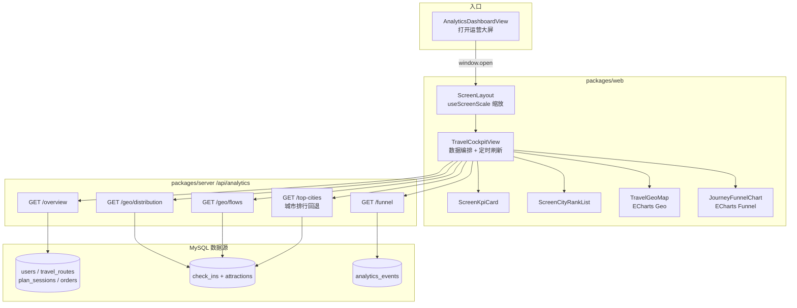
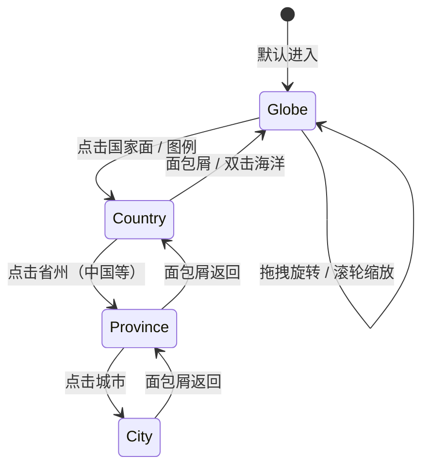

# 旅行运营大屏（DT5）实现说明与演进方案

> **定位**：兜行 Web 管理端 **全站旅行运营驾驶舱**，用于投屏展示聚合指标、空间分布与用户旅程漏斗。  
> **关联**：[数据中台.md §9](./数据中台.md#9-dt5-旅行运营大屏规划) · [数字孪生与三维建模.md §7](./数字孪生与三维建模.md#7-与-dt5-运营大屏的关系) · ROADMAP **DT5**

**文档版本**：1.1  
**更新日期**：2026-06-26  
**状态**：一期已落地（2D 地图 + 漏斗 + KPI）；全球 3D 地球 + 层级下钻 + 动向飞线为 **二期规划**

---

## 1. 产品概述

| 项 | 说明 |
|----|------|
| 访问路径 | `http://<web-host>/screen/travel` |
| 入口 | 管理端「数据分析」页 →「打开运营大屏」（**新标签页**打开） |
| 权限 | 管理员 JWT + `data:analytics:view` |
| 布局 | `ScreenLayout` 全屏、无侧栏；设计稿 **1920×1080**，等比缩放适配任意分辨率 |
| 语言 | zh-CN / en-US（文案走 `packages/web` i18n + API `Accept-Language`） |
| 刷新 | 页面挂载后每 **60 秒** 轮询一次全部接口；时钟每秒更新 |

**与 F 线（个人数字孪生）区分**：大屏只做 **全站脱敏聚合**；单用户路线 3D 回放属于 `packages/pc` F 线，不在此页展示。

---

## 2. 架构总览



---

## 3. 前端实现

### 3.1 路由与布局

| 文件 | 职责 |
|------|------|
| `packages/web/src/router/index.ts` | 路由 `/screen/travel`，`meta.fullscreen`、`perm: data:analytics:view` |
| `packages/web/src/layouts/ScreenLayout.vue` | 暗色全屏容器，`router-view` 承载子页 |
| `packages/web/src/composables/useScreenScale.ts` | 按视口对 1920×1080 画布做 `scale` + 居中偏移 |

`ScreenLayout` 与 `BasicLayout`（带侧栏的管理端壳）**平级**，大屏不经过管理端侧栏与 Tab。

### 3.2 主页面 `TravelCockpitView.vue`

**布局结构**（自上而下）：

1. **页头**：标题 + 实时时钟 +「近 30 天」范围标签  
2. **KPI 行**（4 列）：用户总数、路线总数、打卡总数、规划会话  
3. **主内容三栏**（320px | flex | 360px）  
   - 左：热门打卡城市排行  
   - 中：全国旅行分布地图  
   - 右上：用户旅程漏斗  
   - 右下：城际流动 Top 6 列表  

**数据加载**（`loadData`）：

```text
Promise.all([
  fetchAnalyticsOverview(),           // 全站 KPI
  fetchAnalyticsGeoDistribution(30),  // 省/市/热力点
  fetchAnalyticsGeoFlows(30, 20),     // 城际 OD
  fetchAnalyticsFunnel(30),           // 旅程漏斗
])
```

**前端回退逻辑**（冷启动 / 时间窗无数据时）：

- 若 `geo.cities` 为空 → 额外请求 `fetchTopCheckinCities(10)` 填充左侧城市排行（**全量**已通过打卡，不限 30 天）
- 地图组件在无省份数据时仍渲染中国底图，中央叠加「暂无数据」提示

### 3.3 可视化组件

| 组件 | 技术 | 输入数据 |
|------|------|----------|
| `ScreenPanel` | 纯 CSS 科技风面板 | 标题 + 默认插槽 |
| `ScreenKpiCard` | 数字卡片 | label / value / sub |
| `ScreenCityRankList` | 条形排行列表 | `AnalyticsCityGeoStat[]` |
| `TravelGeoMap` | ECharts Map + Lines + EffectScatter | 省着色、城市散点、城际飞线 |
| `JourneyFunnelChart` | ECharts Funnel | `AnalyticsFunnelStep[]` |

**地图 GeoJSON**：

- 优先加载本地静态资源：`packages/web/public/geo/china.json`（DataV 100000_full）
- 失败时回退阿里云 CDN：`https://geo.datav.aliyun.com/areas_v3/bound/100000_full.json`

**ECharts 图层说明**（`TravelGeoMap`）：

| series | 类型 | 含义 |
|--------|------|------|
| province | map | 省级打卡量着色（visualMap） |
| flow | lines + effect | 城际 OD 飞线（最多 15 条） |
| city | effectScatter | 热门城市涟漪点（最多 12 个，需有效经纬度） |

### 3.4 API 封装

`packages/web/src/api/analytics.ts` 统一通过 `http`（带 JWT、`Accept-Language`）访问 `/api/analytics/*`。

---

## 4. 后端实现

### 4.1 路由与鉴权

文件：`packages/server/src/routes/analytics.ts`

| 方法 | 路径 | 大屏是否使用 | 说明 |
|------|------|--------------|------|
| GET | `/overview` | ✅ | 核心 KPI 总量 + 近 7 日新增 |
| GET | `/geo/distribution?days=30` | ✅ | 省/市分布 + 热力网格点 |
| GET | `/geo/flows?days=30&limit=20` | ✅ | 城际流动 Top N |
| GET | `/funnel?days=30` | ✅ | 旅程漏斗 6 步 |
| GET | `/top-cities?limit=10` | ✅（回退） | 全量城市排行 |
| GET | `/trends` | ❌ | 管理端折线图专用 |

所有大屏接口均需 `authMiddleware` + `data:analytics:view`。

### 4.2 地理分布 `analytics-geo.service.ts`

**数据范围**：

- 默认统计 **近 N 天**（1～90，大屏传 30）**已通过**打卡（`check_ins.status = APPROVED`）
- 若时间窗内 **省、市均为空** → **自动回退全量**已通过打卡（便于演示与冷启动）

**坐标来源**（优先级）：

1. 打卡 `location.latitude / longitude`（JSON 字段）  
2. 关联景点 `attractions.latitude / longitude`（`LEFT JOIN`）

**省级聚合**：

- 按 `city_code` → `findCityRegionByCode` → 省份 slug  
- 通过 `getProvinceGeoMapName` 转为 ECharts GeoJSON 面名称（如 `浙江` → `浙江省`）  
- 未知省份归入 `other`，**不出现在地图着色中**

**热力点 `heatPoints`**：

- 对单条打卡坐标做 **0.1° 网格**聚合，取权重 Top 200  
- **当前大屏前端尚未消费**，仅 API 返回（见 §6 缺口）

**城际流动 `getAnalyticsGeoFlows`**：

1. 取同一用户按 `checked_at` 排序的打卡序列  
2. 相邻且 `city_code` 不同 → 计为一次「从 A 到 B」  
3. 仅保留出现次数 **≥ 2** 的 OD 对（`ANALYTICS_MIN_FLOW_COUNT`）  
4. 起终点需在城市坐标表中有有效经纬度  

### 4.3 漏斗 `getAnalyticsFunnel`

基于 `analytics_events` 表，对 DT3 埋点做 **去重计数**（按 user/session，实现见 `countDistinctFunnelActors`）。

六步顺序（`@douxing/shared` `ANALYTICS_FUNNEL_STEPS`）：

| stepKey | 事件名 | 业务含义 |
|---------|--------|----------|
| planPage | `plan.page_view` | 进入规划页 |
| planSubmit | `plan.prompt_submit` | 提交规划需求 |
| planSession | `plan.session_created` | 创建规划会话 |
| routeSaved | `plan.route_saved` | 保存路线 |
| routePublish | `route.publish` | 发布路线 |
| checkin | `checkin.create` | 完成打卡 |

### 4.4 概览 KPI `getAnalyticsOverview`

| 指标 | 口径 |
|------|------|
| 用户/路线/订单/打卡/规划会话 | **全表总量** |
| 子指标 | 如今日新增、近 7 日新增、公开路线数、已通过打卡数等 |

> **注意**：大屏 KPI 为 **全站累计**，地图/漏斗/流动为 **近 30 天**（地理分布有空时回退全量）。这是当前「有总数但地图空」的常见原因，见 §5.3。

### 4.5 类型定义

共享类型位于 `packages/shared/src/types.ts`：

- `AnalyticsOverview`
- `AnalyticsGeoDistribution` / `AnalyticsProvinceGeoStat` / `AnalyticsCityGeoStat` / `AnalyticsHeatPoint`
- `AnalyticsGeoFlow`
- `AnalyticsFunnelStep`

### 4.6 验收脚本

```bash
pnpm --filter @douxing/server dt5:analytics-cases
```

文件：`packages/server/src/scripts/dt5-analytics-cases.ts`

---

## 5. 数据口径与常见问题

### 5.1 各区块时间范围对照

| 区块 | 时间范围 | 备注 |
|------|----------|------|
| KPI 主数字 | 全站累计 | 与「近 30 天」标签无直接对应 |
| KPI 副文案 | 近 7 日 / 累计子项 | 如「近 7 日新增」 |
| 地图 / 漏斗 / 城际流动 | 近 30 天 | 页头展示 `近 {days} 天` |
| 地理分布（回退） | 全量 | 仅当 30 天窗口无省/市数据时 |
| 城市排行（回退） | 全量 | 仅当 30 天窗口无城市坐标数据时 |

### 5.2 地图有底图但无着色

可能原因：

- 近 30 天无已通过打卡，且全量回退后仍无数据  
- `city_code` 无法映射到国内省份（落入 `other`）  
- 打卡与景点均无经纬度 → 有省级统计但无城市散点  

### 5.3 城际流动长期为空

需同时满足：同一用户、不同城市、按时间相邻、该 OD 出现 ≥ 2 次、两端城市有坐标。早期用户量少时为空属正常。

### 5.4 漏斗有数但转化偏低

依赖 mobile/pc 客户端埋点（`packages/mobile|pc/src/utils/analytics.ts`）。未埋点或离线场景会导致漏斗偏小。

---

## 6. 当前缺口（相对规划）

对照 [数据中台 §9.1](./数据中台.md#91-大屏展示内容)：

| 规划项 | 状态 | 说明 |
|--------|------|------|
| 核心指标卡 | ✅ 部分 | 缺订单 KPI、无轮播 |
| 全国旅行分布 | ✅ | ECharts 省级着色 + 城市点 + 飞线 |
| 打卡热力 | ⚠️ API 有 / UI 无 | `heatPoints` 未接入 Leaflet / ECharts heatmap |
| 用户路径漏斗 | ✅ | ECharts 漏斗（非桑基） |
| 城际 OD | ✅ 部分 | 列表 + 飞线；阈值偏高 |
| 3D 底图 | ❌ | Cesium / 3D Tiles 未做 |
| 时间范围切换 | ❌ | 固定 30 天 |
| 实时推送 | ❌ | 仅 60s 轮询 |
| 数据范围标注 | ⚠️ | 回退全量时 UI 未显式提示 |
| 独立投屏域名 | ❌ | 复用 web 路由，未拆 `packages/screen` |

---

## 7. 后续优化方案

### 7.1 短期（1～2 迭代，低成本高收益）

| 优先级 | 项 | 方案 |
|--------|-----|------|
| P0 | **统一时间口径展示** | API 增加 `scope: 'window' \| 'allTime'`；页头或各面板角标标明「近 30 天 / 全量回退」 |
| P0 | **打通热力图层** | 用 ECharts `heatmap` 或 `Leaflet.heat` 消费 `heatPoints`，叠加在地图或独立小窗 |
| P1 | **可配置时间窗** | 页头 Segmented：7 / 30 / 90 天，联动全部 `days` 参数 |
| P1 | **KPI 与看板对齐** | 增加订单总量；可选展示「近 30 日新增」主数字，与地图口径一致 |
| P1 | **城际流动降阈值** | 环境变量或配置：`ANALYTICS_MIN_FLOW_COUNT` 生产=2、演示=1 |
| P2 | **加载与错误态** | 全页 `a-spin` / 骨架屏；接口失败分区降级，避免整页空白 |
| P2 | **城市坐标兜底** | shared 维护省级首府/地级市中心坐标表，`city_code` 无 GPS 时用于散点与飞线 |

### 7.2 中期（体验与性能）

| 项 | 方案 |
|----|------|
| **预聚合** | 新建 `analytics_geo_daily`（省/市/网格按日汇总），大屏读汇总表；复用 DT2 `pnpm analytics:rollup` 调度体系 |
| **桑基图** | 漏斗旁增加 Sankey：规划意图 → 城市 → 打卡，需后端按 `properties` 聚合 |
| **趋势迷你图** | KPI 卡片底部嵌入 sparkline（复用 `/trends` + DT2 日汇总表） |
| **数字翻牌动画** | `requestAnimationFrame` 或 `vue-countup` 增强投屏观感 |
| **SSE / WebSocket** | 今日实时指标推送（新注册用户、新打卡），减少 60s 延迟 |
| **投屏模式** | URL `?kiosk=1` 隐藏浏览器 UI 提示；`Fullscreen API` 一键全屏 |
| **缓存** | 服务端 `Cache-Control` 或 Redis 60s；GeoJSON 长期本地缓存 |

### 7.3 长期（数据量与展厅级）

| 项 | 方案 |
|----|------|
| **DT4 ClickHouse** | 漏斗、OD、热力迁移 OLAP；接口形状不变 |
| **全球 3D 地球** | 见 **§13**：Cesium 地球 + 国家/城市下钻 + 动向飞线动画 |
| **Cesium L3 底图** | 与 F 线城市 tileset 共用资产；下钻至城市级可叠 3D Tiles |
| **独立 `packages/screen`** | 展厅常亮、无管理端依赖；只读 Token + 公网 CDN |
| **多屏联动** | 与 §13 下钻层级统一：地球 → 国家 → 省/州 → 市 |
| **告警条** | 打卡审核积压、规划失败率、支付异常等运营红线 |

---

## 8. 可补充的展示元素

### 8.1 业务指标类

| 元素 | 数据来源 | 价值 |
|------|----------|------|
| 今日实时动态 | `users` / `check_ins` / `plan_sessions` 当日增量 | 投屏「活力感」 |
| 会员转化 | `orders` + 会员表 | 商业闭环监控 |
| 路线发布率 | `travel_routes.is_public` / 总量 | 内容生态健康度 |
| 打卡通过率 | 审核状态分布 | 运营审核负载 |
| AI 规划成功率 | `plan_sessions` 状态 / 失败原因聚合 | 产品质量 |
| 热门景点 Top | `check_ins.attraction_id` 聚合 | 与地图点位联动 |
| 兴趣标签云 | 用户 `interest_tags` | 用户画像 |

### 8.2 空间可视化类

| 元素 | 技术手段 |
|------|----------|
| 打卡热力图 | Leaflet.heat / ECharts heatmap（`heatPoints` 已就绪） |
| 路线密度弧 | 公开路线起终点 OD，ECharts lines |
| 时间轴回放 | 按日切换 `checked_at`，Timeline 控件 |
| 3D 城市夜景 | CesiumJS + 3D Tiles（F 线资产） |
| 粒子背景 | WebGL/CSS 轻量动效，增强大屏氛围 |

### 8.3 行为分析类

| 元素 | 技术手段 |
|------|----------|
| 桑基图 | ECharts Sankey：渠道 → 规划 → 打卡 |
| 留存曲线 |  cohort 分析（DT4 更合适） |
| 端占比 | `analytics_events.source` 饼图（mobile / pc） |
| 分享裂变 | `share.route` 事件计数 |
| 漏斗下钻 | 点击漏斗步弹出该步 Top 城市 / 失败原因 |

### 8.4 运营与系统类

| 元素 | 说明 |
|------|------|
| 公告滚动条 | 复用系统公告，展厅欢迎语 |
| 数据更新时间 | 展示 `geo.generatedAt` |
| 水印 / 脱敏声明 | 「内部数据，禁止拍照外传」 |
| 多语言一键切换 | 复用 `useLocale`，投屏国际化会议 |

---

## 9. 推荐技术栈扩展

| 场景 | 推荐 | 备注 |
|------|------|------|
| 2D 地图增强 | ECharts Geo + GeoJSON 分省下钻 | 已用；可扩展市县边界 |
| 热力 | `leaflet` + `leaflet.heat` | web 已依赖 leaflet |
| 3D 地球 | **CesiumJS**（推荐） | 全球弧面飞线、拾取下钻；见 **§13** |
| 3D 地球（轻量备选） | ECharts GL `globe` | 包体小，下钻与贴地飞线能力弱于 Cesium |
| 实时 | SSE（Express）/ Socket.io | 先做今日计数即可 |
| 预聚合 | MySQL 汇总表 + cron | 延续 DT2 模式 |
| 海量分析 | ClickHouse | DT4 |
| 埋点增强 | 现有 `analytics_events` + shared 白名单 | 扩事件需同步 mobile/pc |
| 投屏适配 | `useScreenScale` + CSS 变量主题 | 可抽 `packages/screen-theme` |

---

## 13. 全球 3D 地球与动向飞线（二期规划）

> **目标**：在保持当前大屏「深蓝科技风」前提下，支持 **3D 地球旋转浏览**、**点击国家/城市逐级下钻**、**人员动向弧面飞线**（参考金线 + 光点拖尾动画，从出发地射向目的地）。  
> **与一期关系**：一期 `TravelGeoMap`（ECharts 2D 中国图）保留为 **国内下钻终点** 与 **WebGL 不可用时的降级**；全球视图用 Cesium 新组件 **`TravelGlobeMap`**。

### 13.1 交互与层级



| 层级 | 视图 | 数据粒度 | 主要图层 |
|------|------|----------|----------|
| **L0 全球** | Cesium 3D 地球 | 国家级打卡量、跨国/跨城 OD | 国家着色、弧面飞线、枢纽光点 |
| **L1 国家** | `flyTo` 后切 2D/3D 国界图 | 省/州级 | 中国复用 ECharts `china.json`；海外用 ISO 国界 GeoJSON |
| **L2 省州** | 平面分区图 | 地级市 | `cn-division` 省级 GeoJSON 按需加载 |
| **L3 城市** | 平面或倾斜视角 | POI / 网格热力 | `heatPoints`、市内短距飞线 |

**面包屑示例**：`地球 > 中国 > 浙江省 > 杭州市`（i18n 键 `screen.travel.breadcrumb.*`）

**投屏手势**：单指/鼠标拖拽旋转地球；滚轮缩放；点击拾取；**禁止**依赖右键平移（展厅触摸友好）。

### 13.2 技术选型

| 方案 | 适用 | 优点 | 缺点 |
|------|------|------|------|
| **CesiumJS**（推荐） | L0 地球 + 弧面飞线 + 拾取下钻 | 成熟的大圆弧 `Polyline`、贴地/悬空弧、`ScreenSpaceEventHandler` 拾取、`flyTo` 相机动画 | 包体 ~2MB+，需按需异步加载 |
| ECharts GL `globe` | 仅全球概览、OD 较少 | 与现有 ECharts 栈一致 | 下钻需切组件；弧面飞线表现力弱于 Cesium |
| Three.js 自研地球 | 完全定制 | 与 pc F 线 Three 复用经验 | 开发与维护成本高 |

**推荐组合**：

```text
L0 全球     → CesiumJS（TravelGlobeMap.vue，路由级 dynamic import）
L1～L3 中国 → 现有 TravelGeoMap.vue + 省内 GeoJSON 分片
L1～L3 海外 → Cesium GeoJSON 面 + 同套飞线材质
降级        → 检测 WebGL / 内存失败时回退 TravelGeoMap 中国 2D
```

与 [数字孪生 §4](./数字孪生与三维建模.md#4-技术体系) 对齐：Cesium 依赖 **仅在大屏路由加载**，避免拖慢 `dev:web` 常规管理端。

### 13.3 视觉规范（延续当前系统风格）

一期 `TravelGeoMap` 已确立的 Token，二期 **原样复用** 于 Cesium 材质与 HTML 标注：

| Token | 色值 / 参数 | 用途 |
|-------|-------------|------|
| `areaBase` | `#0a1f35` | 无数据国家/省份面 |
| `areaEmphasis` | `#145a8a` | 悬停高亮 |
| `border` | `rgba(0, 196, 255, 0.35)` | 国界/省界 |
| `choroplethLow→High` | `#0a2a45` → `#146ba8` → `#29b6f6` → `#7ae582` | 打卡量着色（与 visualMap 一致） |
| `flowLine` | `#ffd666`，opacity `0.55`，width `1.5` | 静态弧底线 |
| `flowParticle` | `#ffffff` 光点 + `#ffd666` 箭头 | 沿弧运动粒子（参考示意图金线拖尾） |
| `hubGlow` | `#40e0ff`，`shadowBlur: 12` | 枢纽城市 / 出发密集点 |
| `label` | `#e6f7ff`，外发光 `rgba(64,224,255,0.65)` | 国家/城市名 |
| `panelBg` | `rgba(4, 16, 32, 0.92)` | 拾取弹层，与 tooltip 一致 |

**动向飞线动画参数**（与一期 ECharts `lines.effect` 对齐，便于肉眼一致）：

```typescript
// 建议抽取 packages/web/src/components/screen/screen-map-theme.ts
export const SCREEN_FLOW_EFFECT = {
  period: 4,           // 单程周期（秒）
  trailLength: 0.35,   // 拖尾占弧长比例
  symbol: 'arrow',     // 箭头尖
  symbolSize: 6,
  lineColor: '#ffd666',
  particleColor: '#ffffff',
  curveness: 0.25,     // 平面地图；球面改用大圆弧中点抬升高度
  arcHeightMeters: 120_000, // Cesium：弧顶离地高度（全球视图）
} as const;
```

**Cesium 实现要点**：

1. **弧线路径**：起终点经纬度 → `EllipsoidGeodesic` 插值 → 中点 `cartographic.height += arcHeight` → `SampledPositionProperty` 或静态 positions。  
2. **底线**：`polyline.material = new PolylineGlowMaterialProperty({ glowPower: 0.15, color })`。  
3. **动效箭头**：`PolylineTrailMaterialProperty` 或自定义 `Material`（`time` uniform 驱动纹理偏移）；多条 OD 线 `period` 加随机相位避免同步闪烁。  
4. **枢纽点**：`PointGraphics` + `pixelSize` 脉动（`CallbackProperty` 正弦缩放）；高流量城市叠加 `Billboard` 文字。  
5. **国家面**：`GeoJsonDataSource` 加载 Natural Earth 110m 国界；`fill` 按打卡量插值上色，`outline` 用 `border` 色。

### 13.4 动向数据与 API 扩展

一期 `GET /analytics/geo/flows` 仅 **国内城际**、且阈值 ≥2。二期需扩展：

| 方法 | 路径 | 说明 |
|------|------|------|
| GET | `/analytics/geo/global/distribution?days=30` | 国家级 + 城市级聚合（含 `countryCode` ISO-3166） |
| GET | `/analytics/geo/global/flows?days=30&limit=50&minCount=1` | 全球 OD：`from`/`to` 含经纬度、国家码、城市码、名称、`count` |
| GET | `/analytics/geo/boundaries?level=country\|province\|city&code=` | 返回 GeoJSON URL 或内联（CDN 缓存） |
| GET | `/analytics/geo/distribution` | 保留；`countryCode=CN` 时行为与现网一致 |

**共享类型扩展**（`packages/shared`）：

```typescript
interface AnalyticsGlobalFlow {
  fromCountryCode: string;
  toCountryCode: string;
  fromCityCode?: string;
  toCityCode?: string;
  fromName: string;
  toName: string;
  fromLatitude: number;
  fromLongitude: number;
  toLatitude: number;
  toLongitude: number;
  count: number;
}

interface AnalyticsGeoScopeMeta {
  level: 'globe' | 'country' | 'province' | 'city';
  code: string;
  scopeDays: number;
  effectiveScope: 'window' | 'allTime';
}
```

**人员动向口径**（与一期城际逻辑递进）：

| 粒度 | 规则 |
|------|------|
| 国内城际 | 同用户 `check_ins` 按时间排序，相邻不同 `city_code` → +1 |
| 跨国 | 相邻不同 `country_code` → +1（需业务表扩展 `country_code`，默认 `CN`） |
| 路线 OD | 可选：`travel_routes` 起终点城市对计数（规划意向流） |
| 隐私 | 仅返回聚合 `count`；`minCount` 与小样本合并（如 &lt;5 归入「其他」） |

### 13.5 前端组件规划

```text
packages/web/src/components/screen/
├── screen-map-theme.ts          # 颜色 / 飞线动画 Token（ECharts + Cesium 共用）
├── TravelGeoMap.vue             # 一期：中国 2D（保留下钻终点）
├── TravelGlobeMap.vue           # 二期：Cesium 地球 + 弧面飞线
├── TravelMapBreadcrumb.vue      # 下钻面包屑
├── composables/
│   ├── useGlobeViewer.ts        # Cesium Viewer 生命周期、主题、销毁
│   ├── useGlobeDrilldown.ts     # 层级状态机、flyTo、GeoJSON 加载
│   └── useGlobeFlowLines.ts     # OD 实体创建、动画、节流更新
```

**`TravelCockpitView` 改造**：

```vue
<TravelGlobeMap
  v-if="mapMode === 'globe'"
  :countries="globalGeo?.countries ?? []"
  :flows="globalFlows"
  :level="drilldown.level"
  :focus-code="drilldown.code"
  @pick-country="onPickCountry"
  @pick-city="onPickCity"
/>
<TravelGeoMap v-else ... />
```

地图模式切换：`?map=globe|china` 或页内 Segmented；默认国内运营用 `china`，国际版/展厅用 `globe`。

### 13.6 分阶段实施

| 阶段 | 交付 | 依赖 |
|------|------|------|
| **II-A** | `screen-map-theme.ts`；增强一期 `TravelGeoMap` 飞线动效（更明显拖尾、枢纽呼吸点） | 无 |
| **II-B** | Cesium 地球 L0：旋转 + 国家着色 + 全球 OD 弧面飞线（仅中国数据也可先画国内弧） | `cesium` 按需依赖、`public/geo/world-countries.json` |
| **II-C** | 点击国家 `flyTo` + 面包屑；中国下钻切 `TravelGeoMap` 省级 | 省内 GeoJSON 分片 |
| **II-D** | 城市拾取、市内热力、`heatPoints` 叠加 | Leaflet heat 或 Cesium heatmap primitive |
| **II-E** | 海外国家、`country_code` 全链路、全球 API | 业务表迁移 |
| **II-F** | 时间轴回放 OD（按日切换动画） | `analytics_geo_daily` 预聚合 |

### 13.7 性能与工程约束

| 项 | 策略 |
|----|------|
| 包体 | `import('cesium')` 仅 `TravelGlobeMap` 路由级懒加载；Vite `manualChunks` |
| 静态资源 | 国界/省界 GeoJSON 放 `public/geo/`，按 `code` 动态 `fetch` |
| 飞线条数 | 全球同屏 ≤50 条；超出按 `count` Top N，其余合并「其他」 |
| 刷新 | OD 增量 diff：仅更新变更 entity，避免销毁整个 Viewer |
| 内存 | 下钻离开 L0 时 `viewer.entities.removeAll()` 弧层；销毁页面 `viewer.destroy()` |
| 投屏 GPU | 展厅机器独显优先；提供 `?quality=low` 关闭泛光与拖尾 |

### 13.8 验收标准（二期）

- [ ] 地球可拖拽旋转、滚轮缩放，帧率 ≥30fps（1080p 投屏）
- [ ] 国家面颜色与一期 visualMap 色系一致
- [ ] OD 飞线带 **可见箭头/光点** 从出发地向目的地运动，周期约 4s
- [ ] 点击中国进入省级 2D/3D 视图，面包屑可返回地球
- [ ] 点击城市后中央面板展示城市 KPI 或热力（可与左侧排行联动）
- [ ] WebGL 不可用时自动降级 `TravelGeoMap`
- [ ] zh-CN / en-US 国家与城市名正确
- [ ] 仅聚合数据，接口不暴露 userId / 单条轨迹

### 13.9 与示意图对照

用户提供的参考图特征与系统映射：

| 示意图元素 | 兜行实现 |
|------------|----------|
| 深蓝底图 + 省界虚线 | `areaBase` + `border` 国界 GeoJSON |
| 金黄色弧状飞线 | `flowLine` + 大圆弧 `Polyline` |
| 弧上白色光点拖尾 | `PolylineTrailMaterial` / ECharts `lines.effect` |
| 枢纽城市高亮（如北京） | `hubGlow` 脉动点 + 字号加粗 label |
| 多方向辐射 OD | `globalFlows` Top N 同时渲染，相位错开 |

---

## 10. 代码路径速查

| 层级 | 路径 |
|------|------|
| 入口按钮 | `packages/web/src/views/AnalyticsDashboardView.vue` |
| 大屏主页 | `packages/web/src/views/screen/TravelCockpitView.vue` |
| 全屏布局 | `packages/web/src/layouts/ScreenLayout.vue` |
| 缩放 | `packages/web/src/composables/useScreenScale.ts` |
| 地图组件（一期 2D） | `packages/web/src/components/screen/TravelGeoMap.vue` |
| 地图组件（二期 3D，规划） | `packages/web/src/components/screen/TravelGlobeMap.vue` |
| 地图主题 Token（规划） | `packages/web/src/components/screen/screen-map-theme.ts` |
| 漏斗组件 | `packages/web/src/components/screen/JourneyFunnelChart.vue` |
| 中国地图静态资源 | `packages/web/public/geo/china.json` |
| 前端 API | `packages/web/src/api/analytics.ts` |
| 后端路由 | `packages/server/src/routes/analytics.ts` |
| 地理服务 | `packages/server/src/services/analytics-geo.service.ts` |
| 指标/漏斗服务 | `packages/server/src/services/analytics.service.ts` |
| 共享类型/漏斗步骤 | `packages/shared/src/types.ts`、`analytics/analytics-events.ts` |
| 验收 | `packages/server/src/scripts/dt5-analytics-cases.ts` |

---

## 11. 迭代验收清单

- [ ] 管理员账号可新标签打开 `/screen/travel`，无侧栏全屏
- [ ] zh-CN / en-US 切换后标题、面板、空态文案正确
- [ ] 有已通过打卡时：省级地图着色或城市排行至少一侧有数据
- [ ] 中国地图底图离线可加载（`public/geo/china.json`）
- [ ] 漏斗 6 步与埋点事件一致
- [ ] `pnpm --filter @douxing/server dt5:analytics-cases` 通过
- [ ] 无权限用户被路由守卫拦截

---

## 12. 修订记录

| 日期 | 版本 | 说明 |
|------|------|------|
| 2026-06-26 | 1.1 | 新增 §13：全球 3D 地球、国家/城市下钻、动向弧面飞线动画方案 |
| 2026-06-26 | 1.0 | 初版：总结一期实现、口径说明、优化路线与可扩展元素 |
