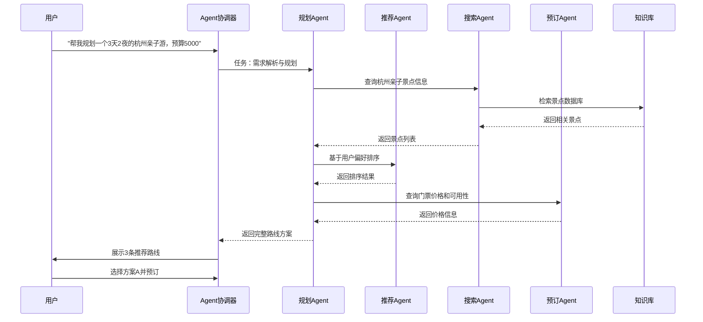
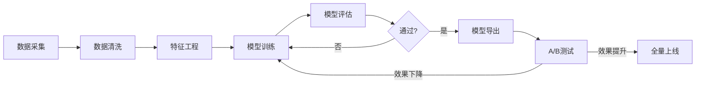
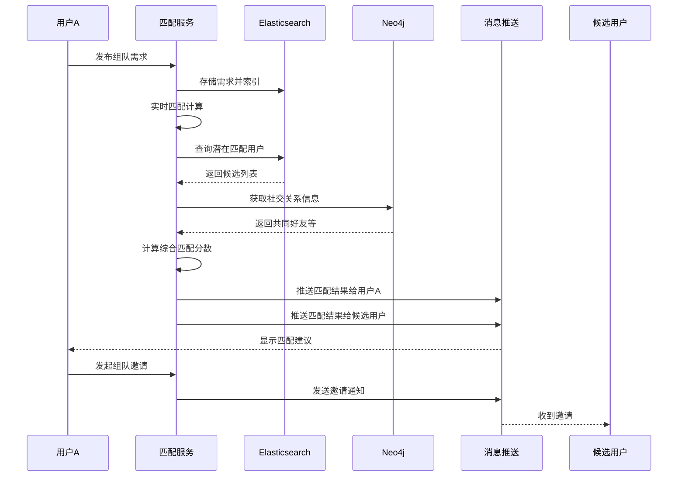

# 兜行（Douxing）平台详细设计文档

<div align="center">

**AI 驱动 · 个性化旅游决策与社交平台**

| 项目 | 兜行（Douxing） |
|------|----------------|
| 文档版本 | **V2.0 最终版** |
| 编制日期 | 2024 年 12 月 |
| 编制团队 | 产品技术部 |
| 文档状态 | 已定稿 |

</div>

> 本文档由《详细设计文档》Word 原版整理为 Markdown，便于版本管理与在线阅读。  
> **实施进度**请参阅 [ROADMAP.md](./ROADMAP.md) 与 **[AI路径规划路线图.md](./AI路径规划路线图.md)**（AI 规划 M6 主链 Step/M 里程碑）及 **[AI流程编排路线图.md](./AI流程编排路线图.md)**（C7-W 流程编排 W0～W5）；**用户粘性与旅友圈（D6）** 见 [用户粘性与旅友圈战略.md](./用户粘性与旅友圈战略.md)；**数据分析（G4/DT1）** 见 [数据中台.md](./数据中台.md)；**系统管理（S 线）** 见 [系统管理.md](./系统管理.md)；**发单接单（M 线 · 模块 B）** 见 [发单接单平台.md](./发单接单平台.md)；**数字孪生 / 三维建模（F 线）** 见 [数字孪生与三维建模.md](./数字孪生与三维建模.md)；**AI Agent 设计全稿（C7 线）** 见 [AI规划与Agent演进.md](./AI规划与Agent演进.md)。**前端工程约束（新页面 UI / i18n / 组件复用）** 见 [Cursor-Agent规则.md](./Cursor-Agent规则.md)。

## 目录

- [1. 引言](#1-引言)
- [2. 系统架构设计](#2-系统架构设计)
- [3. AI智能规划引擎设计](#3-ai智能规划引擎设计)
- [4. 游戏化社交系统设计](#4-游戏化社交系统设计)
- [5. 商业服务闭环设计](#5-商业服务闭环设计)
- [6. AR/VR增强体验设计](#6-ar/vr增强体验设计)
  - [6.7 数字孪生与三维建模（实施补充）](#67-数字孪生与三维建模实施补充)
- [7. 数据存储设计](#7-数据存储设计)
- [7.5 数据分析与指标（实施对照）](#75-数据分析与指标实施对照)
- [8. 安全与合规设计](#8-安全与合规设计)
- [9. 部署与运维设计](#9-部署与运维设计)
- [10. 性能优化设计](#10-性能优化设计)
- [11. 测试策略设计](#11-测试策略设计)
- [12. 接口设计规范](#12-接口设计规范)
- [13. 前沿技术集成](#13-前沿技术集成)
- [14. 项目实施计划](#14-项目实施计划)
- [15. 风险管理](#15-风险管理)
- [16. 总结](#16-总结)
- [17. 实施补充（2026-06）](#17-实施补充2026-06)
  - [17.5 数字孪生与三维建模（实施补充）](#175-数字孪生与三维建模实施补充)
  - [17.6 AI Agent 演进（实施补充）](#176-ai-agent-演进实施补充)
  - [17.7 用户粘性与增长策略（实施补充）](#177-用户粘性与增长策略实施补充)
  - [17.8 旅友圈（D6 线 · 实施补充）](#178-旅友圈d6-线--实施补充)

---


## 1. 引言

### 1.1 项目背景

随着人工智能技术的快速发展和旅游消费的持续升级，传统旅游服务平台已无法满足用户对个性化、智能化旅游体验的需求。根据艾瑞咨询《2024年中国在线旅游行业研究报告》，Z世代用户已占旅游消费人群的42%，他们追求便捷、社交化、沉浸式的旅游体验，对AI个性化推荐、社交互动、游戏化体验有强烈需求。
当前旅游市场存在以下痛点：

| 痛点类型 | 具体描述 |
|---------|---------|
| 规划耗时 | 用户平均需要花费5-8小时规划一次3天2夜的旅行 |
| 信息过载 | 各平台信息分散，难以整合比较 |
| 缺乏个性 | 传统推荐算法无法理解用户深层需求 |
| 社交缺失 | 旅行过程中的社交互动需求未被满足 |
| 消费断层 | 规划到消费的转化链路过长 |

市场亟需一个整合AI智能规划、社交互动和本地生活服务的一站式旅游平台。

### 1.2 项目定位

兜行（Douxing）定位为**AI驱动的下一代个性化旅游决策与社交平台**，致力于通过人工智能技术重构旅游体验全流程，为用户提供“一句话生成专属旅行”的智能化服务。

**2026-06 产品架构补充：** 平台由两个 **独立并列** 的业务模块组成（详见 [§17](#17-实施补充2026-06)）：

- **模块 A（AI 旅行规划）**：个人自助游 — 规划、路线、打卡、成就、手帐（现有主线）
- **模块 B（发单接单 marketplace）**：按需启用 — 个人/团体发单，旅行社、领队、摄影团队等持证接单

两模块 **不冲突、不强制串联**；共用账号与基础设施，数据域分离。

### 核心价值主张

- **智能化**：AI Agent技术实现个性化路线一键生成
- **社交化**：游戏化打卡、**旅友圈**关系动态流、搭子匹配与兴趣社交
- **闭环化**：从规划到消费的完整商业生态（规划 → 打卡 → 记忆 → 分享 → 复购）
- **惊喜化**：盲盒旅行等创新体验模式
- **沉浸化**：AR/VR技术打造虚实融合的旅行体验

### 1.3 设计目标

| 目标维度 | 具体目标 |
|---------|---------|
| 智能化 | 构建AI驱动的智能旅游规划系统，路线生成准确率≥85% |
| 社交化 | 实现游戏化社交与旅游体验的深度融合，日活跃用户≥10万 |
| 商业化 | 打造从规划到消费的完整商业闭环，转化率≥15% |
| 技术性 | 提供高可用（99.9%）、高扩展性的系统架构 |
| 安全性 | 确保数据安全与用户隐私保护，通过等保三级认证 |

### 1.4 技术栈全景

| 层级 | 技术选型 | 说明 |
|-----|---------|------|
| **前端** | Vue 3.5 + Vite 6 + Pinia 2 + Vue Router 4 | Web管理端 |
| **移动端** | UniApp 4 + Vue 3 + Vite | 跨平台开发（iOS/Android/小程序） |
| **后端** | Node.js 22 + Express 5 + TypeScript 5.6 | 主要业务服务 |
| **AI服务** | Python 3.12 + LangChain 0.3 + FastAPI | AI专用服务 |
| **数据库** | MySQL 8.4 + Drizzle ORM | 关系型数据 |
| **缓存** | Redis 7.4 + Memcached | 多级缓存 |
| **向量数据库** | Milvus 2.4 / Pinecone | AI特征存储与检索 |
| **图数据库** | Neo4j 5.20 | 社交关系图谱 |
| **消息队列** | RabbitMQ 4.0 + Apache Kafka 3.7 | 异步任务与流处理 |
| **搜索引擎** | Elasticsearch 8.15 | 全文检索与日志 |
| **对象存储** | MinIO / 阿里云OSS | 图片、文件存储 |
| **部署** | Docker 26 + Kubernetes 1.30 | 容器化与编排 |
| **网关** | Kong 3.8 / Nginx 1.26 | API网关与负载均衡 |
| **监控** | Prometheus 2.55 + Grafana 11 + ELK 8 | 可观测性体系 |
| **AI框架** | PyTorch 2.5 + TensorFlow 2.17 | 深度学习 |
| **大模型** | 通义千问/Qwen-72B + 文心一言4.0 | 自然语言处理 |
---

## 2. 系统架构设计

### 2.1 整体架构图

```text
┌─────────────────────────────────────────────────────────────────────────────────┐
│                              客户端层                                            │
├───────────────┬───────────────┬───────────────┬───────────────┬─────────────────┤
│   Web管理端    │   iOS App     │  Android App  │  微信小程序    │   H5移动网页     │
│   (Vue 3)     │  (UniApp)     │   (UniApp)    │   (UniApp)    │   (UniApp)      │
└───────┬───────┴───────┬───────┴───────┬───────┴───────┬───────┴────────┬────────┘
│               │               │               │                │
└───────────────┴───────────────┴───────────────┴────────────────┘
│
▼
┌─────────────────────────────────────────────────────────────────────────────────┐
│                             CDN加速层                                             │
│                      (阿里云CDN / CloudFlare)                                     │
└─────────────────────────────────────────────────────────────────────────────────┘
│
▼
┌─────────────────────────────────────────────────────────────────────────────────┐
│                           API网关层 (Kong/Nginx)                                  │
├───────────────┬───────────────┬───────────────┬───────────────┬─────────────────┤
│   认证鉴权     │   限流熔断     │   请求路由     │   日志记录     │   协议转换       │
│   (JWT)       │   (Sentinel)  │   (动态路由)   │   (访问日志)   │   (REST/gRPC)   │
└───────┬───────┴───────┬───────┴───────┬───────┴───────┬───────┴────────┬────────┘
│               │               │               │                │
└───────────────┴───────────────┴───────────────┴────────────────┘
│
▼
┌─────────────────────────────────────────────────────────────────────────────────┐
│                          微服务层 (Kubernetes)                                    │
├─────────────────┬─────────────────┬─────────────────┬───────────────────────────┤
│   用户服务       │   AI规划服务     │   社交服务       │    订单服务                │
│   (认证/用户)    │   (Agent/LangChain)│ (关系/匹配)    │    (订单/支付)             │
├─────────────────┼─────────────────┼─────────────────┼───────────────────────────┤
│   内容服务       │   通知服务       │   营销服务       │    数据分析服务            │
│   (景点/攻略)    │   (推送/邮件)    │   (优惠/盲盒)    │    (BI/推荐)              │
├─────────────────┼─────────────────┼─────────────────┼───────────────────────────┤
│   AR服务        │   支付服务       │   客服服务       │    审核服务                │
│   (AR渲染)      │   (网关/对账)    │   (智能客服)     │    (内容/资质)             │
└─────────────────┴─────────────────┴─────────────────┴───────────────────────────┘
│
▼
┌─────────────────────────────────────────────────────────────────────────────────┐
│                          消息队列层                                               │
├─────────────────────────────┬───────────────────────────────────────────────────┤
│   RabbitMQ (实时任务)        │          Kafka (流处理/日志)                       │
│   - 订单异步处理              │          - 用户行为日志                            │
│   - 通知推送                  │          - 实时数据管道                            │
│   - 任务调度                  │          - 事件溯源                                │
└─────────────────────────────┴───────────────────────────────────────────────────┘
│
▼
┌─────────────────────────────────────────────────────────────────────────────────┐
│                          数据存储层                                               │
├───────────────┬───────────────┬───────────────┬───────────────┬─────────────────┤
│  MySQL 8.4    │  Redis 7.4    │  Milvus 2.4   │  Neo4j 5.20   │   MinIO/OSS     │
│  (主从/分片)   │  (集群/持久化) │  (向量检索)    │  (图关系)      │   (对象存储)     │
├───────────────┼───────────────┼───────────────┼───────────────┼─────────────────┤
│  Elasticsearch 8.15          │    ClickHouse 24.6         │    TiDB 7.5         │
│  (全文检索/日志)              │    (OLAP分析)               │    (HTAP混合)       │
└───────────────────────────────┴───────────────────────────┴─────────────────────┘
```

### 2.2 技术架构分层说明

#### 2.2.1 客户端层（表现层）

| 客户端类型 | 技术框架 | 核心功能 | 适配范围 |
|-----------|---------|---------|---------|
| Web管理端 | Vue 3 + Ant Design Vue 4 + Vite | 管理员后台、数据分析、审核管理 | PC端浏览器 |
| iOS App | UniApp + Vue 3 | 用户端全部功能 | iOS 12+ |
| Android App | UniApp + Vue 3 | 用户端全部功能 | Android 8+ |
| 微信小程序 | UniApp + 小程序SDK | 轻量级功能、快速访问 | 微信生态 |
| H5移动网页 | UniApp | 分享页、营销页 | 移动浏览器 |

**移动端特性：**
- 跨平台代码复用率≥80%
- 支持热更新和增量更新
- 离线缓存能力（PWA技术）
- 原生插件扩展（地图、支付、相机）

#### 2.2.2 API网关层

**核心职责：**
1. **请求路由**：动态路由到不同微服务
2. **认证鉴权**：Access JWT 验证 + Refresh Token 轮换（[双Token认证与无感刷新.md](./双Token认证与无感刷新.md)）；OAuth2.0（规划）
3. **限流熔断**：基于令牌桶算法的限流 + 熔断降级
4. **协议转换**：REST ↔ gRPC转换
5. **日志监控**：全链路请求日志记录
**网关配置：**
```yaml
# 网关配置示例
gateway:
  rate_limit:
    enabled: true
    default_limit: 100
    user_limit: 200
  circuit_breaker:
    failure_threshold: 5
    timeout: 3000
    half_open_requests: 3
```

#### 2.2.3 微服务层（业务逻辑层）

**微服务清单：**

| 序号 | 服务名称 | 职责范围 | 数据存储 | 端口 |
|-----|---------|---------|---------|------|
| 1 | 用户服务 | 用户注册、认证、个人资料管理 | MySQL + Redis | 8001 |
| 2 | AI规划服务 | 智能路线生成、推荐算法 | Milvus + Redis | 8002 |
| 3 | 社交服务 | 打卡、搭子匹配、成就系统 | MySQL + Neo4j | 8003 |
| 4 | 订单服务 | 订单管理、状态流转 | MySQL | 8004 |
| 5 | 支付服务 | 支付网关、对账结算 | MySQL + Redis | 8005 |
| 6 | 内容服务 | 景点信息、攻略、UGC管理 | MySQL + ES | 8006 |
| 7 | 通知服务 | 推送通知、邮件、短信 | Redis + RabbitMQ | 8007 |
| 8 | 营销服务 | 优惠券、盲盒、活动管理 | MySQL + Redis | 8008 |
| 9 | AR服务 | AR内容管理、渲染服务 | MinIO + Redis | 8009 |
| 10 | 客服服务 | 智能客服、人工客服 | MySQL + ES | 8010 |
| 11 | 审核服务 | 内容审核、资质审核 | MySQL | 8011 |
| 12 | 数据分析服务 | 用户行为分析、BI报表 | ClickHouse | 8012 |

**服务间通信：**
- 同步通信：gRPC（高性能内部调用）
- 异步通信：RabbitMQ（任务解耦）
- 事件驱动：Kafka（状态同步）

#### 2.2.4 数据存储层

详见第7章"数据存储设计"。

### 2.3 微服务间通信设计

#### 2.3.1 服务发现

采用 Kubernetes 原生 Service Discovery + Consul：
```yaml
apiVersion: v1
kind: Service
metadata:
name: ai-planning-service
spec:
selector:
app: ai-planning
ports:
- port: 8002
targetPort: 8002
```

#### 2.3.2 服务治理

| 治理能力 | 实现方案 | 说明 |
|---------|---------|------|
| 服务注册 | Kubernetes + Consul | 自动注册与健康检查 |
| 服务发现 | CoreDNS + Consul DNS | 域名解析到服务实例 |
| 负载均衡 | Kubernetes Service | Round-Robin算法 |
| 熔断降级 | Sentinel + Hystrix | 故障隔离与降级 |
| 链路追踪 | Jaeger + OpenTelemetry | 分布式调用链 |
| 配置管理 | Apollo + ConfigMap | 动态配置下发 |
---

## 3. AI智能规划引擎设计

### 3.1 模块概述

AI智能规划引擎是兜行平台的核心模块，基于大语言模型技术实现个性化旅游路线的自动生成。该引擎采用多Agent协作架构，能够理解用户的自然语言需求，结合实时数据生成最优旅行方案。

### 3.2 技术架构图

```text
┌─────────────────────────────────────────────────────────────────────────────────┐
│                            用户交互层                                             │
│  ┌─────────────┐  ┌─────────────┐  ┌─────────────┐  ┌─────────────┐            │
│  │  文本输入    │  │  语音输入    │  │  图片输入    │  │  历史偏好    │            │
│  └──────┬──────┘  └──────┬──────┘  └──────┬──────┘  └──────┬──────┘            │
└─────────┼────────────────┼────────────────┼────────────────┼──────────────────┘
│                │                │                │
└────────────────┴────────────────┴────────────────┘
│
▼
┌─────────────────────────────────────────────────────────────────────────────────┐
│                        Agent协调器 (LangChain)                                    │
│                    任务分解、调度、结果聚合                                        │
└─────────────────────────────────────────────────────────────────────────────────┘
│                │                │                │
▼                ▼                ▼                ▼
┌─────────────┐    ┌─────────────┐    ┌─────────────┐    ┌─────────────┐
│  规划Agent   │    │  推荐Agent   │    │  搜索Agent   │    │  预订Agent   │
│ 路线生成     │    │ 兴趣点推荐   │    │ 信息检索     │    │ 资源预订     │
│ 时间安排     │    │ 餐饮推荐     │    │ 数据聚合     │    │ 价格查询     │
│ 预算控制     │    │ 住宿推荐     │    │ 结果排序     │    │ 库存确认     │
└──────┬──────┘    └──────┬──────┘    └──────┬──────┘    └──────┬──────┘
│                  │                  │                  │
└──────────────────┴──────────────────┴──────────────────┘
│
▼
┌─────────────────────────────────────────────────────────────────────────────────┐
│                         知识库与数据层                                            │
├───────────────┬───────────────┬───────────────┬───────────────┬─────────────────┤
│  向量数据库    │   关系数据库   │   缓存数据库   │   图数据库     │   外部API       │
│  (Milvus)     │   (MySQL)     │   (Redis)     │   (Neo4j)     │   (第三方)       │
│  - 景点向量    │   - 景点信息   │   - 热门路线   │   - 关系推荐   │   - 实时天气     │
│  - 用户画像    │   - 用户数据   │   - 会话缓存   │   - 协同过滤   │   - 交通信息     │
│  - 历史路线    │   - 订单数据   │   - 推荐结果   │               │   - 门票价格     │
└───────────────┴───────────────┴───────────────┴───────────────┴─────────────────┘
```

### 3.3 多Agent协作架构

#### 3.3.1 Agent类型与职责

| Agent名称 | 核心职责 | 输入 | 输出 | 技术实现 |
|-----------|---------|------|------|---------|
| **规划Agent** | 整体路线规划、时间安排、预算分配 | 用户需求、约束条件 | 完整路线方案 | LangChain + ReAct |
| **推荐Agent** | 景点、餐饮、住宿个性化推荐 | 用户画像、历史行为 | 推荐列表 | 双塔模型 + 协同过滤 |
| **搜索Agent** | 实时信息检索、数据聚合 | 查询条件 | 结构化数据 | Elasticsearch + Web Scraper |
| **预订Agent** | 资源可用性查询、价格比较 | 资源类型、时间 | 预订方案 | API Gateway + 供应商对接 |
| **评估Agent** | 路线质量评估、风险检测 | 生成的路线 | 评分、风险报告 | LLM评估 + 规则引擎 |
| **对话Agent** | 用户意图理解、多轮对话 | 用户消息 | 响应、任务指令 | RAG + 意图分类 |

#### 3.3.2 Agent协作流程



### 3.4 自然语言处理模块

#### 3.4.1 功能描述

解析用户输入的自然语言描述，提取关键信息，支持多轮对话和上下文理解。

#### 3.4.2 处理流程

```text
用户输入 → 文本预处理 → 意图识别 → 实体抽取 → 情感分析 → 特征向量化 → 知识库检索
```

#### 3.4.3 技术实现

| 组件 | 技术方案 | 说明 |
|-----|---------|------|
| 文本预处理 | Jieba分词 + 自定义词典 | 旅游领域专业词汇 |
| 意图识别 | BERT-base-chinese + Fine-tuning | 20种旅游意图分类 |
| 实体抽取 | BiLSTM-CRF模型 | 地点、时间、预算、人数等 |
| 情感分析 | RoBERTa-wwm-ext | 用户偏好强度判断 |
| 语义理解 | 通义千问/Qwen-72B | 复杂需求理解 |

#### 3.4.4 意图分类体系

| 意图大类 | 意图子类 | 示例 |
|---------|---------|------|
| 类型意图 | 亲子游、情侣游、独自游、商务游 | "带5岁孩子去上海迪士尼" |
| 预算意图 | 穷游、经济型、舒适型、豪华型 | "预算2000左右的穷游" |
| 时间意图 | 周末游、节假日游、长期游 | "清明节3天假期" |
| 主题意图 | 美食之旅、文化之旅、冒险之旅 | "想体验当地美食" |
| 特殊需求 | 无障碍、带宠物、定制游 | "需要无障碍设施" |

### 3.5 知识库构建

#### 3.5.1 数据来源

| 数据源类型 | 具体来源 | 更新频率 | 采集方式 |
|-----------|---------|---------|---------|
| 景点信息 | 高德地图、百度地图、美团 | 每日 | API + 爬虫 |
| 用户评价 | 大众点评、携程、马蜂窝 | 实时 | 爬虫 |
| 优惠信息 | OTA平台API、官方渠道 | 每小时 | API对接 |
| 交通信息 | 12306、航班管家、高德 | 实时 | API |
| 天气数据 | 和风天气、OpenWeather | 实时 | API |
| 用户行为 | 平台内部数据 | 实时 | 埋点采集 |

#### 3.5.2 数据处理流程

```text
原始数据 → 数据清洗 → 标准化处理 → 特征提取 → 向量化 → 存储
```

**数据清洗规则：**
- 去重：基于MD5哈希的去重
- 异常值处理：3σ原则 + 人工规则
- 缺失值填充：均值填充 / 模型预测
- 格式标准化：统一日期、价格、坐标格式

#### 3.5.3 向量化存储

**Milvus集合设计：**

| 集合名称 | 维度 | 索引类型 | 说明 |
|---------|------|---------|------|
| attraction_vectors | 768 | IVF_FLAT | 景点特征向量 |
| user_profile_vectors | 512 | IVF_PQ | 用户画像向量 |
| route_vectors | 1024 | HNSW | 路线特征向量 |
| review_vectors | 384 | IVF_FLAT | 评价情感向量 |

### 3.6 推荐算法引擎

#### 3.6.1 算法架构

```text
┌─────────────────────────────────────────────────────────────────┐
│                        推荐算法引擎                              │
├─────────────────────────────────────────────────────────────────┤
│  ┌─────────────┐  ┌─────────────┐  ┌─────────────┐             │
│  │ 协同过滤     │  │ 内容推荐     │  │ 深度学习     │             │
│  │ - 用户CF    │  │ - 标签匹配   │  │ - DSSM      │             │
│  │ - 物品CF    │  │ - 语义相似   │  │ - DeepFM    │             │
│  │ - SlopeOne  │  │ - 知识图谱   │  │ - DIN       │             │
│  └──────┬──────┘  └──────┬──────┘  └──────┬──────┘             │
│         │                │                │                     │
│         └────────────────┼────────────────┘                     │
│                          ▼                                      │
│              ┌─────────────────────┐                           │
│              │    混合排序层        │                           │
│              │  - 加权融合          │                           │
│              │  - 重排序            │                           │
│              │  - 多样性控制        │                           │
│              └─────────────────────┘                           │
└─────────────────────────────────────────────────────────────────┘
```

#### 3.6.2 协同过滤算法

**用户相似度计算：**
```text
sim(u, v) = (R_u · R_v) / (||R_u|| × ||R_v||) × w_time × w_location
```

其中 w_time 为时间衰减权重，w_location 为地理位置权重。
**物品相似度计算：**
```text
sim(i, j) = cos(θ) = (V_i · V_j) / (||V_i|| × ||V_j||)
```

#### 3.6.3 深度学习模型

| 模型 | 用途 | 架构 | 训练数据 |
|-----|------|------|---------|
| DSSM | 用户-物品匹配 | 双塔结构，256维 | 点击行为1000万+ |
| DeepFM | 点击率预估 | FM + DNN | 用户特征+上下文特征 |
| DIN | 兴趣演化建模 | Attention机制 | 用户序列行为 |
| BERT4Rec | 序列推荐 | Transformer | 浏览序列2000万+ |

### 3.7 路线生成算法

#### 3.7.1 优化目标

```text
max F(route) = α·S_exp + β·S_budget + γ·S_time + δ·S_diversity
```

| 目标 | 符号 | 权重 | 说明 |
|-----|------|------|------|
| 体验满意度 | S_exp | 0.4 | 基于用户偏好的匹配度 |
| 预算符合度 | S_budget | 0.25 | 实际花费与预算的接近度 |
| 时间效率 | S_time | 0.2 | 行程时间利用率 |
| 多样性 | S_diversity | 0.15 | 景点类型的丰富程度 |

#### 3.7.2 约束条件

| 约束类型 | 约束条件 | 实现方式 |
|---------|---------|---------|
| 时间约束 | 景点开放时间、交通时间、游玩时长 | 时间窗口检查 |
| 预算约束 | 总费用 ≤ 用户预算 × 1.1 | 动态规划剪枝 |
| 距离约束 | 相邻景点距离 ≤ 50km | 距离矩阵检查 |
| 偏好约束 | 必须包含指定类型景点 | 硬约束过滤 |
| 体力约束 | 每日步数 ≤ 25000 | 体力模型计算 |

#### 3.7.3 算法流程

```text
输入：候选景点集P，约束条件C
输出：最优路线R
1. 初始化种群：随机生成N条路线
2. 计算适应度：F(route) = 加权评分
3. 选择：轮盘赌选择 + 精英保留
4. 交叉：顺序交叉(OX)
5. 变异：交换变异 + 插入变异
6. 局部优化：2-opt优化
7. 重复2-6直到收敛或达到迭代次数
8. 输出最优路线
```

#### 3.7.4 遗传算法参数配置

| 参数 | 值 | 说明 |
|-----|---|------|
| 种群大小 | 200 | 每代路线数量 |
| 迭代次数 | 500 | 最大进化代数 |
| 交叉概率 | 0.85 | 发生交叉的概率 |
| 变异概率 | 0.1 | 发生变异的概率 |
| 精英数量 | 10 | 直接保留的最优个体 |
| 收敛阈值 | 0.01 | 适应度变化小于阈值时停止 |

### 3.8 实时数据融合

#### 3.8.1 数据融合架构

```text
┌─────────────────────────────────────────────────────────────────┐
│                        实时数据管道                              │
├─────────────────────────────────────────────────────────────────┤
│                                                                  │
│  外部API ──→ 数据采集器 ──→ 消息队列(Kafka) ──→ 数据处理 ──→ Redis│
│     │                                            │         │     │
│     │                                            │         ▼     │
│     │                                            │      路线引擎  │
│     │                                            │              │
│     └────────────────────────────────────────────┘              │
│                     实时更新通知                                 │
└─────────────────────────────────────────────────────────────────┘
```

#### 3.8.2 数据更新策略

| 数据类型 | 更新频率 | 缓存策略 | 降级方案 |
|---------|---------|---------|---------|
| 门票价格 | 每小时 | Redis 10分钟过期 | 缓存上个有效值 |
| 天气信息 | 每小时 | Redis 1小时过期 | 预报数据 |
| 交通状态 | 5分钟 | Redis 5分钟过期 | 历史平均数据 |
| 优惠信息 | 实时 | 无缓存 | 展示无优惠方案 |
| 用户评论 | 每日 | 本地缓存24小时 | 上次缓存数据 |

### 3.9 模型训练与部署

#### 3.9.1 训练流程



#### 3.9.2 模型部署架构

```text
┌─────────────────────────────────────────────────────────────────┐
│                      模型服务平台                                │
├─────────────────────────────────────────────────────────────────┤
│                                                                  │
│  ┌─────────────┐    ┌─────────────┐    ┌─────────────┐         │
│  │ TensorFlow  │    │  PyTorch    │    │   ONNX      │         │
│  │  Serving    │    │  Serve      │    │  Runtime    │         │
│  └──────┬──────┘    └──────┬──────┘    └──────┬──────┘         │
│         │                  │                  │                 │
│         └──────────────────┼──────────────────┘                 │
│                            ▼                                     │
│                   ┌─────────────────┐                           │
│                   │   模型路由层     │                           │
│                   │  - 模型版本管理  │                           │
│                   │  - 流量分配     │                           │
│                   │  - 灰度发布     │                           │
│                   └─────────────────┘                           │
└─────────────────────────────────────────────────────────────────┘
```

### 3.10 性能优化策略

| 优化点 | 策略 | 预期效果 |
|-------|------|---------|
| 响应延迟 | 多级缓存 + 预计算热门路线 | P99 < 3秒 |
| 模型推理 | 模型量化 + GPU加速 | 推理速度提升5倍 |
| 并发处理 | 异步处理 + 批量推理 | QPS提升10倍 |
| 数据加载 | 预热加载 + 冷热分离 | 命中率90%+ |
---

## 4. 游戏化社交系统设计

### 4.1 模块概述

游戏化社交系统通过游戏化机制和社交功能，增强用户粘性和互动性，构建活跃的旅游社区生态。系统集成了打卡地图、**旅友圈（关系动态流）**、旅游搭子匹配、盲盒旅行、成就系统等核心功能。

> **2026-06-12 补充：** 用户留存与增长激励策略见 [§17.7](#177-用户粘性与增长策略实施补充)；旅友圈（D6）详设见 [§4.8](#48-旅友圈系统) 与 [用户粘性与旅友圈战略.md](./用户粘性与旅友圈战略.md)。

### 4.2 系统架构

```text
┌─────────────────────────────────────────────────────────────────────────────────┐
│                         游戏化社交系统架构                                        │
├─────────────────────────────────────────────────────────────────────────────────┤
│                                                                                  │
│  ┌────────────────────────────────────────────────────────────────────────────┐ │
│  │                           客户端层                                         │ │
│  │  ┌──────────┐ ┌──────────┐ ┌──────────┐ ┌──────────┐ ┌──────────┐       │ │
│  │  │ 打卡界面  │ │ 地图视图  │ │ 匹配页面  │ │ 成就展示  │ │ 排行榜   │       │ │
│  │  └──────────┘ └──────────┘ └──────────┘ └──────────┘ └──────────┘       │ │
│  │  ┌──────────┐ ┌──────────┐                                                 │ │
│  │  │ 旅友圈   │ │ 发现Tab  │  （D6 · 2026-06 补充）                          │ │
│  │  └──────────┘ └──────────┘                                                 │ │
│  └────────────────────────────────────────────────────────────────────────────┘ │
│                                      │                                           │
│                                      ▼                                           │
│  ┌────────────────────────────────────────────────────────────────────────────┐ │
│  │                        业务逻辑层                                           │ │
│  │  ┌──────────┐ ┌──────────┐ ┌──────────┐ ┌──────────┐ ┌──────────┐       │ │
│  │  │ 打卡服务  │ │ 地图服务  │ │ 匹配服务  │ │ 成就服务  │ │ 排行榜   │       │ │
│  │  │ - 位置验证│ │ - 图层渲染│ │ - 相似度  │ │ - 条件检测│ │ - 实时排名│       │ │
│  │  │ - 照片审核│ │ - 足迹聚合│ │ - 实时推送│ │ - 奖励发放│ │ - 周月榜  │       │ │
│  │  └──────────┘ └──────────┘ └──────────┘ └──────────┘ └──────────┘       │ │
│  │  ┌──────────┐ ┌──────────┐ ┌──────────┐                                   │ │
│  │  │ 关系服务  │ │ 动态服务  │ │ 互动服务  │  （D1/D6 · 关注/Feed/赞评）     │ │
│  │  └──────────┘ └──────────┘ └──────────┘                                   │ │
│  └────────────────────────────────────────────────────────────────────────────┘ │
│                                      │                                           │
│                                      ▼                                           │
│  ┌────────────────────────────────────────────────────────────────────────────┐ │
│  │                        数据存储层                                           │ │
│  │  ┌──────────┐ ┌──────────┐ ┌──────────┐ ┌──────────┐ ┌──────────┐       │ │
│  │  │  MySQL   │ │   Neo4j  │ │   Redis  │ │    ES    │ │    OSS   │       │ │
│  │  │ 打卡记录  │ │ 社交图谱  │ │ 会话缓存  │ │ 搜索索引  │ │ 图片存储  │       │ │
│  │  └──────────┘ └──────────┘ └──────────┘ └──────────┘ └──────────┘       │ │
│  └────────────────────────────────────────────────────────────────────────────┘ │
│                                                                                  │
└─────────────────────────────────────────────────────────────────────────────────┘
```

### 4.3 打卡地图系统

#### 4.3.1 功能描述

可视化记录用户旅行足迹，提供成就激励和社交分享功能。

#### 4.3.2 核心功能

| 功能模块 | 详细说明 | 技术实现 |
|---------|---------|---------|
| 位置打卡 | GPS定位验证，500米范围内可打卡 | 高德地图API + 地理围栏 |
| 足迹记录 | 自动记录旅行轨迹，生成热力图 | Mapbox GL + Canvas绘图 |
| 城市徽章 | 完成特定城市打卡解锁对应徽章 | 条件触发 + 动画效果 |
| 旅行地图 | 个性化旅行地图生成，可分享 | 2D 已落地（Leaflet / UniApp map）；**3D 孪生**见 [数字孪生与三维建模.md](./数字孪生与三维建模.md) · ROADMAP **F0/F4** |
| 时间轴 | 按时间顺序展示旅行足迹 | 时间轴组件 + 照片墙 |

#### 4.3.3 地理围栏设计

**打卡触发条件：**
- 距离景点核心区域 ≤ 500米
- 停留时间 ≥ 5分钟
- 当日未打卡过该景点
- 通过活体检测（可选）
**防作弊机制：**
- 虚假GPS检测（速度异常检测）
- 设备指纹绑定
- 打卡照片审核（可选）
- 人工抽查

#### 4.3.4 数据模型扩展

```sql
-- 打卡记录表（增强版）
CREATE TABLE check_ins (
id BIGINT PRIMARY KEY AUTO_INCREMENT,
user_id BIGINT NOT NULL,
attraction_id BIGINT NOT NULL,
route_id BIGINT,
location POINT NOT NULL,
city_code VARCHAR(20) NOT NULL,
district_code VARCHAR(20),
check_in_time DATETIME NOT NULL,
departure_time DATETIME,
duration_minutes INT DEFAULT 0,
photos JSON,                           -- 打卡照片URL数组
gps_accuracy INT,                      -- GPS精度（米）
verify_status ENUM('pending', 'passed', 'failed') DEFAULT 'pending',
verify_method ENUM('auto', 'photo', 'manual'),
points_earned INT DEFAULT 0,           -- 获得积分
is_first_checkin BOOLEAN DEFAULT FALSE, -- 是否首次打卡该景点
created_at DATETIME DEFAULT CURRENT_TIMESTAMP,
updated_at DATETIME DEFAULT CURRENT_TIMESTAMP ON UPDATE CURRENT_TIMESTAMP,
SPATIAL INDEX(location),
INDEX idx_user_time (user_id, check_in_time),
INDEX idx_attraction (attraction_id),
INDEX idx_city (city_code),
UNIQUE KEY uk_user_attraction_date (user_id, attraction_id, DATE(check_in_time))
);
-- 徽章表
CREATE TABLE badges (
id BIGINT PRIMARY KEY AUTO_INCREMENT,
badge_code VARCHAR(50) NOT NULL UNIQUE,
name VARCHAR(100) NOT NULL,
description TEXT,
category ENUM('city', 'achievement', 'special', 'level') DEFAULT 'achievement',
condition_type VARCHAR(50) NOT NULL,   -- 触发条件类型
condition_value JSON,                  -- 条件参数
icon_url VARCHAR(500),
rarity ENUM('common', 'rare', 'epic', 'legendary') DEFAULT 'common',
points_reward INT DEFAULT 0,
created_at DATETIME DEFAULT CURRENT_TIMESTAMP
);
-- 用户徽章关联表
CREATE TABLE user_badges (
id BIGINT PRIMARY KEY AUTO_INCREMENT,
user_id BIGINT NOT NULL,
badge_id BIGINT NOT NULL,
unlock_time DATETIME NOT NULL,
progress JSON,                         -- 解锁进度
is_displayed BOOLEAN DEFAULT TRUE,    -- 是否展示在主页
created_at DATETIME DEFAULT CURRENT_TIMESTAMP,
INDEX idx_user (user_id),
UNIQUE KEY uk_user_badge (user_id, badge_id)
);
```

### 4.4 旅游搭子匹配系统

#### 4.4.1 功能描述

基于兴趣标签、时空匹配的智能组队功能，帮助用户找到志同道合的旅行伙伴。

#### 4.4.2 匹配算法

**综合匹配分数计算：**
```text
MatchScore = w1 × TagSimilarity + w2 × TimeMatch + w3 × LocationMatch + w4 × CreditScore + w5 × AgeSimilarity
```

**权重配置：**

| 因子 | 权重 | 说明 |
|-----|------|------|
| TagSimilarity | 0.35 | 兴趣标签相似度（余弦相似度） |
| TimeMatch | 0.25 | 出发时间和行程天数匹配度 |
| LocationMatch | 0.20 | 出发城市和目的地匹配度 |
| CreditScore | 0.15 | 用户信用评分（0-100） |
| AgeSimilarity | 0.05 | 年龄相近度（年龄差≤5岁为满分） |

#### 4.4.3 匹配流程



#### 4.4.4 实时匹配技术实现

**Elasticsearch索引映射：**
```json
{
"mappings": {
"properties": {
"user_id": {"type": "long"},
"destination": {"type": "geo_point"},
"departure_city": {"type": "keyword"},
"start_date": {"type": "date"},
"end_date": {"type": "date"},
"interests": {"type": "keyword"},
"budget": {"type": "integer"},
"group_size": {"type": "integer"},
"credit_score": {"type": "integer"},
"age": {"type": "integer"},
"gender": {"type": "keyword"},
"status": {"type": "keyword"}
}
}
}
```

**匹配查询DSL：**
```json
{
"query": {
"bool": {
"must": [
{"term": {"destination": {"lat": 31.23, "lon": 121.47}}},
{"range": {"start_date": {"gte": "2024-12-01", "lte": "2024-12-07"}}}
],
"should": [
{"terms": {"interests": ["美食", "摄影", "户外"]}},
{"range": {"credit_score": {"gte": 80}}},
{"range": {"age": {"gte": 25, "lte": 35}}}
],
"minimum_should_match": 2
}
}
}
```

#### 4.4.5 群组功能设计

| 功能 | 说明 |
|-----|------|
| 群组聊天 | 行程专属群聊，支持文字、图片、位置共享 |
| 行程协作 | 共同编辑行程计划，投票决定目的地 |
| 费用分摊 | AA制账单记录，支持微信/支付宝转账 |
| 实时位置 | 组队成员实时位置共享（需授权） |
| 评价系统 | 行程结束后互相评价 |

### 4.5 盲盒旅行系统

#### 4.5.1 功能描述

支付固定金额解锁惊喜路线，结合游戏化机制和社交分享，创造独特的旅行体验。

#### 4.5.2 盲盒类型

| 类型 | 价格区间 | 内容 | 保底机制 |
|-----|---------|------|---------|
| 城市盲盒 | 99-199元 | 1天城市探索路线 | 价值≥99元 |
| 周边盲盒 | 299-599元 | 2天1夜周边游 | 价值≥299元 |
| 主题盲盒 | 199-399元 | 美食/文化/冒险主题 | 价值≥199元 |
| 隐藏款盲盒 | 99元（限量） | 稀有目的地/特殊体验 | 概率1% |

#### 4.5.3 随机算法设计

**加权随机算法：**
```python
def generate_blindbox_route(user_profile, box_type):
# 基于用户画像的加权随机
candidates = get_candidate_routes(box_type)
# 计算每个路线的权重
for route in candidates:
weight = base_weight(route)
weight *= affinity_score(user_profile, route)  # 用户偏好
weight *= time_factor(route)                   # 季节性因素
weight *= inventory_factor(route)              # 库存因素
selected = weighted_random_choice(candidates, weights)
selected.tier = determine_tier(selected)  # 普通/稀有/传说
return selected
```

#### 4.5.4 业务流程

```text
用户选择盲盒类型 → 确认支付 → 系统生成随机路线 → 锁定资源 → 等待揭晓 →
行程开始前24小时揭晓 → 用户查看完整行程 → 开始旅行 → 评价反馈
```

#### 4.5.5 风险控制

| 风险类型 | 控制措施 |
|---------|---------|
| 价值不符 | 保底价值机制 + 差额补偿 |
| 库存不足 | 预锁定机制 + 备选方案 |
| 用户不满意 | 退款保障（揭晓前可退80%） |
| 恶意刷单 | 风控系统 + 限购（每人每月限3次） |

### 4.6 成就系统

#### 4.6.1 成就分类体系

| 大类 | 子类 | 示例成就 | 奖励 |
|-----|------|---------|------|
| 探索类 | 城市征服 | 打卡10个城市 | 勋章+100积分 |
| 探索类 | 景点达人 | 打卡50个景点 | 勋章+VIP体验券 |
| 社交类 | 组队达人 | 成功组队10次 | 勋章+50积分 |
| 社交类 | 影响力者 | 获得1000个赞 | 勋章+流量扶持 |
| 消费类 | 消费达人 | 累计消费5000元 | 勋章+返现券 |
| 消费类 | 盲盒收藏家 | 购买20个盲盒 | 隐藏款盲盒 |
| 挑战类 | 连续打卡 | 连续7天打卡 | 连续徽章 |
| 挑战类 | 一日游 | 单日打卡5个景点 | 勋章+50积分 |

#### 4.6.2 成就检测机制

**事件驱动架构：**
```text
用户行为 → 事件发布 → Kafka → 成就检测服务 → 条件评估 → 成就解锁 → 奖励发放
```

**成就检测示例：**
```python
@event_handler('checkin_created')
def check_city_conqueror(event):
user_id = event.user_id
cities = db.query(
"SELECT COUNT(DISTINCT city_code) FROM check_ins WHERE user_id = ?",
user_id
)
if cities >= 10:
unlock_achievement(user_id, 'city_conqueror')
```

### 4.7 社交图谱构建

> **实施路径（2026-06）：** MVP 阶段 **MySQL 先行**（`follows`、`friendships`、`social_posts`），Neo4j 为远期增强；ROADMAP **D1** 关注/旅友、**D6** 旅友圈。

#### 4.7.1 Neo4j图模型（远期）

```cypher
-- 节点标签
:User {user_id, name, age, city, interests}
:Attraction {attraction_id, name, city, category, rating}
:CheckIn {checkin_id, time, rating}
-- 关系类型
- (u1:User)-[:FOLLOW]->(u2:User)
- (u1:User)-[:FRIEND {since}]->(u2:User)
- (u:User)-[:CHECKED_IN {time, rating}]->(a:Attraction)
- (u1:User)-[:MATCHED {score, route_id}]->(u2:User)
- (u:User)-[:SIMILAR_TO {score}]->(u2:User)  -- 相似度关系
```

#### 4.7.2 社交关系查询

```cypher
-- 推荐二度好友
MATCH (me:User {user_id: $user_id})-[:FOLLOW]->(friend:User)<-[:FOLLOW]-(candidate)
WHERE NOT (me)-[:FOLLOW]->(candidate) AND me <> candidate
RETURN candidate, count(friend) as common_friends
ORDER BY common_friends DESC
LIMIT 20
-- 共同打卡的景点
MATCH (u1:User {user_id: $user1})-[:CHECKED_IN]->(a:Attraction)<-[:CHECKED_IN]-(u2:User {user_id: $user2})
RETURN a.name, u1_rating, u2_rating
```

### 4.8 旅友圈系统

> **录入日期**：2026-06-12 · **路线图**：ROADMAP **D6-a～e** · **战略详述**：[用户粘性与旅友圈战略.md](./用户粘性与旅友圈战略.md)

#### 4.8.1 定位与边界

**旅友圈** 是模块 A 的 **关系层社交动态流**，回答「我关注的旅友最近在旅行什么」。**不是** 微信朋友圈翻版，**不是** 全站用户混在一起的公开大 Feed。

| 层级 | 能力 | 受众 | 状态 |
|------|------|------|------|
| 发现层 | 路线广场 `isPublic` | 陌生人 | 已交付 |
| **关系层** | **旅友圈** | 关注/旅友 | D6 待做 |
| 叙事层 | 旅行日记 K-A | 持链接访客 | K-A0 定稿 |
| 单次传播 | D5/J5 分享链接 | 站外 | 部分已交付 |

#### 4.8.2 关系模型

| 关系 | 类型 | 说明 |
|------|------|------|
| 关注 `follow` | 单向 | 低门槛；粉丝/关注列表 |
| 旅友 `friend` | 双向确认 | 「仅旅友可见」动态的前提 |

**不推荐** MVP 仅做双向好友：冷启动阶段关系链难以建立。

#### 4.8.3 可见性

与 K-A 旅行日记块级隐私 **概念对齐**（见 [旅行日记博客.md §4](./旅行日记博客.md#4-可见性与隐私模型)）：

| 值 | 说明 | 默认 |
|----|------|------|
| `public` | 所有人可见；可选进入「发现」Tab | 否 |
| `friends` | 仅互相关注/确认的旅友 | **是（推荐默认）** |
| `private` | 仅作者 | — |
| `team` | 同行程小队（D4 组队后） | D6-a 可 stub |

#### 4.8.4 动态形态：活动流优先

**MVP（D6-a）** 以 **活动流** 为主，内容来自已有业务行为，用户选择是否同步入圈：

| 触发源 | 动态类型 | 关联实体 |
|--------|----------|----------|
| 景点打卡 | `check_in` | `check_ins` |
| 路线发布 | `route_published` | `travel_routes` |
| 成就/徽章 | `achievement` / `badge` | `achievements` / `user_badges` |
| 日记发布 | `journal_published` | K-A `travel_journals`（D6-c） |
| 路线完成 | `route_progress` | 打卡进度聚合 |

用户可：删除动态、修改可见性、追加配文。**自由发帖**（多图+文字+POI）置于 **D6-d** 二期。

**差异化：** 动态卡片须携带 **路线/景点/打卡上下文**，支持「收藏路线」「查看打卡地图」等 CTA，而非纯图文。

#### 4.8.5 与搭子匹配（§4.4）协同

```text
D1 关注/旅友 → D6 旅友圈 → D2/D3 搭子匹配 → D4 组队（team 可见性）→ H5 IM
```

搭子匹配成功后可自动建立旅友或同行程组；行中组内动态使用 `team` 可见性。

#### 4.8.6 核心 API（规划）

| 方法 | 路径 | 说明 |
|------|------|------|
| POST | `/api/social/follows/:userId` | 关注 |
| DELETE | `/api/social/follows/:userId` | 取消关注 |
| POST | `/api/social/friends/requests` | 发起旅友申请 |
| POST | `/api/social/friends/requests/:id/accept` | 接受旅友 |
| GET | `/api/social/feed` | 旅友圈时间线（cursor 分页） |
| GET | `/api/social/feed/discover` | 发现 Tab（公开动态，可选） |
| POST | `/api/social/posts` | 创建/同步动态（含活动流自动写入） |
| PATCH | `/api/social/posts/:id` | 改可见性/配文 |
| DELETE | `/api/social/posts/:id` | 删除动态 |
| POST | `/api/social/posts/:id/like` | 点赞 |
| POST | `/api/social/posts/:id/comments` | 评论 |

错误码走 `ApiMessageKey`；须 G9 国际化。

#### 4.8.7 内容安全

- 动态图片：腾讯云内容审核（与 J/K-A 共用策略）  
- 文字：敏感词 + 举报入口  
- 默认 `friends` 可见，降低隐私泄漏面  

---

## 5. 商业服务闭环设计

### 5.1 模块概述

商业服务闭环模块实现从旅游规划到消费支付的完整商业流程，包括订单管理、支付系统、服务者认证、CPS分佣、数字商品等核心功能。

### 5.2 商业生态架构

```text
┌─────────────────────────────────────────────────────────────────────────────────┐
│                          商业服务闭环架构                                         │
├─────────────────────────────────────────────────────────────────────────────────┤
│                                                                                  │
│  ┌────────────────────────────────────────────────────────────────────────────┐ │
│  │                           产品层                                           │ │
│  │  ┌──────────┐ ┌──────────┐ ┌──────────┐ ┌──────────┐ ┌──────────┐       │ │
│  │  │ AI路线   │ │ 服务预约  │ │ 打包产品  │ │ 数字商品  │ │ 会员体系  │       │ │
│  │  │ 定制     │ │ 模特/摄影 │ │ 一价全包  │ │ 地图/藏品 │ │ VIP特权  │       │ │
│  │  └──────────┘ └──────────┘ └──────────┘ └──────────┘ └──────────┘       │ │
│  └────────────────────────────────────────────────────────────────────────────┘ │
│                                      │                                           │
│                                      ▼                                           │
│  ┌────────────────────────────────────────────────────────────────────────────┐ │
│  │                           交易层                                           │ │
│  │  ┌──────────┐ ┌──────────┐ ┌──────────┐ ┌──────────┐ ┌──────────┐       │ │
│  │  │ 订单系统  │ │ 支付网关  │ │ 分佣系统  │ │ 结算系统  │ │ 发票系统  │       │ │
│  │  └──────────┘ └──────────┘ └──────────┘ └──────────┘ └──────────┘       │ │
│  └────────────────────────────────────────────────────────────────────────────┘ │
│                                      │                                           │
│                                      ▼                                           │
│  ┌────────────────────────────────────────────────────────────────────────────┐ │
│  │                           服务层                                           │ │
│  │  ┌──────────┐ ┌──────────┐ ┌──────────┐ ┌──────────┐ ┌──────────┐       │ │
│  │  │ 供应商管理│ │ 服务者认证│ │ 客服系统  │ │ 评价体系  │ │ 风控系统  │       │ │
│  │  └──────────┘ └──────────┘ └──────────┘ └──────────┘ └──────────┘       │ │
│  └────────────────────────────────────────────────────────────────────────────┘ │
│                                                                                  │
└─────────────────────────────────────────────────────────────────────────────────┘
```

### 5.3 订单管理系统

#### 5.3.1 订单类型

| 订单类型 | 代码 | 说明 | 业务场景 |
|---------|------|------|---------|
| 路线订单 | ROUTE | AI生成的旅游路线购买 | 用户付费解锁完整路线 |
| 服务订单 | SERVICE | 模特/摄影师/向导预约 | 到店服务预约 |
| 打包产品 | PACKAGE | 一价全包旅游产品 | 交通+住宿+餐饮+门票 |
| 数字商品 | DIGITAL | AI手绘地图、数字藏品 | 虚拟商品购买 |
| 盲盒订单 | BLIND_BOX | 盲盒旅行产品 | 惊喜路线购买 |
| 会员订单 | VIP | 会员订阅服务 | 月度/年度会员 |

#### 5.3.2 订单状态机

```text
┌─────────────────────────────────────────────────┐
│                                                 │
▼                                                 │
┌──────┐      ┌──────────┐     ┌──────────┐     ┌──────────┐         │
│待支付│─────→│  已支付   │────→│  进行中  │────→│  已完成   │         │
└──────┘      └──────────┘     └──────────┘     └──────────┘         │
│              │                  │                                  │
│              │                  │                                  │
▼              ▼                  ▼                                  │
┌──────────┐  ┌──────────┐     ┌──────────┐                           │
│ 已取消   │  │ 退款中   │────→│ 已退款   │                           │
└──────────┘  └──────────┘     └──────────┘                           │
│                  │
└──────────────────┘
可进行售后申请
```

#### 5.3.3 订单服务设计

**核心功能模块：**

| 模块 | 功能 | 技术实现 |
|-----|------|---------|
| 订单创建 | 生成订单、锁定库存 | 分布式锁 + 事务 |
| 订单查询 | 多维度查询、分页 | Elasticsearch索引 |
| 订单更新 | 状态流转、信息修改 | 状态机 + 事件发布 |
| 订单关闭 | 超时自动关闭、手动取消 | 定时任务 + 消息队列 |
| 售后管理 | 退款、投诉、评价 | 工作流引擎 |

**订单超时处理：**
- 待支付订单：30分钟自动取消
- 待确认订单：2小时自动取消
- 待评价订单：7天后自动好评

### 5.4 支付系统集成

#### 5.4.1 支付渠道

| 渠道 | 费率 | 限额 | 特点 |
|-----|------|------|------|
| 微信支付 | 0.6% | 单笔5万 | 用户基数大 |
| 支付宝 | 0.6% | 单笔5万 | 信用支付 |
| 银联云闪付 | 0.5% | 单笔10万 | 大额支付 |
| 数字人民币 | 0% | 无限制 | 政策支持 |

#### 5.4.2 支付网关架构

```text
┌─────────────────────────────────────────────────────────────────┐
│                        统一支付网关                              │
├─────────────────────────────────────────────────────────────────┤
│                                                                  │
│  支付请求 ──→ 参数校验 ──→ 渠道路由 ──→ 渠道调用 ──→ 结果处理    │
│                   │              │              │               │
│                   ▼              ▼              ▼               │
│               风控系统        渠道配置        异步通知           │
│                               (降级策略)                         │
│                                                                  │
└─────────────────────────────────────────────────────────────────┘
```

#### 5.4.3 对账系统

**对账流程：**
```text
T+1日 08:00 下载各渠道账单
↓
T+1日 09:00 平台账单与渠道账单比对
↓
T+1日 10:00 生成差异报告
↓
T+1日 11:00 自动处理短款/长款
↓
T+1日 12:00 发送对账结果通知
```

**异常处理：**
- 短款：自动发起补款流程
- 长款：人工复核后退款
- 重复支付：自动退款处理

### 5.5 服务者认证体系

#### 5.5.1 服务者类型

| 类型 | 认证要求 | 服务范围 | 抽佣比例 |
|-----|---------|---------|---------|
| 模特 | 身份认证+作品集 | 旅拍、产品拍摄 | 20% |
| 摄影师 | 资质认证+案例审核 | 跟拍、精修 | 15% |
| 向导 | 导游证+语言能力 | 深度讲解、定制 | 15% |
| 体验师 | 技能认证+面试 | 特色体验教学 | 25% |

> **实施补充（2026-06）：** 模块 B 扩展供给类型含 **旅行社、户外领队、摄影团队、摄影师、模特** 等；团体发单支持学校班级、公司团建、社区活动。与模块 A（AI 自助规划）**独立分域**，详见 [发单接单平台.md](./发单接单平台.md) §2～§4。

#### 5.5.2 认证流程

```text
用户申请 → 提交资料 → 系统初审 → 人工复审 → 在线考试 → 签约 → 上岗培训 → 正式上岗
```

**认证技术：**
- OCR识别：身份证、导游证自动识别
- 人脸识别：活体检测+人脸比对
- 技能测试：在线答题+作品审核
- 背景调查：第三方背调服务

#### 5.5.3 信用评分模型

| 评分维度 | 权重 | 计算方式 |
|---------|------|---------|
| 完成率 | 30% | 接单完成数/总接单数 |
| 准时率 | 20% | 准时履约次数/总次数 |
| 好评率 | 30% | 5星评价数/总评价数 |
| 投诉率 | 10% | (1-投诉数/服务次数)×100 |
| 经验值 | 10% | 服务次数/100 |

### 5.6 CPS分佣系统

#### 5.6.1 分佣模式

| 模式 | 说明 | 佣金比例 |
|-----|------|---------|
| 固定比例 | 按订单金额固定比例 | 5%-15% |
| 阶梯式 | 根据月交易额阶梯递增 | 5%-20% |
| 等级式 | 根据推广员等级决定 | 8%-18% |
| 裂变式 | 多级分销（限2级） | 一级10%，二级3% |

#### 5.6.2 分佣计算引擎

```python
def calculate_commission(order, promoter):
base_amount = order.total_amount
# 排除优惠和退款部分
base_amount -= order.discount_amount
# 根据模式计算
if promoter.level == 'gold':
rate = 0.20
elif promoter.level == 'silver':
rate = 0.15
else:
rate = 0.10
# 阶梯加成
monthly_sales = get_monthly_sales(promoter.id)
if monthly_sales > 10000:
rate += 0.02
elif monthly_sales > 5000:
rate += 0.01
commission = base_amount * rate
# 扣除个税（代扣代缴）
tax = calculate_withholding_tax(commission)
return {
'commission': commission,
'tax': tax,
'net_amount': commission - tax
}
```

#### 5.6.3 分佣结算流程

```text
确认收货 → 生成分佣记录 → 等待结算期 → 月度结算 → 生成账单 → 开票 → 打款
```

**结算周期：**
- 订单确认收货后进入待结算
- 月度结算：每月15日结算上月佣金
- 提现：T+1到账

### 5.7 数字商品

#### 5.7.1 数字商品类型

| 类型 | 说明 | 价格 | 技术实现 |
|-----|------|------|---------|
| AI手绘地图 | 基于用户路线生成的个性化地图 | 9.9-29.9元 | Stable Diffusion + 矢量图 |
| 数字藏品 | 限量版旅行纪念NFT | 29.9-199元 | 蚂蚁链/至信链 |
| 虚拟礼品卡 | 可转赠的电子卡券 | 50/100/200元 | 卡券系统 |
| 旅行手账模板 | 可打印的电子手账 | 4.9-19.9元 | PDF生成 |
| AR滤镜 | 景点专属AR相机滤镜 | 免费/付费 | ARKit/ARCore |

#### 5.7.2 数字藏品发行流程

```text
藏品设计 → 铸造上链 → 限量发行 → 用户购买 → 链上转移 → 收藏展示
```

---

## 6. AR/VR增强体验设计

### 6.1 模块概述

AR/VR增强体验模块通过增强现实和虚拟现实技术，为用户提供沉浸式的旅游体验，包括AR导航、AR讲解、虚拟合影、VR预览等功能。

### 6.2 技术架构

```text
┌─────────────────────────────────────────────────────────────────────────────────┐
│                      AR/VR增强体验架构                                           │
├─────────────────────────────────────────────────────────────────────────────────┤
│                                                                                  │
│  ┌────────────────────────────────────────────────────────────────────────────┐ │
│  │                         客户端层                                           │ │
│  │  ┌──────────┐ ┌──────────┐ ┌──────────┐ ┌──────────┐ ┌──────────┐       │ │
│  │  │ ARKit    │ │ ARCore   │ │ WebAR    │ │ VR全景   │ │ 图像识别  │       │ │
│  │  │ (iOS)    │ │ (Android)│ │ (Web)    │ │ (360°)   │ │ (离线)   │       │ │
│  │  └──────────┘ └──────────┘ └──────────┘ └──────────┘ └──────────┘       │ │
│  └────────────────────────────────────────────────────────────────────────────┘ │
│                                      │                                           │
│                                      ▼                                           │
│  ┌────────────────────────────────────────────────────────────────────────────┐ │
│  │                         渲染层                                             │ │
│  │  ┌──────────┐ ┌──────────┐ ┌──────────┐ ┌──────────┐ ┌──────────┐       │ │
│  │  │ 3D引擎   │ │ 渲染管线  │ │ 模型加载  │ │ 纹理优化  │ │ 特效系统  │       │ │
│  │  │ Three.js │ │ WebGL    │ │ glTF/GLB │ │ ASTC     │ │ 粒子系统  │       │ │
│  │  └──────────┘ └──────────┘ └──────────┘ └──────────┘ └──────────┘       │ │
│  └────────────────────────────────────────────────────────────────────────────┘ │
│                                      │                                           │
│                                      ▼                                           │
│  ┌────────────────────────────────────────────────────────────────────────────┐ │
│  │                         服务层                                             │ │
│  │  ┌──────────┐ ┌──────────┐ ┌──────────┐ ┌──────────┐ ┌──────────┐       │ │
│  │  │ AR内容   │ │ 图像识别  │ │ 空间定位  │ │ 模型存储  │ │ 数据同步  │       │ │
│  │  │ 管理     │ │ 服务     │ │ SLAM     │ │ OSS      │ │ CDN      │       │ │
│  │  └──────────┘ └──────────┘ └──────────┘ └──────────┘ └──────────┘       │ │
│  └────────────────────────────────────────────────────────────────────────────┘ │
│                                                                                  │
└─────────────────────────────────────────────────────────────────────────────────┘
```

### 6.3 AR导航功能

#### 6.3.1 功能描述

基于AR技术的实景导航，将导航信息叠加在真实场景中，提供直观的指引体验。

#### 6.3.2 核心技术

| 技术 | 说明 | 实现方案 |
|-----|------|---------|
| SLAM | 实时定位与地图构建 | ARKit/ARCore + VPS |
| 视觉定位 | 厘米级精度定位 | 图像特征匹配 + GPS融合 |
| 路径渲染 | 3D路径叠加 | 自定义Shader + 实时渲染 |
| POI标注 | 兴趣点信息显示 | 屏幕空间投影 |
| 语音导航 | 语音提示与交互 | 语音合成 + 唤醒词 |

#### 6.3.3 导航流程

```text
用户开启AR导航 → 初始化摄像头 → 获取当前位置 → 加载AR场景 →
计算导航路径 → 实时渲染引导 → 用户跟随指引 → 到达目的地
```

### 6.4 景点AR讲解

#### 6.4.1 功能描述

通过图像识别技术识别景点，自动触发AR讲解内容，提供沉浸式的导览体验。

#### 6.4.2 识别能力

| 识别类型 | 识别对象 | 技术方案 | 准确率 |
|---------|---------|---------|--------|
| 地标识别 | 著名建筑物、雕塑 | 深度学习分类模型 | 95% |
| 文物识别 | 博物馆展品 | 细粒度图像识别 | 90% |
| 画作识别 | 名画、壁画 | 特征匹配 + 分类 | 92% |
| 文字识别 | 碑文、牌匾 | OCR + NLP | 85% |

#### 6.4.3 内容类型

| 内容类型 | 格式 | 时长 | 文件大小 |
|---------|------|------|---------|
| 语音讲解 | MP3 | 1-3分钟 | 0.5-2MB |
| 3D模型 | glTF/GLB | - | 2-10MB |
| 视频短片 | H.264 | 30-60秒 | 3-10MB |
| 历史重现 | AR动画 | 30秒 | 5-15MB |
| 互动问答 | 小程序 | - | <1MB |

### 6.5 虚拟合影功能

#### 6.5.1 功能描述

与虚拟元素合影留念，生成可分享的AR照片/视频。

#### 6.5.2 技术实现

| 组件 | 技术 | 说明 |
|-----|------|------|
| 人物分割 | MediaPipe/自研 | 实时人像抠图 |
| 场景合成 | 实时渲染 | 虚拟背景融合 |
| 虚拟角色 | 3D模型 | 动漫形象/历史人物 |
| 特效系统 | 粒子系统 | 滤镜、贴纸、动画 |
| 分享模块 | 社交媒体SDK | 一键分享 |

### 6.6 VR全景预览

#### 6.6.1 功能描述

提供景点360°全景预览，帮助用户在出行前了解目的地。

#### 6.6.2 技术方案

- **采集设备**：Insta360 Pro 2 / 无人机
- **处理流程**：多图拼接 → 图像增强 → 切片处理 → CDN分发
- **播放器**：Three.js全景播放器 / 第三方SDK
- **交互**：陀螺仪控制 + 手势拖拽

### 6.7 数字孪生与三维建模（实施补充）

> **2026-06-10 录入**：完整方案见专题 [数字孪生与三维建模.md](./数字孪生与三维建模.md)；ROADMAP **阶段 F（F0～F6）** 跟踪交付。  
> **说明**：本文 §6 原描述 AR/VR **全景与模型** 能力；**旅行孪生**（规划路径 vs 打卡轨迹）归入 §4.3 与 §17.5，统一由 F 线实施。

#### 6.7.1 产品分层

| 层级 | 名称 | 能力 |
|------|------|------|
| L1 | 路线孪生 | `RoutePath` + `check_ins` 时空对照；PC 3D 回放（F0/F4） |
| L2 | 景点孪生 | 360° 全景（F1）、glTF 地标（F2）、讲解（F3） |
| L3 | 城市孪生 | 三维底图 + 实时叠加；运营向，远期 |

#### 6.7.2 技术选型（实施默认）

| 组件 | 选型 | 说明 |
|------|------|------|
| 3D 引擎 | Three.js（首选）/ CesiumJS（L3 大屏） | **仅 pc** 用户 3D；**mobile 不做 3D** |
| 运营大屏 | ECharts Geo + 漏斗；Leaflet 热力 | **web** DT5 `/screen/travel` |
| 模型格式 | glTF/GLB | OSS；体系外建模 → web 入库 |
| 全景 | 等距柱状图 + Three.js | pc 播放 |
| 坐标系 | GCJ-02 | 与 [amap-geocoding.md](./amap-geocoding.md) 一致 |
| 路线数据 | `map-path` / `twin` API | 复用 `RoutePath` |

完整技术体系表见 [数字孪生与三维建模.md §4](./数字孪生与三维建模.md#4-技术体系)。

#### 6.7.3 与 §6 各节关系

| 原节 | F 线步骤 |
|------|----------|
| §6.3 AR 导航 | **F6** 远期 |
| §6.4 景点讲解 / 3D 模型 | **F2** 模型 · **F3** 讲解 |
| §6.5 虚拟合影 | 远期，依赖 F2 资产管线 |
| §6.6 VR 全景 | **F1** |

---

## 7. 数据存储设计

### 7.1 存储架构全景

```text
┌─────────────────────────────────────────────────────────────────────────────────┐
│                          数据存储架构                                            │
├─────────────────────────────────────────────────────────────────────────────────┤
│                                                                                  │
│  ┌────────────────────────────────────────────────────────────────────────────┐ │
│  │                         业务数据层                                         │ │
│  │  ┌──────────┐ ┌──────────┐ ┌──────────┐ ┌──────────┐ ┌──────────┐       │ │
│  │  │  MySQL   │ │  TiDB    │ │  MongoDB │ │  Neo4j   │ │ ClickHouse│       │ │
│  │  │ 用户/订单 │ │ 高并发   │ │ 内容/日志 │ │ 社交关系 │ │ 分析数据  │       │ │
│  │  └──────────┘ └──────────┘ └──────────┘ └──────────┘ └──────────┘       │ │
│  └────────────────────────────────────────────────────────────────────────────┘ │
│                                      │                                           │
│                                      ▼                                           │
│  ┌────────────────────────────────────────────────────────────────────────────┐ │
│  │                         缓存层                                             │ │
│  │  ┌──────────┐ ┌──────────┐ ┌──────────┐ ┌──────────┐ ┌──────────┐       │ │
│  │  │  Redis   │ │  Local   │ │  CDN     │ │  L2缓存  │ │  预热    │       │ │
│  │  │  集群    │ │  Cache   │ │  缓存    │ │  (Memcached)│  系统    │       │ │
│  │  └──────────┘ └──────────┘ └──────────┘ └──────────┘ └──────────┘       │ │
│  └────────────────────────────────────────────────────────────────────────────┘ │
│                                      │                                           │
│                                      ▼                                           │
│  ┌────────────────────────────────────────────────────────────────────────────┐ │
│  │                         存储层                                             │ │
│  │  ┌──────────┐ ┌──────────┐ ┌──────────┐ ┌──────────┐ ┌──────────┐       │ │
│  │  │  SSD     │ │  HDD     │ │   OSS    │ │  NAS     │ │  磁带    │       │ │
│  │  │  热数据  │ │  温数据  │ │  冷数据  │ │  备份    │ │  归档    │       │ │
│  │  └──────────┘ └──────────┘ └──────────┘ └──────────┘ └──────────┘       │ │
│  └────────────────────────────────────────────────────────────────────────────┘ │
│                                                                                  │
└─────────────────────────────────────────────────────────────────────────────────┘
```

### 7.2 核心数据模型

#### 7.2.1 用户表 (users)

```sql
CREATE TABLE users (
id BIGINT PRIMARY KEY AUTO_INCREMENT,
username VARCHAR(50) NOT NULL UNIQUE,
password_hash VARCHAR(255) NOT NULL,
phone VARCHAR(20) UNIQUE,
email VARCHAR(100) UNIQUE,
user_type ENUM('normal', 'vip', 'service', 'admin') DEFAULT 'normal',
avatar VARCHAR(500),
nickname VARCHAR(50),
real_name VARCHAR(50),
id_card VARCHAR(18),
gender TINYINT COMMENT '1:男 2:女 0:未知',
birthday DATE,
city_code VARCHAR(20),
bio TEXT,
interests JSON,
credit_score INT DEFAULT 80,
status ENUM('active', 'frozen', 'deleted') DEFAULT 'active',
last_login_at DATETIME,
register_ip VARCHAR(45),
created_at DATETIME DEFAULT CURRENT_TIMESTAMP,
updated_at DATETIME DEFAULT CURRENT_TIMESTAMP ON UPDATE CURRENT_TIMESTAMP,
INDEX idx_phone (phone),
INDEX idx_email (email),
INDEX idx_user_type (user_type),
INDEX idx_city (city_code),
INDEX idx_credit (credit_score)
) ENGINE=InnoDB DEFAULT CHARSET=utf8mb4 COLLATE=utf8mb4_unicode_ci;
```

#### 7.2.2 旅游路线表 (travel_routes)

```sql
CREATE TABLE travel_routes (
id BIGINT PRIMARY KEY AUTO_INCREMENT,
name VARCHAR(100) NOT NULL,
description TEXT,
cover_image VARCHAR(500),
budget_range VARCHAR(20),
days INT,
start_city VARCHAR(50),
interest_tags JSON,
route_detail JSON COMMENT '{days: [{date, attractions: [{id, name, time, cost}]}]}',
total_distance INT COMMENT '总距离(km)',
total_cost DECIMAL(10,2),
creator_id BIGINT,
view_count INT DEFAULT 0,
like_count INT DEFAULT 0,
collect_count INT DEFAULT 0,
status ENUM('draft', 'published', 'offline', 'deleted') DEFAULT 'draft',
is_ai_generated BOOLEAN DEFAULT FALSE,
created_at DATETIME DEFAULT CURRENT_TIMESTAMP,
updated_at DATETIME DEFAULT CURRENT_TIMESTAMP ON UPDATE CURRENT_TIMESTAMP,
INDEX idx_creator_status (creator_id, status),
INDEX idx_city_days (start_city, days),
INDEX idx_status_view (status, view_count)
) ENGINE=InnoDB DEFAULT CHARSET=utf8mb4 COLLATE=utf8mb4_unicode_ci;
```

#### 7.2.3 打卡记录表 (check_ins)

```sql
CREATE TABLE check_ins (
id BIGINT PRIMARY KEY AUTO_INCREMENT,
user_id BIGINT NOT NULL,
attraction_id BIGINT NOT NULL,
route_id BIGINT,
location POINT NOT NULL,
city_code VARCHAR(20) NOT NULL,
district_code VARCHAR(20),
check_in_time DATETIME NOT NULL,
departure_time DATETIME,
duration_minutes INT DEFAULT 0,
photos JSON,
gps_accuracy INT,
verify_status ENUM('pending', 'passed', 'failed') DEFAULT 'pending',
verify_method ENUM('auto', 'photo', 'manual'),
points_earned INT DEFAULT 0,
is_first_checkin BOOLEAN DEFAULT FALSE,
created_at DATETIME DEFAULT CURRENT_TIMESTAMP,
updated_at DATETIME DEFAULT CURRENT_TIMESTAMP ON UPDATE CURRENT_TIMESTAMP,
SPATIAL INDEX(location),
INDEX idx_user_time (user_id, check_in_time),
INDEX idx_attraction (attraction_id),
INDEX idx_city (city_code),
UNIQUE KEY uk_user_attraction_date (user_id, attraction_id, DATE(check_in_time))
) ENGINE=InnoDB DEFAULT CHARSET=utf8mb4 COLLATE=utf8mb4_unicode_ci;
```

#### 7.2.4 订单表 (orders)

```sql
CREATE TABLE orders (
id BIGINT PRIMARY KEY AUTO_INCREMENT,
order_no VARCHAR(32) NOT NULL UNIQUE,
user_id BIGINT NOT NULL,
order_type ENUM('route', 'service', 'package', 'digital', 'blindbox', 'vip') NOT NULL,
product_id BIGINT NOT NULL,
product_name VARCHAR(200),
product_snapshot JSON COMMENT '下单时的商品快照',
total_amount DECIMAL(10,2) NOT NULL,
discount_amount DECIMAL(10,2) DEFAULT 0,
paid_amount DECIMAL(10,2) DEFAULT 0,
payment_method VARCHAR(20),
payment_time DATETIME,
status ENUM('pending', 'paid', 'processing', 'completed', 'cancelled', 'refunding', 'refunded') DEFAULT 'pending',
cancel_reason VARCHAR(200),
cancel_time DATETIME,
complete_time DATETIME,
remark TEXT,
created_at DATETIME DEFAULT CURRENT_TIMESTAMP,
updated_at DATETIME DEFAULT CURRENT_TIMESTAMP ON UPDATE CURRENT_TIMESTAMP,
INDEX idx_user_status (user_id, status),
INDEX idx_order_type (order_type),
INDEX idx_created (created_at),
INDEX idx_payment_time (payment_time)
) ENGINE=InnoDB DEFAULT CHARSET=utf8mb4 COLLATE=utf8mb4_unicode_ci;
```

#### 7.2.5 社交关系表（follows / friendships · D1）

> **2026-06-12 补充** · 代码未启动 · MySQL 先行，Neo4j 见 §4.7.1 远期。

```sql
-- 单向关注
CREATE TABLE follows (
  id BIGINT PRIMARY KEY AUTO_INCREMENT,
  follower_id BIGINT NOT NULL COMMENT '关注者',
  followee_id BIGINT NOT NULL COMMENT '被关注者',
  created_at DATETIME DEFAULT CURRENT_TIMESTAMP,
  UNIQUE KEY uk_follow (follower_id, followee_id),
  INDEX idx_followee (followee_id)
) ENGINE=InnoDB DEFAULT CHARSET=utf8mb4;

-- 双向旅友（确认后）
CREATE TABLE friendships (
  id BIGINT PRIMARY KEY AUTO_INCREMENT,
  user_id BIGINT NOT NULL,
  friend_id BIGINT NOT NULL,
  status ENUM('pending', 'accepted', 'blocked') DEFAULT 'pending',
  created_at DATETIME DEFAULT CURRENT_TIMESTAMP,
  accepted_at DATETIME,
  UNIQUE KEY uk_pair (user_id, friend_id),
  INDEX idx_friend (friend_id, status)
) ENGINE=InnoDB DEFAULT CHARSET=utf8mb4;
```

#### 7.2.6 旅友圈动态表（social_posts · D6）

```sql
CREATE TABLE social_posts (
  id BIGINT PRIMARY KEY AUTO_INCREMENT,
  user_id BIGINT NOT NULL,
  post_type ENUM(
    'check_in', 'route_published', 'achievement', 'badge',
    'journal_published', 'route_progress', 'manual'
  ) NOT NULL DEFAULT 'manual',
  visibility ENUM('public', 'friends', 'private', 'team') NOT NULL DEFAULT 'friends',
  content TEXT COMMENT '用户追加配文',
  photos JSON COMMENT '图片 URL 数组',
  ref_type VARCHAR(32) COMMENT 'route|check_in|journal|achievement|badge',
  ref_id BIGINT COMMENT '关联业务实体 ID',
  team_id BIGINT COMMENT '小队 ID，visibility=team 时使用',
  like_count INT DEFAULT 0,
  comment_count INT DEFAULT 0,
  is_auto_generated TINYINT(1) DEFAULT 0 COMMENT '是否由业务行为自动写入',
  created_at DATETIME DEFAULT CURRENT_TIMESTAMP,
  updated_at DATETIME DEFAULT CURRENT_TIMESTAMP ON UPDATE CURRENT_TIMESTAMP,
  INDEX idx_user_time (user_id, created_at),
  INDEX idx_visibility_time (visibility, created_at),
  INDEX idx_ref (ref_type, ref_id)
) ENGINE=InnoDB DEFAULT CHARSET=utf8mb4;

CREATE TABLE social_post_likes (
  id BIGINT PRIMARY KEY AUTO_INCREMENT,
  post_id BIGINT NOT NULL,
  user_id BIGINT NOT NULL,
  created_at DATETIME DEFAULT CURRENT_TIMESTAMP,
  UNIQUE KEY uk_post_user (post_id, user_id)
) ENGINE=InnoDB DEFAULT CHARSET=utf8mb4;

CREATE TABLE social_post_comments (
  id BIGINT PRIMARY KEY AUTO_INCREMENT,
  post_id BIGINT NOT NULL,
  user_id BIGINT NOT NULL,
  content VARCHAR(512) NOT NULL,
  created_at DATETIME DEFAULT CURRENT_TIMESTAMP,
  INDEX idx_post (post_id, created_at)
) ENGINE=InnoDB DEFAULT CHARSET=utf8mb4;
```

Feed 查询：`GET /api/social/feed` 聚合 **我关注的人 + 我的旅友** 在可见性范围内的动态；`discover` Tab 仅 `visibility=public`。

### 7.3 缓存设计

#### 7.3.1 缓存层级

| 层级 | 存储 | 过期时间 | 适用场景 |
|-----|------|---------|---------|
| L1缓存 | 本地内存 | 30秒-5分钟 | 热点数据、配置信息 |
| L2缓存 | Redis集群 | 5分钟-24小时 | 用户会话、推荐结果 |
| L3缓存 | CDN | 1小时-7天 | 静态资源、图片 |

#### 7.3.2 Redis数据结构设计

| Key模式 | 类型 | 过期时间 | 说明 |
|--------|------|---------|------|
| user:{id} | Hash | 1小时 | 用户基础信息 |
| user:session:{token} | String | 7天 | 用户会话 |
| route:hot:city:{city} | ZSet | 1小时 | 热门路线排行 |
| route:detail:{id} | String | 24小时 | 路线详情 |
| checkin:daily:{date} | HyperLogLog | 2天 | 每日打卡统计 |
| location:user:{id} | Geo | 30分钟 | 用户实时位置 |
| rate:limit:{api}:{ip} | String | 1分钟 | API限流计数 |

### 7.4 数据库优化策略

#### 7.4.1 分库分表策略

**分片键选择：** user_id（用户维度）
**分片规则：**
- 库：hash(user_id) % 16
- 表：hash(user_id) / 16 % 8
**分片范围：**
- 用户数<1000万：4库4表
- 用户数1000万-5000万：8库8表
- 用户数>5000万：16库16表

#### 7.4.2 读写分离

```text
主库（写） → 半同步复制 → 从库1（读）
↘
→ 从库2（读）
→ 从库3（分析）
```

**流量分配：**
- 写操作：100%主库
- 读操作：30%主库 + 70%从库
- 分析查询：专用从库

#### 7.4.3 索引优化原则

1. **最左前缀原则**：复合索引按查询频率排序
2. **覆盖索引**：避免回表查询
3. **索引下推**：减少回表次数
4. **索引选择性**：选择性>20%才建立索引

### 7.5 数据分析与指标（实施对照）

> **状态**：**DT1～DT3 已验收**（2026-06-09 G4 / 2026-06-26 DT2·DT3）。远期 ClickHouse 见 [数据中台.md](./数据中台.md) DT4。  
> 本节描述 **当前 Monorepo 已落地** 的数据能力，与 §2.2 微服务「数据分析服务 + ClickHouse」为 **分阶段演进** 关系。

#### 7.5.1 架构分层（当前）

```text
展示层   packages/web 数据分析看板（ECharts）· 工作台概览卡片
服务层   GET/POST /api/analytics/*  ·  analytics.service.ts
指标层   日汇总 analytics_daily_metrics（DT2）· 业务表实时 SQL 聚合（DT1 回退）
采集层   analytics_events 埋点表 · mobile/pc trackAnalytics（DT3）· 服务端 trackEvent
```

#### 7.5.2 埋点表 `analytics_events`

| 字段 | 说明 |
|------|------|
| `event_name` | 事件名，如 `route.publish` |
| `event_category` | `business` / `behavior` / `system` |
| `user_id` | 可选 |
| `session_id` | 可选 |
| `properties` | JSON 扩展 |
| `source` | `server` / `mobile` / `pc` / `web` |
| `occurred_at` | 业务发生时间 |

迁移：`packages/server/drizzle/0021_analytics.sql`。

#### 7.5.3 核心指标口径（DT1）

| 指标 | 口径 |
|------|------|
| 用户新增 | `users.created_at` 按日计数 |
| 路线新增 | `travel_routes.created_at`；公开 = 已发布 |
| 订单新增 | `orders.created_at`；已支付 = `PAID` / `COMPLETED` |
| 打卡新增 | `check_ins.checked_at`；已通过 = `APPROVED` |
| 规划会话 | `plan_sessions.created_at` |
| 城市排行 | 已通过打卡按 `city_code` 聚合 Top N |

#### 7.5.4 管理端看板

| 项 | 说明 |
|----|------|
| 入口 | Web 管理端侧栏 **数据中台 → 数据分析**（`/analytics`） |
| 概览 | 五类 KPI 卡片 + 近 7 日 / 今日新增 |
| 趋势 | ECharts 折线图（用户/路线/订单/打卡/规划）；7/30/90 天切换 |
| 明细 | 按日趋势表格；卡片 `#extra` 可 **导出 XLSX**（`analytics.trendsTitle`） |
| 地域 | 打卡城市 Top 10；支持 **导出 XLSX**（`analytics.cityRankTitle`） |

内嵌表空值 `-`、表头 i18n、导出约定见 [Web管理端表格规范.md](./Web管理端表格规范.md)。三端新页面 UI 与组件复用见 [Cursor-Agent规则.md](./Cursor-Agent规则.md)。

#### 7.5.5 演进路线（设计 → 实施）

| 设计目标（本文 §2.2 #12） | 当前（DT1～DT3） | 后续 |
|--------------------------|-----------------|------|
| ClickHouse OLAP | MySQL 实时聚合 + DT2 日汇总 | **DT4** 同步 ClickHouse，API 不变 |
| BI 报表 | 固定看板 + ECharts + 旅程漏斗 | **DT5** 运营大屏（按需） |
| 行为分析 | mobile/pc SDK + `POST /events` + 漏斗 API | 留存等扩展指标（按需） |

---

## 8. 安全与合规设计

### 8.1 安全架构

```text
┌─────────────────────────────────────────────────────────────────────────────────┐
│                          安全防护架构                                            │
├─────────────────────────────────────────────────────────────────────────────────┤
│                                                                                  │
│  ┌────────────────────────────────────────────────────────────────────────────┐ │
│  │                         边界安全                                           │ │
│  │  ┌──────────┐ ┌──────────┐ ┌──────────┐ ┌──────────┐ ┌──────────┐       │ │
│  │  │  WAF     │ │  DDoS    │ │  CDN     │ │  防火墙  │ │  入侵检测 │       │ │
│  │  │  防护    │ │  清洗    │ │  加速    │ │  (FW)    │ │  (IDS)   │       │ │
│  │  └──────────┘ └──────────┘ └──────────┘ └──────────┘ └──────────┘       │ │
│  └────────────────────────────────────────────────────────────────────────────┘ │
│                                      │                                           │
│                                      ▼                                           │
│  ┌────────────────────────────────────────────────────────────────────────────┐ │
│  │                         应用安全                                           │ │
│  │  ┌──────────┐ ┌──────────┐ ┌──────────┐ ┌──────────┐ ┌──────────┐       │ │
│  │  │  认证    │ │  授权    │ │  防注入   │ │  防XSS   │ │  防CSRF  │       │ │
│  │  │  JWT/OAuth│ │  RBAC   │ │  SQL预编译│ │  内容过滤 │ │  Token   │       │ │
│  │  └──────────┘ └──────────┘ └──────────┘ └──────────┘ └──────────┘       │ │
│  └────────────────────────────────────────────────────────────────────────────┘ │
│                                      │                                           │
│                                      ▼                                           │
│  ┌────────────────────────────────────────────────────────────────────────────┐ │
│  │                         数据安全                                           │ │
│  │  ┌──────────┐ ┌──────────┐ ┌──────────┐ ┌──────────┐ ┌──────────┐       │ │
│  │  │ 加密存储  │ │ 传输加密  │ │ 数据脱敏  │ │ 备份加密  │ │ 审计日志  │       │ │
│  │  │ AES-256  │ │ TLS 1.3  │ │ 动态脱敏  │ │  KMS     │ │  审计    │       │ │
│  │  └──────────┘ └──────────┘ └──────────┘ └──────────┘ └──────────┘       │ │
│  └────────────────────────────────────────────────────────────────────────────┘ │
│                                                                                  │
└─────────────────────────────────────────────────────────────────────────────────┘
```

### 8.2 数据安全

#### 8.2.1 加密策略

| 数据类型 | 加密方式 | 密钥管理 | 说明 |
|---------|---------|---------|------|
| 用户密码 | bcrypt + salt | 硬编码 | 不可逆加密 |
| 身份证号 | AES-256 + IV | KMS | 可逆加密 |
| 手机号 | 中间4位脱敏 | - | 展示时脱敏 |
| 支付密码 | 国密SM3 | HSM | 硬件加密 |
| 聊天记录 | 端到端加密 | 客户端生成 | 服务端无法解密 |
| 数据库备份 | GPG + 密钥对 | KMS | 离线备份加密 |

#### 8.2.2 数据脱敏规则

| 字段 | 脱敏规则 | 示例 |
|-----|---------|------|
| 手机号 | 中间4位替换为**** | 138****1234 |
| 身份证 | 前6后4保留，中间* | 310101********1234 |
| 邮箱 | 前2位+***+域名 | zh***@example.com |
| 银行卡 | 后4位保留，前* | **** **** **** 1234 |
| 真实姓名 | 姓保留，名* | 张* |

### 8.3 应用安全

#### 8.3.1 认证授权

**认证方式：**
- **双 Token（已落地）**：Access Token（JWT，短效，默认 15m）+ Refresh Token（opaque，长效，默认 30d，DB 哈希存储、可轮换吊销）。详见 [双Token认证与无感刷新.md](./双Token认证与无感刷新.md)。
- OAuth 2.0（微信/支付宝登录，规划中）
- 短信验证码（注册/登录）
- 生物识别（指纹/面部，规划中）
**授权模型：RBAC**

| 角色 | 权限范围 |
|-----|---------|
| 普通用户 | 浏览、下单、打卡、社交 |
| VIP用户 | 普通用户权限 + 优先服务 + 专属内容 |
| 服务者 | 接单、查看订单、提现 |
| 内容审核员 | 内容审核、用户处理 |
| 运营 | 活动配置、数据分析 |
| 管理员 | 全部权限 |

> **实施补充（2026-06）：** Web 管理端 RBAC 落地见 [系统管理.md](./系统管理.md)（`role_menu`、`requirePerm`、预置 `operator`/`auditor`）。商户与服务者权限见 [发单接单平台.md](./发单接单平台.md) §5（平台层 + 组织层）。

#### 8.3.2 安全防护措施

| 攻击类型 | 防护措施 |
|---------|---------|
| SQL注入 | 参数化查询 + ORM框架 + 输入过滤 |
| XSS | 内容过滤 + CSP + HttpOnly Cookie |
| CSRF | Token验证 + SameSite Cookie |
| 越权访问 | 权限校验中间件 + 数据权限控制 |
| 暴力破解 | 验证码 + 限流 + 账户锁定 |
| DDoS | WAF + CDN + 流量清洗 |
| 中间人攻击 | TLS 1.3 + HSTS + 证书锁定 |

### 8.4 合规性设计

#### 8.4.1 法律法规遵从

| 法规 | 要求 | 实现方式 |
|-----|------|---------|
| 《个人信息保护法》 | 最小必要原则、用户授权、删除权 | 隐私政策、权限申请、账户注销 |
| 《数据安全法》 | 数据分类分级、安全评估 | 数据资产盘点、定期评估 |
| 《网络安全法》 | 等保三级、日志留存 | 等保测评、日志保留6个月 |
| GDPR | 数据跨境、被遗忘权 | 数据本地化、删除机制 |

#### 8.4.2 用户隐私保护

**隐私政策要点：**
1. 明确告知收集数据类型和用途
2. 获取明确授权（opt-in）
3. 提供数据访问、更正、删除入口
4. 数据存储期限说明
5. 第三方共享清单
**隐私保护技术：**
- 差分隐私：数据分析时添加噪声
- 联邦学习：用户数据不出本地
- 零知识证明：验证不暴露数据
- 匿名化处理：不可逆向识别
---

## 9. 部署与运维设计

### 9.1 部署架构

```text
┌─────────────────────────────────────────────────────────────────────────────────┐
│                          生产环境部署架构                                        │
├─────────────────────────────────────────────────────────────────────────────────┤
│                                                                                  │
│  ┌────────────────────────────────────────────────────────────────────────────┐ │
│  │                         边缘节点 (CDN)                                     │ │
│  │  北京 │ 上海 │ 广州 │ 成都 │ 香港 │ 东京 │ 新加坡 │ 法兰克福               │ │
│  └────────────────────────────────────────────────────────────────────────────┘ │
│                                      │                                           │
│                                      ▼                                           │
│  ┌────────────────────────────────────────────────────────────────────────────┐ │
│  │                     负载均衡层                                              │ │
│  │  ┌──────────────────────────────────────────────────────────────────────┐ │ │
│  │  │  SLB (阿里云) / Nginx + LVS                                          │ │ │
│  │  └──────────────────────────────────────────────────────────────────────┘ │ │
│  └────────────────────────────────────────────────────────────────────────────┘ │
│                                      │                                           │
│                                      ▼                                           │
│  ┌────────────────────────────────────────────────────────────────────────────┐ │
│  │                     Kubernetes集群 (3个可用区)                              │ │
│  │  ┌─────────────────┐ ┌─────────────────┐ ┌─────────────────┐             │ │
│  │  │  可用区A        │ │  可用区B        │ │  可用区C        │             │ │
│  │  │  ┌───────────┐  │ │  ┌───────────┐  │ │  ┌───────────┐  │             │ │
│  │  │  │ API网关   │  │ │  │ API网关   │  │ │  │ API网关   │  │             │ │
│  │  │  ├───────────┤  │ │  ├───────────┤  │ │  ├───────────┤  │             │ │
│  │  │  │ 微服务    │  │ │  │ 微服务    │  │ │  │ 微服务    │  │             │ │
│  │  │  ├───────────┤  │ │  ├───────────┤  │ │  ├───────────┤  │             │ │
│  │  │  │ 数据服务  │  │ │  │ 数据服务  │  │ │  │ 数据服务  │  │             │ │
│  │  │  └───────────┘  │ │  └───────────┘  │ │  └───────────┘  │             │ │
│  │  └─────────────────┘ └─────────────────┘ └─────────────────┘             │ │
│  └────────────────────────────────────────────────────────────────────────────┘ │
│                                      │                                           │
│                                      ▼                                           │
│  ┌────────────────────────────────────────────────────────────────────────────┐ │
│  │                     数据层 (主从 + 备份)                                    │ │
│  │  ┌─────────────┐ ┌─────────────┐ ┌─────────────┐ ┌─────────────┐         │ │
│  │  │ MySQL主库   │ │ MySQL从库  │ │ Redis集群   │ │ ClickHouse  │         │ │
│  │  │ (杭州A)     │ │ (杭州B)     │ │ (杭州A/B/C) │ │ (杭州)      │         │ │
│  │  └─────────────┘ └─────────────┘ └─────────────┘ └─────────────┘         │ │
│  │  ┌─────────────┐ ┌─────────────┐                                         │ │
│  │  │ Milvus      │ │ 对象存储OSS │                                         │ │
│  │  │ (GPU集群)   │ │ (全国加速)  │                                         │ │
│  │  └─────────────┘ └─────────────┘                                         │ │
│  └────────────────────────────────────────────────────────────────────────────┘ │
│                                                                                  │
└─────────────────────────────────────────────────────────────────────────────────┘
```

### 9.2 容器化配置

#### 9.2.1 Dockerfile示例

```dockerfile
# 多阶段构建
FROM node:22-alpine AS builder
WORKDIR /app
COPY package*.json ./
RUN npm ci --only=production
FROM node:22-alpine
RUN apk add --no-cache tzdata
ENV TZ=Asia/Shanghai
WORKDIR /app
COPY --from=builder /app/node_modules ./node_modules
COPY . .
EXPOSE 3000
USER node
CMD ["node", "dist/server.js"]
```

#### 9.2.2 Kubernetes资源配置

```yaml
apiVersion: apps/v1
kind: Deployment
metadata:
name: ai-planning-service
spec:
replicas: 3
selector:
matchLabels:
app: ai-planning
template:
metadata:
labels:
app: ai-planning
spec:
containers:
- name: service
image: douxing/ai-planning:latest
ports:
- containerPort: 8002
env:
- name: DB_HOST
valueFrom:
configMapKeyRef:
name: app-config
key: db.host
resources:
requests:
memory: "512Mi"
cpu: "500m"
limits:
memory: "2Gi"
cpu: "2000m"
livenessProbe:
httpGet:
path: /health
port: 8002
initialDelaySeconds: 30
periodSeconds: 10
readinessProbe:
httpGet:
path: /ready
port: 8002
initialDelaySeconds: 5
periodSeconds: 5
```

### 9.3 监控告警体系

#### 9.3.1 监控指标

| 类别 | 指标 | 阈值 | 采集频率 |
|-----|------|------|---------|
| 应用性能 | API响应时间P99 | < 3秒 | 1分钟 |
| 应用性能 | 错误率 | < 0.5% | 1分钟 |
| 应用性能 | QPS | 动态 | 1分钟 |
| 系统资源 | CPU使用率 | < 80% | 30秒 |
| 系统资源 | 内存使用率 | < 85% | 30秒 |
| 系统资源 | 磁盘使用率 | < 80% | 1分钟 |
| 业务指标 | 订单量 | 动态 | 5分钟 |
| 业务指标 | 活跃用户数 | 动态 | 5分钟 |
| 数据库 | 慢查询数 | < 10/分钟 | 1分钟 |
| 数据库 | 连接数 | < 80% | 30秒 |

#### 9.3.2 告警规则

```yaml
groups:
- name: application
rules:
- alert: HighErrorRate
expr: rate(http_requests_total{status=~"5.."}[5m]) > 0.05
for: 2m
annotations:
summary: "高错误率告警"
- alert: SlowResponse
expr: histogram_quantile(0.99, http_request_duration_seconds) > 3
for: 5m
annotations:
summary: "API响应慢告警"
- alert: ServiceDown
expr: up == 0
for: 1m
annotations:
summary: "服务不可用告警"
```

---

## 10. 性能优化设计

### 10.1 前端性能优化

| 优化项 | 策略 | 目标 |
|-------|------|------|
| 首屏加载 | SSR/SSG + 骨架屏 + 预加载 | FCP < 1.5s |
| 资源加载 | 代码分割 + 懒加载 + CDN | LCP < 2.5s |
| 交互响应 | 防抖/节流 + Web Worker | FID < 100ms |
| 渲染性能 | Virtual DOM + 不可变数据 | 60fps |
| 网络优化 | HTTP/2 + Brotli + 缓存策略 | 页面大小 < 1MB |
| 图片优化 | WebP格式 + 响应式图片 + 懒加载 | 图片大小 < 100KB |

### 10.2 后端性能优化

#### 10.2.1 数据库优化

| 优化项 | 策略 | 预期效果 |
|-------|------|---------|
| 索引优化 | 覆盖索引 + 索引下推 | 查询速度提升10倍 |
| 查询优化 | 避免SELECT *、分批查询 | 慢查询减少80% |
| 连接池 | 连接复用 + 动态调整 | 连接数降低50% |
| 读写分离 | 主写从读 + 负载均衡 | 吞吐量提升3倍 |
| 分库分表 | 水平分片 + 分区表 | 单表记录<500万 |

#### 10.2.2 缓存策略

**多级缓存架构：**
```text
请求 → L1(本地缓存) → 命中返回
↓ 未命中
L2(Redis集群) → 命中返回并回填L1
↓ 未命中
数据库 → 回填L1/L2 → 返回
```

**缓存预热策略：**
- 启动预热：加载热门数据
- 定时预热：每日凌晨预加载
- 预测预热：基于用户行为预测

### 10.3 系统扩展性设计

#### 10.3.1 水平扩展

| 组件 | 扩展方式 | 上限 |
|-----|---------|------|
| 无状态服务 | K8s HPA自动扩容 | 无限 |
| 数据库 | 分库分表 | 16库×8表 |
| Redis | 集群模式 | 1000节点 |
| 消息队列 | 分区扩展 | 100分区 |

#### 10.3.2 弹性伸缩配置

```yaml
apiVersion: autoscaling/v2
kind: HorizontalPodAutoscaler
metadata:
name: api-gateway-hpa
spec:
scaleTargetRef:
apiVersion: apps/v1
kind: Deployment
name: api-gateway
minReplicas: 3
maxReplicas: 20
metrics:
- type: Resource
resource:
name: cpu
target:
type: Utilization
averageUtilization: 70
- type: Pods
pods:
metric:
name: requests_per_second
target:
type: AverageValue
averageValue: 1000
```

---

## 11. 测试策略设计

### 11.1 测试金字塔

```text
/\
/  \
/    \
/  E2E \
/--------\
/  集成测试  \
/------------\
/    单元测试    \
/----------------\
```

| 测试层级 | 比例 | 执行频率 | 责任人 |
|---------|------|---------|--------|
| 单元测试 | 70% | 每次提交 | 开发 |
| 集成测试 | 20% | 每日 | 开发+QA |
| E2E测试 | 10% | 每次发布 | QA |

### 11.2 性能测试

#### 11.2.1 测试场景

| 场景 | 并发数 | 持续时间 | 目标QPS | 期望响应时间 |
|-----|-------|---------|---------|-------------|
| 正常负载 | 1000 | 30分钟 | 5000 | < 1秒 |
| 峰值负载 | 5000 | 10分钟 | 20000 | < 2秒 |
| 压力测试 | 10000 | 5分钟 | 50000 | < 5秒（不崩溃） |
| 稳定性测试 | 2000 | 72小时 | 10000 | 无内存泄漏 |

#### 11.2.2 性能基线

| 接口 | P50 | P95 | P99 | 目标QPS |
|-----|-----|-----|-----|---------|
| 路线生成 | 2秒 | 5秒 | 8秒 | 100 |
| 路线查询 | 50ms | 150ms | 300ms | 5000 |
| 打卡提交 | 100ms | 200ms | 400ms | 1000 |
| 支付接口 | 500ms | 1秒 | 2秒 | 500 |

### 11.3 安全测试

| 测试类型 | 工具 | 频率 | 要求 |
|---------|------|------|------|
| 漏洞扫描 | Nessus | 每周 | 高危漏洞0 |
| 渗透测试 | 人工 + Burp Suite | 每季度 | 修复所有中危以上漏洞 |
| 代码安全扫描 | SonarQube | 每次提交 | 安全热点清零 |
| 依赖漏洞扫描 | Snyk | 每日 | 高危漏洞24小时内修复 |
| API安全测试 | Postman | 每次发布 | OWASP Top 10验证 |
---

## 12. 接口设计规范

### 12.1 RESTful API规范

#### 12.1.1 URL规范

```text
https://api.douxing.com/v1/{resource}/{id}/{sub-resource}
```

**命名规范：**
- 使用名词复数形式
- 小写字母 + 连字符
- 版本号放在路径中
**示例：**
```text
GET    /v1/users/{id}           # 获取用户
POST   /v1/users                # 创建用户
PUT    /v1/users/{id}           # 更新用户
DELETE /v1/users/{id}           # 删除用户
GET    /v1/routes/{id}/checkins # 获取路线的打卡记录
```

#### 12.1.2 请求与响应格式

**请求头：**
```text
Content-Type: application/json
Authorization: Bearer {token}
Accept-Language: zh-CN
X-Request-Id: {uuid}
```

**响应格式：**
```json
{
"code": 0,
"message": "success",
"data": {},
"timestamp": 1704067200000,
"requestId": "xxx"
}
```

**错误响应：**
```json
{
"code": 40001,
"message": "参数错误：用户名不能为空",
"details": [
{
"field": "username",
"message": "用户名不能为空"
}
],
"timestamp": 1704067200000,
"requestId": "xxx"
}
```

### 12.2 核心API清单

#### 12.2.1 用户服务API

| 方法 | 路径 | 说明 |
|-----|------|------|
| POST | /v1/auth/register | 用户注册 |
| POST | /v1/auth/login | 用户登录 |
| POST | /v1/auth/logout | 用户登出 |
| POST | /v1/auth/refresh | 刷新Token |
| GET | /v1/users/me | 获取当前用户 |
| PUT | /v1/users/me | 更新用户信息 |
| POST | /v1/users/me/avatar | 上传头像 |

#### 12.2.2 AI规划服务API

| 方法 | 路径 | 说明 |
|-----|------|------|
| POST | /v1/routes/generate | 生成旅游路线 |
| GET | /v1/routes/{id} | 获取路线详情 |
| GET | /v1/routes | 获取用户路线列表 |
| POST | /v1/routes/{id}/save | 保存路线 |
| POST | /v1/routes/{id}/like | 点赞路线 |
| GET | /v1/recommendations | 获取推荐内容 |

#### 12.2.3 社交服务API

| 方法 | 路径 | 说明 |
|-----|------|------|
| POST | /v1/checkins | 打卡 |
| GET | /v1/users/{id}/checkins | 获取用户打卡记录 |
| GET | /v1/users/{id}/achievements | 获取用户成就 |
| POST | /v1/matches | 匹配搭子 |
| GET | /v1/matches/{id} | 获取匹配详情 |
| POST | /v1/matches/{id}/invite | 发送邀请 |

#### 12.2.4 数据分析服务 API（已实施 · DT1）

> 实际路径前缀为 **`/api/analytics`**（非 `/v1`），需 **管理员** JWT。完整说明见 [API接口文档.md](./API接口文档.md) §19。

| 方法 | 路径 | 说明 |
|-----|------|------|
| GET | /api/analytics/overview | 核心指标总量与近 7 日新增 |
| GET | /api/analytics/trends | 按日趋势（`days` 1～90，默认 30） |
| GET | /api/analytics/top-cities | 打卡城市 Top N（`limit` 1～50） |
| POST | /api/analytics/events | 写入埋点（**DT3** mobile/pc 客户端；白名单事件名） |

响应类型：`AnalyticsOverview`、`AnalyticsDailyPoint[]`、`AnalyticsCityRankItem[]`（`@douxing/shared`）。

### 12.3 WebSocket接口

**连接地址：**
```text
wss://ws.douxing.com/v1/ws?token={token}
```

**消息格式：**
```json
{
"type": "message",
"data": {},
"timestamp": 1704067200000
}
```

**消息类型：**

| 类型 | 方向 | 说明 |
|-----|------|------|
| chat | 双向 | 聊天消息 |
| location | 双向 | 位置共享 |
| match | 服务端推送 | 匹配通知 |
| notification | 服务端推送 | 系统通知 |
| heartbeat | 双向 | 心跳检测 |
---

## 13. 前沿技术集成

### 13.1 Web3与区块链

#### 13.1.1 应用场景

| 场景 | 技术方案 | 价值 |
|-----|---------|------|
| 数字藏品NFT | 蚂蚁链/至信链 | 旅行纪念品确权 |
| 旅游行程NFT | 行程上链 | 行程确权与转让 |
| 积分通证 | 联盟链 | 跨平台积分流通 |
| DAO治理 | 社区投票 | 用户参与决策 |

#### 13.1.2 技术架构

```text
用户 → 平台账户 → 数字资产钱包 → 区块链网络
↓
链上记录
(NFT/Token)
```

### 13.2 大语言模型（LLM）集成

| 场景 | 模型 | 用途 |
|-----|------|------|
| 对话Agent | Qwen-72B / 文心一言4.0 | 自然语言交互 |
| 路线生成 | 微调大模型 | 个性化路线生成 |
| 内容摘要 | ChatGLM3-6B | 评论摘要生成 |
| 情感分析 | RoBERTa | 用户评价分析 |
| 多模态 | Qwen-VL | 图片识别与描述 |

### 13.3 生成式AI应用

| 应用 | 技术 | 说明 |
|-----|------|------|
| AI手绘地图 | Stable Diffusion + ControlNet | 个性化地图生成 |
| AI游记生成 | GPT-4 | 自动生成旅行日记 |
| AI照片修复 | Real-ESRGAN | 老照片/模糊照片修复 |
| AI视频剪辑 | 自研模型 | 自动生成旅行vlog |

### 13.4 边缘计算

**应用场景：**
- AR识别：端侧模型推理
- 位置服务：边缘节点处理位置数据
- 内容缓存：边缘CDN缓存热点内容
**架构：**
```text
用户设备 → 边缘节点 → 中心云
↓
端侧推理
```

### 13.5 隐私计算

| 技术 | 应用场景 | 实现方案 |
|-----|---------|---------|
| 联邦学习 | 用户画像训练 | 数据不出本地 |
| 多方安全计算 | 跨平台数据联合分析 | 加密计算 |
| 可信执行环境 | 敏感数据处理 | Intel SGX |
---

## 14. 项目实施计划

### 14.1 里程碑规划

| 阶段 | 时间 | 关键产出 | 里程碑 |
|-----|------|---------|--------|
| 启动期 | M1-M2 | 团队组建、技术选型、架构设计 | 设计定稿 |
| 开发期 | M3-M5 | MVP功能开发、测试 | MVP上线 |
| 验证期 | M6-M9 | 种子用户获取、功能迭代 | 1万活跃用户 |
| 成长期 | M10-M18 | 市场推广、商业闭环 | 月GMV破100万 |
| 规模化 | M19-M36 | 全国扩张、生态完善 | 盈亏平衡 |

### 14.2 迭代计划

#### Sprint 1-2 (MVP)

- 用户注册登录
- 基础AI路线生成（基于模板）
- 简单打卡功能
- 基本订单支付

#### Sprint 3-4 (社交功能)

- 完整打卡地图
- 成就系统
- 旅游搭子匹配基础版
- 社交分享

#### Sprint 5-6 (AI增强)

- 多Agent协作架构
- 深度学习推荐模型
- 盲盒旅行功能
- AR导航预览

#### Sprint 7-8 (商业闭环)

- 服务者认证体系
- CPS分佣系统
- 数字商品
- 数据分析后台 → **DT1 已交付**（2026-06-09）：管理端看板 + `/api/analytics/*`；ClickHouse 见 DT4

### 14.3 资源规划

| 角色 | MVP阶段 | 成长期 | 规模化期 |
|-----|--------|--------|---------|
| 后端开发 | 4人 | 8人 | 15人 |
| 前端开发 | 3人 | 5人 | 8人 |
| AI工程师 | 2人 | 4人 | 8人 |
| 测试 | 2人 | 4人 | 6人 |
| 运维 | 1人 | 2人 | 4人 |
| 产品 | 2人 | 3人 | 5人 |
| 设计 | 1人 | 2人 | 3人 |
| 运营 | 2人 | 5人 | 15人 |
| **合计** | **17人** | **33人** | **64人** |
---

## 15. 风险管理

### 15.1 风险清单

| 风险类别 | 风险描述 | 概率 | 影响 | 应对措施 |
|---------|---------|------|------|---------|
| 技术风险 | AI模型准确性不达标 | 中 | 高 | 分阶段验证 + 人工审核 |
| 技术风险 | 系统性能瓶颈 | 中 | 中 | 压力测试 + 性能优化 |
| 技术风险 | 数据安全漏洞 | 低 | 高 | 安全审计 + 渗透测试 |
| 市场风险 | 用户接受度不足 | 中 | 高 | 小范围MVP验证 |
| 市场风险 | 竞争对手模仿 | 高 | 中 | 构建技术壁垒 |
| 市场风险 | 政策变化 | 低 | 高 | 合规性监控 |
| 运营风险 | 服务质量问题 | 中 | 中 | 服务者认证体系 |
| 运营风险 | 资金链断裂 | 低 | 高 | 分阶段融资 |
| 运营风险 | 团队流失 | 中 | 中 | 股权激励 + 人才培养 |

### 15.2 应急预案

| 场景 | 响应时间 | 处理流程 | 恢复目标 |
|-----|---------|---------|---------|
| 服务中断 | 5分钟 | 自动切换 + 人工介入 | RTO < 30分钟 |
| 数据丢失 | 30分钟 | 从备份恢复 | RPO < 1小时 |
| 安全事件 | 15分钟 | 隔离 + 取证 + 通报 | 2小时内恢复 |
| 支付故障 | 立即 | 降级到备用渠道 | 30分钟内恢复 |
| 大流量冲击 | 自动 | HPA自动扩容 | 5分钟内响应 |
---

## 16. 总结

兜行项目通过AI技术重构旅游体验全流程，为用户提供智能化、个性化、社交化的旅游服务。项目采用先进的微服务架构和AI技术，构建了从规划到消费的完整商业生态。

### 核心优势

1. **技术驱动**：AI + LBS 核心技术构建竞争壁垒
   - 多 Agent 协作架构
   - 深度学习推荐算法
   - AR/VR 沉浸式体验
2. **模式创新**：游戏化社交 + 商业闭环的独特模式
   - 打卡地图与成就系统
   - 盲盒旅行创新体验
   - CPS 分佣生态
3. **完整生态**：从规划到消费的一站式服务
   - AI 智能规划
   - 社交互动
   - 商业闭环
4. **技术前瞻性**：集成 Web3、大模型等前沿技术
   - 数字藏品 NFT
   - 生成式 AI 应用
   - 隐私计算

### 发展建议

1. **聚焦MVP**：优先验证核心AI规划功能
2. **数据合规**：高度重视用户隐私保护
3. **生态合作**：积极与本地生活服务商建立合作
4. **资本规划**：制定清晰的融资节奏和使用计划
5. **技术储备**：持续跟进前沿技术发展
---

## 17. 实施补充（2026-06）

> 本章为 V2.0 定稿后的 **实施层补充**（2026-06-09），不改变原 Word 版章节结构。  
> 完整方案见专题文档；ROADMAP 阶段 **S** / **M** 跟踪交付状态。

### 17.1 双模块产品架构

| 模块 | 名称 | 默认用户 | 核心对象 | 与另一模块关系 |
|------|------|----------|----------|----------------|
| **A** | AI 旅行规划 | 个人自助游 | `plan_sessions`、`travel_routes`、`check_ins` | 主链；不因 B 改表结构 |
| **B** | 发单接单 marketplace | 按需：发单方 + 服务方 | `service_demand`、`biz_org`、`service_order` | 独立 API 域；可选弱引用 `route_id` |

**原则：** 不将发单流程嵌入 AI 规划主路径；C 端四 Tab 不变，模块 B 为独立入口（如「定制服务」）。

**与搭子匹配（§4.4）：** 社交结伴，非商业；`match_requests` ≠ `service_demand`。

详述：[发单接单平台.md](./发单接单平台.md)

### 17.2 发单接单平台（模块 B）概要

**定位：** 旅行及相关服务的双边撮合 — 发单方（个人、学校班级、公司团建、社区、摄影需求者等）发布需求；接单方（旅行社、户外领队、摄影团队、摄影师、模特等，**资质审核后**）报价/接单；平台担保交易与结算。

**服务类目（taxonomy）：**

- `travel`：团体定制、个人定制、户外、向导
- `photo`：旅拍、婚拍、商业拍摄、团队整包
- `talent`：摄影师、模特、后期

**核心实体：** `biz_org`（商户组织，**非** `sys_dept`）、`org_member`、`service_provider`、`demand_group`、`service_demand`、`demand_quote`、`service_order`（与模块 A 的 `orders` 路线解锁 **分表**）。

**成交模式：** ① 需求驱动（发单 → 报价 → 选定） ② 供给驱动（标品套餐直购）。

**权限：** 平台 RBAC（审核、监管）+ 组织 RBAC（`org_id` 数据隔离）+ 服务者能力（按类目）。

**实施：** ROADMAP [阶段 M](./ROADMAP.md#阶段-m发单接单平台2026-06-09-录入) — **M0～M5 ✅** · **M6/E2 通道接线 ✅** · **M7-α/3/4/5 ✅**（2026-07-15）；**MB4 通道预览**；完整商用待沙箱真机一笔；依赖 H6、公司主体/商户号。

### 17.3 系统管理（Web 管理端 · S 线）概要

**范围：** 平台运营后台 — 用户管理、角色/菜单/权限（RBAC）、字典/参数/公告、日志与监控。

**现状（2026-06）：** `sys_menu`、`sys_dept`、`sys_post` 等表与 `/api/system/*` CRUD、Web 管理页已建；鉴权仍为 `requireAdmin` 二元判断；`role_menu` 与 `requirePerm` 待 **S1**。

**组织区分：**

| 表/概念 | 用途 |
|---------|------|
| `sys_dept` / `sys_post` | 兜行 **内部** 运营团队（可选） |
| `biz_org` | 旅行社、摄影工作室等 **商户**（模块 B） |

**预置平台角色扩展：** `admin`、`operator`、`auditor`；C 端 `user` 无管理端权限。模块 B 商户角色见发单接单文档。

详述：[系统管理.md](./系统管理.md) · ROADMAP [阶段 S](./ROADMAP.md#阶段-s系统管理2026-06-09-录入)

### 17.4 与原设计章节对照

| 原章节 | 补充说明 |
|--------|----------|
| §5.5 服务者认证 | 扩展为模块 B 供给体系；含摄影/模特/领队；组织入驻 + 个人服务者 |
| §5.3 / §5.6 订单与分佣 | 模块 A 保留路线解锁；模块 B 用 `service_order`；CPS 推广员与商户抽佣并存 |
| §8.3.1 RBAC | S 线落地 `role_menu` + perms；商户层见 §17.2 |
| §4.4 搭子匹配 | 仍属社交 D 线，与商业发单分离；与 **D6 旅友圈** 串联 |
| §4.7 社交图谱 | MVP：**MySQL** `follows` / `friendships`；远期 Neo4j |
| §4.8 旅友圈 | **2026-06-12 新增**；D6-a～e；见 [用户粘性与旅友圈战略.md](./用户粘性与旅友圈战略.md) |
| §6.7 数字孪生 | F 线 **F0～F6**；L1 路线孪生优先于 L3 城市孪生 |
| §3.3 多 Agent | C7 线 **Tool 化 + Supervisor**；执行顺序见 [AI路径规划路线图.md](./AI路径规划路线图.md) · 设计见 [AI规划与Agent演进.md](./AI规划与Agent演进.md) · §17.6 |
| 用户粘性 / 增长 | **§17.7**；积分消耗、分享拉新、不做传统签到 |

### 17.5 数字孪生与三维建模（实施补充）

> 专题文档：[数字孪生与三维建模.md](./数字孪生与三维建模.md)

**定位**：旅游场景 **轻量旅行孪生**（个人/路线级），非智慧城市 CIM。与 ROADMAP **DT 线（数据中台）** 命名区分。

**现状（2026-06-10）**：

- 2D：高德 polyline、`RouteMapPlayer`、Leaflet 打卡地图已交付。
- 3D：无引擎依赖；`attractions` 无场景资产字段；F 线未启动。

**架构定稿（2026-06-10）**：

| 能力 | 落点 |
|------|------|
| 用户 3D / 个人孪生 | **`packages/pc`**（F0～F4） |
| 三维资产入库 / 审核 | **`packages/web`** + **server** OSS `scenes/` |
| 全站旅行分布 / 路径漏斗大屏 | **`packages/web`** `/screen/travel`（**DT5**，见 [数据中台 §9](./数据中台.md#9-dt5-旅行运营大屏规划)） |
| 移动端 3D | **不做**；保持 2D 地图 |

**三维建模三线**：① 体系外生产（Blender/全景/测绘）→ ② web+server 入库 → ③ pc 呈现（大屏仅展示 L3 tileset）。

**技术体系摘要**：Three.js + glTF（pc）；ECharts Geo + 漏斗（DT5）；Leaflet 热力；可选 Cesium（L3）。详见 [数字孪生与三维建模.md §4](./数字孪生与三维建模.md#4-技术体系)。

**实施要点**：

1. **F0**：`attractions` 场景字段；scene/twin API；pc 路线 3D Tab；无资产降级 2D。
2. **F1～F2**：全景 → glTF；web 绑资产；pc `ModelViewer`。
3. **F4**：规划 vs 打卡孪生（pc）。
4. **DT5**：与 F 线并行可选；2D 大屏先于 Cesium 底图。

**触发时机**：不阻塞 J1 / S / M；F0 建议 J1 或 P5 后；DT5 按运营看板需求排期。

### 17.6 AI Agent 演进（实施补充）

> **M6 主链**：[AI路径规划路线图.md](./AI路径规划路线图.md)（**Step 1～42 · M0～M6**）  
> **流程编排**：[AI流程编排路线图.md](./AI流程编排路线图.md)（**W0～W5 · MW1～MW4 · §12 术语表 v1.6**）  
> **设计全稿**：[AI规划与Agent演进.md](./AI规划与Agent演进.md)

**定位**：将详细设计 §3.3「多 Agent 协作」从愿景落实为 **可渐进交付的 C7 线**，与当前已验收的 **编排式管道（C1～C6 + H9）** 并存，而非推倒重来。

**现状（2026-06-18）**：

- 默认仍为 `plan_sessions` + `generateRoute` 固定管道；追问在 flag 关闭时走全量 `regenerateRouteFromPrompt`。
- **M0～M5 已达成**：C7-a/b · M2（等价率 · Langfuse · warnings · 首句 Agent）· M3（H9+）· M4（H3-a～c + C7-c 记忆宠物）· **M5（H7/H8/H3-d 行中）**。
- **当前 Step 35**：I2 PAI LoRA 微调 → **M6**（Step 35～40 主链验收）。
- **Step 38/39 已交付（2026-07-02～03）**：H10-a POI 信任链 · H10-b/c 路线视频。
- **Step 36 基础设施已就绪**：I3 `douxing` provider（待 PAI checkpoint 后全链路验收）。
- 待收尾项映射：**Step 35 PAI 任务** · **Step 37 C7-d LoRA → plan_agent** · **Step 40 H10-d 热评**。

**架构定稿（2026-06-11）**：

| 能力 | 落点 |
|------|------|
| Tool 执行（RAG、Enricher、生成） | **`packages/server`**（权威数据源与高德） |
| Agent 编排（Supervisor + 专家） | **`packages/ai-service`** LangGraph |
| 特性开关与降级 | Node `agent-plan-client`；失败回退 `generateRoute` |
| 记忆 Tool | 衔接 H3 `pet_memories`（C7-c ∥ H3-a～b） |
| 观测 | Langfuse（推荐） |

**与 §3.3 六 Agent 对照**：不独立部署 6 进程；收敛为 **Supervisor + 规划 / 记忆 / 行中** 三专家 + `validate_route` 等 Tool。预订 Agent 暂缓（无 OTA API）。

**实施要点**（与 Step 对照）：

1. **C7-a / M0**：✅ 9 Tool + `/v1/agent/plan` POC。
2. **C7-b / M1**：✅ Step 1～9 — 统一路由 · enrich 链 · SSE · i18n · 四类意图 · 追问验收（2026-06-17）。
3. **C7 质量 / M2**：✅ Step 10～15 — 等价率 · Langfuse · warnings · 首句 Agent · staging。
4. **C7-c + H3 / M4**：✅ Step 25～30 — 记忆 Agent · 宠物 UI · 悬浮层 · 记忆墙（2026-06-18）。
5. **M5 行中**：✅ Step 31～34 — `replan_segment` · transit_agent · H7 遗漏补救 · H3-d in_trip（2026-06-18）。
6. **C7-d / M6**：🔄 validate_route · transit_agent 已落地；⏳ Step 35～37 — I3 LoRA。

**流程编排补充（C7-W · 2026-07-06 定稿）**：

| 能力 | 落点 | 阶段 |
|------|------|------|
| 可配置 DAG 运行时 | `ai-service` LangGraph（替代手写 `graph.py`） | W1 |
| 观测增强（NodeSpan · RAG 命中） | `plan_sessions.agent_state` + 管理端诊断 API | W0～W2 |
| 会话级费用估算 | `workflow-cost.service` + 模型单价表 | W2 |
| 按 intent 选工作流模板 | `workflow_templates` + JSON Logic | W3 |
| Visual 编排编辑器 | Web 管理端 Vue Flow（`@vue-flow/core`，内部工具） | W5（按需） |

**触发时机**：M6 主链按 [AI路径规划路线图 §0.1](./AI路径规划路线图.md#01-现在最推荐做什么) 从 **Step 35** 执行；**W0 可与 M6 并行**，详见 [AI流程编排路线图 §7](./AI流程编排路线图.md#7-与现有路线图衔接)。

### 17.7 用户粘性与增长策略（实施补充）

> **录入日期**：2026-06-12 · **详述**：[用户粘性与旅友圈战略.md](./用户粘性与旅友圈战略.md)

#### 17.7.1 核心命题

用户长期留存依赖 **内在产品价值**（规划可执行、记忆可沉淀、分享有身份），外在激励（积分、分享奖、创作者分成）为 **加速器**。

**战略定位：**

> 兜行 = AI 帮你规划 + 帮你记录 + 帮你晒

#### 17.7.2 粘性分层

| 层级 | 机制 | 兜行落点 |
|------|------|----------|
| 内在 | 全链路闭环 | C 规划 → B 打卡 → J 相册 → H2/K-A 分享 |
| 外在 | 积分/成就/拉新 | B 线积分与排行榜；分享奖励绑 H2/D5 |
| 关系 | 旅友与搭子 | D1 + D6 + D2/D3 |

#### 17.7.3 增长激励策略定稿

| 策略 | 结论 | 说明 |
|------|------|------|
| 推广分享奖励 | ✅ 优先 | 绑有效传播（点击/注册/收藏）；与手帐/分享页联动 |
| 传统签到 | ❌ 不做 | 旅行低频；改 **行前 Push**、**回归激励**（送 AI 次数） |
| 积分奖励 | ✅ 补消耗 | 已有打卡发放；兑换：路线解锁、AI 次数、相册配额、虚拟徽章 |
| 旅行奖励 | 🟡 融入 B 线 | 路线完成度、城市徽章；不另起现金红包 |
| 发布抽成 | 🟡 中后期 | 先验证路线付费；早期 0 抽成吸引创作者 |

#### 17.7.4 分阶段组合

| 阶段 | 重点 |
|------|------|
| 冷启动 | AI 体验 + 分享拉新 + 积分消耗 + D1/D6-a |
| 成长期 | 行前/行中/行后触达 + 创作者数据赋能 + 足迹报告 |
| 成熟期 | 路线解锁抽成 + 会员 + M 线 marketplace |

### 17.8 旅友圈（D6 线 · 实施补充）

> **录入日期**：2026-06-12 · **详设**：[§4.8](#48-旅友圈系统) · **战略**：[用户粘性与旅友圈战略.md](./用户粘性与旅友圈战略.md) · **ROADMAP**：[阶段 D](./ROADMAP.md#阶段-d社交4447约-4-6-周)

**现状（2026-06-12）：** 方案定稿；`follows` / `social_posts` 等表 **未迁移**；代码未启动。

**实施顺序：**

```text
D1 关注/旅友 → D6-a 活动流 + 可见性 → D6-b 赞评/发现
    → D2/D3 搭子（可 ∥ D6-c）→ D4 组队 + team 可见性
    → K-A3 日记发布同步（D6-c）→ H5 IM → D6-d 自由发帖
```

**与 K-A 边界：** 旅友圈 = 短动态/关系流；K-A = 长叙事/块级隐私/免登录分享页。日记 `published` 可自动生成一条可删动态（D6-c）。

**验收要点（D6-a）：**

- 打卡/发布/成就可写入 `social_posts`，默认 `visibility=friends`
- 关注链时间线可刷；私有动态对他人不可见
- zh-CN / en-US；图片审核策略与 J 线一致

### 17.9 精准化与人群定制（实施补充 · 2026-07-17 录入）

> **专题文档**：[精准化与人群定制路线图.md](./精准化与人群定制路线图.md) · **ROADMAP**：[§9.10](./ROADMAP.md#910-精准化与人群定制待办池2026-07-17-录入)

#### 17.9.1 定位

将「通用 AI 规划」演进为「按场景/人群精准命中」的产品线，覆盖六大方向 + 首次引导 + 人群定制推荐：

| ID | 名称 | 核心价值 |
|----|------|----------|
| P-TAG-01 | 场景标签 + 标签专题区 | 按场景（溜娃/约会/玩水/纳凉）而非类型找需求 |
| P-ONBOARD-01 | 首次进入标签引导 + 分类标签体系 | 新用户从第一次就精准 |
| P-INPUT-01 | 规划对话标签化定制 | 不打字也能发起规划 |
| P-MEMORY-01 | 已去景点避重推荐 | 不再推荐去过的地方 |
| P-THEME-01 | 群体属性定制化界面 | 卡通/pink/科技/成熟 + 自由切换 |
| P-LIVE-01 | 景点打卡实时人数 | 决策「现在去不去」 |
| P-DEMAND-01 | 同城单日单景点需求 | 即时拼人同去 |
| P-PROFILE-01 | 年龄/性别 + 同龄人社交 | 同龄人旅行匹配 |

#### 17.9.2 标签双层体系

| 层 | 字段 | 取值示例 | 落点 |
|----|------|----------|------|
| 类型层（已有） | `attractions.tags` / `users.interestTags` | culture/nature/food…（12 slug） | 不动 |
| 场景层（新增） | `attractions.sceneTags` / `travel_routes.sceneTags` / `users.preferredScenes` | 溜娃/约会/玩水/纳凉/赏花/夜游/避暑/露营 | P-TAG-01 |

#### 17.9.3 分类标签体系（P-ONBOARD-01）

**三大核心类**（引导必经，可跳过则默认）：

| 类 | 小类 | 默认值 |
|----|------|--------|
| 基础属性 | 性别（男/女/其他/不愿透露）+ 年龄段（18-22/23-30/31-40/41-50/50+） | 不愿透露 + 23-30 |
| 旅行半径 | 城市周边 / 国内长途 / 全球旅行 / 都喜欢 | 都喜欢 |
| 旅行场景 | 溜娃/约会/玩水/纳凉/赏花/夜游/避暑/露营/独行/团建 | 溜娃+纳凉 |

**可选补充类**：兴趣类型（复用 12 个 `interestTags`）/ 同伴结构 / 预算档次 / 出行节奏。

**设计原则**：可跳过、默认非空、分类选择、可修改、渐进收集。

#### 17.9.4 数据模型变更摘要

```ts
// users 新增
gender: varchar('gender', { length: 16 }),
ageRange: varchar('age_range', { length: 16 }),
travelRadius: varchar('travel_radius', { length: 16 }),
preferredScenes: json('preferred_scenes').$type<string[]>(),
companionStructure: json('companion_structure').$type<string[]>(),
budgetTier: varchar('budget_tier', { length: 32 }),
birthYear: int('birth_year'),
ageVisibility: tinyint('age_visibility').notNull().default(0),
onboardedAt: timestamp('onboarded_at'),

// attractions 新增
sceneTags: json('scene_tags').$type<string[]>(),
liveVisitorLevel: tinyint('live_visitor_level'),
liveVisitorUpdatedAt: timestamp('live_visitor_updated_at'),
companionFit: json('companion_fit').$type<{family?:number;couple?:number;solo?:number;group?:number}>(),

// travel_routes 新增
sceneTags: json('scene_tags').$type<string[]>(),

// service_demand 新增
demandScene: varchar('demand_scene', { length: 32 }).notNull().default('custom'),
targetAttractionId: int('target_attraction_id'),
targetDate: date('target_date'),

// TravelIntentSnapshot（shared）新增
source?: 'rule' | 'llm' | 'hybrid' | 'manual';
companionStructure?: string[];
headcount?: number;
```

#### 17.9.5 人群定制化推荐方案

**推荐架构**：多路召回 + 加权排序

```text
用户画像（引导 + 行为沉淀 → user_travel_persona）
  ↓
6 路召回：
  1. 场景匹配（attractions.sceneTags ∩ preferredScenes）
  2. 兴趣匹配（attractions.tags ∩ interestTags）
  3. 人群热门（同 ageRange+gender 的高频打卡）
  4. 地理半径（travelRadius 过滤）
  5. 避重过滤（P-MEMORY-01，排除已去过）
  6. 同伴适配（family→亲子友好，couple→约会场景）
  ↓
加权排序：score = w1·场景 + w2·兴趣 + w3·人群热度 + w4·距离 + w5·预算 - w6·已去过
  ↓
首页 / 专题页 / 规划 RAG topK 重排 / C7 Agent 画像注入
```

**分 Phase 实现**：

| Phase | 交付 | 复用 |
|-------|------|------|
| Phase 1（MVP） | 单路召回（场景+兴趣+半径）+ `/api/recommendations/home` | P-TAG-01 sceneTags |
| Phase 2 | 人群热门召回 + 物化视图跑批 | `analytics:rollup` 模式 |
| Phase 3 | 同伴适配 + 预算适配 + 规划 RAG 重排 | C3 RAG topK |
| Phase 4 | AI Prompt 注入画像段 + Agent 主动建议 | C7 Agent memory |

#### 17.9.6 群体主题体系（P-THEME-01）

扩展 `useTheme` 主题注册表至 6 套：

| 主题 ID | 名称 | 主色 | 适用人群 |
|---------|------|------|----------|
| `blue` | 兜行蓝（默认） | `#1677ff` | 通用 |
| `teal` | 探索青 | `#13c2c2` | 通用 |
| `kids` | 卡通童趣 | `#ff7a45` | 孩子 |
| `pink` | 樱花甜心 | `#eb2f96` | 女孩 |
| `tech` | 科技深空 | `#00d4ff` | 男生 |
| `mature` | 成熟稳重 | `#595959` + 金 | 大龄 |

**原则**：每套主题定义一套 `--dx-*` CSS 变量覆盖；根据 `ageRange`+`gender` 自动推荐默认主题，用户手动选择优先；移动端全量支持，PC 支持 blue/teal/tech/mature，Web 管理端不接入群体主题。

#### 17.9.7 与原设计章节对照

| 原章节 | 补充说明 |
|--------|----------|
| §3.4 意图解析 | P-INPUT-01 标签化定制补充文本输入；`TravelIntentSnapshot.source='manual'` |
| §3.5 景点库 | P-TAG-01 新增 `sceneTags` 场景标签维度 |
| §4.3 打卡地图 | P-LIVE-01 实时人数档位展示（隐私阈值 <5 不暴露数字） |
| §4.4 搭子匹配 | P-DEMAND-01 单景点需求为轻量即时撮合，与商业发单分场景枚举 |
| §4.7 社交图谱 | P-PROFILE-01 同龄人社交依赖 D6-e 关注推荐加权 |
| §7.2 用户表 | 新增 `gender`/`ageRange`/`travelRadius`/`preferredScenes`/`companionStructure`/`budgetTier`/`birthYear`/`ageVisibility`/`onboardedAt` |
| §7.3 景点表 | 新增 `sceneTags`/`liveVisitorLevel`/`liveVisitorUpdatedAt`/`companionFit` |
| §8 隐私合规 | P-PROFILE-01 年龄/性别自愿填写、可隐藏、未成年人保护 |

#### 17.9.8 实施顺序

```text
P-TAG-01（标签基建）
  → P-ONBOARD-01（首次引导 + 分类标签 + 人群推荐）
  → P-INPUT-01（规划输入体验，标签预填）
  → P-MEMORY-01（规划体验立刻见效）
  → P-THEME-01（视觉差异化）
  → P-LIVE-01 ∥ P-DEMAND-01
  → P-PROFILE-01（依赖 D 线社交）
```

#### 17.9.9 合规要点

- 性别/年龄段为自愿填写，可「不愿透露」
- 不收集未成年人精确信息
- 画像字段不对外公开（仅用于推荐），隐私政策同步 [后期待办.md](./后期待办.md)
- 用户可一键清除画像重置为默认
- 实时人数计数 < 5 时仅展示「人少」语义，不暴露具体数字

#### 17.9.10 AI 流程优化联动（2026-07-17 录入）

> **专题文档**：[精准化与人群定制路线图.md §13](./精准化与人群定制路线图.md#13-ai-流程优化联动2026-07-17-录入) · **AI 路线图**：[AI路径规划路线图 §10.1](./AI路径规划路线图.md#101-精准化与-ai-流程优化联动2026-07-17-录入) · **Agent 演进**：[AI规划与Agent演进 §17](./AI规划与Agent演进.md#17-标签约束对-agent-的影响2026-07-17-录入)

标签体系（P-TAG-01 / P-ONBOARD-01 / P-INPUT-01 / P-MEMORY-01）引入后，现有 AI 流程（C1-C7、H9 Enricher、C7-W 编排）的 21 个优化点，**嵌入现有 AI 路线图对应 Step**，不新立路线图。

**P0（与标签待办同步落地，必须）**：

| # | 优化点 | 嵌入位置 |
|---|--------|----------|
| 1 | 标签直接构建意图跳过 LLM | P-INPUT-01 落地时 |
| 5 | 避重过滤前置到 RAG | P-MEMORY-01 落地时 |
| 7 | Prompt 注入画像/场景/已去过 | P-ONBOARD-01 落地时 |
| 21 | 标签约束贯穿降级链 | 全线落地时 |

**P1（标签待办落地后第一迭代）**：优化点 2、3、4、8、11、15（C2 sceneTags 解析、RAG topK 重排、Prompt 模板库、Enricher 段间交通、H7 替补）。

**P2/P3（后续迭代，按需）**：优化点 6、9、10、12、13、14、16、17、18、19、20（RAG 参数动态、tweak_tags 路由、Agent 主动建议、Enricher 住宿、工作流模板、多方案差异化、行中救场、Golden Case 分桶、训练数据分层、画像刷新、记忆召回过滤）。

**与原设计章节对照**：

| 原章节 | 补充说明 |
|--------|----------|
| §3.4 意图解析 | 优化点 1/2/3：标签直接构建意图、混合强约束、sceneTags 解析 |
| §3.6 RAG | 优化点 4/5/6：topK 重排、避重前置、参数动态 |
| §5 Prompt | 优化点 7/8：画像段注入、场景模板库 |
| §6 Agent | 优化点 9/10：tweak_tags 路由、主动建议 |
| §5.3 Enricher | 优化点 11/12：段间交通、住宿选址 |
| §6.4 编排 | 优化点 13：工作流模板分支 |
| §3.7 多方案 | 优化点 14：候选差异化 |
| §6.5 行中 | 优化点 15/16：替补参考场景、救场结合画像 |
| §6.6 反馈环 | 优化点 17/18：Golden Case 分桶、训练数据分层 |
| §6.7 记忆 | 优化点 19/20：画像刷新、记忆召回过滤 |
| §6.8 降级链 | 优化点 21：标签约束贯穿 |

**验收**：

- [ ] P0 优化点随标签待办验收时同步验收
- [ ] `p-ai-flow:optimization-cases` 覆盖 21 个优化点的关键路径
- [ ] 降级链各层标签约束生效（即使降级到模板，仍按场景标签选模板）
- [ ] Agent 追问路由新增 `tweak_tags` 意图
- [ ] Prompt 模板库可按场景标签 CRUD（运营维护）

---

**文档版本**：V2.0 最终版 + §17 实施补充（2026-07-17 · §17.9.10 AI 流程优化联动录入）  
**编制日期**：2024年12月（原版）；2026年06月（§17.1～17.8）；2026年07月（§17.9）  
**编制团队**：兜行产品技术部  
**文档状态**：V2.0 已定稿；§17 随 ROADMAP S/M/D/P 线 + 精准化线迭代更新  

---

*本文档涵盖系统架构、AI 引擎、社交系统、商业闭环等章节；**§17** 及专题文档描述 2026-06 起的双模块架构、系统管理、发单接单、数字孪生、AI Agent、**用户粘性与旅友圈** 等实施思路。*

---

## 附录

| 文档 | 说明 |
|------|------|
| [ROADMAP.md](./ROADMAP.md) | 功能实施路线图（对照本文档；含 S/M/D 线） |
| [用户粘性与旅友圈战略.md](./用户粘性与旅友圈战略.md) | 增长激励策略 · 旅友圈 D6 产品方案 |
| [旅行日记博客.md](./旅行日记博客.md) | K-A 线 · 与 D6 边界 |
| [系统管理.md](./系统管理.md) | Web 管理端 RBAC、用户/菜单/权限；S 线 |
| [发单接单平台.md](./发单接单平台.md) | 模块 B marketplace；M 线 |
| [数据中台.md](./数据中台.md) | DT1～DT4 技术方案、API、表结构、代码路径 |
| [数字孪生与三维建模.md](./数字孪生与三维建模.md) | F0～F6 旅行孪生、三维资产、API 与端策略 |
| [精准化与人群定制路线图.md](./精准化与人群定制路线图.md) | P-TAG/P-ONBOARD/P-INPUT/P-MEMORY/P-THEME/P-LIVE/P-DEMAND/P-PROFILE 八项待办 |
| [数据中台-价值与行业对照.md](./数据中台-价值与行业对照.md) | 价值说明、行业能力对照、实施优先级 |
| [API接口文档.md](./API接口文档.md) | REST 全量接口（含 §19 数据分析） |
| [openapi.yaml](./openapi.yaml) | OpenAPI 3.0（Apifox 导入） |
| [README.md](../README.md) | 项目快速开始与命令速查 |

---

<p align="center"><sub>兜行产品技术部 · V2.0 最终版 · 约 18,000 字</sub></p>
