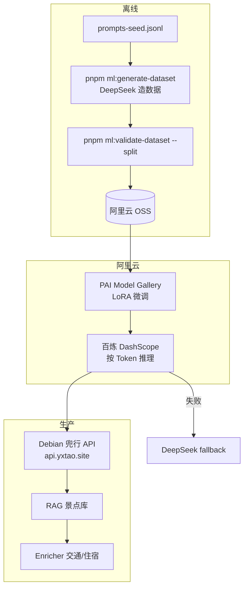

# 兜行专属模型 · 阿里云训练与部署操作指南

> **基座模型**：`DeepSeek-R1-Distill-Qwen-7B`  
> **任务**：在 RAG 约束下输出 POI 路线 JSON（不含 transit/lodging；交通/住宿仍由 Enricher 补全）  
> **推荐路径**：项目内造数据 → **PAI Model Gallery LoRA 训练** → **百炼（DashScope）按 Token 推理** → Debian 兜行 API 接入  
> **文档版本**：1.2  
> **更新日期**：2026-07-03  
> **代码状态**：**I3 基础设施已落地**（`douxing` provider · `i3:douxing-llm-cases`）；PAI LoRA 微调（I2 Step 35）待执行

> 根目录 `pnpm ml:*` 命令可用 `npm run ml:generate-dataset` 等替代，见 [包管理与命令.md](./包管理与命令.md)。

---

## 目录

1. [架构与目标](#1-架构与目标)
2. [前置准备](#2-前置准备)
3. [阶段一：项目内生成训练数据](#3-阶段一项目内生成训练数据)
4. [阶段二：上传数据到阿里云 OSS](#4-阶段二上传数据到阿里云-oss)
5. [阶段三：PAI Model Gallery 微调](#5-阶段三pai-model-gallery-微调)
6. [阶段四：百炼部署与获取 Endpoint](#6-阶段四百炼部署与获取-endpoint)
7. [阶段五：Debian 服务端接入](#7-阶段五debian-服务端接入)
8. [阶段六：验收与 A/B 对比](#8-阶段六验收与-ab-对比)
9. [阶段七：发版与再训练（v0.2+）](#9-阶段七发版与再训练v02)
10. [费用估算](#10-费用估算)
11. [常见问题](#11-常见问题)
12. [检查清单](#12-检查清单)

---

## 1. 架构与目标

### 1.1 整体链路



### 1.2 训练后期望效果

| 维度 | 训练前（DeepSeek） | 训练后（v0.1 目标） |
|------|-------------------|---------------------|
| JSON Schema 合法率 | ~85～90% | **≥ 98%** |
| POI 来自 RAG 库 | ~80～90% | **≥ 95%** |
| 单次 LLM 延迟 | 5～15s | **2～6s** |
| 用户改 POI 比例 | 基线 | **下降 30%+** |
| 月推理费（1 万次） | ~80～120 元 | **≈ 50～100 元（按 Token）** |

### 1.3 明确不做的事

- ❌ 不在 Debian 小内存服务器上训练或常驻 GPU 推理  
- ❌ 不让 LLM 编造 transit/lodging（Enricher 负责）  
- ❌ 不训 27B / 多模态 VL 模型  
- ❌ 不用笔记本 LM Studio + ngrok 作为生产主力  

---

## 2. 前置准备

### 2.1 阿里云账号与服务

| 服务 | 用途 | 控制台入口 |
|------|------|------------|
| **对象存储 OSS** | 存放 `train.jsonl` / `val.jsonl`、训练产出 | [OSS 控制台](https://oss.console.aliyun.com/) |
| **PAI 灵骏 / Model Gallery** | LoRA 微调 | [PAI 控制台](https://pai.console.aliyun.com/) → Model Gallery |
| **百炼 DashScope** | 微调模型部署与 API 调用 | [百炼控制台](https://bailian.console.aliyun.com/) |
| **RAM 子账号（可选）** | 生产环境最小权限 | RAM 访问控制 |

### 2.2 项目与密钥

| 项 | 说明 |
|----|------|
| 本仓库 | 已含 `packages/ml-training/` 与 `pnpm ml:*` 脚本（含 `ml:upload-dataset`） |
| `DEEPSEEK_API_KEY` | 写入根目录 `.env`，用于 **离线造数据**（非阿里云） |
| MySQL | 本地或 Docker，`pnpm ml:generate-dataset` 需 RAG 景点库 |
| DashScope API Key | 百炼控制台创建，用于 **推理**（训练完成后） |

### 2.3 推荐地域

**统一选华东 1（杭州）** 或 **华东 2（上海）**，OSS、PAI、百炼、Debian 调用尽量同区域，降低延迟。

---

## 3. 阶段一：项目内生成训练数据

### 3.1 扩充种子 Prompt

编辑 `packages/ml-training/datasets/prompts-seed.jsonl`，每行一条 JSON：

```json
{"prompt":"杭州3天文化之旅，预算3000","city":"杭州","days":3,"themes":["文化"]}
```

建议覆盖：**10+ 城市 × 1～7 天 × 不同预算/主题**，至少 **50～100 条种子**。

### 3.2 批量生成（DeepSeek + RAG）

在**项目根目录**执行：

```bash
# 确保 .env 已配置 DEEPSEEK_API_KEY，MySQL 已启动
pnpm ml:generate-dataset

# 试跑 20 条
pnpm ml:generate-dataset -- --limit 20 --delay-ms 800

# 校验 + 划分 train/val（90% / 10%）
pnpm ml:validate-dataset -- --split
```

### 3.3 产出文件

| 文件 | 说明 |
|------|------|
| `packages/ml-training/datasets/generated/raw.jsonl` | 原始生成结果 |
| `packages/ml-training/datasets/train.jsonl` | **上传阿里云** |
| `packages/ml-training/datasets/val.jsonl` | 评测 / 可选上传 |

### 3.4 数据格式要求

每条样本为 **ShareGPT / messages** 格式，与线上一致：

```json
{
  "messages": [
    { "role": "system", "content": "你是兜行（Douxing）旅游规划助手…" },
    { "role": "user", "content": "【用户约束】…【内容库候选 POI】…用户需求：杭州3天…" },
    { "role": "assistant", "content": "{\"name\":\"…\",\"routeDetail\":{\"days\":[…]}}" }
  ]
}
```

**硬性规则：**

- `assistant` 为 **纯 JSON 字符串**，无 markdown 代码块  
- **无** `` 思维链（R1 蒸馏训练也不要教模型输出思维链）  
- **无** `transit` / `lodging` 字段  
- `poiType=attraction` 的 `name` 必须来自 RAG 列表  

### 3.5 数据量建议

| 阶段 | train 条数 |
|------|------------|
| 试跑验证 | 50～200 |
| **v0.1 上线** | **2000～5000** |
| v0.2 迭代 | 再 +500～2000 |

---

## 4. 阶段二：上传数据到阿里云 OSS

### 4.1 创建 Bucket

1. 登录 [OSS 控制台](https://oss.console.aliyun.com/)  
2. **创建 Bucket**  
   - 名称：如 `douxing-ml-hz`  
   - 地域：与 PAI 一致（如华东 1 杭州）  
   - 读写权限：**私有**  
3. 创建目录：`douxing/datasets/v0.1/`

### 4.2 上传文件

**推荐（项目内脚本）** — 配置根目录 `.env` 中 `OSS_ENABLED=true` 及 OSS 相关变量后，在项目根目录执行：

```bash
# 上传 train.jsonl / val.jsonl 至 OSS，并生成 manifests/pai-job-v0.1.json
pnpm ml:upload-dataset

# 仅生成 manifest，不实际上传（联调）
pnpm ml:upload-dataset -- --dry-run

# 本地验收（可选校验 OSS 对象是否存在）
pnpm --filter @douxing/server i2:pai-lora-cases -- --verify-oss
```

也可使用控制台上传，或 ossutil 手动上传：

```bash
ossutil cp packages/ml-training/datasets/train.jsonl oss://douxing-ml-hz/douxing/datasets/v0.1/train.jsonl
ossutil cp packages/ml-training/datasets/val.jsonl   oss://douxing-ml-hz/douxing/datasets/v0.1/val.jsonl
```

记录 OSS 路径，训练任务中需填写：

```text
oss://douxing-ml-hz/douxing/datasets/v0.1/train.jsonl
oss://douxing-ml-hz/douxing/datasets/v0.1/val.jsonl
```

---

## 5. 阶段三：PAI Model Gallery 微调

### 5.1 进入训练

1. 打开 [PAI 控制台](https://pai.console.aliyun.com/)  
2. 左侧 **Model Gallery（模型广场）**  
3. 搜索 **`DeepSeek-R1-Distill-Qwen-7B`**  
4. 点击卡片 → **训练**

> 不要选 Qwen2.5-VL、Qwen3.5-27B 等多模态或大模型。

### 5.2 训练配置

| 配置项 | 推荐值 |
|--------|--------|
| 训练方式 | **SFT 监督微调** |
| 微调方法 | **LoRA**（不要全参 SFT） |
| 训练数据集 | OSS 路径 → **`train-pai.jsonl`**（Alpaca：`instruction`/`input`/`output`） |
| 验证数据集 | OSS 路径 → **`val-pai.jsonl`**（可选） |
| 模型输出路径 | 如 `oss://douxing-ml-hz/douxing/checkpoints/v0.1/` |
| 资源组 | 选有 **GPU** 的公共资源组 |
| 算力规格 | **1 卡 GPU，显存 ≥ 16GB**（如 gn 系列） |

### 5.3 超参数

| 参数 | 值 | 说明 |
|------|-----|------|
| `num_train_epochs` | **3** | 数据少可 4，多可 2 |
| `learning_rate` | **1e-4** | LoRA 常用 |
| `seq_length` / `max_length` | **8192** | 样本含长 system + JSON，4096 会被全部滤掉 |
| `per_device_train_batch_size` | **1** | OOM 则保持 1 |
| `lora_rank` | **16** | 8～32 均可 |
| `warmup_ratio` | **0.1** | 默认即可 |

### 5.4 提交与等待

1. 点击 **确定 / 提交训练**  
2. 在 **训练任务详情** 查看 loss 曲线，应平稳下降  
3. 预计耗时：**2～6 小时**（视数据量与 GPU）  
4. 完成后 checkpoint 位于所填 OSS 输出目录  

### 5.5 离线评测（可选）

对 `val.jsonl` 抽样，检查：

- JSON 能否被项目内 `llmRouteSchema` 解析  
- POI 名称是否在 RAG 候选内  

---

## 6. 阶段四：百炼部署与获取 Endpoint

> **重要**：推理请使用百炼 **按 Token 计费** 的部署方式，**不要**在 PAI 上 7×24 常驻整卡 GPU 在线服务（低流量时极贵）。

### 6.1 发布微调模型

1. 打开 [百炼控制台](https://bailian.console.aliyun.com/)  
2. **模型调优 / 我的模型** → 找到 PAI 训练产出或百炼微调任务  
3. **部署** → 选择 **按量付费（Token）** 推理（若有选项）  
4. 记录：  
   - **模型 ID**（如 `ft-xxxxxxxx` 或 `douxing-planner-v0.1`）  
   - **API Key**（DashScope）  

若 PAI 训练产物需先 **导入百炼**，按控制台「从 PAI 导入」向导操作。

### 6.2 OpenAI 兼容调用地址

百炼兼容模式 Base URL（中国内地）：

```text
https://dashscope.aliyuncs.com/compatible-mode/v1
```

### 6.3 公网测试（任意机器）

```bash
curl -X POST "https://dashscope.aliyuncs.com/compatible-mode/v1/chat/completions" \
  -H "Authorization: Bearer sk-你的DashScopeKey" \
  -H "Content-Type: application/json" \
  -d '{
    "model": "你的微调模型ID",
    "messages": [
      {
        "role": "user",
        "content": "帮我规划杭州3天文化游，预算3000"
      }
    ],
    "temperature": 0.6,
    "max_tokens": 2048
  }'
```

**期望**：返回内容为 **单个 JSON 对象**（或可被提取的 JSON），无 markdown 包裹。

### 6.4 推理注意

| 项 | 说明 |
|----|------|
| 思维链 | **关闭** thinking / 推理模式（若模型支持） |
| `response_format` | 可试 `{"type":"json_object"}`（视百炼模型支持情况） |
| 并发 | 按百炼配额；生产建议监控 QPS |

---

## 7. 阶段五：Debian 服务端接入

### 7.1 环境变量

在 **生产服务器** `.env`（参考 `deploy/env.production.example`）增加：

```env
# ---------- 兜行专属微调模型（百炼） ----------
DOUXING_LLM_ENABLED=true
DOUXING_LLM_BASE_URL=https://dashscope.aliyuncs.com/compatible-mode/v1
DOUXING_LLM_MODEL=ft-你的微调模型ID
DOUXING_LLM_API_KEY=sk-你的DashScopeKey
DOUXING_LLM_TIMEOUT_MS=90000

# 降级：DeepSeek 仍保留
LLM_DEFAULT_PROVIDER=auto
DEEPSEEK_API_KEY=sk-xxx
DEEPSEEK_BASE_URL=https://api.deepseek.com/v1
DEEPSEEK_MODEL=deepseek-chat
```

### 7.2 服务端改造要点

**已实现（2026-07-01）**：`packages/server/src/config/llm.ts` · `llm-client.service.ts` · 规划页 `douxing` 选项 · `GET /api/routes/llm-status` 返回 `douxingConfigured`/`douxingEnabled`。

验收：`pnpm --filter @douxing/server i3:douxing-llm-cases`（`--live` 含真实百炼调用）。

原设计要点（供对照）：

```text
auto 链顺序建议：
  douxing-finetuned（百炼） → deepseek → lmstudio → 模板/RAG 组装
```

`packages/server/src/services/llm-client.service.ts` 请求体与 DeepSeek 相同：

```text
POST {DOUXING_LLM_BASE_URL}/chat/completions
Authorization: Bearer {DOUXING_LLM_API_KEY}
Body: { model, messages, temperature, max_tokens }
```

**Prompt 必须与训练一致**（复用 `buildRoutePlannerMessages`，不要改 system 模板）。

### 7.3 部署更新

```bash
# 在 Debian 项目目录
git pull
pnpm build:server
pm2 restart douxing-api   # 或你的 PM2 进程名
```

### 7.4 移动端

**无需改动**。小程序/H5 仍调用：

```text
POST https://api.yxtao.site/api/routes/generate
```

### 7.5 降级链

```text
generateRoute()
  → 百炼 douxing-planner-v0.1
  → 失败/超时 → DeepSeek V4-Flash
  → 失败 → RAG 模板组装
  → 始终 → Enricher（高德、班次、酒店）
```

---

## 8. 阶段六：验收与 A/B 对比

### 8.1 离线指标（val.jsonl）

| 指标 | 目标 |
|------|------|
| Schema 通过率 | ≥ 98% |
| POI 命中率（相对 RAG） | ≥ 95% |
| 平均输出 token | 较 DeepSeek 基线下降为佳 |

### 8.2 在线指标

在 `plan_sessions` 或日志中记录：

| 字段 | 说明 |
|------|------|
| `provider` | `douxing-finetuned` / `deepseek` |
| `latencyMs` | LLM 耗时 |
| `schemaValid` | 是否通过 Zod |
| `userEditedPoi` | 用户是否改 POI |

### 8.3 手测用例（zh-CN / en-US 各 5 条）

- 杭州 3 天文化  
- 北京 5 天亲子  
- 成都 2 天美食  
- 多轮：「把第二天改成轻松一点」  
- 边界：库内 POI 不足的城市（应少编造）  

---

## 9. 阶段七：发版与再训练（v0.2+）

### 9.1 何时再训

| 信号 | 动作 |
|------|------|
| 新城市/大量新景点 | 补种子 → 生成样本 → **v0.2** |
| 用户常改某类路线 | 导出编辑 diff 作样本 |
| POI 命中率 < 90% | 补 bad case + 重训 |
| 仅 Enricher/班次更新 | **不必重训** |

### 9.2 再训练方式

- 在 v0.1 checkpoint 上 **继续 LoRA** 或全量新数据重训  
- OSS 路径改为 `v0.2/`  
- 百炼部署新模型 ID，`.env` 切换后 PM2 重启  

### 9.3 节奏建议

```text
v0.1：首次 2000～5000 条，上线
v0.2：+1～3 个月或 +500 条优质样本
```

---

## 10. 费用估算

| 环节 | 一次性 / 持续 | 粗算 |
|------|---------------|------|
| DeepSeek 造 3000 条 | 一次性 | ~30～50 元 |
| PAI LoRA 训练 | 一次性 | ~50～100 元 |
| 百炼推理（按 Token） | **持续** | ~0.003～0.01 元/次规划 |
| 月 1 万次规划 | 持续 | ~**50～100 元** |
| OSS 存储 | 持续 | ~几元/月 |

**对比**：DeepSeek 直连月 1 万次 ~80～120 元；百炼微调按 Token **同量级**，专属模型 **不会必然更贵**。  
**避免**：PAI/EAS **7×24 常驻 GPU**（低流量时可 **数千～上万/月**）。

---

## 11. 常见问题

### Q1：训练一次就够吗？

**v0.1 上线够**；长期需 v0.2、v0.3 增量再训，见 [§9](#9-阶段七发版与再训练v02)。

### Q2：PAI 和百炼什么关系？

- **PAI**：适合 **GPU 训练**（Model Gallery LoRA）  
- **百炼**：适合 **按 Token 推理 API**（生产调用）  

### Q3：能否只用百炼 API 微调、不用 PAI？

可以。百炼支持 `deepseek-r1-distill-qwen-7b` 的 SFT API，上传 `file_id` 后创建微调任务，见 [百炼模型调优文档](https://help.aliyun.com/zh/model-studio/fine-tuning-api-guide)。  
本指南以 **PAI 可视化训练** 为主，百炼 API 为等价替代。

### Q4：Debian 内存少有没有影响？

**无影响**（仅 HTTP 调百炼）。不要在 Debian 上跑 7B 推理。

### Q5：腾讯云短信还能用吗？

可以。**短信腾讯 + 模型阿里** 是常见组合。

### Q6：返回带 markdown 或思维链怎么办？

- 检查训练数据 `assistant` 是否纯 JSON  

### Q7：PAI 报错 `IndexError: size 0` / `Dataset filtered … length: 0`？

**原因**：Swift 预处理后训练集为 0 条。常见两类：

1. **格式**：PAI QuickStart 默认按 **Alpaca**（`instruction`/`output`）解析，勿直接用 `messages` 格式的 `train.jsonl`。执行 `pnpm ml:upload-dataset` 会生成并上传 **`train-pai.jsonl`**，控制台训练集改选该文件。
2. **长度**：`seq_length` 过短（如 4096）会把含长 system + JSON 的样本全部滤掉。请设为 **8192**，`batch_size=1`。

日志中若见 `There are errors in the dataset, the data will be deleted`，向上滚动查看具体行错误。

- 推理关闭 thinking  
- 服务端继续用 `extractJsonObject` + `llmRouteSchema` 校验，失败则 fallback DeepSeek  

---

## 12. 检查清单

### 数据

- [ ] `prompts-seed.jsonl` ≥ 50 条  
- [ ] `pnpm ml:generate-dataset` 成功  
- [ ] `pnpm ml:validate-dataset -- --split` 通过  
- [ ] `train.jsonl` ≥ 2000 条（v0.1）  

### 阿里云

- [ ] OSS Bucket 与 PAI 同地域  
- [ ] PAI LoRA 训练成功，loss 正常  
- [ ] 百炼部署完成，拿到模型 ID + API Key  
- [ ] curl 测试 `/chat/completions` 返回合法 JSON  

### 兜行生产

- [ ] Debian `.env` 配置 `DOUXING_LLM_*`  
- [ ] `llm.ts` auto 链含百炼 → DeepSeek 降级  
- [ ] `pm2 restart` 后规划页可生成路线  
- [ ] Enricher 交通/住宿正常  
- [ ] en-US / zh-CN 各抽测通过  

---

## 相关文档

| 文档 | 说明 |
|------|------|
| [packages/ml-training/README.md](../packages/ml-training/README.md) | 数据脚本与 LLaMA-Factory 配置 |
| [env-environments.md](./env-environments.md) | 三套环境变量 |
| [deploy-production.md](./deploy-production.md) | Debian 部署 |
| [开发记录 C3 / H9](./开发记录-重难点与亮点.md) | RAG 与 Enricher 原理 |

---

## 官方链接

- [PAI Model Gallery 快速入门](https://help.aliyun.com/zh/pai/getting-started/model-gallery-quick-start)  
- [百炼模型调优 API](https://help.aliyun.com/zh/model-studio/fine-tuning-api-guide)  
- [百炼模型定价](https://help.aliyun.com/zh/model-studio/model-pricing)  
- [DashScope 兼容 OpenAI 接口](https://help.aliyun.com/zh/model-studio/developer-reference/use-qwen-by-calling-api)
