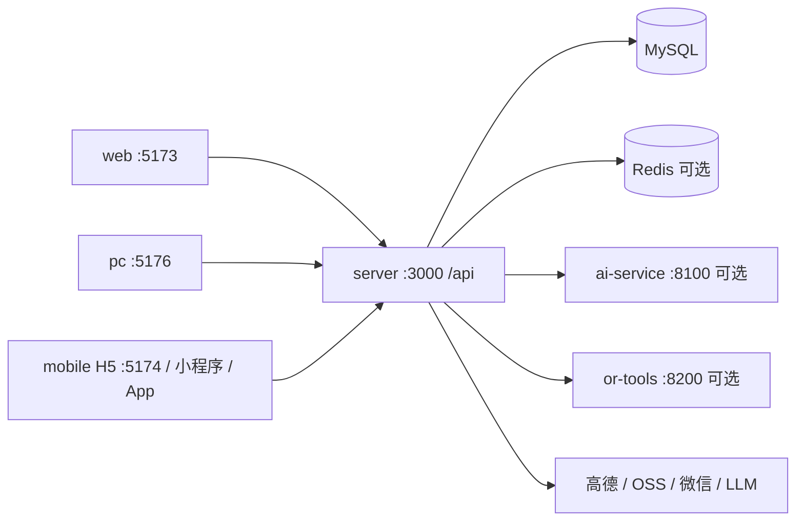

# 兜行 · 项目分析总结

> 生成日期：2026-09-11  
> 分析根目录：`projects/douxing`（LabHub 托管克隆）  
> 说明：基于仓库内 README、`package.json`、`project.manifest.yaml`、`.env.example`、`docs/` 与路由入口整理；推断处已标明。

## 1. 一句话定位

**兜行（Douxing）** 是 AI 驱动的个性化旅游决策与社交平台：pnpm Monorepo 统一后端 API、Web 管理端、PC 用户端、UniApp 移动端（H5 / 微信小程序 / App），并可选 Python AI / OR-Tools 路径求解服务。

## 2. 项目概览

| 项 | 内容 |
|---|---|
| 类型 | 全栈 pnpm Monorepo（`packages/*`） |
| 主要语言 | TypeScript（前端 / 后端）；Python（AI / OR-Tools，可选） |
| 包管理器 | pnpm@9.15.0（亦支持 npm workspaces） |
| 远程仓库 | https://github.com/yxtao-lab/douxing.git |
| 当前分支 | `main` |
| 许可证 | 根 `package.json` 为 `private`；`project.manifest.yaml` 亦标 private |
| 成熟度 | 主链、发单接单、数据中台、流程编排等已大量交付；真机支付与部分商业化仍受商户号 / 对公办理阻塞（见 `docs/下一步工作.md`） |

### 2.1 目标与范围

- 要解决的问题：一站式旅行规划、路线运营、打卡 / 相册、发单接单、管理后台与运营大屏，覆盖 Web / PC / H5 / 小程序 / App。
- 明确不做的事（文档线索）：完整商业化微信支付闭环尚未收口；PAI LoRA 自训现网主路径已延后（现网用百炼 / DeepSeek / LM Studio）；数字孪生 / AR 可后置。

### 2.2 使用者与场景

- 目标用户：出行产品开发者、运营管理员、C 端旅行用户（PC / H5 / 小程序）。
- 典型使用场景：本地 `pnpm bootstrap:dev` 联调全端；管理端运营路线与订单；PC / H5 体验 AI 规划与打卡。

## 3. 我能用这个项目做什么

> 作为使用者，跑起来之后能得到什么结果。

| # | 我可以… | 得到的结果 | 依据（功能 / 路由 / 脚本） |
|---|---|---|---|
| 1 | 一键初始化 MySQL + 迁移种子并起开发服务 | 本地可联调 API / 管理端 / PC / H5 | `pnpm bootstrap` / `bootstrap:dev`、`scripts/deploy.mjs` |
| 2 | 配置 LLM 后生成旅行路线 | 验证 AI 规划主链与路线详情 | `POST /api/routes/generate`、规划页、`LLM_*` / `DEEPSEEK_*` / `DOUXING_LLM_*` |
| 3 | 启动 Web 管理端做运营与 RBAC | 路线 / 订单 / 打卡 / 系统管理 / 运营大屏 / 流程编排 | `pnpm dev:admin` → `:5173`、`docs/系统管理.md`、`/screen/travel` |
| 4 | 启动 PC / H5 / 小程序体验 C 端主流程 | 规划、路线广场、打卡、相册、旅行宠物等 | `pnpm dev:pc` / `dev:mobile` / `dev:mp-weixin` |
| 5 | 联调发单接单（marketplace）能力 | 验证模块 B 与主链并列 | `packages/server/src/routes/marketplace/`、`docs/发单接单平台.md` |
| 6 | 可选启动 AI / OR-Tools 微服务 | 编排与路径算法实验 | `pnpm dev:ai-service` `:8100`、`pnpm dev:route-solver` `:8200` |
| 7 | 按文档部署公网 API 与静态站 | 腾讯云 Debian 等发版路径 | `pnpm deploy:server` / `deploy:release`、`docs/deploy-production.md` |

### 3.1 适合谁用 / 不适合做什么

- 适合：本机全栈联调、运营后台验收、AI 规划与多端 UI 迭代、LabHub 分 profile 启停。
- 不适合 / 未实现：未办妥商户号前的真机微信支付收口；把本仓当作「无 MySQL 也能完整跑业务」的纯静态站；把 PAI LoRA 当作当前现网主路径。

### 3.2 与周边系统如何配合

- **LabHub 托管**：`data/projects.json` 中 id=`douxing`，路径 `projects/douxing`；默认 `pnpm run dev`，openUrl `http://127.0.0.1:5173`；另有 `dev-admin`、`dev-server`、`dev-pc`、`dev-mobile`、`dev-ai-service` 等 startProfiles。
- 提交推送：在本目录 `git push origin` → `https://github.com/yxtao-lab/douxing.git`。
- 可选依赖：Docker MySQL / Redis、高德、OSS、短信、微信、百炼 / DeepSeek / LM Studio、Langfuse。

## 4. 具体实施步骤

### 场景 A：在 LabHub 下本地跑通（推荐）

1. 前置：Node.js ≥ 18；已装 **pnpm**（或用 npm workspaces）；本机 MySQL **或** Docker；LabHub 已登记本项目。
2. 安装与环境：
   ```bash
   cd projects/douxing
   cp .env.example .env
   # 核对 DATABASE_URL 与本机 MySQL；3306 冲突时可改 DOCKER_MYSQL_HOST_PORT / 用 --skip-docker
   pnpm install
   pnpm bootstrap:dev --skip-docker   # 本机已有 MySQL 时
   # 或：pnpm bootstrap:dev
   ```
3. 日常开发也可：`pnpm dev`（全端）或 LabHub 选「管理后台」等 profile。
4. 验证：
   - `curl http://127.0.0.1:3000/api/health`
   - 管理端 http://127.0.0.1:5173 （种子账号：`admin` / `admin123`）
   - PC http://127.0.0.1:5176 ；H5 http://127.0.0.1:5174
5. 可选：`pnpm env:status` 确认 API 指向；禁用自启浏览器：`DOUXING_NO_OPEN=1 pnpm dev`。

### 场景 B：仅 API + 管理端验收

1. 前置：已完成 `pnpm install` 与 `.env`（至少 `DATABASE_URL`、`JWT_SECRET`；可选 `DEEPSEEK_API_KEY`）。
2. 数据库：`pnpm db:setup`（或 `db:migrate` + `db:seed`）。
3. 启动：`pnpm dev:admin`（API `:3000` + 管理端 `:5173`）。
4. 验证：`GET /api/health`；管理端登录后刷新无白屏；可选 `GET /api/routes/llm-status`（需已配 LLM）。
5. 小改动落点：API `packages/server/src/routes/`；管理端 `packages/web/src/views/`。

### 场景 C：体验一次 AI 路线生成

1. 前置：场景 A 或 B 已跑通；`.env` 中 `LLM_ENABLED=true`，并配置 `DEEPSEEK_API_KEY` 或本地 LM Studio（`LLM_BASE_URL` / `LLM_MODEL`）。
2. 打开 PC（`:5176`）或 H5（`:5174`）规划入口，提交一次生成请求。
3. 验证：Network 出现 `POST /api/routes/generate` 且返回路线数据；或管理端可查看对应路线。
4. 失败排查：`pnpm env:status`、检查 LLM 服务可达性、看 server 日志。

## 5. 技术栈

| 层级 | 选型 | 依据（文件） |
|---|---|---|
| 运行时 / 语言 | Node.js ≥ 18；Python（可选） | 根 `engines`、`packages/ai-service`、`packages/or-tools` |
| 后端 | Express + TypeScript + Drizzle ORM | `@douxing/server` |
| 管理端 | Vue 3 + Ant Design Vue + Vite + Pinia + ECharts + Vue Flow | `@douxing/web/package.json` |
| PC 用户端 | Vue 3 + Tailwind + Vite + Pinia + Leaflet | `@douxing/pc/package.json` |
| 移动端 | UniApp (Vue 3) + Vite | `@douxing/mobile/package.json` |
| 共享 | `@douxing/shared` 类型与常量 | `packages/shared` |
| 数据 | MySQL 8；可选 Redis | `docker-compose.yml`、`DATABASE_URL`、`REDIS_*` |
| AI | FastAPI + LangChain（可选）；Node 侧 LLM Provider | `@douxing/ai-service`、`.env.example` |
| 路径求解 | OR-Tools Python 服务（可选） | `@douxing/or-tools` |
| 包管理 / 编排 | pnpm workspace + 根 scripts | `pnpm-workspace.yaml`、`scripts/pm.mjs` |
| 鉴权 | JWT 双 Token（Access + Refresh） | `JWT_*`、`docs/双Token认证与无感刷新.md` |

## 6. 架构与目录

### 6.1 逻辑架构



### 6.2 顶层目录职责

| 路径 | 职责 |
|---|---|
| `packages/` | 业务子包（web / pc / mobile / server / shared / ai-service / or-tools / ml-training） |
| `docs/` | 路线图、API、发版与领域文档 |
| `scripts/` | 开发编排、部署与运维脚本 |
| `deploy/` | 生产 compose、PM2、Nginx 模板 |
| `docker-compose.yml` | 本地 MySQL（及可选 Redis） |
| `project.manifest.yaml` | 产品元数据、端口、域名、功能开关（无密钥） |

### 6.3 Monorepo 子项目

| 包名 | 路径 | 职责 |
|---|---|---|
| `@douxing/server` | `packages/server` | Express API、Drizzle、业务脚本与用例 |
| `@douxing/web` | `packages/web` | Web 管理端 |
| `@douxing/pc` | `packages/pc` | PC 用户端 |
| `@douxing/mobile` | `packages/mobile` | UniApp 多端 |
| `@douxing/shared` | `packages/shared` | 共享类型与常量 |
| `@douxing/ai-service` | `packages/ai-service` | Python AI 微服务（manifest 默认 `enabled: false`） |
| `@douxing/or-tools` | `packages/or-tools` | 路径求解（含 upstream submodule） |
| `@douxing/ml-training` | `packages/ml-training` | 专属模型 LoRA 训练数据与配置 |

## 7. 核心模块

| 模块 | 职责 | 关键路径 |
|---|---|---|
| API 路由聚合 | 挂载 health / auth / routes / orders / marketplace 等 | `packages/server/src/routes/index.ts` |
| 认证与用户 | 登录、双 Token 刷新、用户资料 | `routes/auth.ts`、`routes/users.ts` |
| 路线与规划 | AI 生成、发布、行程、审核 | `routes/routes.ts`、`routes/plan-sessions.ts`、`routes/playbooks.ts` |
| 发单接单 | marketplace 需求 / 匹配 / 支付相关 | `routes/marketplace/` |
| 打卡 / 相册 / 游戏化 | 打卡、旅程相册、成就徽章排行榜 | `routes/checkins.ts`、`journey-albums.ts`、`achievements.ts` 等 |
| 系统管理与数据中台 | RBAC、分析、运营大屏 | `routes/system-admin.ts`、`routes/analytics.ts` |
| AI Agent / 工作流 | Agent 工具、工作流模板、路径求解管理 | `routes/agent-*.ts`、`admin-workflow-templates.ts`、`admin-route-solver.ts` |
| 旅行宠物 | 宠物养成相关 API | `routes/pets.ts` |
| 共享层 | 跨端类型 / 常量 / `API_PREFIX` | `packages/shared/src/` |
| 管理端 / PC / Mobile | 各端 UI 与状态 | `packages/web|pc|mobile/src/` |

## 8. 入口与关键流程

### 8.1 应用入口

- 根编排：`package.json` scripts → `scripts/run-dev*.mjs` / `pm.mjs` / `deploy.mjs`
- API 进程：`packages/server` → `tsx watch src/index.ts`（dev）
- 前端：各包 Vite / UniApp 入口
- HTTP 前缀：`/api`（与 `project.manifest.yaml` / shared 常量一致）

### 8.2 主流程

**流程 A：AI 路线生成**

1. 客户端（PC / H5 / 小程序）规划页提交意向  
2. `POST /api/routes/generate`（可走 Node LLM 或可选 ai-service / LangGraph）  
3. 持久化路线到 MySQL → 详情 / 发布 /（可选）支付解锁  

**流程 B：管理端运营**

1. `pnpm dev:admin` → 登录 RBAC  
2. 路线 / 订单 / 系统管理 / 运营大屏 / 工作流模板  
3. 写操作经 `/api/*` 回写 MySQL  

**流程 C：发单接单**

1. C 端或伙伴侧创建需求 / 接单  
2. ` /api/marketplace/*` 匹配与订单流转  
3. 支付模式由 `PAYMENT_MODE`（mock / wechat / auto）决定  

## 9. API 与数据

### 9.1 对外接口（节选）

| 方法 | 路径 | 说明 |
|---|---|---|
| GET | `/api/health` | 健康检查 |
| * | `/api/auth/*` | 登录 / 刷新 / 登出 |
| * | `/api/routes/*` | 路线 CRUD / 生成 / LLM 状态等 |
| * | `/api/orders/*`、`/api/payments/*` | 订单与支付 |
| * | `/api/checkins/*`、`/api/journey-albums/*` | 打卡与相册 |
| * | `/api/marketplace/*` | 发单接单 |
| * | `/api/analytics/*`、`/api/system-admin/*` | 数据中台与系统管理 |
| * | `/api/pets/*` | 旅行宠物 |

完整契约见 `docs/API接口文档.md`、`docs/openapi.yaml`。

### 9.2 核心数据模型（基于路由 / 文档推断）

| 实体 | 说明 | 关键位置 |
|---|---|---|
| users / refresh_tokens | 用户与双 Token | Drizzle schema + `auth` |
| routes / attractions / scenes | 路线与景点 | `routes`、`attractions`、`scenes` |
| orders / payments | 订单支付 | `orders`、`payments` |
| checkins / journey albums | 打卡与相册 | 对应 routes |
| marketplace_* | 发单接单域 | `routes/marketplace/` |
| analytics_* | 埋点与日汇总 | `analytics` + `pnpm analytics:rollup` |

### 9.3 外部依赖与集成

| 服务 | 用途 | 配置项（变量名） |
|---|---|---|
| MySQL | 主库 | `DATABASE_URL`、`MYSQL_*` |
| Redis | 缓存（地理编码等） | `REDIS_URL`、`REDIS_ENABLED` |
| DeepSeek / LM Studio / 百炼 | LLM 规划 | `DEEPSEEK_*`、`LLM_*`、`DOUXING_LLM_*` |
| 高德 | 地理编码 / POI / 路网 | `AMAP_WEB_KEY`、`AMAP_*` |
| 对象存储 | 封面 / 相册 / 训练数据 | `OSS_*` |
| 微信支付 | 真机支付 | `WECHAT_PAY_*`、`PAYMENT_MODE` |
| Langfuse | LLM 观测 | `LANGFUSE_*` |
| AI / OR-Tools 服务 | 可选微服务 | `AI_SERVICE_*`、`ROUTE_SOLVER_*` |

## 10. 配置与运行

### 10.1 环境变量（仅名称与用途）

| 变量名 | 用途 | 是否必需 |
|---|---|---|
| `DATABASE_URL` | MySQL 连接串 | 是（业务） |
| `SERVER_PORT` | API 端口（默认 3000） | 否 |
| `JWT_SECRET` / `JWT_ACCESS_EXPIRES_IN` / `JWT_REFRESH_EXPIRES_IN` | 双 Token 签发 | 是（认证） |
| `LLM_*` / `DEEPSEEK_*` / `DOUXING_LLM_*` | LLM Provider | 规划功能可选 |
| `AI_SERVICE_*` / `ROUTE_SOLVER_*` / `WORKFLOW_ENGINE` | 外部 AI / 求解器 / 编排引擎 | 可选 |
| `OSS_*` / `AMAP_*` / `WECHAT_*` / `REDIS_*` | 存储、地图、支付、缓存 | 可选 |
| `MYSQL_*` / `DOCKER_MYSQL_HOST_PORT` | Docker MySQL | 可选 |
| `API_PUBLIC_BASE_URL*` | 静态资源对外基址 | 分环境建议配置 |
| `PAYMENT_MODE` / `ROUTE_UNLOCK_PAYMENT_REQUIRED` | 支付与解锁策略 | 可选 |

### 10.2 本地启动

```bash
cd projects/douxing
cp .env.example .env
pnpm install
pnpm bootstrap:dev          # 或 --skip-docker
# 日常：
pnpm dev                    # 全端
pnpm dev:admin              # API + 管理端
pnpm stop:dev               # 停开发进程，保留 Docker MySQL
```

### 10.3 常用脚本

| 命令 | 作用 |
|---|---|
| `pnpm install` | 安装依赖 |
| `pnpm bootstrap` / `bootstrap:dev` | 一键初始化（可 `--skip-docker`） |
| `pnpm dev` / `dev:only <平台>` | 全端 / 组合启动 |
| `pnpm dev:server` / `dev:web` / `dev:pc` / `dev:mobile` / `dev:admin` | 分端 |
| `pnpm db:setup` / `db:migrate` / `db:seed` / `db:reset` | 数据库 |
| `pnpm build` / `build:only …` | 构建 |
| `pnpm deploy:server` / `deploy:release` | 服务端 / 发版 |
| `pnpm stop` / `stop:dev` / `stop:docker` | 停止 |
| `pnpm env:status` | 查看当前环境 API 指向 |

### 10.4 测试与 CI

- 服务端大量用例脚本：`pnpm --filter @douxing/server <script>`（如 `m0:marketplace-cases`、`w4:plan-golden-cases`）。
- 根目录 `pnpm lint`：各包 TypeScript 检查。
- CI / 发版：`.workflow/*-pipeline.yml` + `docs/发版流程与CI-CD解析.md`；本地亦可 Webhook（`pnpm webhook:serve`）。

### 10.5 部署线索

- 生产：腾讯云轻量 + Docker MySQL/Redis + PM2 + Nginx/HTTPS（`docs/deploy-production.md`）。
- 静态站：`deploy:pc` / `deploy:web-site` / `deploy:static-sites`。
- 域名（技术域）：API `api.yxtao.site` / 测试 `api-test.yxtao.site`；品牌域候选见 `docs/域名规划.md`。

### 10.6 默认端口

| 服务 | 端口 |
|---|---|
| API | 3000 |
| 管理端 | 5173 |
| H5 | 5174 |
| App 热更新 Vite | 5175 |
| PC | 5176 |
| AI | 8100 |
| OR-Tools | 8200 |
| Docker MySQL（映射） | 3307（避免占本机 3306） |
| Redis | 6379 |

## 11. 工程约定

- 代码：变量 camelCase、常量 UPPER_SNAKE_CASE、组件 PascalCase（`project.manifest.yaml` / 工作区规范）。
- 文档与注释：中文优先；提交 Conventional Commits + 中文 subject。
- API 响应形：`{ code, message, messageKey?, data }`，成功 `code === 0`。
- 前端禁止默认 React；管理端 Ant Design Vue，PC Tailwind，移动端自研组件 + uni 内置。
- 密钥只进 `.env`，不进 `project.manifest.yaml` / Git。

## 12. 风险、债与未知

- **端口冲突**：与 LabHub 其它托管项目（如 FreeLLMAPI `:5173`、EZShell `:3000`）并存时需分时启动或改端口。
- **MySQL / Docker**：本机 3306 占用时用 `--skip-docker` 或改映射端口。
- **密钥**：生产必须更换 `JWT_SECRET` 等占位值；勿提交 `.env` 实值。
- **支付**：公司 / 对公 / 商户号未齐前，真机支付无法完整验收（`docs/后期待办.md`）。
- **submodule**：`packages/or-tools/upstream` 可选，需要时再 `git submodule update --init`。
- **AI 服务默认关闭**：manifest 中 `aiService.enabled: false`；`pnpm dev` 编排是否拉起以根脚本为准，单独调试用 `dev:ai-service`。
- **下一步文档日期**：`docs/下一步工作.md` 标「最后更新 2026-07-17」，与代码现状可能有滞后，以 ROADMAP / 代码为准。

## 13. 新人上手路径

1. 阅读：`README.md` → `docs/启动与部署流程.md` → 本文件。  
2. 完成「场景 A」：`cp .env.example .env` → `pnpm install` → `pnpm bootstrap:dev`（或 `--skip-docker`）。  
3. 打开 http://127.0.0.1:5173 登录 `admin` / `admin123`，并 `curl http://127.0.0.1:3000/api/health`。  
4. 需要规划能力时再配 `DEEPSEEK_API_KEY` 或 LM Studio，走「场景 C」。  
5. 小改动：后端 `packages/server/src/routes/`；管理端 `packages/web/src/views/`；PC `packages/pc/src/`。

## 14. 参考文件索引

| 主题 | 路径 |
|---|---|
| README | `README.md` |
| 项目清单 | `project.manifest.yaml` |
| 包脚本 | `package.json` |
| 启动部署 | `docs/启动与部署流程.md` |
| 环境变量说明 | `docs/env-environments.md`、`.env.example` |
| API / OpenAPI | `docs/API接口文档.md`、`docs/openapi.yaml` |
| 路线图 / 下一步 | `docs/ROADMAP.md`、`docs/下一步工作.md` |
| 生产部署 | `docs/deploy-production.md` |
| LabHub 登记 | `../../data/projects.json`（id=`douxing`） |
| 路由入口 | `packages/server/src/routes/index.ts` |
