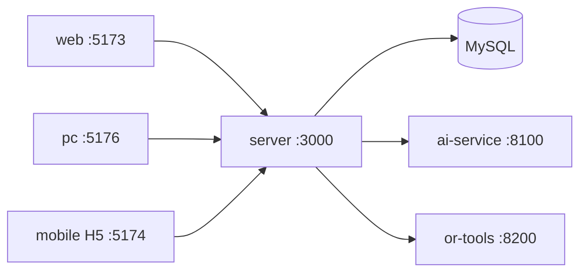

# 兜行 · 项目分析总结

> 生成日期：2026-09-10  
> 分析根目录：`projects/douxing`（LabHub 托管克隆）  
> 说明：基于仓库内 README、package 脚本、docs 与 `.env.example` 整理；推断处已标明。

## 1. 一句话定位

**兜行（Douxing）** 是面向自助游与发单接单的**多端出行服务平台**：pnpm Monorepo 统一后端 API、Web 管理端、PC 用户端、UniApp 移动端，并可选 Python AI / 路径求解服务。

## 2. 项目概览

| 项 | 内容 |
|---|---|
| 类型 | 全栈 pnpm Monorepo（`packages/*`） |
| 主要语言 | TypeScript（前端/后端）；Python（AI / OR-Tools，可选） |
| 包管理器 | pnpm@9.15.0（亦支持 npm workspaces） |
| 远程仓库 | https://github.com/yxtao-lab/douxing.git |
| 当前分支 | `main` |
| 许可证 | 未在仓库根标明 |
| 成熟度 | 主链与多条业务线已有大量交付；支付真机与部分商业化仍在推进（见 ROADMAP / 下一步工作） |

### 2.1 目标与范围

- 要解决的问题：一站式旅行规划、路线运营、打卡/相册、发单接单与管理后台，覆盖 Web / PC / H5 / 小程序 / App。
- 明确不做的事（文档线索）：完整商业化支付闭环尚未收口；数字孪生/AR 可后置；自训 PAI LoRA 现网主路径已延后。

### 2.2 使用者与场景

- 目标用户：出行产品开发者、运营管理员、C 端旅行用户（PC/H5/小程序）。
- 典型使用场景：本地 `pnpm bootstrap:dev` 联调全端；管理端运营路线与订单；PC/H5 体验 AI 规划与打卡。

## 3. 我能用这个项目做什么

| # | 我可以… | 得到的结果 | 依据 |
|---|---|---|---|
| 1 | 一键初始化 MySQL + 迁移种子并起开发服务 | 本地可联调 API / 管理端 / PC / H5 | `pnpm bootstrap` / `bootstrap:dev`、`scripts/deploy.mjs` |
| 2 | 配置 LLM 后生成旅行路线 | 验证 AI 规划主链与路线详情 | `POST /api/routes/generate`、规划页、`LLM_*` / `DEEPSEEK_*` |
| 3 | 启动 Web 管理端做运营与 RBAC | 路线/订单/打卡/系统管理/运营大屏 | `pnpm dev:web` → `:5173`、`docs/系统管理.md` |
| 4 | 启动 PC / H5 / 小程序体验 C 端主流程 | 规划、路线广场、打卡、相册等 | `pnpm dev:pc` / `dev:mobile` / `dev:mp-weixin` |
| 5 | 联调发单接单（marketplace）能力 | 验证模块 B 与主链并列 | `packages/server/src/routes/marketplace/`、`docs/发单接单平台.md` |
| 6 | 可选启动 AI / OR-Tools 微服务 | 编排与路径算法实验 | `pnpm dev:ai-service` `:8100`、`pnpm dev:route-solver` `:8200` |
| 7 | 按文档部署公网 API 与静态站 | 腾讯云 Debian 等发版路径 | `pnpm deploy:server` / `deploy:release` |

### 3.1 适合谁用 / 不适合做什么

- 适合：本机全栈联调、运营后台验收、AI 规划与多端 UI 迭代。
- 不适合 / 未实现：未办妥商户号前的真机微信支付收口；把本仓当作「无 MySQL 也能完整跑业务」的纯静态站。

### 3.2 与周边系统如何配合

- **LabHub 托管**：清单 id=`douxing`，目录 `projects/douxing`；多模式：`server` / `web` / `pc` / `mobile` / `admin` / `all`。
- 提交推送：在本目录 `git push origin` 回到 `https://github.com/yxtao-lab/douxing.git`。
- 可选依赖：Docker MySQL、Redis、高德、OSS、短信、微信、百炼 / DeepSeek / LM Studio。

## 4. 具体实施步骤

### 场景 A：在 LabHub 下本地跑通（推荐）

1. 前置：Node.js ≥ 18；已装 **pnpm**；本机 MySQL **或** Docker；LabHub 控制台已登记本项目。
2. 安装与环境：
   ```bash
   cd projects/douxing
   cp .env.example .env
   # 核对 DATABASE_URL 与本机 MySQL；3306 冲突时可改 DOCKER_MYSQL_HOST_PORT / 用 --skip-docker
   pnpm install
   pnpm bootstrap:dev --skip-docker   # 本机已有 MySQL 时
   # 或：pnpm bootstrap:dev
   ```
3. 日常开发也可：`pnpm dev`（全端）或 LabHub 分模式启动（默认 API）。
4. 验证：
   - `curl http://127.0.0.1:3000/api/health`
   - 管理端 http://127.0.0.1:5173 （示例账号见 README：`admin` / `admin123`）
   - PC http://127.0.0.1:5176 ；H5 http://127.0.0.1:5174
5. 可选：`pnpm env:status` 确认 API 指向；禁用自启浏览器：`DOUXING_NO_OPEN=1 pnpm dev`。

### 场景 B：仅 API + 管理端验收

1. 前置：已完成 `pnpm install` 与 `.env`（至少 `DATABASE_URL`、`JWT_*`；可选 `DEEPSEEK_API_KEY`）。
2. 数据库：`pnpm db:setup`（或 `db:migrate` + `db:seed`）。
3. 启动：`pnpm dev:admin`（API `:3000` + 管理端 `:5173`）。
4. 验证：`GET /api/health`、`GET /api/routes/llm-status`；管理端登录后刷新无白屏。
5. 小改动落点：API `packages/server/src/routes/`；管理端 `packages/web/src/views/`。

## 5. 技术栈

| 层级 | 选型 | 依据 |
|---|---|---|
| 运行时 | Node.js ≥ 18；Python（可选） | `engines`、`ai-service` |
| 后端 | Express + TypeScript + Drizzle | `@douxing/server` |
| 管理端 | Vue 3 + Ant Design Vue + Vite | `@douxing/web` |
| PC | Vue 3 + Tailwind + Vite | `@douxing/pc` |
| 移动端 | UniApp (Vue 3) + Vite | `@douxing/mobile` |
| 数据 | MySQL 8 | README、`DATABASE_URL` |
| AI | FastAPI + LangChain（可选） | `@douxing/ai-service` |
| 包管理 / 编排 | pnpm workspace + 根 scripts | `pnpm-workspace.yaml`、`scripts/pm.mjs` |

## 6. 架构与目录

### 6.1 逻辑架构



### 6.2 顶层目录职责

| 路径 | 职责 |
|---|---|
| `packages/` | 业务子包（web/pc/mobile/server/shared/ai-service/or-tools/ml-training） |
| `docs/` | 路线图、API、发版与领域文档 |
| `scripts/` | 开发编排、部署与运维脚本 |
| `docker-compose.yml` | 本地 MySQL 等 |

### 6.3 Monorepo 子项目

| 包名 | 路径 | 职责 |
|---|---|---|
| `@douxing/server` | `packages/server` | Express API |
| `@douxing/web` | `packages/web` | Web 管理端 |
| `@douxing/pc` | `packages/pc` | PC 用户端 |
| `@douxing/mobile` | `packages/mobile` | UniApp 多端 |
| `@douxing/shared` | `packages/shared` | 共享类型与常量 |
| `@douxing/ai-service` | `packages/ai-service` | Python AI 微服务 |
| `@douxing/or-tools` | `packages/or-tools` | 路径求解（含 upstream submodule） |

## 7. 核心模块

| 模块 | 职责 | 关键路径 |
|---|---|---|
| API 路由与服务 | 认证、路线、订单、打卡、相册、marketplace、系统管理 | `packages/server/src/routes/`、`services/` |
| 共享层 | 跨端类型/常量 | `packages/shared/src/` |
| 管理端 | 运营后台与大屏 | `packages/web/src/` |
| PC / Mobile | C 端体验 | `packages/pc/src/`、`packages/mobile/src/` |

## 8. 入口与关键流程

### 8.1 应用入口

- 根编排：`package.json` scripts → `scripts/run-dev*.mjs` / `pm.mjs`
- API：`packages/server` 的 dev/start 入口
- 前端：各包 Vite / UniApp 入口

### 8.2 主流程

**流程 A：AI 路线生成** — 客户端规划页 → `POST /api/routes/generate` →（可选）AI Service / Node LLM → MySQL 路线表 → 详情/发布。

**流程 B：管理端运营** — `pnpm dev:web` → 登录 RBAC → 路线/订单/系统管理。

## 9. 配置与运行

### 9.1 环境变量（仅名称与用途）

| 变量名 | 用途 | 是否必需 |
|---|---|---|
| `DATABASE_URL` | MySQL 连接串 | 是（业务） |
| `SERVER_PORT` | API 端口（默认 3000） | 否 |
| `JWT_SECRET` / `JWT_*` | 令牌签发 | 是（认证） |
| `LLM_*` / `DEEPSEEK_*` | 本地/DeepSeek LLM | 可选 |
| `AI_SERVICE_*` / `ROUTE_SOLVER_*` | 外部 AI / 求解器 | 可选 |
| `OSS_*` / `AMAP_*` / `WECHAT_*` / `TENCENT_SMS_*` | 对象存储、地图、支付、短信 | 可选 |
| `MYSQL_*` / `DOCKER_MYSQL_HOST_PORT` | Docker MySQL | 可选 |

### 9.2 常用命令

| 命令 | 说明 |
|---|---|
| `pnpm install` | 安装依赖 |
| `pnpm bootstrap` / `bootstrap:dev` | 一键初始化（可 `--skip-docker`） |
| `pnpm dev` | 全端开发 |
| `pnpm dev:server` / `dev:web` / `dev:pc` / `dev:mobile` / `dev:admin` | 分端 |
| `pnpm db:setup` | 迁移 + 种子 |
| `pnpm stop` / `stop:dev` | 停止服务 |

### 9.3 默认端口

| 服务 | 端口 |
|---|---|
| API | 3000 |
| 管理端 | 5173 |
| H5 | 5174 |
| PC | 5176 |
| AI | 8100 |
| OR-Tools | 8200 |

## 10. 风险与约定

- **端口冲突**：与 LabHub 其它托管项目（如 FreeLLMAPI `:5173`、EZShell `:3000`）并存时需分时启动或改端口。
- **MySQL / Docker**：本机 3306 占用时用 `--skip-docker` 或改映射端口。
- **密钥**：生产必须更换 `JWT_SECRET` 等占位值；勿把 `.env` 实值提交进 Git。
- **submodule**：`packages/or-tools/upstream` 可选，需要时再 `git submodule update --init`。
- **支付**：商户号/对公未齐前，真机支付无法完整验收。

## 11. 新人 30 分钟路径

1. `cd projects/douxing && cp .env.example .env && pnpm install`
2. 配置好 `DATABASE_URL` 后执行 `pnpm bootstrap:dev --skip-docker`（或带 Docker 的 bootstrap）
3. 打开 http://127.0.0.1:5173 登录管理端，并 `curl http://127.0.0.1:3000/api/health`
4. 在 LabHub 控制台用「API / 管理端」模式日常启停与看日志
