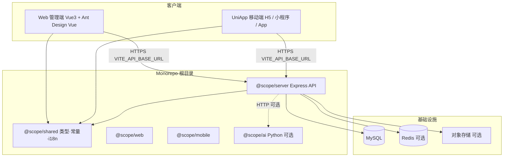

# 多端 Monorepo 项目框架架构（AI 模板）

> **版本**：1.0（基于兜行 Douxing 仓库抽象）  
> **配套配置**：仓库根目录 [`project.manifest.yaml`](../project.manifest.yaml)  
> **目标读者**：人类架构师、Cursor/Claude 等 AI Agent  

---

## 0. AI 使用说明（必读）

### 0.1 你要完成什么

收到本仓库或本模板后，AI 应能：

1. **新建**：生成与兜行同类型的 **pnpm/npm workspace Monorepo**（Web 管理端 + UniApp 移动端 + Node API + shared）。
2. **改造**：在已有仓库中对照本架构补齐缺失层（API 契约、i18n、脚本、部署），并替换 `project.manifest.yaml` 中的项目专属项。

### 0.2 执行顺序（强制）

```text
1. 读取并理解 project.manifest.yaml（用户应先改好 meta / domains / packages 开关）
2. 读取本 MD 的「固定架构」章节 — 不得随意删减目录职责
3. 按 manifest.placeholders 与 §12 映射表替换占位符
4. 按 manifest.packages.*.enabled 裁剪可选包（ai-service、ml-training）
5. 生成/更新 .env.example、README、根 package.json scripts
6. 自检 §13 清单
```

### 0.3 禁止事项

- 不得在代码或 manifest 中硬编码 **API Key、密码、私钥**；仅使用环境变量。
- 不得破坏 **统一 API 响应体** `ApiResponse` 与 **messageKey** 国际化机制。
- 不得在未读 `packages/shared` 的情况下在三端重复定义相同常量/类型。
- 不得去掉 `scripts/pm.mjs` 的双包管理器兼容（若仓库已包含）。

---

## 1. 架构总览

### 1.1 系统形态



### 1.2 技术栈（固定选型）

| 层级 | 技术 | 说明 |
|------|------|------|
| Monorepo | pnpm workspace（推荐）+ npm workspaces | `pnpm-workspace.yaml` + 根 `package.json#workspaces` |
| 共享包 | TypeScript 纯类型/常量 | 构建输出 `dist/`，子包 `workspace:*` 引用 |
| 后端 | Node 18+、Express、TypeScript、Drizzle ORM、MySQL | `tsx` 开发，`tsc` 生产（低内存可 tsx） |
| Web | Vue 3、Vite、Pinia、Vue Router、Ant Design Vue 4 | 管理端，非 UniApp |
| 移动端 | UniApp 3（Vue 3）、Vite、无第三方 UI 库 | 自研组件 + `view/text/button` + `theme.css` |
| 部署 | Docker Compose、PM2、Nginx、Certbot | 脚本在 `scripts/`、`deploy/` |
| 国际化 | `@scope/shared` 统一 ApiMessageKey + 各端 vue-i18n | `Accept-Language` 中间件 |

业务域（兜行实例）：AI 行程规划、路线、打卡、成就徽章、订单支付、内容库 —— **新建项目可换业务，但分层不变**。

---

## 2. 仓库目录结构（固定骨架）

```text
{root}/
├── project.manifest.yaml      # 【可配置】项目专属元数据（AI 首先修改）
├── package.json               # 根编排脚本，不含业务逻辑
├── pnpm-workspace.yaml
├── pnpm-lock.yaml             # 主锁文件
├── .npmrc                     # shamefully-hoist + npm install-strategy
├── .env.example               # 后端环境变量模板
├── .env.development           # 前端本地 API（Vite/UniApp）
├── .env.staging
├── .env.production
├── docker-compose.yml         # 本地 MySQL + Redis
├── deploy/
│   ├── ecosystem.config.cjs   # PM2
│   ├── docker-compose.prod.yml
│   ├── env.production.example
│   ├── env.staging.example
│   └── nginx/*.template
├── scripts/
│   ├── pm.mjs                 # pnpm/npm 统一转发
│   ├── platforms.mjs          # 多端平台定义
│   ├── run-dev.mjs            # dev:only
│   ├── run-build.mjs          # build:only
│   ├── deploy.mjs             # bootstrap
│   ├── deploy-server.mjs
│   ├── deploy-app.mjs
│   └── setup-*.sh             # 服务器初始化
├── docs/                      # 人类文档 + 本 AI 模板
├── .cursor/
│   └── rules/*.mdc            # Cursor Agent 持久化规则（索引见 docs/Cursor-Agent规则.md）
└── packages/
    ├── shared/
    ├── server/
    ├── web/
    ├── mobile/
    ├── ai-service/            # 可选
    └── ml-training/           # 可选
```

---

## 3. 子包规范

### 3.1 `@scope/shared`（必须先于 server 构建）

**职责**：跨端 TypeScript 类型、业务常量、API 错误码 i18n。

```text
packages/shared/src/
├── index.ts              # 统一 export
├── constants.ts          # APP_NAME, API_PREFIX, 枚举状态码
├── types.ts              # ApiResponse, UserInfo, 领域 DTO
├── i18n/
│   ├── api-keys.ts       # ApiMessageKey 枚举
│   ├── api-messages.ts   # 各语言文案
│   ├── resolve-api-message.ts
│   └── locales/zh-CN.ts, en-US.ts
└── …                     # 领域共用：pagination, geo, membership
```

**规则**：

- `APP_NAME`、`API_PREFIX` 必须从 manifest 同步，禁止在 server/web/mobile 各写一份。
- 新增 API 错误：先加 `ApiMessageKey`，再加中英文 message，最后在 server `fail(res, ApiMessageKey.XXX)`。

### 3.2 `@scope/server`

**职责**：REST API、鉴权、数据库、第三方集成、定时任务。

```text
packages/server/src/
├── index.ts                 # Express 入口，挂载静态 uploads、CORS、路由
├── config/
│   ├── env.ts               # dotenv 加载（override: true）
│   ├── *.ts                 # 按领域拆分配置（payment, oss, amap…）
├── middleware/
│   ├── auth.ts              # Access JWT Bearer → req.auth；过期 401 + api.tokenExpired
│   └── locale.ts            # Accept-Language → res.locals.locale
├── routes/
│   ├── index.ts             # Router 聚合，前缀 ${API_PREFIX}
│   ├── auth.ts
│   └── {domain}.ts          # 薄路由：校验入参 → 调 service
├── services/
│   └── {domain}.service.ts  # 业务逻辑，禁止在 route 写 SQL
├── db/
│   ├── schema/              # Drizzle table 定义
│   ├── migrate.ts
│   └── seed.ts
├── jobs/                    # 定时任务（如订单超时）
├── utils/
│   ├── response.ts          # success() / fail() / failFromError()
│   └── pagination.ts
└── scripts/                 # CLI 运维脚本（enrich、migrate-oss…）
```

**API 契约（强制）**：

```typescript
// 成功
{ "code": 0, "message": "…", "messageKey": "ok", "data": T }

// 失败
{ "code": 1, "message": "…", "messageKey": "unauthorized", "data": null }
```

**路由注册模式**：

```typescript
router.use(`${API_PREFIX}/users`, usersRouter);
```

**鉴权模式**：

- 登录接口无 `authMiddleware`
- 其余写操作：`authMiddleware` + `req.auth.userId`
- 管理端接口：额外校验 `RoleCode.ADMIN`（**S1 目标**：`requirePerm` 细粒度 RBAC，见 [系统管理.md](./系统管理.md)）

### 3.3 `@scope/web`

**职责**：运营管理端（Ant Design Vue），非用户 C 端。系统管理（S 线）与发单接单商户端（M 线 · 远期 `/partner`）分域；C 端 AI 规划与模块 B marketplace 产品入口独立。

```text
packages/web/src/
├── main.ts
├── App.vue
├── api/
│   ├── http.ts              # axios 实例，拦截 ApiResponse
│   └── {domain}.ts
├── router/index.ts
├── stores/                  # Pinia
├── layouts/                 # BasicLayout + Sider + Tabs
├── views/                   # 页面
├── components/              # 复用组件
├── i18n/
├── theme/antd-theme.ts
└── utils/
```

**环境变量**：`VITE_API_BASE_URL`（打包时注入），须与 manifest `domains.*.apiBaseUrl` 一致。

**表格列表**：数据页统一 `DouxingAdminTable` + 筛选 + XLSX 导出 + 空值 `-`；见 [Web管理端表格规范.md](./Web管理端表格规范.md)。

### 3.4 `@scope/mobile`

**职责**：用户端 UniApp（H5 / 微信小程序 / App）。

```text
packages/mobile/src/
├── App.vue
├── pages.json               # 页面路由 + tabBar
├── pages/{feature}/         # 页面
├── components/              # 业务组件（Douxing* 前缀）
├── utils/
│   ├── request.ts           # uni.request 封装，解析 ApiResponse
│   └── api-base.ts          # VITE_API_BASE_URL 校验
├── styles/theme.css         # 设计 Token（与品牌规范同步）
├── i18n/
└── poster/                  # Canvas 海报等重功能可分子目录
```

**UI 约定**：不使用 uView/Vant；用 uni 内置组件 + 自研 + CSS 变量。

**多端编译**：由根脚本 `dev:mp-weixin`、`build:app-android` 等经 `pm.mjs` 转发。

### 3.5 `@scope/ai`（可选，manifest `aiService.enabled`）

- Python 3.12+、FastAPI、LangChain
- Node 通过 `AI_SERVICE_URL` HTTP 调用，失败回退 Node 内置 LLM
- 根命令：`dev:ai-service` → `scripts/run-ai-service.mjs`

### 3.6 `@scope/ml`（可选）

- 训练数据 JSONL、YAML 配置，无运行时服务
- 根命令：`ml:generate-dataset`、`ml:validate-dataset` 转发到 server scripts

---

## 4. 根目录编排（package.json 约定）

根 `package.json` **不得**实现业务，只提供：

| 脚本类别 | 示例 | 实现方式 |
|----------|------|----------|
| 开发 | `dev`, `dev:server`, `dev:web`, `dev:pc`, `dev:admin`, `dev:mobile`, `dev:mp-weixin` | `scripts/dev-web.mjs` / `dev-pc.mjs` / `dev-mp-weixin.mjs` + concurrently |
| 组合开发 | `dev:only` | `scripts/run-dev.mjs` + `platforms.mjs` |
| 构建 | `build`, `build:web`, `build:server` | pm filter / recursive |
| 数据库 | `db:migrate`, `db:seed`, `db:setup` | filter server |
| 部署 | `bootstrap`, `deploy:server`, `deploy:app` | `scripts/deploy*.mjs` |
| 停止 | `stop`, `stop:dev` | `scripts/stop.mjs` |

**平台标识表**（`scripts/platforms.mjs`，扩展时同步 manifest）：

| id | 说明 |
|----|------|
| server | 后端 API |
| web | 管理端（dev 就绪后自动打开浏览器） |
| pc / desktop | PC 用户端（dev 就绪后自动打开浏览器） |
| mobile / h5 | H5 |
| mp-weixin / mp | 微信小程序 |
| app-android / android | Android |
| app-ios / ios | iOS |

---

## 5. 配置与环境变量分层

| 文件 | 读取方 | 内容 |
|------|--------|------|
| `.env` | server、deploy 脚本 | 数据库、JWT（`JWT_ACCESS_EXPIRES_IN` / `JWT_REFRESH_EXPIRES_IN`）、第三方密钥、SERVER_PORT（**禁止 VITE_***） |
| `.env.local` | Vite / UniApp dev（gitignore） | 本机 dev API、微信 CLI |
| `.env.development` | Vite / UniApp dev | dev 共享项（如 `VITE_H5_BASE_URL`） |
| `.env.staging` | staging 构建 | 测试 API 域名 |
| `.env.production` | 生产构建 | 生产 API 域名 |
| `deploy/env.*.example` | 服务器首次部署 | 完整生产模板 |

**生成 .env.example 时**：按 `manifest.integrations` 列出键名与注释，值留空或示例占位。

---

## 6. 数据层约定

- **ORM**：Drizzle，`packages/server/drizzle/` 迁移 SQL
- **流程**：改 schema TS → `db:generate` → `db:migrate` → `db:seed`
- **命名**：表名 snake_case，字段与 shared 枚举对齐
- **分页**：复用 shared `pagination` 类型与 server `utils/pagination.ts`

---

## 7. 国际化（i18n）端到端

```text
shared ApiMessageKey
    ↓
server localeMiddleware + success/fail(messageKey)
    ↓
web/mobile axios 或 uni.request 解析 messageKey
    ↓
resolveApiMessage(key, clientLocale)
```

**新增功能验收**：用户可见文案必须进 vue-i18n；API 错误必须进 ApiMessageKey。

---

## 8. 部署架构

### 8.1 本地开发

```bash
pnpm install          # 或 npm install
cp .env.example .env
pnpm bootstrap:dev    # Docker MySQL + migrate + seed + pnpm dev
```

### 8.2 生产（服务器）

```text
git pull → pnpm install --frozen-lockfile
→ docker compose -f deploy/docker-compose.prod.yml up -d
→ pnpm deploy:server [--nginx api.example.com]
→ PM2 启动 deploy/ecosystem.config.cjs
→ Nginx 反代 443 → 127.0.0.1:SERVER_PORT
```

**低内存机**：`--use-tsx` 跳过 server tsc，只 build shared。

### 8.3 前端发布

- 小程序/Web/H5：**本地或 CI 构建**，产物上传微信/静态服务器
- `VITE_*` 在构建时写入，非运行时改

---

## 9. 可选模块裁剪指南

根据 `project.manifest.yaml` 的 `packages.*.enabled`：

| 关闭项 | AI 应执行 |
|--------|-----------|
| aiService | 删除/忽略 `packages/ai-service`，根 package.json 去掉 `dev:ai-service`、`dev:with-ai` |
| mlTraining | 删除 `packages/ml-training`，去掉 `ml:*` 脚本 |
| mobile.targets.mpWeixin | 去掉 `dev:mp-weixin`、`build:mp-weixin` 及 platforms 项 |
| features.oss | server 仅本地 `uploads/`，去掉 OSS 脚本与 config |
| features.i18n | 保留最小 zh-CN，可暂不实现 en-US 验收 |

---

## 10. 代码风格与 Git（固定）

- 变量/函数：`camelCase`；常量：`UPPER_SNAKE_CASE`
- 注释、提交信息、AI 回复：**简体中文**
- 提交格式：`feat(scope): 描述`（Conventional Commits）
- 异步：server 路由/服务 `try/catch`，`failFromError(res, err)`

---

## 11. 新建同类型项目 — AI 检查清单

- [ ] 复制 Monorepo 骨架目录（§2）
- [ ] 填写 `project.manifest.yaml` 全部 meta/domains/packages
- [ ] 替换 `shared/constants.ts` 中 APP_NAME、API_PREFIX
- [ ] 重命名 scope：`@douxing` → `@{{SCOPE}}`（全仓库）
- [ ] 更新 `docker-compose.yml` container_name、数据库名
- [ ] 更新 `deploy/ecosystem.config.cjs` PM2 名称
- [ ] 生成 `.env.example`（无真实密钥）
- [ ] 配置三端 `VITE_API_BASE_URL` 与 manifest domains 一致
- [ ] 实现最小闭环：`auth` 登录 + 一条核心业务 CRUD
- [ ] 根脚本 `pnpm dev` 能同时起 server + web + mobile(h5)
- [ ] README + docs/包管理与命令.md

---

## 12. 改造项目 — AI 检查清单

- [ ] 对照 §3 补齐缺失目录（如只有前端无 shared → 先抽 shared）
- [ ] API 响应统一为 `ApiResponse`，禁止 `{ success: true }` 混用
- [ ] 路由统一加 `API_PREFIX` 前缀
- [ ] 环境变量迁入 `.env.example` 文档化
- [ ] 根目录增加 `scripts/pm.mjs`、`platforms.mjs`（若缺）
- [ ] 将硬编码中文错误改为 ApiMessageKey
- [ ] 新前端页面符合 `.cursor/rules/page-ui-standards.mdc`（Token、i18n、通用组件）
- [ ] 更新 `project.manifest.yaml` 反映真实域名与端口

---

## 13. 占位符 → 文件映射表

| 占位符 | 典型文件 |
|--------|----------|
| `{{APP_NAME}}` | `packages/shared/src/constants.ts` |
| `{{SCOPE}}` | 各 `package.json` name 字段 |
| `{{API_PREFIX}}` | `packages/shared/src/constants.ts` |
| `{{SERVER_PORT}}` | `.env.example`, `packages/server/src/index.ts` |
| `{{DB_NAME}}` | `.env.example`, `docker-compose.yml` |
| `{{MYSQL_CONTAINER}}` | `docker-compose.yml` `container_name` |
| `{{PM2_APP_NAME}}` | `deploy/ecosystem.config.cjs` |
| `{{API_DEV}}` | `.env.local` 或 `.env.development`（dev 默认 127.0.0.1） |
| `{{API_PROD}}` | `.env.production` |
| `{{API_STAGING}}` | `.env.staging` |
| `{{MP_APP_ID}}` | 小程序 manifest、`WECHAT_PAY_APP_ID` 等 |
| `{{PRIMARY_COLOR}}` | `packages/mobile/src/styles/theme.css` |

完整映射见 `project.manifest.yaml` 末尾 `placeholders` 节。

---

## 14. 给 AI 的 Prompt 片段（可直接复制）

```markdown
你将基于「多端 Monorepo 项目框架架构（AI 模板）」工作。

1. 先读取仓库根目录 project.manifest.yaml，并列出你将修改的 meta、domains、packages 开关。
2. 严格遵守 ApiResponse、shared 常量、server routes→services 分层。
3. 所有项目专属名称、域名、端口、AppID 只从 manifest 读取，不得臆造。
4. 密钥只出现在 .env.example 的键名注释中，不要写入代码或 manifest。
5. 完成后按 docs/项目框架架构-AI模板.md §11 或 §12 自检清单逐项说明结果。

当前任务：[在此描述新建/改造目标]
```

---

## 15. 参考实例

本模板来源于 **兜行（Douxing）** 生产仓库。实例文件：

- 清单：[`project.manifest.yaml`](../project.manifest.yaml)
- 包管理：[`docs/包管理与命令.md`](./包管理与命令.md)
- 启动部署：[`docs/启动与部署流程.md`](./启动与部署流程.md)
- 品牌 Token：[`docs/品牌视觉规范.md`](./品牌视觉规范.md)
- Agent 规则：[`docs/Cursor-Agent规则.md`](./Cursor-Agent规则.md)

---

**文档维护**：架构骨架变更时同步更新本文件与 `project.manifest.yaml`；业务需求变更只改 manifest 与业务 docs，不破坏 §3 分层。
